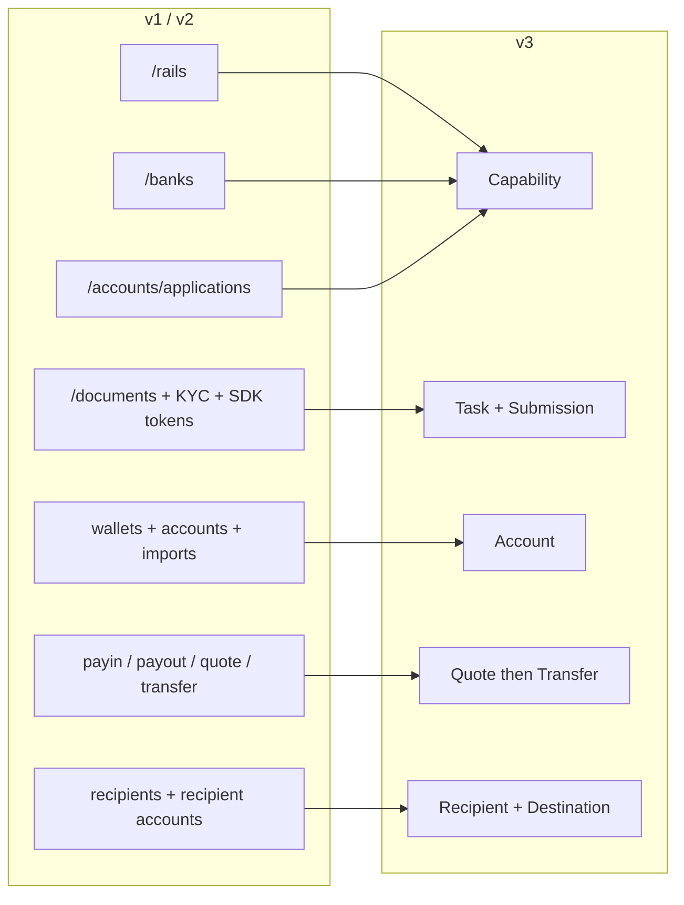
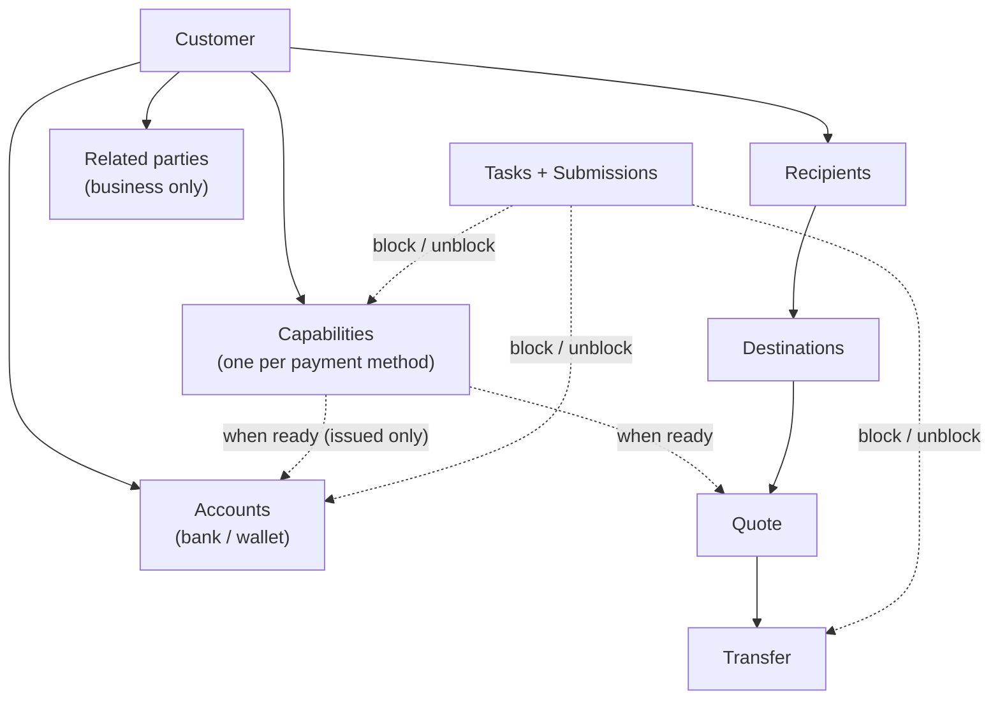
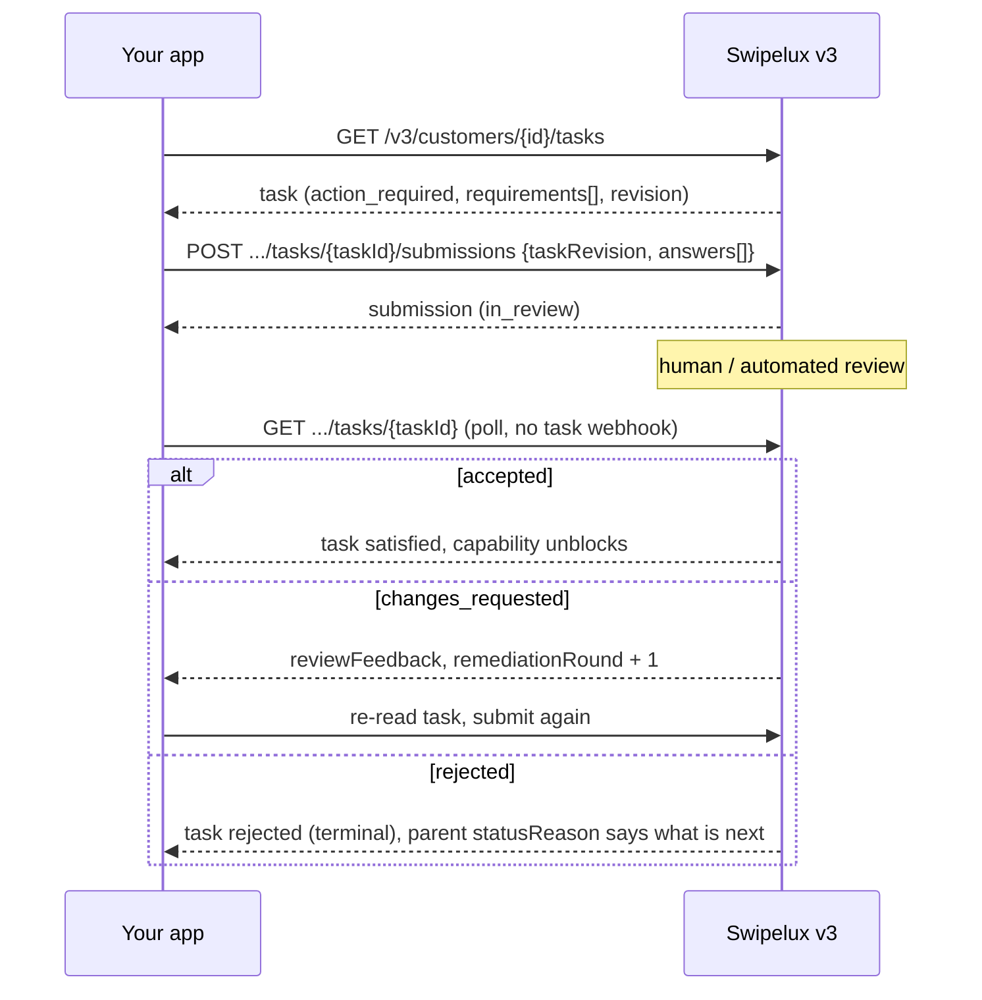
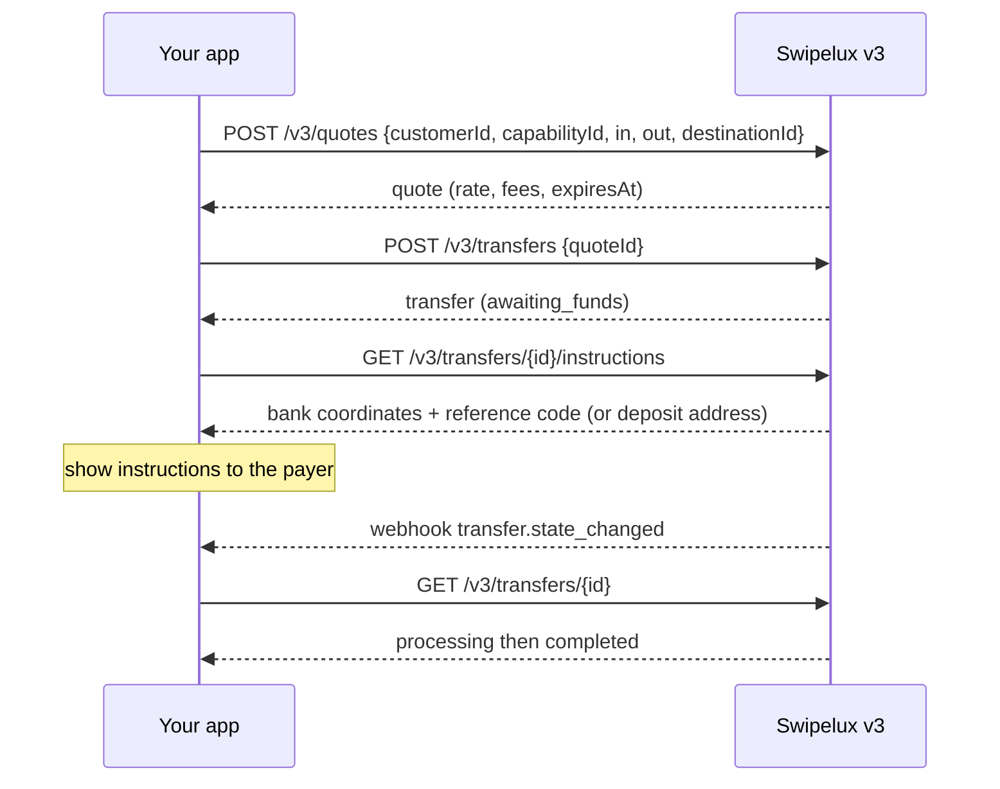
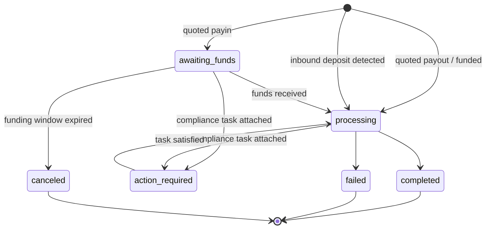
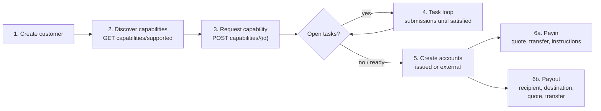

Migrate your integration from API v1 and v2 to v3 in two passes:

- **Part 1, the concept.** Read this first. v3 is a remodel, not a rename: if you map old endpoints one-to-one you will fight the API. Ten minutes here saves days later.
- **Part 2, the API.** Endpoint-by-endpoint mapping, request examples, state machines, and a migration checklist.

Grounded in the production OpenAPI spec ([platform.swipelux.com/openapi.json](https://platform.swipelux.com/openapi.json)). v1 and v2 remain live and are not yet deprecated; all new capability, recipient, task, and quoting features ship on v3 only. Subscribe to the `api.deprecation` webhook event for sunset notices.

<Info>
  **Contents.** Part 1: 1.1 why v3 exists, 1.2 object model, 1.3 per-capability readiness, 1.4 task loop, 1.5 money movement, 1.6 state machines, 1.7 conventions, 1.8 golden path. Part 2: 2.1 customers, 2.2 capabilities, 2.3 tasks and submissions, 2.4 accounts, 2.5 recipients and destinations, 2.6 quotes and transfers, 2.7 webhooks, 2.8 sandbox, 2.9 legacy endpoints, 2.10 migration order, 2.11 gotcha checklist.
</Info>

---

## Part 1, the concept

### 1.1 Why v3 exists

v1 and v2 grew four overlapping ways to make a customer payment-ready: `/rails`, `/banks`, `/accounts/applications`, and the business `rail-applications` surface, each with its own status vocabulary. Document collection (`/documents`, KYC imports, verification SDK tokens) was disconnected from the thing it actually unblocked. v3 collapses all of it into six resources, the customer plus five things it owns:



| Resource | One-line definition |
| --- | --- |
| **Customer** | The person or business. Has **no public status field**, readiness lives on capabilities. |
| **Capability** | One payment method the customer can use (`sepa`, `ach`, `swift`, `stablecoin_transfers`, and so on), with its own status. Replaces `/rails`, `/banks`, and the account-application entry points. |
| **Task** | A unit of work Swipelux needs (data, documents, verification), answered with a **Submission**. Replaces the document and KYC surface. |
| **Account** | A funding endpoint the customer owns: `bank` or `wallet`, `issued` by Swipelux or `external`. |
| **Recipient / Destination** | Payout beneficiary (who) and their bank or wallet endpoint (where). |
| **Quote / Transfer** | All money movement. A transfer executes a persisted quote; unquoted transfers are gone. |

### 1.2 The object model



Two structural rules to internalize:

1. **Capabilities gate everything.** Accounts are provisioned under a `ready` capability; quotes are priced against a capability. Onboarding equals getting the capabilities you need to `ready`.
2. **Tasks attach anywhere.** A capability, an account, or an in-flight transfer can carry `openTaskIds`. Wherever you see them, the loop is the same: read task, submit answers, wait for review, re-read the parent.

### 1.3 Readiness is per capability, not per customer

v1 tangled `/rails` readiness with a customer-wide KYC gate. In v3 there is no customer status: a customer can be fully usable on `stablecoin_transfers` while their `sepa` capability still has open tasks. Pooled-account capabilities generally go `ready` faster than named ones, so start transacting on what is `ready` instead of waiting for everything.

If your v1 or v2 code drives UI badges off customer verification status, rewrite it:

- "Can they transact on X?" becomes capability X `status == "ready"`.
- "Do they need to do something?" becomes any task with status `action_required` (the capability typically shows `restricted` with `statusReason.resolution: "complete_tasks"`).
- "Are we waiting on Swipelux?" becomes tasks `in_review`, capability `pending`.

### 1.4 The task loop

Everything the old document and KYC surface did is now this one loop:



Key properties:

- A task carries `requirements[]`, the individual asks. Each has a per-task `requirementId`, a stable `key` naming the ask (for example proof of address, deduplicate your UI by it), and a typed `request` describing exactly what input is wanted (text, date, select, document, attestation, and so on).
- Submitting is **review-gated**: it never mutates capability or account state directly, acceptance does. One exception: `profile` answers write through to the customer profile on submit (2.3). After submitting, poll the task or the parent resource.
- `taskRevision` (echo of the task's `revision`) is a concurrency guard: if the task changed since you read it, re-read and rebuild your answers.
- `absence` is a first-class answer ("I don't have this because ..."), use it instead of leaving requirements dangling.

### 1.5 Money movement

One flow for payins, payouts, and stablecoin moves. There is **no direction input**, you never declare payin vs payout. The in and out currency shapes derive a read-only `direction` on the quote and transfer: `fiat_to_stablecoin` (payin), `stablecoin_to_fiat` (payout), or `stablecoin_move`.



### 1.6 One state machine per resource

Every status-bearing resource has its own enum, and every non-happy status carries a structured reason. Accounts, applications, and transfers share the shape `{ code, message, actor, retryable }`: accounts and applications expose it as `statusReason`, transfers as `stateDetail`. `actor` says who must act (`customer`, `developer`, `provider`, `network`, `swipelux`), `retryable` says whether retrying can help. Capabilities use `{ code, resolution, message }`, where `resolution` (`complete_tasks`, `wait`, `contact_support`, `none`) says what moves the capability forward. `code` values are an open, append-only catalog: branch on `resolution` (or `actor` plus `retryable`), and tolerate codes you have never seen.

| Resource | States |
| --- | --- |
| Capability | `pending`, `restricted`, `ready`, `rejected`, `canceled` |
| Application (per-request attempt under a capability, 2.2) | `requested`, `in_review`, `action_required`, `ready`, `rejected`, `disabled`, `canceled` |
| Task | `action_required`, `in_review`, `satisfied`, `rejected`, `canceled` |
| Submission | `in_review`, `accepted`, `changes_requested`, `rejected` |
| Account | `provisioning`, `in_review`, `ready`, `action_required`, `suspended`, `rejected`, `archived` |
| Quote | `active`, `executed`, `expired`, `failed` |
| Transfer | `awaiting_funds`, `processing`, `action_required`, `completed`, `failed`, `canceled` |
| Recipient | `active`, `rejected`, `archived` |
| Destination | `in_review`, `ready`, `action_required`, `archived` |

States this guide does not walk through (`rejected`, `suspended`, `disabled`, `failed`, `canceled`) are terminal or support-driven; per-resource definitions are in the spec.

Transfer, drawn out:



### 1.7 Conventions

| Area | v1 / v2 | v3 |
| --- | --- | --- |
| Auth | `X-API-Key` header | Same. Environment (production vs sandbox) is selected by the key; one base URL. |
| Idempotency | Not enforced | `Idempotency-Key` header **required on every effectful request** (POST, PATCH, PUT, DELETE), sandbox endpoints excepted. Same key plus same body replays the original response. |
| Money | Mixed numbers and strings | Strings only (`"amount": "150.00"`). Never floats. |
| Pagination | Offset/limit variants | Cursor: lists return `{ data, nextCursor, hasMore }`. |
| Updates | PUT-heavy | `PATCH` partial updates. |
| Webhooks | Single endpoint config | Multiple endpoints, per-event subscription. Events are **hints**, the read is the truth (2.7). |

Idempotency rules worth internalizing before writing code:

- Reusing a key with a **different** body is a `409 idempotency_conflict` for as long as the key is retained (at least 7 days), so never plan to reuse a key. Generate a fresh UUID per logical operation and persist it with your job.
- Replay covers errors too: if the original request ended in a terminal 4xx, the same key plus body returns that same problem response again.
- Two concurrent requests with the same key: one wins, the other gets `409`. Retry the loser after the winner settles; the replay returns the original response.

### 1.8 The golden path



---

## Part 2, the API

### 2.1 Customers

| v1 / v2 | v3 |
| --- | --- |
| `POST /v1/customers`, `POST /v1/customers/business`, `POST /v2/customers` | `POST /v3/customers` (one endpoint, `type: individual \| business`) |
| `GET/PUT/DELETE /v1/customers/{id}`, `/v1/customers/business/{id}`, `/v2/customers/{customerId}` | `GET/PATCH/DELETE /v3/customers/{customerId}` |
| `GET /v1/customers` (list) | `GET /v3/customers` (cursor-paged, embeds capability summaries) |
| `GET /v1/customers/balances` (batch), `GET /v1/customers/{id}/balances` | No balance endpoint, balances live on accounts: read `balances` on `GET /v3/customers/{customerId}/accounts` |
| `POST/GET .../shareholders` (v1 business) | `POST/GET /v3/customers/{customerId}/related-parties` (plus `GET/PATCH/DELETE .../related-parties/{relatedPartyId}`) |
| `POST /v1/customers/business/{id}/kyb` (submit), `GET .../kyb` (status) | No KYB submit call, request a capability (2.2) and answer its tasks (2.3); the verdict surfaces as capability and task state |
| `POST /v1/customers/{id}/kyc`, `.../kyc/import`, SDK token endpoints | Task system (2.3); hosted verification appears as `verificationSessions` inside tasks |

Create, discriminated on `type` (illustrative values, field names per spec):

```jsonc
// POST /v3/customers        Idempotency-Key: <fresh uuid>
{
  "type": "individual",
  "externalId": "user-1042",
  "individual": {
    "firstName": "Maria",
    "lastName": "Silva",
    "birthDate": "1990-04-12",
    "nationalities": ["BR"],
    "residenceCountry": "BR",
    "email": "maria@example.com",
    "residentialAddress": {
      "streetLine1": "Av. Paulista 1000",
      "city": "Sao Paulo",
      "postalCode": "01310-100",
      "country": "BR"
    }
  },
  "financialProfile": {
    "accountPurposes": ["cross_border_remittance"],
    "sourcesOfFunds": ["salary"]
  }
}
```

- **Creation is progressive**: `{ "type": "individual" }` alone is a valid create. Missing facts never invalidate the customer, they surface later as intake tasks on the capabilities that need them.
- Businesses carry `business` plus registration data. v1's shareholder CRUD maps onto **related parties**, widened to cover directors, officers, and owners: create them inline at customer creation (each gets a stable `rp_` id) or manage them through the dedicated related-parties endpoints.
- **No customer `status` field**, see 1.3.
- **Existing customers carry over**: customers created on v1 or v2 are addressable by the same id on v3 endpoints. The v3 read is a _sanitized view_, legacy values that fail v3 validation come back absent. After your **first v3 write that view becomes permanent**: absent values do not come back on their own. So enrich early, budget a one-time pass that `PATCH`es the full profile in from your own records before relying on v3 reads. v1 `metadata` is a separate namespace and is **not** carried over, re-set it on v3.
- `externalId` is first-class and **unique across your customers** on v3, per environment (`409 duplicate_external_id`). Archiving a customer does not release its `externalId`, clear it by PATCH before DELETE if you intend to reuse it.
- `DELETE` is an **archive cascade** (no restore; ids never reused). It is blocked with `409 customer_has_active_resources` plus `blockingResources[]` while any non-archived account or in-flight transfer exists.
- PATCH merge rules: explicit `null` clears a nullable field, arrays replace wholesale (except inline related parties, which upsert by id), `metadata` keys merge. Full schemas and list filters are in the OpenAPI spec.

### 2.2 `/rails`, `/banks`, applications become Capabilities

| v1 / v2 | v3 |
| --- | --- |
| `GET /v1/.../rails/capabilities` | `GET /v3/customers/{customerId}/capabilities/supported` |
| `GET /v2/.../banks` (plus `/banks/{bank}`), `GET /v2/meta/banks` | `GET /v3/customers/{customerId}/capabilities/supported` |
| `GET /v1/customers/{customerId}/rails` (list) | `GET /v3/customers/{customerId}/capabilities` |
| `GET /v2/customers/{customerId}/rails` (overview) | `GET /v3/customers/{customerId}/capabilities` |
| `POST /v1/.../rails`, `POST /v2/.../banks` | `POST /v3/customers/{customerId}/capabilities/{capabilityId}` |
| `POST /v2/.../accounts/applications` | `POST /v3/customers/{customerId}/capabilities/{capabilityId}` |
| `GET /v1/.../rails/{rail}` | `GET /v3/.../capabilities/{capabilityId}` |
| `GET /v2/.../accounts/applications` (plus `/{applicationId}`, `/{applicationId}/history`) | `GET /v3/.../capabilities/{capabilityId}` (plus `/applications`, `/applications/{id}/history`) |
| Business-rail surface: `GET/POST /v2/customers/business/{customerId}/rail-applications` (plus `/{rail}`) | Same v3 capability endpoints, no separate business surface |
| Business-rail surface: `GET .../business/{customerId}/rails` (plus `/{rail}`) | Same v3 capability endpoints, no separate business surface |
| `GET /v1/meta/rails` (static catalog) | `GET /v3/customers/{customerId}/capabilities/supported`, availability is per customer; there is no static catalog |
| `GET /v1/meta/accounts/banks` | `GET /v3/institutions` (bank directory: id, name, BIC, countries) |
| Not available | `GET /v3/capabilities`, merchant-wide list of granted capabilities across customers (filter by `status`, `method`, `customerId`) |
| Not available | `GET /v3/.../capabilities/{capabilityId}/tasks-preview` (see asks before requesting) |
| Not available | `POST /v3/.../capabilities/{capabilityId}/cancel` |

- A capability equals `method` (`ach`, `wire`, `rtp`, `pix`, `sepa`, `swift`, `spei`, `pse`, `transfers_3_0`, `faster_payments`, `sepa_instant`, `uaefts`, `card`, `stablecoin_transfers`, and so on) plus `accountType` (`pooled` or `named`, `null` for non-bank methods) plus `directions` (`payin` or `payout`). The public `capabilityId` is the qualified pair (`sepa_pooled`, `ach_named`) or the bare method for `card` and `stablecoin_transfers`.
- Each capability request spawns an **application**, the per-attempt record under `.../capabilities/{capabilityId}/applications` (plus `/{applicationId}/history`), with its own statuses (1.6) and `statusReason`. It is the audit trail of a request; day-to-day, poll the capability itself.
- `capabilities/supported` returns availability (`available`, `beta`, or `disabled`), eligibility, and institutions on offer. Bank selection happens at request time via the optional `institutions` array, there is no separate `/banks` resource. Omitting it (or sending `[]`) selects every default institution; `isDefault: true` is a customer-and-capability-specific flag, not a global one. A non-empty list overrides the defaults, and a bank-backed capability with no applicable default returns `422 capability_institutions_required`. Institution ids are opaque, tolerate new ones.
- `stablecoin_transfers` is **auto-granted at customer creation** and born `ready` (so it is never requested and not cancelable). `card` is individual-only.
- `openTaskIds` on the capability is your "what do I do next" pointer. Open equals `action_required` **or** `in_review`, and the rollup includes shared customer-level tasks reached through active dependencies.
- `cancel` works only from `pending` or `restricted` **and** with no blocking resources, otherwise `409 capability_not_cancelable`, whose problem body lists `blockingResources`. Re-requesting after cancel is a fresh create with a new idempotency key.
- **Poll the GET.** Capability state refreshes when you read it; poll `GET .../capabilities/{capabilityId}` or subscribe to `capability.status_changed`, do not cache.
- Requesting one method can make related methods available at once, treat capabilities as a set you re-read, not a single row you track.
- Use `tasks-preview` to show onboarding asks **before** committing to a request.
- Verification is not one-time: new tasks can appear on an already-`ready` capability (periodic or event-driven re-verification). Keep the task loop wired for the whole customer lifetime, not just onboarding.

### 2.3 Documents and KYC become Tasks and Submissions

<Note>
  **Naming note.** These endpoints briefly shipped as `requirements` and `fulfillments`. Since 2026-08-02 the public names are **tasks** and **submissions**. The rename covered the resources and endpoint paths only, the `requirements[]` array inside a task and its `requirementId` keep those names.
</Note>

Every legacy document surface maps to the same replacement: read `GET /v3/customers/{customerId}/tasks`, answer with `POST .../tasks/{taskId}/submissions`.

| v1 / v2 | v3 |
| --- | --- |
| `POST/GET/DELETE /v1/documents` | `GET /v3/.../tasks` plus `POST .../tasks/{taskId}/submissions` |
| `POST /v1/customers/{id}/documents` | `GET /v3/.../tasks` plus `POST .../tasks/{taskId}/submissions` |
| `GET/POST /v1/customers/business/{id}/documents` (plus `PUT/DELETE .../{docId}`) | `GET /v3/.../tasks` plus `POST .../tasks/{taskId}/submissions` |
| `GET/POST .../shareholders/{shareholderId}/documents` (plus `GET/PUT/DELETE .../{docId}`) | `GET /v3/.../tasks` plus `POST .../tasks/{taskId}/submissions` |
| `GET/POST/DELETE /v2/.../documents` (plus `/{documentId}`) | `GET /v3/.../tasks` plus `POST .../tasks/{taskId}/submissions` |
| `POST /v2/.../documents/upload-token` plus `POST /v2/documents/direct-upload` | Upload directly with your API key (below), or send a fresh direct-upload `storageKey` as JSON to `POST /v3/.../documents` within five minutes |
| `POST /v1/customers/documents/upload`, `POST /v1/document` (legacy intakes) | Gone, upload directly with your API key (below) |
| `POST /v1/customers/{id}/kyc` plus SDK tokens | Task `verificationSessions` (hosted verification); no direct "start KYC" call |

Around that loop:

- **Raw file storage**: `POST/GET/DELETE /v3/customers/{customerId}/documents` (plus `/{documentId}` and `GET .../{documentId}/download`), upload once with your API key, then reference document ids in submission answers. This replaces every upload-token and direct-upload intake. `POST .../documents` also accepts a JSON body (`storageKey`, `fileName`, `type`) that consumes a still-fresh customer-scoped reference from `POST /v2/documents/direct-upload`, so parked uploads migrate without re-sending bytes.
- **Net-new reads**: `GET /v3/tasks` (merchant-wide inbox), `GET /v3/transfers/{transferId}/tasks`, `GET .../tasks/{taskId}/history`, `GET .../tasks/{taskId}/submissions` (plus `/{submissionId}`).

Submission (illustrative):

```jsonc
// POST /v3/customers/{cus}/tasks/{task}/submissions   Idempotency-Key: <fresh uuid>
{
  "taskRevision": 3,
  "answers": [
    { "requirementId": "req_a1", "answer": { "type": "document", "documentIds": ["doc_passport1"] } },
    { "requirementId": "req_b2", "answer": { "type": "text", "value": "Import/export business" } },
    { "requirementId": "req_c3", "answer": { "type": "absence", "reason": "not_applicable" } }
  ]
}
```

- Answer types: `profile`, `text`, `date`, `single_select`, `multi_select`, `boolean`, `attestation`, `document`, `resource_reference`, `absence`. Each requirement's `request` object tells you which type it expects.
- A submission must answer **every actionable requirement in the current round**, with the exact `taskRevision` you read. Partial submissions are rejected.
- `profile` answers **write through**: they update the customer profile via the normal validation path and immediately re-evaluate every capability referencing the same intake work. Sibling intake tasks whose requirements are all satisfied close automatically.
- Requirements can form alternative groups (`alternativeKey`): submit exactly one of the group.
- `changes_requested` bumps `remediationRound` and carries `reviewFeedback`. Re-read the task, submit again **with a fresh idempotency key**.
- Hosted verification URLs appear **only** on customer-scoped task detail (`GET /v3/customers/{customerId}/tasks/{taskId}`) and only while the session is actionable; lists and `GET /v3/tasks/{taskId}` are deliberately URL-free.
- Terms of service is a task too: `openTaskIds` can include a `category: "terms_of_service"` task whose hosted acceptance page is linked the same way (customer-scoped detail only). Generic submissions cannot accept terms, and KYC approval never implies terms acceptance.
- Tasks are scoped per capability, so the "same" ask (for example proof of address) can appear once per capability. Deduplicate in your UI by requirement `key`.
- **No translation layer**: posting to `/v1/documents` will not unblock v3 capabilities. Once a customer is on v3, drive all asks through tasks.

### 2.4 Accounts and wallets

| v1 / v2 | v3 |
| --- | --- |
| `POST/GET /v1/.../accounts` (plus `/import`), `/v2/.../accounts` (plus `/import`) | `POST/GET /v3/customers/{customerId}/accounts` |
| `POST/GET /v1/.../wallets` (plus `/import`) | Same endpoint, `type: wallet` |
| `GET/DELETE /v1/customers/{customerId}/accounts/{accountId}` (and the wallets variant), `GET /v2/.../accounts/{accountId}` | `GET/PATCH/DELETE /v3/.../accounts/{accountId}` |
| `PATCH /v2/.../accounts/{accountId}/fees` | `GET/PUT /v3/.../accounts/{accountId}/fees` |

Create, discriminated on `origin` plus `type`. Issued bank accounts take a single `method`; external bank accounts take a `methods` array instead (sending `method` there is rejected):

```jsonc
// issued bank account (capability must be ready)
{ "origin": "issued", "type": "bank", "method": "sepa",
  "currency": "EUR", "settlement": { "accountId": "acc_wallet1" } }

// external wallet the customer already owns (replaces /import)
{ "origin": "external", "type": "wallet", "currency": "USDC",
  "network": "polygon", "details": { "address": "0x71C7656EC7ab88b098defB751B7401B5f6d8976F" } }
```

- `country` on issued bank accounts is optional (defaulted per method); on external **bank** accounts provide it explicitly. Wallet accounts carry no country at all.
- `settlement.accountId` is required on issued bank accounts: it names the issued wallet account that receives settled funds from deposits into the bank account.
- Issued accounts expose `details` (IBAN or routing plus account or address), versioned `routing` (deposit coordinates can rotate, always render the latest read), `fees`, `balances`.
- Networks: `polygon`, `ethereum`, `base`, `arbitrum`, `optimism`, `bsc`, `avalanche`.
- The capability gate applies to **issued** accounts only: creating one against a non-ready capability fails with a capability-coded error, request the capability first (2.2). External accounts need no capability (and no customer approval); they get request-schema and bank-detail validation only.
- Issued bank accounts are born `provisioning` with `details: null`. Poll the account or watch `account.status_changed` until `ready`.
- `DELETE` archives, never hard-deletes. Accounts referenced by in-flight transfers return `409 account_has_active_transfers`. Retry after those transfers reach a terminal state.
- Net-new in v3: **Rules**, standing instructions on an issued wallet account (`POST/GET /v3/customers/{customerId}/rules`, `GET/PATCH/DELETE .../rules/{ruleId}`) that auto-sweep incoming funds to another account or a wallet destination. No v1 or v2 equivalent.

### 2.5 Recipients and destinations

| v1 | v3 |
| --- | --- |
| `POST/GET /v1/.../recipients` | `POST/GET /v3/customers/{customerId}/recipients` |
| Not available (v1 recipients were create and list only) | `GET/PATCH/DELETE /v3/.../recipients/{recipientId}`, net-new detail, update, archive |
| `POST/GET .../recipients/{recipientId}/accounts` | `POST/GET /v3/.../recipients/{recipientId}/destinations` |
| `GET/DELETE .../recipients/{recipientId}/accounts/{recipientAccountId}` | `GET/DELETE /v3/.../recipients/{recipientId}/destinations/{destinationId}` (no destination PATCH, archive and recreate) |

v2 had no recipient concept. If you are on v2 and pay out to third parties, this is new surface, not a rename.

- **Recipient** equals who: `individual` (first and last name) or `business` (company name), with required `relationship` (`employee`, `contractor`, `vendor`, `subsidiary`, `merchant`, `customer`, `landlord`, `family`, `other`). Recipients and destinations are for third parties only. A first-party payout does not use a recipient at all: target one of the customer's own `acc_` accounts as the quote `destinationId` (2.6).
- **Destination** equals where: typed per method, `sepa` (iban, bic optional), `ach` or `wire` (routing plus account), `swift` (full coordinates plus optional intermediary), `spei` (clabe), `pse`, `transfers_3_0` (cbu), and so on, plus wallet destinations. Each destination has its own status. Watch `destination.status_changed`.
- Fiat destinations require the recipient's complete `address` (street, city, postal code, country) **before** creation. Missing pieces fail with `422 recipient_address_required`. Wallet destinations skip the address but require top-level `ownership` (`self_custodied`, or `custodial` with a custodian name).
- Beneficiary-name accuracy matters: receiving banks match the account's **legal** name. Send exact legal first plus last name or company name, not a display nickname.
- Per-method destination field schemas are in the OpenAPI spec.

### 2.6 Quotes and transfers

| v1 / v2 | v3 |
| --- | --- |
| `POST /v1/payin/quote`, `/v1/payout/quote`, `/v2/quote` | `POST /v3/quotes` |
| `POST /v1/payin`, `/v1/payout`, `POST /v1/transfers`, `/v2/transfer` | `POST /v3/transfers` (executes a quote, unquoted creates are gone) |
| `GET /v1/transfers` (list), `GET /v1/transfers/{id}` | `GET /v3/transfers`, `/v3/transfers/{transferId}` |
| Not available (v1 and v2 quotes had no read) | `GET /v3/quotes/{quoteId}` |
| `GET /v1/rate/{base}/{quote}` | `GET /v3/rates` |
| (implicit in payin response) | `GET /v3/transfers/{transferId}/instructions` |
| Not available | `POST /v3/transfers/{transferId}/cancel`, `GET /v3/transfers/{transferId}/tasks` |

```jsonc
// 1. Quote: amount on exactly one side picks mode (exact_in / exact_out).
// POST /v3/quotes            Idempotency-Key: <fresh uuid>
{
  "customerId": "cus_123",
  "capabilityId": "sepa_named",
  "in":  { "currency": "EUR", "amount": "150.00" },
  "out": { "currency": "USDC" },
  "destinationId": "acc_wallet1",   // fiat-funded: must be a customer-owned acc_ account
  "fees": { "breakdown": { "developer": { "fixed": "1.00", "bips": 50 } } }
}
// -> { mode: "exact_in", direction: "fiat_to_stablecoin", rate, fees[], expiresAt, ... }

// 2. Execute before expiresAt.
// POST /v3/transfers         Idempotency-Key: <fresh uuid>
{ "quoteId": "quo_789", "externalId": "order-991", "memo": "invoice 44" }
```

- `destinationId` takes an `acc_` (customer-owned account) or `dst_` (recipient destination) id. **Fiat-funded quotes (payins) must target an `acc_` account**, a `dst_` target always means a payout (`422 quote_direction_invalid` otherwise).
- `externalId` on quotes and transfers is a non-unique correlation reference (echoed on reads, filterable on lists). The per-environment uniqueness rule (2.1) applies to customer `externalId` only.
- Execute a quote exactly once, before `expiresAt`. An expired quote fails with `409 quote_expired`, a second execution with `409 quote_already_executed` (the problem carries the existing `transferId`).
- Transfer cancellation is not yet supported: `POST .../cancel` returns `409 transfer_not_cancelable` in every state. Today's `canceled` transfers come from the funding window expiring on an unfunded payin, not from this endpoint.
- Payins start `awaiting_funds`: render `GET .../instructions` to the payer, bank coordinates plus **reference or memo code** for fiat, deposit address for crypto. The reference code is how the deposit is matched. Always display it.
- `state` plus `stateDetail` for machine-readable substates; `action_required` means a compliance task is attached (`openTaskIds`, `GET .../tasks`), answer via submissions.
- Inbound deposits detected on issued accounts appear as transfers with `origin: "inbound_deposit"` (vs `"quoted"`).
- Payment-network references consolidated under `references`: `transactionHash`, `traceNumber`, `imad`, `uetr`, `explorerUrl`, `returnedTransferId`.

v1 status translation:

| v1 concept | v3 |
| --- | --- |
| separate payin and payout objects | one transfer with `direction` |
| returns or provider-side cancellations (folded into `failed`) | still `failed`, now with machine-readable `stateDetail` and `references.returnedTransferId` when a return spawned a reverse transfer |

Two migration warnings:

- **Transfers do not cross versions.** Transfers created on v1 or v2 are not readable from v3. The list omits them and `GET /v3/transfers/{transferId}` 404s. Cut over _creation_ first, keep the v1 read path until those transfers reach terminal states, then drop it.
- **No token swaps.** `stablecoin_move` requires the same currency in and out: USDC to USDT fails with `422 recipient_destination_invalid` carrying a `currency_mismatch` field error. Same network on both sides, no bridging, and wallet-to-wallet moves currently support zero-fee delivery only: a quote whose platform or developer fee is non-zero fails with `422 amount_not_deliverable`.

### 2.7 Webhooks

| v1 | v3 |
| --- | --- |
| `GET/PATCH /v1/webhooks` (single endpoint config) | `POST/GET /v3/webhooks`, `PATCH/DELETE /v3/webhooks/{webhookId}`, `GET /v3/webhooks/portal` |

Event catalog: `customer.created`, `customer.updated`, `customer.archived`, `capability.created`, `capability.status_changed`, `application.status_changed`, `recipient.status_changed`, `destination.status_changed`, `account.created`, `account.status_changed`, `account.details_changed`, `transfer.created`, `transfer.state_changed`, `api.deprecation`.

- `GET /v3/webhooks/portal` returns a hosted management-portal URL for delivery logs, retries, and manual replay.
- `transfer.created` is currently delivered with the legacy v1 payload shape (the v3 envelope activates when v1 webhooks sunset). Treat it purely as a hint and GET the transfer; do not build against its body.
- Events are hints: on receipt, GET the resource and act on the read. Never build state off event payloads or ordering. Delivery is at-least-once and may be delayed or reordered. Deduplicate by event id, and recover missed events with each list's inclusive `updatedAfter` filter.
- Subscribe to `api.deprecation`, the machine channel for version sunsets.
- No `task.*` event today: after submitting, poll the task or its parent.

### 2.8 Sandbox

Same base URL; the sandbox API key selects the environment.

| v1 | v3 |
| --- | --- |
| `POST /v1/sandbox/topup` | `POST /v3/sandbox/accounts/{accountId}/topup` |
| `POST /v1/sandbox/payins/simulate`, `.../payouts/simulate`, `POST /v1/customers/{id}/simulate-transactions` | `POST /v3/sandbox/transfers/{transferId}/state` (drive a real transfer through states) |
| Not available | `POST /v3/sandbox/customers/{customerId}/verification` (complete verification) |
| Not available | `POST /v3/sandbox/customers/{customerId}/capabilities/{capabilityId}/status` (force capability status) |
| Not available | `POST /v3/sandbox/tasks`, `POST /v3/sandbox/tasks/{taskId}/review` (create a task, then simulate the verdict) |

The v3 sandbox simulates the review loop end to end: create a task, submit against it, `review` it to `accepted` or `rejected`, watch the capability unblock. Rehearse your remediation UX before production. Both sandbox-created tasks and the regular intake tasks that appear on requested capabilities are reviewable this way; as in production, no task webhooks fire, poll (2.7).

### 2.9 Legacy endpoints with no v3 replacement

These have no v3 replacement. Most stay on v1 unchanged (keep your existing calls); two are retired outright (see Disposition):

| Endpoint | Disposition |
| --- | --- |
| `GET /v1/merchant-kyb/creation-gate`, `POST /v1/merchant-kyb/{customerId}/submit`, `POST /v1/merchant-kyb/parked-url`, `POST /v1/merchant-kyb/upload-token` | Your own merchant KYB onboarding (not customer KYB), unchanged on v1 |
| `POST /v1/merchant-wallets/get-or-create` | Merchant treasury wallet helper, unchanged on v1 |
| `GET /v1/meta/accounts/relationships` | Retired, the recipient `relationship` enum is fixed and documented inline (2.5) |
| `GET /v1/meta/kyb/documents` | Retired, v3 tasks declare the required documents per case via `requirements[]` (2.3); there is no static catalog |
| `GET /statecharts` (plus `/{machineId}`, `/{machineId}/svg`, `/explorer`, `/validate`) | Version-neutral public state-machine reference pages, unchanged |

Every other public v1 or v2 endpoint appears in a mapping table above.

### 2.10 Suggested migration order

Each step ships independently; v1 or v2 and v3 run side by side against the same customer base. Rehearse every step against your sandbox key (2.8) before repeating it in production.

<Steps>
  <Step title="Plumbing">
    `Idempotency-Key` on all effectful requests (POST, PATCH, PUT, DELETE; sandbox endpoints exempt); money as strings; cursor pagination helpers.
  </Step>
  <Step title="Webhooks">
    Register v3 endpoints per event, including `api.deprecation`. The v1 single-endpoint config is a separate surface, leave it in place; the two run side by side until the drain in step 9.
  </Step>
  <Step title="Profile enrichment">
    `PATCH /v3/customers/{id}` with the full profile you hold (v1 collected less than v3 exposes) and re-set `metadata`. Make this deliberately the **first v3 write** per customer: it fills the sanitized view before that view becomes permanent (2.1).
  </Step>
  <Step title="Reads">
    Point customer, capability, and account reads at v3; rewrite customer-status logic per 1.3. Only after step 3, unenriched reads come back with legacy-invalid fields absent.
  </Step>
  <Step title="Onboarding writes">
    Create via `POST /v3/customers`; request capabilities instead of `/rails`, `/banks`, or applications; build the task loop (largest net-new UI work, `tasks-preview` helps show asks upfront). From this point, stop posting `/v1/documents` for v3-driven customers, they do not unblock capabilities (2.3).
  </Step>
  <Step title="Accounts">
    Issue via v3; move imports to `origin: external`.
  </Step>
  <Step title="Payouts">
    Recipients plus destinations, then quote and transfer.
  </Step>
  <Step title="Payins">
    Quote, transfer, instructions; keep rendering the reference code.
  </Step>
  <Step title="Drain">
    Transfers do not cross versions (2.6). Keep the v1 or v2 read path and the v1 webhook endpoint for transfers created there, dual-read until they reach terminal states, then drop the old client and the v1 webhook config.
  </Step>
</Steps>

### 2.11 Gotcha checklist

- [ ] Fresh UUID per **logical operation**, persisted with your job and reused on retry; never reuse a key with a changed body (`409 idempotency_conflict`). Sandbox endpoints are exempt from the header.
- [ ] Enrich existing customers (`PATCH` the full profile, re-set `metadata`, it does not carry over) **before any other v3 write**, the first v3 write makes the sanitized view permanent.
- [ ] `externalId` is unique per environment and **not released by archive**, clear it by `PATCH` before `DELETE` if you plan to reuse it.
- [ ] No customer `status` field exists, derive readiness per capability.
- [ ] `action_required` **and** `in_review` both mean an open task.
- [ ] Submissions are review-gated (submitting is not the same as unblocked) and must answer **every** actionable requirement with the exact `taskRevision`. On mismatch, re-read and rebuild.
- [ ] No `task.*` webhook exists, poll the task (or its parent) after every submit.
- [ ] `changes_requested` retry equals re-read the task, fresh answers, **fresh idempotency key**.
- [ ] Posting to `/v1/documents` never unblocks a v3 capability, once a customer is on tasks, drive every ask through tasks.
- [ ] New tasks can appear on an already-`ready` capability, keep the task loop wired after onboarding, not just during it.
- [ ] Capability `cancel` works only from `pending` or `restricted` with no blocking resources (`409 capability_not_cancelable`); re-requesting after cancel is a fresh create with a fresh idempotency key.
- [ ] Capability must be `ready` before issuing accounts under it or quoting against it.
- [ ] Quote has amount on exactly one side; no direction field; execute exactly once before `expiresAt` (`409 quote_expired` or `409 quote_already_executed`).
- [ ] Stablecoin moves are same-currency, same-network only (USDC to USDT fails `422`); wallet-to-wallet supports zero-fee delivery only.
- [ ] `DELETE` archives, never hard-deletes. Account delete is blocked by in-flight transfers (`409 account_has_active_transfers`); customer delete additionally by any non-archived account (`409 customer_has_active_resources`, `blockingResources[]` names them).
- [ ] v1 or v2 transfers are invisible to v3 reads (list omits, GET 404s), dual-read until drained, then drop the old paths.
- [ ] Deposit `routing` and instructions can rotate, always render the latest GET, and always show the reference code.
- [ ] Webhooks are hints; GET is truth, deduplicate by event id, recover missed events with `updatedAfter`.

## Next step

Start at step 1 of the migration order (2.10), idempotency keys, money as strings, cursor pagination, and rehearse each step against your sandbox key (2.8) before repeating it in production.