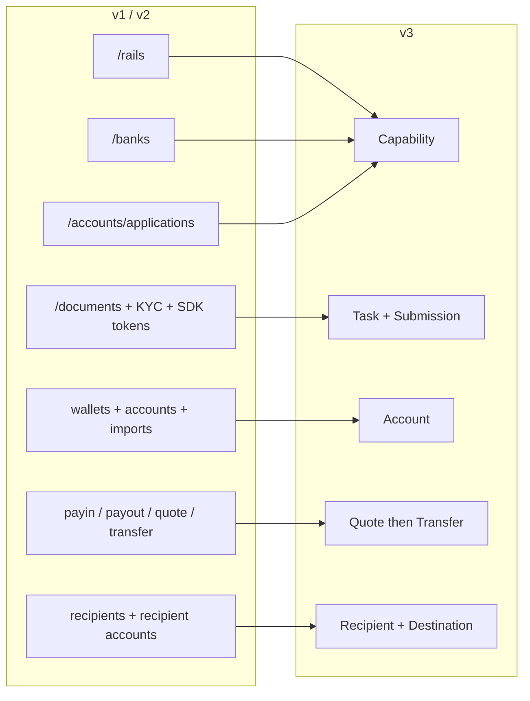
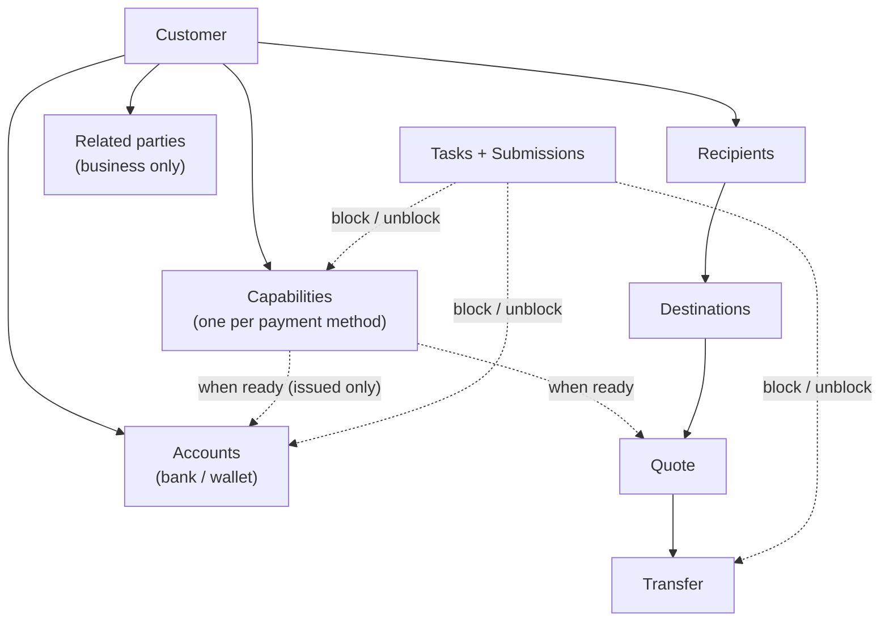
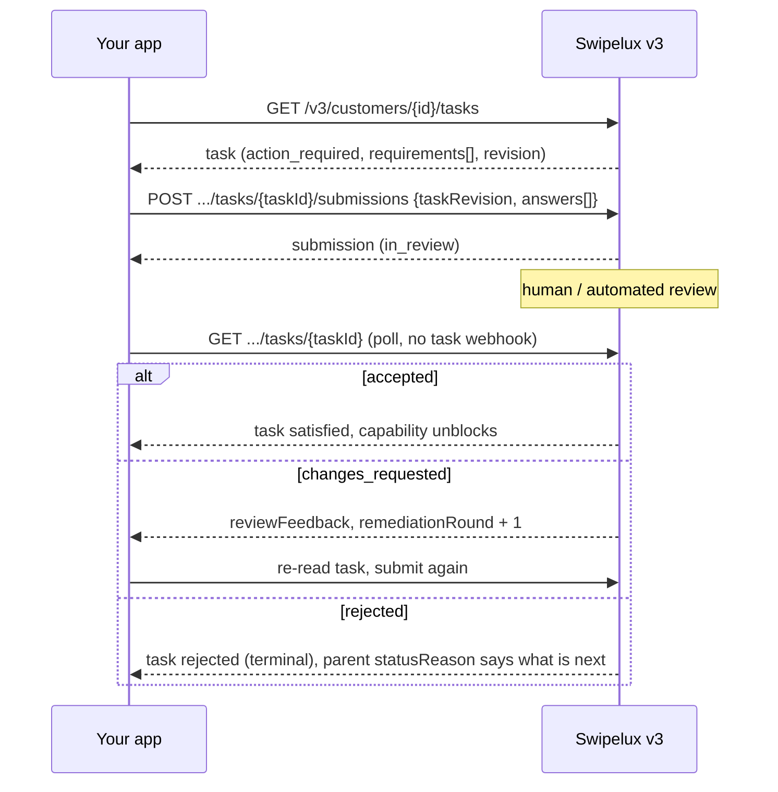
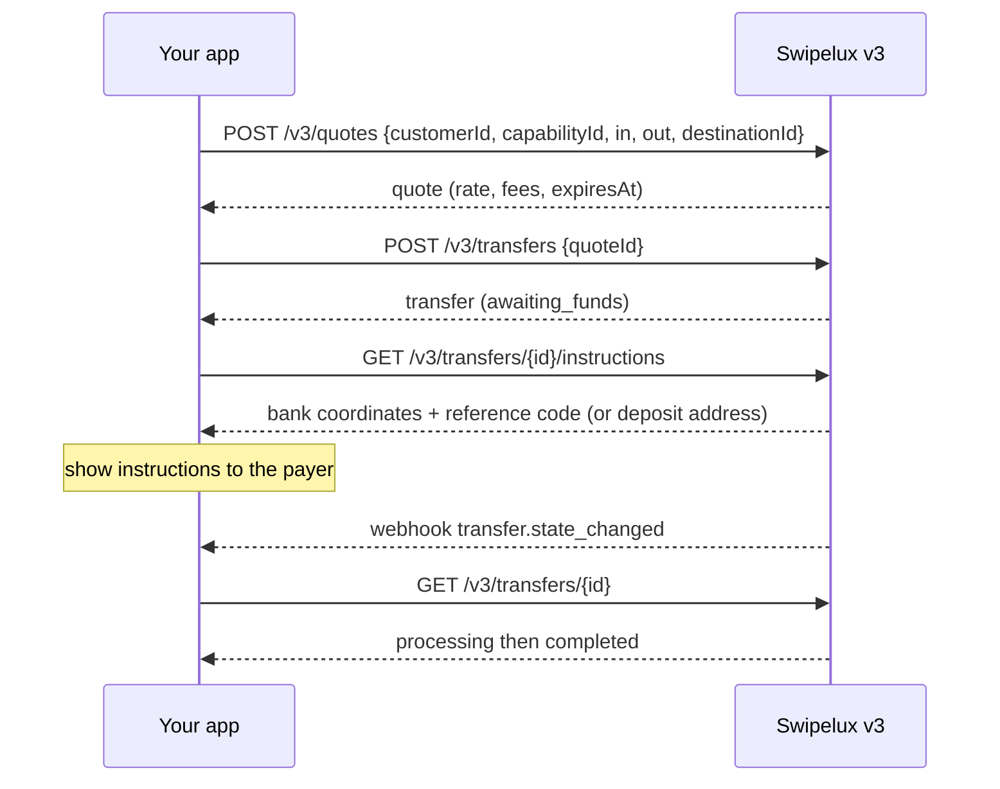
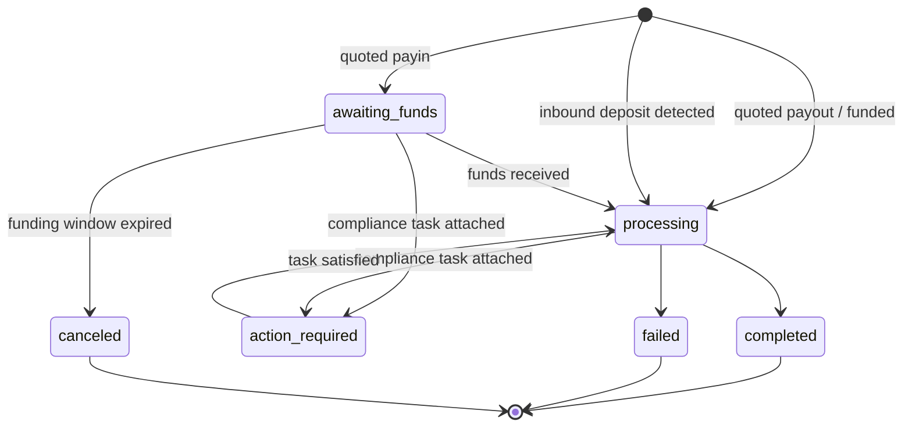
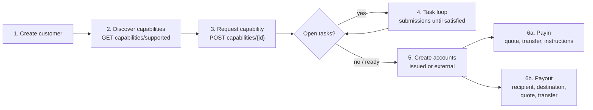

Migra la teva integració de l'API v1 i v2 a v3 en dues passades:

- **Part 1, el concepte.** Llegeix-la primer. v3 és un redisseny, no un canvi de nom: si mapes endpoints antics un a un, lluitaràs contra l'API. Deu minuts aquí t'estalviaran dies més tard.
- **Part 2, l'API.** Mapatge endpoint per endpoint, exemples de peticions, màquines d'estat i una llista de verificació de migració.

Basat en l'especificació OpenAPI de producció ([platform.swipelux.com/openapi.json](https://platform.swipelux.com/openapi.json)). v1 i v2 continuen actives i encara no estan obsoletes; totes les noves funcions capability, recipient, task i quoting es publiquen només en v3. Subscriu-te a l'esdeveniment de webhook `api.deprecation` per rebre avisos de retirada.

<Info>
  **Continguts.** Part 1: 1.1 per què existeix v3, 1.2 model d'objectes, 1.3 preparació per capability, 1.4 bucle de tasques, 1.5 moviment de diners, 1.6 màquines d'estat, 1.7 convencions, 1.8 ruta daurada. Part 2: 2.1 customers, 2.2 capabilities, 2.3 tasks i submissions, 2.4 accounts, 2.5 recipients i destinations, 2.6 quotes i transfers, 2.7 webhooks, 2.8 sandbox, 2.9 endpoints heretats, 2.10 ordre de migració, 2.11 llista d'entrebancs.
</Info>

---

## Part 1, el concepte

### 1.1 Per què existeix v3

v1 i v2 van desenvolupar quatre maneres solapades de deixar un customer llest per a pagaments: `/rails`, `/banks`, `/accounts/applications` i la superfície empresarial `rail-applications`, cadascuna amb el seu propi vocabulari d'estats. La recollida de documents (`/documents`, importacions de KYC, tokens SDK de verificació) estava desconnectada d'allò que realment desbloquejava. v3 ho condensa tot en sis recursos: el customer més cinc coses que posseeix:



| Recurs | Definició en una línia |
| --- | --- |
| **Customer** | La persona o empresa. **No té camp d'estat públic**, la preparació viu a les capabilities. |
| **Capability** | Un mètode de pagament que el customer pot fer servir (`sepa`, `ach`, `swift`, `stablecoin_transfers`, etc.), amb el seu propi estat. Reemplaça `/rails`, `/banks` i els punts d'entrada d'account-application. |
| **Task** | Una unitat de treball que Swipelux necessita (dades, documents, verificació), responguda amb una **Submission**. Reemplaça la superfície de documents i KYC. |
| **Account** | Un endpoint de finançament que el customer posseeix: `bank` o `wallet`, `issued` per Swipelux o `external`. |
| **Recipient / Destination** | Beneficiari del pagament (qui) i el seu endpoint bancari o de wallet (on). |
| **Quote / Transfer** | Tot el moviment de diners. Una transfer executa una quote persistida; les transfers sense cotització desapareixen. |

### 1.2 El model d'objectes



Dues regles estructurals per interioritzar:

1. **Les capabilities regulen tot.** Les accounts es proveeixen sota una capability `ready`; les quotes es cotitzen contra una capability. L'onboarding equival a portar les capabilities que necessites a `ready`.
2. **Les tasks s'adjunten a qualsevol lloc.** Una capability, una account o una transfer en curs poden portar `openTaskIds`. Allà on les vegis, el bucle és el mateix: llegir la task, enviar respostes, esperar la revisió, rellegir el recurs pare.

### 1.3 La preparació és per capability, no per customer

v1 embolicava la preparació de `/rails` amb una barrera de KYC a nivell de customer. En v3 no hi ha estat de customer: un customer pot ser plenament utilitzable en `stablecoin_transfers` mentre la seva capability `sepa` encara té tasks obertes. Les capabilities de compte agrupat solen passar a `ready` més ràpid que les nominatives, així que comença a operar en allò que sigui `ready` en lloc d'esperar-ho tot.

Si el teu codi v1 o v2 controla insígnies de UI basant-se en l'estat de verificació del customer, reescriu-lo:

- "Pot operar en X?" es converteix en capability X amb `status == "ready"`.
- "Ha de fer alguna cosa?" es converteix en qualsevol task amb estat `action_required` (la capability normalment mostra `restricted` amb `statusReason.resolution: "complete_tasks"`).
- "Estem esperant Swipelux?" es converteix en tasks `in_review`, capability `pending`.

### 1.4 El bucle de tasques

Tot el que feia l'antiga superfície de documents i KYC ara és aquest únic bucle:



Propietats clau:

- Una task porta `requirements[]`, les peticions individuals. Cadascuna té un `requirementId` per task, una `key` estable que nomena la petició (per exemple prova de domicili, deduplica la teva UI per ella) i una `request` tipada que descriu exactament quina entrada es desitja (text, data, selecció, document, atestació, etc.).
- Enviar està **subjecte a revisió**: mai muta directament l'estat de la capability o l'account, l'acceptació sí. Una excepció: les respostes `profile` es propaguen al perfil del customer en enviar-se (2.3). Després d'enviar, consulta la task o el recurs pare.
- `taskRevision` (eco del `revision` de la task) és un mecanisme de concurrència: si la task ha canviat des que la vas llegir, rellegeix-la i reconstrueix les teves respostes.
- `absence` és una resposta de primer nivell ("no tinc això perquè..."), fes-la servir en lloc de deixar requirements sense resposta.

### 1.5 Moviment de diners

Un sol flux per a payins, payouts i moviments de stablecoin. **No hi ha entrada de direcció**, mai declares payin contra payout. Les formes de moneda d'entrada i de sortida deriven un `direction` de només lectura a la quote i a la transfer: `fiat_to_stablecoin` (payin), `stablecoin_to_fiat` (payout) o `stablecoin_move`.



### 1.6 Una màquina d'estat per recurs

Cada recurs amb estat té el seu propi enum, i cada estat no exitós porta una raó estructurada. Accounts, applications i transfers comparteixen la forma `{ code, message, actor, retryable }`: accounts i applications l'exposen com a `statusReason`, transfers com a `stateDetail`. `actor` indica qui ha d'actuar (`customer`, `developer`, `provider`, `network`, `swipelux`), `retryable` indica si reintentar pot ajudar. Les capabilities fan servir `{ code, resolution, message }`, on `resolution` (`complete_tasks`, `wait`, `contact_support`, `none`) indica què fa avançar la capability. Els valors de `code` formen un catàleg obert i només additiu: fes branching per `resolution` (o `actor` més `retryable`), i tolera codis que no hagis vist mai.

| Recurs | Estats |
| --- | --- |
| Capability | `pending`, `restricted`, `ready`, `rejected`, `canceled` |
| Application (intent per petició sota una capability, 2.2) | `requested`, `in_review`, `action_required`, `ready`, `rejected`, `disabled`, `canceled` |
| Task | `action_required`, `in_review`, `satisfied`, `rejected`, `canceled` |
| Submission | `in_review`, `accepted`, `changes_requested`, `rejected` |
| Account | `provisioning`, `in_review`, `ready`, `action_required`, `suspended`, `rejected`, `archived` |
| Quote | `active`, `executed`, `expired`, `failed` |
| Transfer | `awaiting_funds`, `processing`, `action_required`, `completed`, `failed`, `canceled` |
| Recipient | `active`, `rejected`, `archived` |
| Destination | `in_review`, `ready`, `action_required`, `archived` |

Els estats que aquesta guia no recorre (`rejected`, `suspended`, `disabled`, `failed`, `canceled`) són terminals o gestionats per suport; les definicions per recurs són a l'especificació.

Transfer, en detall:



### 1.7 Convencions

| Àrea | v1 / v2 | v3 |
| --- | --- | --- |
| Auth | Capçalera `X-API-Key` | Igual. L'entorn (producció o sandbox) se selecciona per la clau; una única URL base. |
| Idempotència | No aplicada | Capçalera `Idempotency-Key` **obligatòria en tota petició amb efectes** (POST, PATCH, PUT, DELETE), exceptuant els endpoints de sandbox. La mateixa clau amb el mateix cos repeteix la resposta original. |
| Diners | Números i cadenes barrejats | Només cadenes (`"amount": "150.00"`). Mai floats. |
| Paginació | Variants offset/limit | Cursor: les llistes retornen `{ data, nextCursor, hasMore }`. |
| Actualitzacions | Molt orientades a PUT | Actualitzacions parcials amb `PATCH`. |
| Webhooks | Configuració d'endpoint únic | Múltiples endpoints, subscripció per esdeveniment. Els esdeveniments són **pistes**, la lectura és la veritat (2.7). |

Regles d'idempotència que convé interioritzar abans d'escriure codi:

- Reutilitzar una clau amb un cos **diferent** produeix `409 idempotency_conflict` mentre la clau es retingui (almenys 7 dies), així que mai planifiquis reutilitzar una clau. Genera un UUID nou per operació lògica i persisteix-lo amb el teu job.
- La repetició també cobreix els errors: si la petició original va acabar en un 4xx terminal, la mateixa clau més el cos retornen la mateixa resposta de problema.
- Dues peticions concurrents amb la mateixa clau: una guanya, l'altra rep `409`. Reintenta la perdedora després de l'estabilització de la guanyadora; la repetició retorna la resposta original.

### 1.8 La ruta daurada



---

## Part 2, l'API

### 2.1 Customers

| v1 / v2 | v3 |
| --- | --- |
| `POST /v1/customers`, `POST /v1/customers/business`, `POST /v2/customers` | `POST /v3/customers` (un sol endpoint, `type: individual \| business`) |
| `GET/PUT/DELETE /v1/customers/{id}`, `/v1/customers/business/{id}`, `/v2/customers/{customerId}` | `GET/PATCH/DELETE /v3/customers/{customerId}` |
| `GET /v1/customers` (llista) | `GET /v3/customers` (paginació per cursor, inclou resums de capabilities) |
| `GET /v1/customers/balances` (lot), `GET /v1/customers/{id}/balances` | Sense endpoint de balances, els balances viuen a les accounts: llegeix `balances` a `GET /v3/customers/{customerId}/accounts` |
| `POST/GET .../shareholders` (v1 business) | `POST/GET /v3/customers/{customerId}/related-parties` (més `GET/PATCH/DELETE .../related-parties/{relatedPartyId}`) |
| `POST /v1/customers/business/{id}/kyb` (enviar), `GET .../kyb` (estat) | Sense trucada d'enviament de KYB, sol·licita una capability (2.2) i respon les seves tasks (2.3); el veredicte apareix com a estat de capability i de task |
| `POST /v1/customers/{id}/kyc`, `.../kyc/import`, endpoints de tokens SDK | Sistema de tasks (2.3); la verificació allotjada apareix com a `verificationSessions` dins de les tasks |

Creació, discriminada per `type` (valors il·lustratius, noms de camp segons l'especificació):

```jsonc
// POST /v3/customers        Idempotency-Key: <fresh uuid>
{
  "type": "individual",
  "externalId": "user-1042",
  "individual": {
    "firstName": "Maria",
    "lastName": "Silva",
    "birthDate": "1990-04-12",
    "nationalities": ["BR"],
    "residenceCountry": "BR",
    "email": "maria@example.com",
    "residentialAddress": {
      "streetLine1": "Av. Paulista 1000",
      "city": "Sao Paulo",
      "postalCode": "01310-100",
      "country": "BR"
    }
  },
  "financialProfile": {
    "accountPurposes": ["cross_border_remittance"],
    "sourcesOfFunds": ["salary"]
  }
}
```

- **La creació és progressiva**: `{ "type": "individual" }` per si sol és una creació vàlida. Les dades que falten mai invaliden el customer, apareixen més tard com a tasks d'intake a les capabilities que les necessitin.
- Les empreses porten `business` més dades de registre. El CRUD d'accionistes de v1 es mapa a **related parties**, ampliat per cobrir directors, executius i propietaris: crea'ls en línia en crear el customer (cada un rep un id estable `rp_`) o gestiona'ls pels endpoints dedicats de related-parties.
- **No hi ha camp `status` al customer**, vegeu 1.3.
- **Els customers existents es conserven**: els customers creats en v1 o v2 són adreçables pel mateix id als endpoints v3. La lectura v3 és una _vista sanejada_, els valors heretats que no superen la validació v3 tornen absents. Després de la teva **primera escriptura v3, aquesta vista es torna permanent**: els valors absents no tornen per si sols. Enriqueix aviat, planifica una passada única que `PATCH` el perfil complet des dels teus propis registres abans de confiar en les lectures v3. El `metadata` de v1 és un espai de noms separat i **no** es conserva, torna-ho a establir en v3.
- `externalId` és de primer nivell i **únic entre els teus customers** en v3, per entorn (`409 duplicate_external_id`). Arxivar un customer no allibera el seu `externalId`, neteja'l amb PATCH abans de DELETE si penses reutilitzar-lo.
- `DELETE` és un **arxivat en cascada** (sense restauració; els ids no es reutilitzen mai). Es bloqueja amb `409 customer_has_active_resources` més `blockingResources[]` mentre existeixi qualsevol account no arxivada o transfer en curs.
- Regles de fusió de PATCH: `null` explícit neteja un camp anul·lable, els arrays es reemplacen per complet (excepte related parties en línia, que fan upsert per id), les claus de `metadata` es fusionen. Els esquemes complets i els filtres de llista són a l'especificació OpenAPI.

### 2.2 `/rails`, `/banks`, applications esdevenen Capabilities

| v1 / v2 | v3 |
| --- | --- |
| `GET /v1/.../rails/capabilities` | `GET /v3/customers/{customerId}/capabilities/supported` |
| `GET /v2/.../banks` (més `/banks/{bank}`), `GET /v2/meta/banks` | `GET /v3/customers/{customerId}/capabilities/supported` |
| `GET /v1/customers/{customerId}/rails` (llista) | `GET /v3/customers/{customerId}/capabilities` |
| `GET /v2/customers/{customerId}/rails` (resum) | `GET /v3/customers/{customerId}/capabilities` |
| `POST /v1/.../rails`, `POST /v2/.../banks` | `POST /v3/customers/{customerId}/capabilities/{capabilityId}` |
| `POST /v2/.../accounts/applications` | `POST /v3/customers/{customerId}/capabilities/{capabilityId}` |
| `GET /v1/.../rails/{rail}` | `GET /v3/.../capabilities/{capabilityId}` |
| `GET /v2/.../accounts/applications` (més `/{applicationId}`, `/{applicationId}/history`) | `GET /v3/.../capabilities/{capabilityId}` (més `/applications`, `/applications/{id}/history`) |
| Superfície business-rail: `GET/POST /v2/customers/business/{customerId}/rail-applications` (més `/{rail}`) | Els mateixos endpoints de capability de v3, sense superfície business separada |
| Superfície business-rail: `GET .../business/{customerId}/rails` (més `/{rail}`) | Els mateixos endpoints de capability de v3, sense superfície business separada |
| `GET /v1/meta/rails` (catàleg estàtic) | `GET /v3/customers/{customerId}/capabilities/supported`, la disponibilitat és per customer; no hi ha catàleg estàtic |
| `GET /v1/meta/accounts/banks` | `GET /v3/institutions` (directori bancari: id, nom, BIC, països) |
| No disponible | `GET /v3/capabilities`, llista global del comerç de capabilities concedides entre customers (filtrable per `status`, `method`, `customerId`) |
| No disponible | `GET /v3/.../capabilities/{capabilityId}/tasks-preview` (veure les peticions abans de sol·licitar) |
| No disponible | `POST /v3/.../capabilities/{capabilityId}/cancel` |

- Una capability equival a `method` (`ach`, `wire`, `rtp`, `pix`, `sepa`, `swift`, `spei`, `pse`, `transfers_3_0`, `faster_payments`, `sepa_instant`, `uaefts`, `card`, `stablecoin_transfers`, etc.) més `accountType` (`pooled` o `named`, `null` per a mètodes no bancaris) més `directions` (`payin` o `payout`). El `capabilityId` públic és la parella qualificada (`sepa_pooled`, `ach_named`) o el mètode simple per a `card` i `stablecoin_transfers`.
- Cada sol·licitud de capability genera una **application**, el registre per intent sota `.../capabilities/{capabilityId}/applications` (més `/{applicationId}/history`), amb els seus propis estats (1.6) i `statusReason`. És la traça d'auditoria d'una sol·licitud; en el dia a dia, consulta la mateixa capability.
- `capabilities/supported` retorna disponibilitat (`available`, `beta` o `disabled`), elegibilitat i institucions ofertes. La selecció de banc passa en el moment de la sol·licitud a través de l'array opcional `institutions`, no hi ha un recurs `/banks` separat. Ometre'l (o enviar `[]`) selecciona totes les institucions per defecte; `isDefault: true` és un flag específic de customer i capability, no global. Una llista no buida sobreescriu els valors per defecte, i una capability bancària sense un valor per defecte aplicable retorna `422 capability_institutions_required`. Els ids d'institució són opacs, tolera els nous.
- `stablecoin_transfers` s'**atorga automàticament en crear el customer** i neix `ready` (per la qual cosa mai se sol·licita ni es cancel·la). `card` és només per a individuals.
- `openTaskIds` a la capability és el teu punter de "què faig a continuació". Obert equival a `action_required` **o** `in_review`, i el rollup inclou tasks compartides a nivell de customer accessibles a través de dependències actives.
- `cancel` només funciona des de `pending` o `restricted` **i** sense recursos bloquejants, altrament `409 capability_not_cancelable`, el cos del problema del qual llista `blockingResources`. Tornar a sol·licitar després de cancel·lar és una nova creació amb una nova clau d'idempotència.
- **Consulta el GET.** L'estat de la capability s'actualitza en llegir-lo; consulta `GET .../capabilities/{capabilityId}` o subscriu-te a `capability.status_changed`, no facis cache.
- Sol·licitar un mètode pot fer disponibles mètodes relacionats alhora, tracta les capabilities com un conjunt que rellegeixes, no com una única fila que segueixes.
- Fes servir `tasks-preview` per mostrar les peticions d'onboarding **abans** de comprometre't amb una sol·licitud.
- La verificació no és única: poden aparèixer noves tasks en una capability ja `ready` (reverificació periòdica o dirigida per esdeveniments). Mantén el bucle de tasks actiu durant tot el cicle de vida del customer, no només durant l'onboarding.

### 2.3 Documents i KYC esdevenen Tasks i Submissions

<Note>
  **Nota sobre el nom.** Aquests endpoints es van publicar breument com a `requirements` i `fulfillments`. Des del 2026-08-02 els noms públics són **tasks** i **submissions**. El canvi de nom va cobrir només els recursos i les rutes d'endpoint, l'array `requirements[]` dins d'una task i el seu `requirementId` conserven aquests noms.
</Note>

Cada superfície de documents heretada es mapa al mateix reemplaçament: llegeix `GET /v3/customers/{customerId}/tasks`, respon amb `POST .../tasks/{taskId}/submissions`.

| v1 / v2 | v3 |
| --- | --- |
| `POST/GET/DELETE /v1/documents` | `GET /v3/.../tasks` més `POST .../tasks/{taskId}/submissions` |
| `POST /v1/customers/{id}/documents` | `GET /v3/.../tasks` més `POST .../tasks/{taskId}/submissions` |
| `GET/POST /v1/customers/business/{id}/documents` (més `PUT/DELETE .../{docId}`) | `GET /v3/.../tasks` més `POST .../tasks/{taskId}/submissions` |
| `GET/POST .../shareholders/{shareholderId}/documents` (més `GET/PUT/DELETE .../{docId}`) | `GET /v3/.../tasks` més `POST .../tasks/{taskId}/submissions` |
| `GET/POST/DELETE /v2/.../documents` (més `/{documentId}`) | `GET /v3/.../tasks` més `POST .../tasks/{taskId}/submissions` |
| `POST /v2/.../documents/upload-token` més `POST /v2/documents/direct-upload` | Puja directament amb la teva clau API (a sota), o envia un `storageKey` recent de càrrega directa com a JSON a `POST /v3/.../documents` en un termini de cinc minuts |
| `POST /v1/customers/documents/upload`, `POST /v1/document` (intakes heretats) | Eliminat, puja directament amb la teva clau API (a sota) |
| `POST /v1/customers/{id}/kyc` més tokens SDK | Task `verificationSessions` (verificació allotjada); sense trucada directa "start KYC" |

Al voltant d'aquest bucle:

- **Emmagatzematge d'arxius en brut**: `POST/GET/DELETE /v3/customers/{customerId}/documents` (més `/{documentId}` i `GET .../{documentId}/download`), puja una vegada amb la teva clau API i després referencia els ids de document a les respostes de submission. Això reemplaça tots els intakes d'upload-token i direct-upload. `POST .../documents` també accepta un cos JSON (`storageKey`, `fileName`, `type`) que consumeix una referència amb àmbit de client encara recent de `POST /v2/documents/direct-upload`, de manera que les càrregues aparcades es migren sense reenviar bytes.
- **Lectures totalment noves**: `GET /v3/tasks` (safata d'entrada del comerç), `GET /v3/transfers/{transferId}/tasks`, `GET .../tasks/{taskId}/history`, `GET .../tasks/{taskId}/submissions` (més `/{submissionId}`).

Submission (il·lustratiu):

```jsonc
// POST /v3/customers/{cus}/tasks/{task}/submissions   Idempotency-Key: <fresh uuid>
{
  "taskRevision": 3,
  "answers": [
    { "requirementId": "req_a1", "answer": { "type": "document", "documentIds": ["doc_passport1"] } },
    { "requirementId": "req_b2", "answer": { "type": "text", "value": "Import/export business" } },
    { "requirementId": "req_c3", "answer": { "type": "absence", "reason": "not_applicable" } }
  ]
}
```

- Tipus de resposta: `profile`, `text`, `date`, `single_select`, `multi_select`, `boolean`, `attestation`, `document`, `resource_reference`, `absence`. L'objecte `request` de cada requirement et diu quin tipus espera.
- Una submission ha de respondre **cada requirement accionable de la ronda actual**, amb el `taskRevision` exacte que has llegit. Les submissions parcials són rebutjades.
- Les respostes `profile` **es propaguen**: actualitzen el perfil del customer per la via de validació normal i reavaluen de seguida cada capability que referencia la mateixa feina d'intake. Les tasks d'intake germanes els requirements de les quals estan tots satisfets es tanquen automàticament.
- Els requirements poden formar grups alternatius (`alternativeKey`): envia exactament un del grup.
- `changes_requested` incrementa `remediationRound` i porta `reviewFeedback`. Rellegeix la task, envia de nou **amb una nova clau d'idempotència**.
- Les URLs de verificació allotjada apareixen **només** al detall de task per customer (`GET /v3/customers/{customerId}/tasks/{taskId}`) i només mentre la sessió sigui accionable; les llistes i `GET /v3/tasks/{taskId}` estan deliberadament sense URLs.
- Els termes de servei també són una task: `openTaskIds` pot incloure una task amb `category: "terms_of_service"` la pàgina d'acceptació allotjada de la qual s'enllaça de la mateixa manera (només detall per customer). Les submissions genèriques no poden acceptar termes, i l'aprovació de KYC mai implica l'acceptació de termes.
- Les tasks tenen àmbit per capability, així que la "mateixa" petició (per exemple prova de domicili) pot aparèixer una vegada per capability. Deduplica a la teva UI per la `key` del requirement.
- **No hi ha capa de traducció**: publicar a `/v1/documents` no desbloquejarà les capabilities de v3. Un cop un customer és a v3, canalitza totes les peticions a través de tasks.

### 2.4 Accounts i wallets

| v1 / v2 | v3 |
| --- | --- |
| `POST/GET /v1/.../accounts` (més `/import`), `/v2/.../accounts` (més `/import`) | `POST/GET /v3/customers/{customerId}/accounts` |
| `POST/GET /v1/.../wallets` (més `/import`) | Mateix endpoint, `type: wallet` |
| `GET/DELETE /v1/customers/{customerId}/accounts/{accountId}` (i la variant de wallets), `GET /v2/.../accounts/{accountId}` | `GET/PATCH/DELETE /v3/.../accounts/{accountId}` |
| `PATCH /v2/.../accounts/{accountId}/fees` | `GET/PUT /v3/.../accounts/{accountId}/fees` |

Creació, discriminada per `origin` més `type`. Els comptes bancaris emesos prenen un únic `method`; els comptes bancaris externs prenen en canvi un array `methods` (enviar `method` allà és rebutjat):

```jsonc
// issued bank account (capability must be ready)
{ "origin": "issued", "type": "bank", "method": "sepa",
  "currency": "EUR", "settlement": { "accountId": "acc_wallet1" } }

// external wallet the customer already owns (replaces /import)
{ "origin": "external", "type": "wallet", "currency": "USDC",
  "network": "polygon", "details": { "address": "0x71C7656EC7ab88b098defB751B7401B5f6d8976F" } }
```

- `country` als comptes bancaris emesos és opcional (per defecte segons el mètode); als comptes bancaris **externs** proporciona'l explícitament. Els comptes de wallet no porten país en absolut.
- `settlement.accountId` és obligatori als comptes bancaris emesos: identifica el compte de wallet emès que rep els fons liquidats dels dipòsits fets al compte bancari.
- Els comptes emesos exposen `details` (IBAN o routing més account o address), `routing` versionat (les coordenades de dipòsit poden rotar, mostra sempre l'última lectura), `fees`, `balances`.
- Xarxes: `polygon`, `ethereum`, `base`, `arbitrum`, `optimism`, `bsc`, `avalanche`.
- La barrera de capability s'aplica només als comptes **emesos**: crear-ne un contra una capability no llesta falla amb un error codificat per capability, sol·licita primer la capability (2.2). Els comptes externs no necessiten capability (ni aprovació del customer); només obtenen validació de l'esquema de la petició i de les dades bancàries.
- Els comptes bancaris emesos neixen `provisioning` amb `details: null`. Consulta el compte o escolta `account.status_changed` fins a `ready`.
- `DELETE` arxiva, mai elimina de forma dura. Els comptes referenciats per transfers en curs retornen `409 account_has_active_transfers`. Reintenta després que aquestes transfers arribin a un estat terminal.
- Nou a v3: **Rules**, instruccions permanents en un compte de wallet emès (`POST/GET /v3/customers/{customerId}/rules`, `GET/PATCH/DELETE .../rules/{ruleId}`) que escombren automàticament els fons entrants cap a un altre compte o una destinació de wallet. Sense equivalent a v1 o v2.

### 2.5 Recipients i destinations

| v1 | v3 |
| --- | --- |
| `POST/GET /v1/.../recipients` | `POST/GET /v3/customers/{customerId}/recipients` |
| No disponible (els recipients de v1 només eren crear i llistar) | `GET/PATCH/DELETE /v3/.../recipients/{recipientId}`, detall, actualització i arxivat totalment nous |
| `POST/GET .../recipients/{recipientId}/accounts` | `POST/GET /v3/.../recipients/{recipientId}/destinations` |
| `GET/DELETE .../recipients/{recipientId}/accounts/{recipientAccountId}` | `GET/DELETE /v3/.../recipients/{recipientId}/destinations/{destinationId}` (sense PATCH de destination, arxiva i torna a crear) |

v2 no tenia el concepte de recipient. Si ets a v2 i pagues a tercers, aquesta és superfície nova, no un canvi de nom.

- **Recipient** equival a qui: `individual` (nom i cognom) o `business` (nom d'empresa), amb `relationship` obligatori (`employee`, `contractor`, `vendor`, `subsidiary`, `merchant`, `customer`, `landlord`, `family`, `other`). Recipients i destinations són només per a tercers. Un payout a un mateix no fa servir cap recipient: apunta a un dels propis comptes `acc_` del customer com a `destinationId` de la quote (2.6).
- **Destination** equival a on: tipada per mètode, `sepa` (iban, bic opcional), `ach` o `wire` (routing més account), `swift` (coordenades completes més intermediari opcional), `spei` (clabe), `pse`, `transfers_3_0` (cbu), etc., més destinacions de wallet. Cada destination té el seu propi estat. Escolta `destination.status_changed`.
- Les destinations fiat requereixen l'`address` complet del recipient (carrer, ciutat, codi postal, país) **abans** de la creació. Les peces que falten fallen amb `422 recipient_address_required`. Les destinations de wallet ometen l'adreça però requereixen `ownership` de nivell superior (`self_custodied`, o `custodial` amb el nom d'un custodi).
- La precisió del nom del beneficiari importa: els bancs receptors comproven el nom **legal** del compte. Envia el nom legal exacte i el cognom o el nom d'empresa, no un àlies de visualització.
- Els esquemes de camps de destination per mètode són a l'especificació OpenAPI.

### 2.6 Quotes i transfers

| v1 / v2 | v3 |
| --- | --- |
| `POST /v1/payin/quote`, `/v1/payout/quote`, `/v2/quote` | `POST /v3/quotes` |
| `POST /v1/payin`, `/v1/payout`, `POST /v1/transfers`, `/v2/transfer` | `POST /v3/transfers` (executa una quote, les creacions sense cotització desapareixen) |
| `GET /v1/transfers` (llista), `GET /v1/transfers/{id}` | `GET /v3/transfers`, `/v3/transfers/{transferId}` |
| No disponible (les quotes de v1 i v2 no tenien lectura) | `GET /v3/quotes/{quoteId}` |
| `GET /v1/rate/{base}/{quote}` | `GET /v3/rates` |
| (implícit a la resposta de payin) | `GET /v3/transfers/{transferId}/instructions` |
| No disponible | `POST /v3/transfers/{transferId}/cancel`, `GET /v3/transfers/{transferId}/tasks` |

```jsonc
// 1. Quote: amount on exactly one side picks mode (exact_in / exact_out).
// POST /v3/quotes            Idempotency-Key: <fresh uuid>
{
  "customerId": "cus_123",
  "capabilityId": "sepa_named",
  "in":  { "currency": "EUR", "amount": "150.00" },
  "out": { "currency": "USDC" },
  "destinationId": "acc_wallet1",   // fiat-funded: must be a customer-owned acc_ account
  "fees": { "breakdown": { "developer": { "fixed": "1.00", "bips": 50 } } }
}
// -> { mode: "exact_in", direction: "fiat_to_stablecoin", rate, fees[], expiresAt, ... }

// 2. Execute before expiresAt.
// POST /v3/transfers         Idempotency-Key: <fresh uuid>
{ "quoteId": "quo_789", "externalId": "order-991", "memo": "invoice 44" }
```

- `destinationId` accepta un id `acc_` (compte del propi customer) o `dst_` (destination de recipient). **Les quotes finançades amb fiat (payins) han d'apuntar a un compte `acc_`**, un objectiu `dst_` sempre significa un payout (`422 quote_direction_invalid` altrament).
- `externalId` a quotes i transfers és una referència de correlació no única (repetida a les lectures, filtrable a les llistes). La regla d'unicitat per entorn (2.1) s'aplica només a l'`externalId` del customer.
- Executa una quote exactament una vegada, abans de `expiresAt`. Una quote expirada falla amb `409 quote_expired`, una segona execució amb `409 quote_already_executed` (el problema porta el `transferId` existent).
- La cancel·lació de transfers encara no està suportada: `POST .../cancel` retorna `409 transfer_not_cancelable` en tots els estats. Les transfers `canceled` d'avui provenen de l'expiració de la finestra de finançament en un payin sense finançar, no d'aquest endpoint.
- Els payins comencen `awaiting_funds`: mostra `GET .../instructions` al pagador, coordenades bancàries més **codi de referència o memo** per a fiat, adreça de dipòsit per a cripto. El codi de referència és com s'aparellarà el dipòsit. Mostra'l sempre.
- `state` més `stateDetail` per a subestats llegibles per màquina; `action_required` significa que hi ha una task de compliment adjunta (`openTaskIds`, `GET .../tasks`), respon via submissions.
- Els dipòsits entrants detectats als comptes emesos apareixen com a transfers amb `origin: "inbound_deposit"` (davant de `"quoted"`).
- Les referències de xarxa de pagament es consoliden sota `references`: `transactionHash`, `traceNumber`, `imad`, `uetr`, `explorerUrl`, `returnedTransferId`.

Traducció de l'estat v1:

| Concepte v1 | v3 |
| --- | --- |
| objectes separats de payin i payout | una sola transfer amb `direction` |
| devolucions o cancel·lacions del proveïdor (englobades a `failed`) | continua sent `failed`, ara amb `stateDetail` llegible per màquina i `references.returnedTransferId` quan una devolució ha generat una transfer inversa |

Dues advertències de migració:

- **Les transfers no creuen versions.** Les transfers creades a v1 o v2 no són llegibles des de v3. La llista les omet i `GET /v3/transfers/{transferId}` respon 404. Migra primer la _creació_, mantingues la ruta de lectura v1 fins que aquestes transfers assoleixin estats terminals, i després elimina-la.
- **Sense intercanvis de tokens.** `stablecoin_move` requereix la mateixa moneda d'entrada i de sortida: USDC a USDT falla amb `422 recipient_destination_invalid` portant un error de camp `currency_mismatch`. Mateixa xarxa a totes dues bandes, sense ponts, i els moviments entre wallets només suporten actualment el lliurament sense comissions: una quote la comissió de plataforma o de developer de la qual sigui diferent de zero falla amb `422 amount_not_deliverable`.

### 2.7 Webhooks

| v1 | v3 |
| --- | --- |
| `GET/PATCH /v1/webhooks` (configuració d'un sol endpoint) | `POST/GET /v3/webhooks`, `PATCH/DELETE /v3/webhooks/{webhookId}`, `GET /v3/webhooks/portal` |

Catàleg d'esdeveniments: `customer.created`, `customer.updated`, `customer.archived`, `capability.created`, `capability.status_changed`, `application.status_changed`, `recipient.status_changed`, `destination.status_changed`, `account.created`, `account.status_changed`, `account.details_changed`, `transfer.created`, `transfer.state_changed`, `api.deprecation`.

- `GET /v3/webhooks/portal` retorna una URL de portal de gestió allotjat per a registres de lliurament, reintents i repetició manual.
- `transfer.created` es lliura actualment amb la forma del payload heretat de v1 (l'envolvent de v3 s'activa quan els webhooks v1 es retirin). Tracta'l purament com una pista i fes GET a la transfer; no construeixis contra el seu cos.
- Els esdeveniments són pistes: en rebre'ls, fes GET al recurs i actua sobre la lectura. Mai construeixis estat a partir dels payloads o l'ordre dels esdeveniments. El lliurament és almenys una vegada i pot retardar-se o reordenar-se. Deduplica per id d'esdeveniment, i recupera esdeveniments perduts amb el filtre inclusiu `updatedAfter` de cada llistat.
- Subscriu-te a `api.deprecation`, el canal automatitzat per a les retirades de versió.
- Sense esdeveniment `task.*` avui: després d'enviar, consulta la task o el seu recurs pare.

### 2.8 Sandbox

Mateixa URL base; la clau API de sandbox selecciona l'entorn.

| v1 | v3 |
| --- | --- |
| `POST /v1/sandbox/topup` | `POST /v3/sandbox/accounts/{accountId}/topup` |
| `POST /v1/sandbox/payins/simulate`, `.../payouts/simulate`, `POST /v1/customers/{id}/simulate-transactions` | `POST /v3/sandbox/transfers/{transferId}/state` (guia una transfer real a través dels estats) |
| No disponible | `POST /v3/sandbox/customers/{customerId}/verification` (completa la verificació) |
| No disponible | `POST /v3/sandbox/customers/{customerId}/capabilities/{capabilityId}/status` (força l'estat de la capability) |
| No disponible | `POST /v3/sandbox/tasks`, `POST /v3/sandbox/tasks/{taskId}/review` (crea una task, després simula el veredicte) |

El sandbox de v3 simula el bucle de revisió d'extrem a extrem: crea una task, envia contra ella, `review` a `accepted` o `rejected`, observa com es desbloqueja la capability. Assaja la teva UX de remediació abans de producció. Tant les tasks creades en sandbox com les tasks d'intake habituals que apareixen a les capabilities sol·licitades es revisen així; com a producció, no es disparen webhooks de task, consulta (2.7).

### 2.9 Endpoints heretats sense reemplaçament a v3

Aquests no tenen reemplaçament a v3. La majoria continuen a v1 sense canvis (mantingues les teves crides existents); dos es retiren directament (vegeu Disposició):

| Endpoint | Disposició |
| --- | --- |
| `GET /v1/merchant-kyb/creation-gate`, `POST /v1/merchant-kyb/{customerId}/submit`, `POST /v1/merchant-kyb/parked-url`, `POST /v1/merchant-kyb/upload-token` | El teu propi onboarding de KYB del comerç (no el KYB del customer), sense canvis a v1 |
| `POST /v1/merchant-wallets/get-or-create` | Ajudant de wallet de tresoreria del comerç, sense canvis a v1 |
| `GET /v1/meta/accounts/relationships` | Retirat, l'enum `relationship` de recipient és fix i està documentat en línia (2.5) |
| `GET /v1/meta/kyb/documents` | Retirat, les tasks de v3 declaren els documents requerits per cas via `requirements[]` (2.3); no hi ha catàleg estàtic |
| `GET /statecharts` (més `/{machineId}`, `/{machineId}/svg`, `/explorer`, `/validate`) | Pàgines públiques de referència de màquines d'estat, neutres respecte a la versió, sense canvis |

Qualsevol altre endpoint públic de v1 o v2 apareix en alguna taula de mapatge anterior.

### 2.10 Ordre de migració suggerit

Cada pas es pot publicar de forma independent; v1 o v2 i v3 conviuen contra la mateixa base de customers. Assaja cada pas contra la teva clau de sandbox (2.8) abans de repetir-lo en producció.

<Steps>
  <Step title="Fontaneria">
    `Idempotency-Key` en totes les peticions amb efectes (POST, PATCH, PUT, DELETE; endpoints de sandbox exempts); diners com a cadenes; ajudants de paginació per cursor.
  </Step>
  <Step title="Webhooks">
    Registra endpoints v3 per esdeveniment, incloent-hi `api.deprecation`. La configuració d'endpoint únic de v1 és una superfície separada, deixa-la al seu lloc; ambdues conviuen fins al drenatge del pas 9.
  </Step>
  <Step title="Enriquiment del perfil">
    `PATCH /v3/customers/{id}` amb el perfil complet que posseeixes (v1 recollia menys del que v3 exposa) i torna a establir `metadata`. Fes d'això deliberadament la **primera escriptura v3** per customer: omple la vista sanejada abans que aquesta vista es torni permanent (2.1).
  </Step>
  <Step title="Lectures">
    Apunta les lectures de customer, capability i account a v3; reescriu la lògica d'estat de customer segons 1.3. Només després del pas 3, les lectures sense enriquir tornen amb els camps legacy-invàlids absents.
  </Step>
  <Step title="Escriptures d'onboarding">
    Crea via `POST /v3/customers`; sol·licita capabilities en lloc de `/rails`, `/banks` o applications; construeix el bucle de tasks (la major feina de UI totalment nova, `tasks-preview` ajuda a mostrar les peticions per endavant). A partir d'aquest punt, deixa de publicar `/v1/documents` per a customers dirigits per v3, no desbloquegen capabilities (2.3).
  </Step>
  <Step title="Comptes">
    Emet via v3; mou les importacions a `origin: external`.
  </Step>
  <Step title="Payouts">
    Recipients més destinations, després quote i transfer.
  </Step>
  <Step title="Payins">
    Quote, transfer, instruccions; continua mostrant el codi de referència.
  </Step>
  <Step title="Drenatge">
    Les transfers no creuen versions (2.6). Mantingues la ruta de lectura de v1 o v2 i l'endpoint de webhook v1 per a les transfers creades allà, fes doble lectura fins que assoleixin estats terminals, després elimina el client antic i la configuració del webhook v1.
  </Step>
</Steps>

### 2.11 Llista d'entrebancs

- [ ] UUID nou per **operació lògica**, persistit amb el teu job i reutilitzat en el reintent; mai reutilitzis una clau amb un cos canviat (`409 idempotency_conflict`). Els endpoints de sandbox estan exempts de la capçalera.
- [ ] Enriqueix els customers existents (`PATCH` el perfil complet, torna a establir `metadata`, no es conserva) **abans de qualsevol altra escriptura v3**, la primera escriptura v3 torna permanent la vista sanejada.
- [ ] `externalId` és únic per entorn i **no s'allibera en arxivar**, neteja'l amb `PATCH` abans de `DELETE` si penses reutilitzar-lo.
- [ ] No existeix camp `status` al customer, deriva la preparació per capability.
- [ ] `action_required` **i** `in_review` signifiquen tots dos una task oberta.
- [ ] Les submissions estan subjectes a revisió (enviar no equival a desbloquejat) i han de respondre **cada** requirement accionable amb el `taskRevision` exacte. En cas de discrepància, rellegeix i reconstrueix.
- [ ] No existeix webhook `task.*`, consulta la task (o el seu pare) després de cada enviament.
- [ ] Reintent `changes_requested` equival a rellegir la task, respostes noves, **clau d'idempotència nova**.
- [ ] Publicar a `/v1/documents` mai desbloqueja una capability v3, un cop un customer és a tasks, canalitza tota petició a través de tasks.
- [ ] Poden aparèixer noves tasks en una capability ja `ready`, mantingues el bucle de tasks actiu després de l'onboarding, no només durant aquest.
- [ ] `cancel` de capability només funciona des de `pending` o `restricted` sense recursos bloquejants (`409 capability_not_cancelable`); tornar a sol·licitar després de cancel·lar és una creació nova amb una nova clau d'idempotència.
- [ ] La capability ha d'estar `ready` abans d'emetre comptes sota ella o cotitzar contra ella.
- [ ] La quote té l'import exactament en un costat; sense camp de direcció; s'executa exactament una vegada abans de `expiresAt` (`409 quote_expired` o `409 quote_already_executed`).
- [ ] Els moviments de stablecoin són només mateixa moneda i mateixa xarxa (USDC a USDT falla `422`); wallet a wallet només suporta lliurament sense comissions.
- [ ] `DELETE` arxiva, mai elimina de forma dura. El delete d'account es bloqueja per transfers en curs (`409 account_has_active_transfers`); el delete de customer a més per qualsevol account no arxivada (`409 customer_has_active_resources`, `blockingResources[]` els anomena).
- [ ] Les transfers de v1 o v2 són invisibles a les lectures de v3 (la llista les omet, GET respon 404), fes doble lectura fins a drenar-les, després elimina les rutes antigues.
- [ ] El `routing` de dipòsit i les instruccions poden rotar, mostra sempre l'últim GET i mostra sempre el codi de referència.
- [ ] Els webhooks són pistes; el GET és la veritat, deduplica per id d'esdeveniment, recupera esdeveniments perduts amb `updatedAfter`.

## Pas següent

Comença al pas 1 de l'ordre de migració (2.10), claus d'idempotència, diners com a cadenes, paginació per cursor, i assaja cada pas contra la teva clau de sandbox (2.8) abans de repetir-lo en producció.
