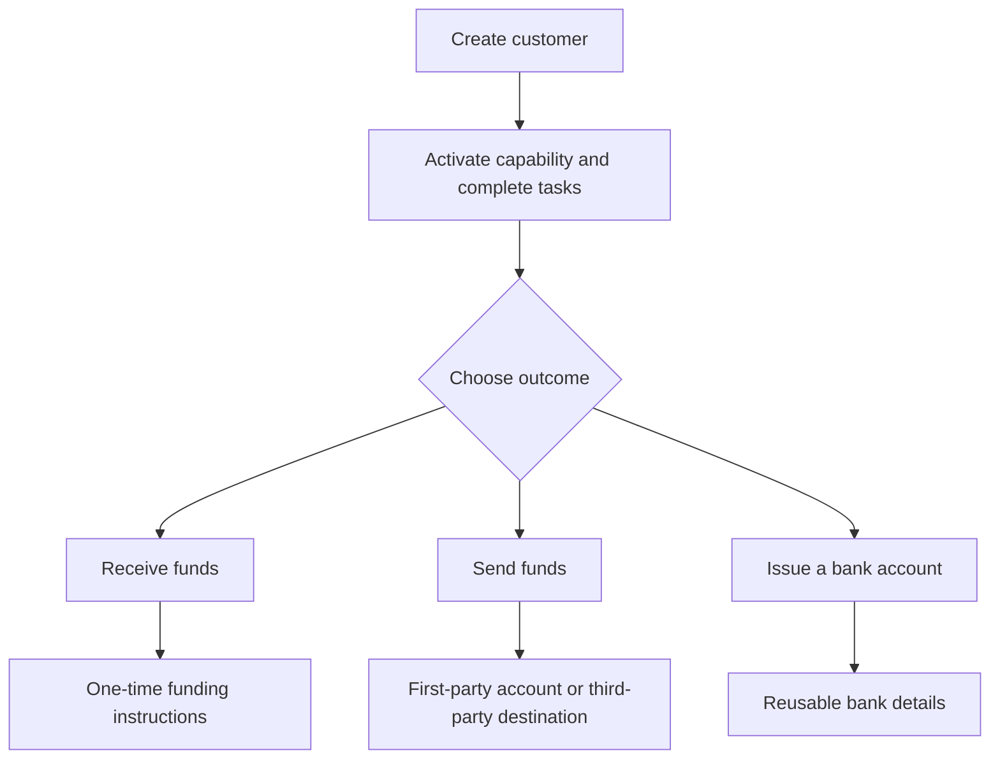

Comença pel resultat del client. Cada flux utilitza el mateix model d'incorporació, i després es ramifica en comptes i moviments de diners diferents.

## Compara els fluxos

| Resultat | Prepara primer | Què reps |
| --- | --- | --- |
| Cobrament | Capacitat de cobrament preparada i cartera de destinació emesa | Instruccions específiques de la transferència i liquidació en stablecoin |
| Pagament | Capacitat de pagament preparada, cartera emesa finançada i compte o destinació preparats | Una transferència al punt final del destinatari seleccionat |
| Compte bancari emès | Capacitat bancària preparada i cartera de liquidació emesa | Dades bancàries reutilitzables després del provisionament |

Un cobrament cotitzat crea instruccions per a una transferència. Un compte bancari emès crea dades reutilitzables per a dipòsits posteriors. Un pagament comença amb fons ja disponibles en una cartera emesa.

## Escull el teu flux

<CardGroup cols={3}>
  <Card title="Rebre fons" icon="arrow-down-to-line" href="/ca/integration/receive-funds">
    Crea i fes el seguiment d'un cobrament de fiat a stablecoin.
  </Card>
  <Card title="Enviar fons" icon="arrow-up-from-line" href="/ca/integration/send-funds">
    Construeix un pagament propi o a tercers.
  </Card>
  <Card title="Emetre un compte bancari" icon="building-columns" href="/ca/integration/issue-bank-account">
    Provisiona dades bancàries reutilitzables vinculades a una cartera.
  </Card>
</CardGroup>
