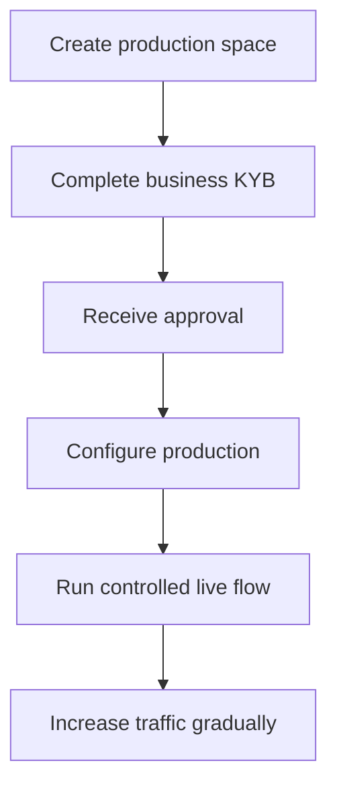

L'activació de producció verifica el teu negoci integrador. És independent dels clients d'API que crees per al teu producte.

## Activa el teu espai de producció

1. Inicia sessió al Dashboard de Swipelux i selecciona **Crear un espai de producció**.
2. Obre la pestanya KYB o ves a [Verificació del negoci](https://www.swipelux.app/kyb).
3. Completa cada camp sol·licitat i puja els documents requerits.
4. Envia el teu negoci integrador per a la verificació i espera l'aprovació.

Només després que el teu negoci integrador i el teu espai de producció estiguin aprovats podràs crear clients d'API i transaccions de producció.

## Manté la producció independent

Crea els recursos de producció explícitament. Canviar una clau d'API no migra l'estat del sandbox.

- Emmagatzema les credencials de producció en una entrada separada del gestor de secrets.
- Utilitza una configuració de desplegament i IDs de recursos només per a producció.
- Registra un endpoint de webhook i un secret de signatura de producció separats.
- Torna a crear els clients, les capacitats, els comptes, els destinataris i les destinacions necessaris en producció.
- Restringeix l'accés a producció als serveis i operadors que ho necessiten.

El sandbox i la producció utilitzen `https://platform.swipelux.com`; la clau d'API selecciona l'entorn.

## Completa la llista de comprovació de llançament

- [ ] Prova el camí feliç i els camins de fallada esperats al sandbox.
- [ ] Envia una `Idempotency-Key` amb cada escriptura que en requereixi i conserva-la per a reintents segurs.
- [ ] Verifica les signatures dels webhooks abans d'analitzar, persisteix els IDs d'esdeveniments de manera duradora i prova la repetició.
- [ ] Gestiona les capacitats no disponibles, les tasques obertes i les revisions de tasca canviades.
- [ ] Gestiona els [errors i reintents de l'API](/ca/integration/errors) documentats, inclosos els reintents idempotents amb la clau original.
- [ ] Fes visibles les fallades de transferència i les instruccions accionables als teus operadors.
- [ ] Confirma que els registres conserven `X-Request-Id` o `correlationId` sense exposar secrets ni dades financeres sensibles.

## Executa un flux controlat en viu

Comença amb un client conegut i una transacció de baix valor. Registra:

| Control | Defineix abans de la prova |
| --- | --- |
| Àmbit | Client, capacitat, compte o destinació, import i mètode. |
| Resultat esperat | Estat de l'API, saldo o instruccions i esdeveniment de webhook que esperes observar. |
| Responsable | Persona responsable de vigilar el flux complet. |
| Condició d'aturada | Qualsevol estat inesperat, webhook absent, import incorrecte o tasca no resolta. |

Verifica tant el recurs actual de l'API com el lliurament de webhook autenticat. Si algun difereix del resultat esperat, atura't i investiga abans d'enviar més tràfic.

Després que el flux complet tingui èxit, augmenta el volum de manera gradual mentre monitoritzes els estats de capacitat, compte, destinació i transferència.

Torna a [Fluxos comuns](/ca/integration/common-flows) per al recorregut del producte, revisa [Errors i reintents](/ca/integration/errors) per a la gestió de fallades, o utilitza la [referència de l'API](/ca/api-reference/introduction) per als contractes exactes.
