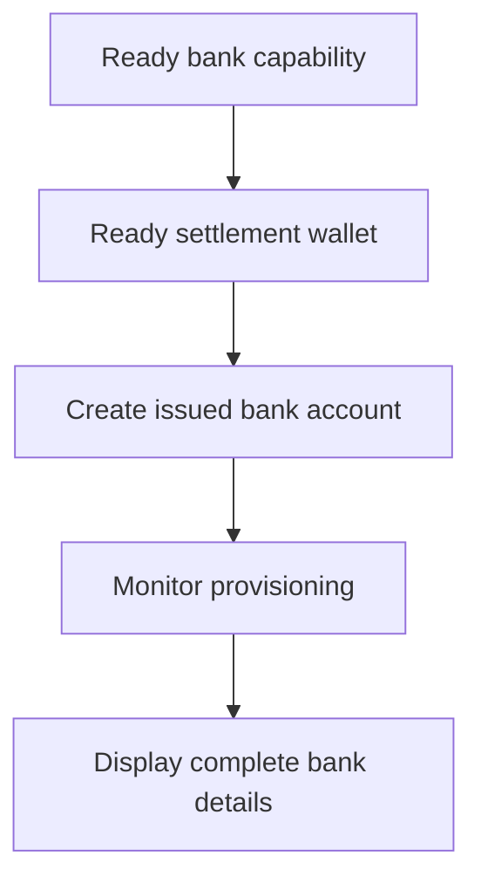

Utilitza un compte bancari emès quan el client necessiti dades bancàries reutilitzables. Per a instruccions de finançament d'un sol ús lligades a un import específic, utilitza [Rebre fons](/ca/integration/receive-funds) en el seu lloc.



## Abans de començar

Necessites un ID de client, una capacitat bancària preparada per al mètode i moneda previstos, i una cartera emesa preparada propietat del mateix client. Completa el treball obert mitjançant [Capacitats i tasques](/ca/integration/onboarding/capabilities-and-requirements).

## 1. Crea o selecciona la cartera de liquidació

Crea una cartera emesa mitjançant [Comptes i carteres](/ca/integration/accounts#create-the-account), i després torna a llegir-la. Continua només quan el seu estat actual permeti la liquidació.

Emmagatzema el seu `data.id` derivat de la resposta com a `SETTLEMENT_WALLET_ID`. No utilitzis una cartera externa per a `settlement.accountId`.

## 2. Crea el compte bancari emès

Utilitza [`POST /v3/customers/{customerId}/accounts`](/api-reference/accounts/post-v3-customers-by-customer-id-accounts) amb aquestes capçaleres:

```http
X-API-Key: ${SWIPELUX_API_KEY}
Idempotency-Key: issued-bank-account-001
Content-Type: application/json
```

Envia aquest cos de sol·licitud:

```json
{
  "origin": "issued",
  "type": "bank",
  "method": "ach",
  "country": "US",
  "currency": "USD",
  "settlement": {
    "accountId": "${SETTLEMENT_WALLET_ID}"
  },
  "label": "USD account"
}
```

Emmagatzema el `data.id` retornat com a `BANK_ACCOUNT_ID`. Conserva també `data.status`, `data.openTaskIds`, `data.details` i la relació de liquidació.

L'ID del compte bancari i l'ID de la cartera tenen rols diferents. Llegeix el provisionament i les dades bancàries a través de l'ID del compte bancari. Utilitza l'ID de la cartera de liquidació per identificar on s'acrediten els dipòsits.

## 3. Monitoritza el provisionament

Llegeix [`GET /v3/customers/{customerId}/accounts/{accountId}`](/api-reference/accounts/get-v3-customers-by-customer-id-accounts-by-account-id) després de la creació i després de cada webhook rellevant.

Manté la interfície del client pendent mentre `details` estigui absent. Si `openTaskIds` no està buit, completa les tasques més recents i torna a obtenir el compte. No infereixis la preparació a partir del temps transcorregut.

Si l'últim `statusReason.code` és `awaiting_assignment`, crea el primer cobrament per al mateix client, capacitat i cartera de liquidació mitjançant [Rebre fons](/ca/integration/receive-funds), i després torna a llegir el compte bancari. Segueix aquesta branca només quan el compte actual ho sol·liciti.

## 4. Presenta les dades bancàries de manera segura

Mostra només les dades completes retornades per l'última lectura del compte. Quan `details.referenceRequired` és true, mostra la `details.reference` exacta i fes-la copiable. Quan és false, no inventis una referència.

Aquestes dades bancàries són reutilitzables. No les substitueixis per coordenades de finançament d'un cobrament cotitzat, que pertanyen només a aquesta transferència.

A continuació, afegeix [Webhooks](/ca/integration/webhooks) perquè les actualitzacions de provisionament arribin a la teva aplicació sense mantenir el client en una pantalla de sondeig.
