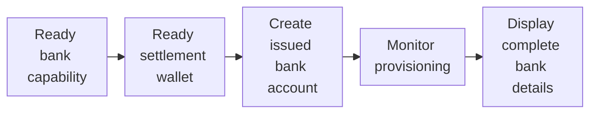

Utilitza un compte bancari emès quan el client necessiti dades bancàries reutilitzables. Per a instruccions de finançament d'un sol ús lligades a un import específic, utilitza [Rebre fons](/ca/integration/receive-funds) en el seu lloc.


```mermaid
%%{init: {"flowchart": {"rankSpacing": 20, "nodeSpacing": 16, "wrappingWidth": 80, "padding": 8}}}%%
flowchart LR
  A["Ready bank capability"] --> B["Ready settlement wallet"]
  B --> C["Create issued bank account"]
  C --> D["Monitor provisioning"]
  D --> E["Display complete bank details"]
```

## Abans de començar

Necessites un ID de client, una capacitat bancària preparada per al mètode i moneda previstos, i una cartera emesa preparada propietat del mateix client. Amb `allowPending`, pots desar la sol·licitud mentre el banc seleccionat encara revisa el client. Completa el treball obert mitjançant [Capacitats i tasques](/ca/integration/onboarding/capabilities-and-requirements).

## 1. Crea o selecciona la cartera de liquidació

Crea una cartera emesa mitjançant [Comptes i carteres](/ca/integration/accounts#create-the-account), i després torna a llegir-la. Continua només quan el seu estat actual permeti la liquidació.

Emmagatzema el seu `data.id` derivat de la resposta com a `SETTLEMENT_WALLET_ID`. No utilitzis una cartera externa per a `settlement.accountId`.

## 2. Crea el compte bancari emès

Utilitza [`POST /v3/customers/{customerId}/accounts`](/api-reference/accounts/post-v3-customers-by-customer-id-accounts) amb aquestes capçaleres:

```http
X-API-Key: ${SWIPELUX_API_KEY}
Idempotency-Key: issued-bank-account-001
Content-Type: application/json
```

Envia aquest cos de sol·licitud:

```json
{
  "origin": "issued",
  "type": "bank",
  "method": "ach",
  "country": "US",
  "currency": "USD",
  "settlement": {
    "accountId": "${SETTLEMENT_WALLET_ID}"
  },
  "label": "USD account"
}
```

Emmagatzema el `data.id` retornat com a `BANK_ACCOUNT_ID`. Conserva també `data.status`, `data.openTaskIds`, `data.details` i la relació de liquidació.

Camps opcionals de la sol·licitud:

| Camp | S'aplica a | Comportament |
| --- | --- | --- |
| `institution` | `ach`, `wire` i `swift` emesos | Selecciona exactament aquest banc. Swipelux no recorre a cap altre banc. Utilitza un ID d'institució retornat per la resposta de capacitats suportades. |
| `allowPending` | `ach`, `wire` i `swift` emesos | Estableix-lo a `true` per desar la sol·licitud mentre la sol·licitud d'alta al banc seleccionat espera aprovació. Requereix `institution`. |
| `settlement.currency` | Comptes bancaris emesos | `USDC` o `USDT`. Defineix la stablecoin que es lliura a la cartera de liquidació. |

### Escull el banc {#choose-the-bank}

Envia `institution` quan el client necessiti dades bancàries d'un banc concret. Swipelux reserva un compte emès per client, mètode, moneda i institució. Una sol·licitud sense `institution` retorna `409 conflict` si el client ja té un compte emès per a aquest mètode i moneda en qualsevol banc. Una sol·licitud amb `institution` retorna `409 conflict` només si ja existeix un compte per a aquest banc.

Les lectures del compte retornen el banc seleccionat com a `institution` amb `id`, `name` i `bic`. `bic` pot ser `null`.

La idempotència s'aplica al banc seleccionat. Repetir la mateixa sol·licitud retorna el compte original. Canviar `institution` amb la mateixa `Idempotency-Key` retorna `409 idempotency_conflict`.

### Desa la sol·licitud abans de l'aprovació del banc {#save-the-request-before-bank-approval}

Per defecte, Swipelux accepta una sol·licitud de compte bancari emès només quan la capacitat bancària està preparada. Per recollir abans la configuració del compte del client, envia `allowPending: true` amb `institution`:

```json
{
  "origin": "issued",
  "type": "bank",
  "method": "wire",
  "country": "US",
  "currency": "USD",
  "institution": "${INSTITUTION_ID}",
  "allowPending": true,
  "settlement": {
    "accountId": "${SETTLEMENT_WALLET_ID}"
  },
  "label": "USD wire account"
}
```

Mentre la sol·licitud d'alta al banc està en revisió, el compte retorna `status: "in_review"` amb `statusReason.code` establert a `waiting_for_approval`. La resposta també inclou `applicationId` i els `openTaskIds` de la sol·licitud d'alta. Completa aquestes tasques mitjançant [Capacitats i tasques](/ca/integration/onboarding/capabilities-and-requirements).

La sol·licitud desada conserva el seu ID de compte, la cartera de liquidació i la plaça de compte. Quan la sol·licitud d'alta i la capacitat estan preparades, Swipelux provisiona les dades bancàries sota el mateix `BANK_ACCOUNT_ID`. Continua llegint aquest ID. No creïs una altra sol·licitud.

Si la sol·licitud d'alta es rebutja, es cancel·la o s'arxiva abans, el compte passa a `rejected`. Ja no ocupa la plaça de compte.

### Escull la moneda de liquidació {#choose-the-settlement-currency}

Per defecte, els dipòsits es liquiden en la moneda de la cartera de liquidació. Estableix `settlement.currency` a `USDC` o `USDT` per triar l'actiu lliurat independentment de la moneda de la cartera:

```json
{
  "settlement": {
    "accountId": "${SETTLEMENT_WALLET_ID}",
    "currency": "USDT"
  }
}
```

`USDT` requereix un compte `USD` i una cartera de liquidació en una xarxa que admeti el lliurament d'USDT. En cas contrari, la sol·licitud retorna `400 invalid_settlement_target`. Les lectures del compte retornen l'elecció desada, fins i tot mentre el compte s'està provisionant.

L'ID del compte bancari i l'ID de la cartera tenen rols diferents. Llegeix el provisionament i les dades bancàries a través de l'ID del compte bancari. Utilitza l'ID de la cartera de liquidació per identificar on s'acrediten els dipòsits.

## 3. Monitoritza el provisionament

Llegeix [`GET /v3/customers/{customerId}/accounts/{accountId}`](/api-reference/accounts/get-v3-customers-by-customer-id-accounts-by-account-id) després de la creació i després de cada webhook rellevant.

Manté la interfície del client pendent mentre `details` estigui absent. Si `openTaskIds` no està buit, completa les tasques més recents i torna a obtenir el compte. No infereixis la preparació a partir del temps transcorregut.

Si el compte es va desar amb `allowPending: true`, es manté a `in_review` amb `statusReason.code` establert a `waiting_for_approval` fins que el banc aprovi la sol·licitud d'alta.

Si l'últim `statusReason.code` és `awaiting_assignment`, crea el primer cobrament per al mateix client, capacitat i cartera de liquidació mitjançant [Rebre fons](/ca/integration/receive-funds), i després torna a llegir el compte bancari. Segueix aquesta branca només quan el compte actual ho sol·liciti.

## 4. Presenta les dades bancàries de manera segura

Mostra només les dades completes retornades per l'última lectura del compte. Quan `details.referenceRequired` és true, mostra la `details.reference` exacta i fes-la copiable. Quan és false, no inventis una referència.

Per als comptes `swift` emesos, mostra `details.bankName`, `details.swiftCode` (el BIC del banc receptor), `details.accountNumber`, `details.accountHolderName` i `details.accountHolderAddress` quan es retornin. Els remitents han de copiar l'adreça del beneficiari exactament a la transferència internacional. Mostra també `details.bankAddress` i qualsevol camp de banc intermediari que retorni el compte.

Aquestes dades bancàries són reutilitzables. No les substitueixis per coordenades de finançament d'un cobrament cotitzat, que pertanyen només a aquesta transferència.

A continuació, afegeix [Webhooks](/ca/integration/webhooks) perquè les actualitzacions de provisionament arribin a la teva aplicació sense mantenir el client en una pantalla de sondeig.
