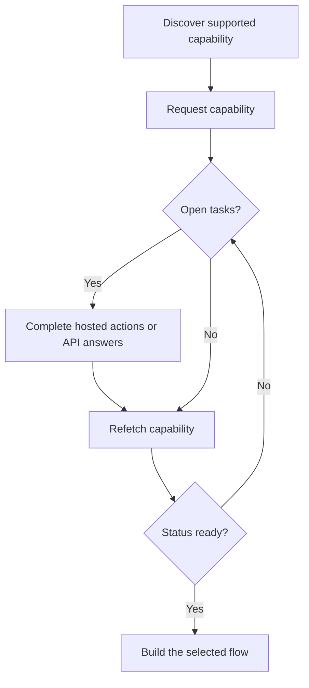

Una capacitat t'indica si un client pot utilitzar un resultat, mètode de pagament i direcció específics. Les tasques obertes t'indiquen què ha de passar abans que aquesta capacitat o un recurs relacionat puguin avançar.



```bash
export API_BASE='https://platform.swipelux.com'
export SWIPELUX_API_KEY='replace-with-your-api-key'
```

## Descobreix les capacitats suportades

Llegeix les opcions actuals del client amb [`GET /v3/customers/{customerId}/capabilities/supported`](/api-reference/capabilities/get-v3-customers-by-customer-id-capabilities-supported):

```bash
curl --request GET \
  "${API_BASE}/v3/customers/${CUSTOMER_ID}/capabilities/supported" \
  --header "X-API-Key: ${SWIPELUX_API_KEY}"
```

Escull una entrada de resposta que coincideixi amb els `directions`, `method` i `accountType` previstos. Continua només quan `availability` sigui `available` o `beta` i `eligibility.eligible` sigui `true`. Si es retornen `institutions`, selecciona només un ID d'aquesta resposta.

Emmagatzema el `data[].id` seleccionat com a `CAPABILITY_ID`. No copiïs mai un ID de capacitat d'un altre client o entorn.

### Tipus de comptes agrupats vs nominatius

Les capacitats bancàries venen en dues variants, codificades al camp `accountType` i al sufix de l'ID de capacitat (per exemple `ach_pooled`, `wire_named`):

- **`pooled`**: compte bancari compartit de Swipelux. Cada cobrament utilitza una referència única per encaminar els fons. Escull aquest per a transferències d'un sol ús.
- **`named`**: dades bancàries dedicades per al client (IBAN virtual, compte ACH dedicat). Reutilitzables i compartibles amb qualsevol pagador. Necessari per als [comptes bancaris emesos](/ca/integration/issue-bank-account).

Per defecte, utilitza `pooled`. Utilitza `named` només quan el client necessiti dades bancàries reutilitzables. Consulta la resposta `supported` per veure quines variants estan disponibles.

## Sol·licita la capacitat

Sol·licita l'opció seleccionada amb [`POST /v3/customers/{customerId}/capabilities/{capabilityId}`](/api-reference/capabilities/post-v3-customers-by-customer-id-capabilities-by-capability-id):

```bash
curl --request POST \
  "${API_BASE}/v3/customers/${CUSTOMER_ID}/capabilities/${CAPABILITY_ID}" \
  --header "X-API-Key: ${SWIPELUX_API_KEY}" \
  --header "Idempotency-Key: capability-request-001" \
  --header "Content-Type: application/json" \
  --data '{}'
```

Utilitza una matriu `institutions` explícita només quan necessitis seleccionar entre els IDs retornats per la resposta de capacitats suportades.

Emmagatzema `data.status` com a `CAPABILITY_STATUS`, `data.openTaskIds` com a `OPEN_TASK_IDS` i cada `data.applications[].id` a `APPLICATION_IDS`.

## Completa les tasques actuals {#complete-current-tasks}

Llista les tasques amb [`GET /v3/customers/{customerId}/tasks`](/api-reference/tasks/list-customer-tasks), selecciona els IDs de `OPEN_TASK_IDS` i, a continuació, llegeix cada tasca actual amb [`GET /v3/customers/{customerId}/tasks/{taskId}`](/api-reference/tasks/get-customer-task):

```bash
curl --request GET \
  "${API_BASE}/v3/customers/${CUSTOMER_ID}/tasks/${TASK_ID}" \
  --header "X-API-Key: ${SWIPELUX_API_KEY}"
```

Utilitza els `data.revision` i `data.requirements` més recents. Torna a obtenir la tasca immediatament abans d'enviar-la si qualsevol dels dos pot haver canviat.

### Accions allotjades

Quan la tasca retorna `verificationSessions` o `tosSessions`, emmagatzema l'`id` i la `url` actual de cada sessió. Envia el client a la URL retornada, i després torna a llegir la tasca. Aquestes són accions amb àmbit de tasca, no un cicle de vida separat de verificació del client.

### Puja documents {#upload-documents}

Quan un requisit sol·licita un document, puja'l amb [`POST /v3/customers/{customerId}/documents`](/api-reference/documents/post-v3-customers-by-customer-id-documents):

```bash
export DOCUMENT_PATH='/absolute/path/to/requested-document.pdf'

curl --request POST \
  "${API_BASE}/v3/customers/${CUSTOMER_ID}/documents" \
  --header "X-API-Key: ${SWIPELUX_API_KEY}" \
  --header "Idempotency-Key: customer-document-001" \
  --form "file=@${DOCUMENT_PATH}"
```

Emmagatzema el `data.id` retornat com a `DOCUMENT_ID` abans d'enviar la resposta que hi fa referència.

### Respostes via API

Envia un conjunt complet de respostes per a la revisió actual amb [`POST /v3/customers/{customerId}/tasks/{taskId}/submissions`](/api-reference/task-submissions/create-customer-task-submission):

```bash
curl --request POST \
  "${API_BASE}/v3/customers/${CUSTOMER_ID}/tasks/${TASK_ID}/submissions" \
  --header "X-API-Key: ${SWIPELUX_API_KEY}" \
  --header "Idempotency-Key: task-submission-001" \
  --header "Content-Type: application/json" \
  --data @- <<'JSON'
{
  "taskRevision": 3,
  "answers": [
    {
      "requirementId": "req_from_current_task",
      "answer": {
        "type": "text",
        "value": "Current answer"
      }
    }
  ]
}
JSON
```

Extreu cada ID de requisit i tipus de resposta de la tasca més recent. Si l'API informa que la tasca ha canviat, torna a obtenir-la i reconstrueix l'enviament a partir de la nova revisió.

## Continua quan la capacitat estigui preparada

Torna a llegir la capacitat amb [`GET /v3/customers/{customerId}/capabilities/{capabilityId}`](/api-reference/capabilities/get-v3-customers-by-customer-id-capabilities-by-capability-id):

```bash
curl --request GET \
  "${API_BASE}/v3/customers/${CUSTOMER_ID}/capabilities/${CAPABILITY_ID}" \
  --header "X-API-Key: ${SWIPELUX_API_KEY}"
```

Reemplaça l'estat emmagatzemat i els IDs de tasques amb la resposta més recent. Continua només quan l'estat actual de la capacitat permeti el compte, la cotització o la transferència que vulguis crear.

A continuació, escull el recorregut corresponent a [Fluxos comuns](/ca/integration/common-flows).
