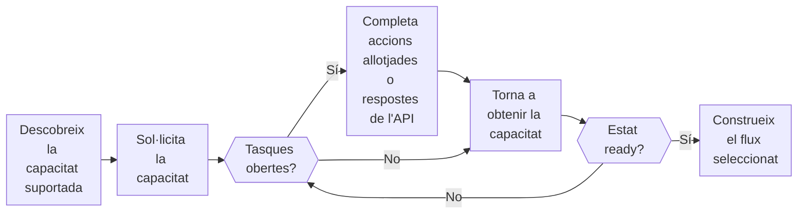

Una capacitat t'indica si un client pot utilitzar un resultat, mètode de pagament i direcció específics. Les tasques obertes t'indiquen què ha de passar abans que aquesta capacitat o un recurs relacionat puguin avançar.


```mermaid
%%{init: {"flowchart": {"rankSpacing": 20, "nodeSpacing": 16, "wrappingWidth": 80, "padding": 8}}}%%
flowchart LR
  A["Descobreix la capacitat suportada"] --> B["Sol·licita la capacitat"]
  B --> C{{"Tasques obertes?"}}
  C -->|"Sí"| D["Completa accions allotjades o respostes de l'API"]
  D --> E["Torna a obtenir la capacitat"]
  C -->|"No"| E
  E --> F{{"Estat ready?"}}
  F -->|"No"| C
  F -->|"Sí"| G["Construeix el flux seleccionat"]
```

```bash Environment variables
export API_BASE='https://platform.swipelux.com'
export SWIPELUX_API_KEY='replace-with-your-api-key'
```

## Descobreix les capacitats suportades

Llegeix les opcions actuals del client amb [`GET /v3/customers/{customerId}/capabilities/supported`](/api-reference/capabilities/get-v3-customers-by-customer-id-capabilities-supported):

```bash List supported capabilities
curl --request GET \
  "${API_BASE}/v3/customers/${CUSTOMER_ID}/capabilities/supported" \
  --header "X-API-Key: ${SWIPELUX_API_KEY}"
```

Escull una entrada de resposta que coincideixi amb els `directions`, `method` i `accountType` previstos. Continua només quan `availability` sigui `available` o `beta` i `eligibility.eligible` sigui `true`. Si es retornen `institutions`, selecciona només un ID d'aquesta resposta.

Cada entrada d'institució inclou un `logoUrl` i un indicador `isDefault`. Utilitza `logoUrl` per mostrar el logotip del banc en una interfície de selecció de banc i mostra la teva pròpia icona genèrica de banc quan sigui `null`. `isDefault` s'aplica només a aquest client i a aquesta capacitat, no a la institució de manera global. [`GET /v3/institutions`](/api-reference/institutions/get-v3-institutions) retorna el mateix `logoUrl`, que pot ser nul. Els IDs d'institució són opacs, així que gestiona els IDs nous sense canvis de codi.

```json Institution entry
{
  "institutions": [
    {
      "id": "jpmorgan",
      "name": "JPMorgan Chase",
      "bic": "CHASUS33",
      "logoUrl": "https://wallet.swipelux.com/bank-logos/jpmorgan.png",
      "countries": ["US"],
      "isDefault": true
    }
  ]
}
```

Emmagatzema el `data[].id` seleccionat com a `CAPABILITY_ID`. No copiïs mai un ID de capacitat d'un altre client o entorn.

### Tipus de comptes agrupats vs nominatius

Les capacitats bancàries venen en dues variants, codificades al camp `accountType` i al sufix de l'ID de capacitat (per exemple `ach_pooled`, `wire_named`):

- **`pooled`**: compte bancari compartit de Swipelux. Cada cobrament utilitza una referència única per encaminar els fons. Escull aquest per a transferències d'un sol ús.
- **`named`**: dades bancàries dedicades per al client (IBAN virtual, compte ACH dedicat). Reutilitzables i compartibles amb qualsevol pagador. Necessari per als [comptes bancaris emesos](/ca/integration/issue-bank-account).

Per defecte, utilitza `pooled`. Utilitza `named` només quan el client necessiti dades bancàries reutilitzables. Consulta la resposta `supported` per veure quines variants estan disponibles.

Per rebre dipòsits SWIFT o emetre dades bancàries SWIFT, utilitza `swift_named`. `swift_pooled` només admet pagaments, així que consulta els `directions` de cada opció a la resposta de capacitats suportades. Un compte SWIFT nominatiu retorna dades de recepció reutilitzables, incloent-hi el BIC del banc, una referència quan sigui necessària i l'adreça del beneficiari quan el banc la proporcioni.

Per als comptes emesos ACH, Wire i SWIFT, pots triar un banc concret amb `institution` i desar la sol·licitud del compte abans que el banc aprovi el client. Consulta [Emet un compte bancari](/ca/integration/issue-bank-account#choose-the-bank).

## Sol·licita la capacitat

Sol·licita l'opció seleccionada amb [`POST /v3/customers/{customerId}/capabilities/{capabilityId}`](/api-reference/capabilities/post-v3-customers-by-customer-id-capabilities-by-capability-id):

```bash Request capability
curl --request POST \
  "${API_BASE}/v3/customers/${CUSTOMER_ID}/capabilities/${CAPABILITY_ID}" \
  --header "X-API-Key: ${SWIPELUX_API_KEY}" \
  --header "Idempotency-Key: capability-request-001" \
  --header "Content-Type: application/json" \
  --data '{}'
```

Utilitza una matriu `institutions` explícita només quan necessitis seleccionar entre els IDs retornats per la resposta de capacitats suportades.

Emmagatzema `data.status` com a `CAPABILITY_STATUS`, `data.accountProvisioning` com a `ACCOUNT_PROVISIONING_STATUS`, `data.openTaskIds` com a `OPEN_TASK_IDS` i cada `data.applications[].id` a `APPLICATION_IDS`.

### Sol·licituds compartides per banc {#shared-applications-per-bank}

Per a les capacitats bancàries nominatives, cada client té un expedient de sol·licitud per banc. Les capacitats agrupades i de plataforma utilitzen expedients sense banc. Swipelux comparteix un expedient entre totes les capacitats compatibles que sol·licitis:

- Una sola aprovació pot cobrir diverses capacitats. Per exemple, un expedient aprovat en un banc pot fer que tant una capacitat ACH com una de wire passin a `ready`.
- Una sol·licitud posterior que coincideixi amb un expedient existent el reutilitza. Swipelux no obre una segona sol·licitud ni afegeix tasques duplicades.
- Els expedients de bancs diferents són independents. Un rebuig en un banc no afecta un expedient en un altre banc.

La resposta a la petició t'indica quin expedient ha utilitzat Swipelux:

- `201` significa que la petició ha obert un expedient de sol·licitud nou.
- `200` significa que la petició s'ha resolt en un expedient de sol·licitud que el client ja tenia, per exemple una petició repetida d'una capacitat bancària que el client ja té, o una petició d'una capacitat cancel·lada. Una petició repetida de `card` o `stablecoin_transfers` continua retornant [`409 capability_already_exists`](/integration/errors#capability-already-exists).
- `selectedApplicationId` és un camp de nivell superior al costat de `data` amb l'ID de l'expedient que la petició ha seleccionat o obert. Swipelux l'omet quan la petició no ha seleccionat cap expedient. Una repetició idempotent retorna el mateix valor.

Resposta abreujada:

```json Response (abbreviated)
{
  "data": {
    "id": "ach_named",
    "status": "pending",
    "openTaskIds": ["tsk_000000000000000002"],
    "applications": [{ "id": "apl_000000000000000005", "status": "in_review" }]
  },
  "selectedApplicationId": "apl_000000000000000005"
}
```

Per a les capacitats nominatives, torna a enviar la mateixa llista `institutions` per seleccionar el mateix expedient, o envia un sol ID d'institució per dirigir-te a aquest banc. S'omet qualsevol banc que hagi rebutjat definitivament el client. Quan només indiques aquest banc, o quan tots els bancs elegibles han rebutjat el client, la petició retorna [`409 capability_terminally_rejected`](/integration/errors#capability-terminally-rejected). Per provar un altre banc després d'un rebuig, torna a sol·licitar la capacitat amb l'ID d'institució d'aquest banc.

L'estat d'una capacitat reflecteix tots els expedients relacionats del client. Per a una capacitat nominativa, n'hi ha prou amb un expedient `ready` l'aprovació del qual la cobreixi perquè passi a `ready`, independentment del que informin els altres bancs. Una capacitat agrupada també espera la seva comprovació de mètode, que s'informa a `probes` a la llista de sol·licituds del client.

#### Llista les sol·licituds del client {#list-the-customers-applications}

Llista tots els expedients de sol·licitud del client amb [`GET /v3/customers/{customerId}/applications`](/api-reference/capabilities/get-v3-customers-by-customer-id-applications). Els resultats es paginen amb `nextCursor` i `hasMore`, i accepten `updatedAfter`:

```bash List applications
curl --request GET \
  "${API_BASE}/v3/customers/${CUSTOMER_ID}/applications" \
  --header "X-API-Key: ${SWIPELUX_API_KEY}"
```

Cada entrada inclou els camps de sol·licitud que es retornen a `applications[]` d'una capacitat, a més de:

- `scope`: `named` per a un expedient en un sol banc, `provider_pooled` o `platform` per a expedients sense banc, o `null` per a un expedient històric sense classificar. `institution` no hi és en els expedients `provider_pooled` i `platform`.
- `requestedScope[]`: les claus de capacitat sol·licitades per a l'expedient, cadascuna amb el seu primer `requestedAt`. Les entrades no s'eliminen mai.
- `coverage[]`: les claus de capacitat que cobreix l'aprovació de l'expedient, cadascuna amb `grantedAt` i `source`. La cobertura registra l'abast, no l'autorització. Llegeix la capacitat per conèixer-ne l'estat actual.
- `probes[]`: comprovacions de mètode per a les claus de capacitat agrupades que cobreix l'expedient, cadascuna amb `capabilityKey`, `status` i `reason`. Les claus nominatives no requereixen mai cap comprovació.
- `generation`, `predecessorApplicationId` i `supersededByApplicationId`: enllaços de successió. Quan `supersededByApplicationId` està definit, l'expedient s'ha substituït. Segueix aquest ID fins a l'expedient actual. La llista `applications[]` d'una capacitat només inclou els expedients actuals, de manera que un expedient substituït només apareix en aquesta llista.

Resposta abreujada:

```json Response (abbreviated)
{
  "data": [
    {
      "id": "apl_000000000000000005",
      "status": "ready",
      "scope": "named",
      "institution": { "id": "jpmorgan", "name": "JPMorgan Chase", "bic": "CHASUS33" },
      "requestedScope": [
        { "capabilityKey": "ach_named", "requestedAt": "2026-09-20T10:00:00.000Z" }
      ],
      "coverage": [
        { "capabilityKey": "ach_named", "grantedAt": "2026-09-22T12:00:00.000Z", "source": "approval" },
        { "capabilityKey": "wire_named", "grantedAt": "2026-09-22T12:00:00.000Z", "source": "approval" }
      ],
      "probes": [],
      "generation": 1,
      "predecessorApplicationId": null,
      "supersededByApplicationId": null
    }
  ],
  "nextCursor": null,
  "hasMore": false
}
```

## Completa les tasques actuals {#complete-current-tasks}

Llista les tasques amb [`GET /v3/customers/{customerId}/tasks`](/api-reference/tasks/list-customer-tasks), selecciona els IDs de `OPEN_TASK_IDS` i, a continuació, llegeix cada tasca actual amb [`GET /v3/customers/{customerId}/tasks/{taskId}`](/api-reference/tasks/get-customer-task):

```bash List open tasks
curl --request GET \
  "${API_BASE}/v3/customers/${CUSTOMER_ID}/tasks/${TASK_ID}" \
  --header "X-API-Key: ${SWIPELUX_API_KEY}"
```

Utilitza els `data.revision` i `data.requirements` més recents. Torna a obtenir la tasca immediatament abans d'enviar-la si qualsevol dels dos pot haver canviat.

### Evidències del perfil reutilitzades {#reused-profile-evidence}

Per a les tasques de recollida de dades de la sol·licitud que accepten l'enviament directe per API, Swipelux reutilitza la informació que el client ja ha proporcionat. Quan es crea o es concilia una tasca d'aquest tipus, Swipelux comprova el perfil del client i els documents que ha pujat el mateix client. Els requisits elegibles que ja estan coberts per un valor de perfil o un document utilitzable passen a `in_review` en lloc de continuar sent accionables. Les actualitzacions del perfil i les pujades de documents nous activen la mateixa comprovació per a les tasques existents.

Només els valors que falten o que són incompatibles continuen sent accionables. La reutilització no aprova les evidències. Swipelux les continua revisant. Les sol·licituds de correcció explícites i els requisits ja responguts continuen sent accionables. Els documents dels propietaris i de les parts relacionades no es reutilitzen, i els requisits que només es recullen mitjançant una sessió allotjada mantenen el seu flux habitual.

### Mostra els requisits {#render-requirements}

Construeix els formularis a partir de les metadades que retorna cada requisit, no a partir de les claus dels requisits. Un requisit pot incloure un `title` curt opcional, i cada `request` inclou un `prompt` per mostrar sota l'encapçalament.

Els requisits amb `request.type: "profile"` identifiquen el camp del perfil amb `profilePointer` i afegeixen metadades d'entrada:

- `allowedValues`: els valors permesos per a un camp escalar, o per a cada element d'un camp de matriu. Envia aquests valors, no etiquetes de visualització traduïdes.
- `valueSchema`: un document JSON Schema Draft 7 autònom que descriu la forma de l'entrada, les propietats niades, els camps obligatoris i les restriccions estructurals. Els enums dels objectes apareixen a la propietat corresponent, per exemple `valueSchema.items.properties.type.enum` per als identificadors fiscals. Swipelux continua aplicant validacions entre camps i de revisió després de l'enviament, així que un valor que superi l'esquema encara pot ser rebutjat.
- `valueType: "country"`, o `itemValueType: "country"` per a les matrius: el camp accepta codis ISO 3166-1 alpha-2 en majúscules. Les propietats de país niades a `valueSchema` utilitzen `format: "iso-3166-1-alpha-2"`. Utilitza una llista de països estàndard per a les etiquetes localitzades.

```json Requirement
{
  "id": "req_000000000000000010",
  "key": "account_purposes",
  "title": "Account purpose",
  "status": "action_required",
  "request": {
    "type": "profile",
    "prompt": "Select every purpose that applies.",
    "required": true,
    "profilePointer": "/financialProfile/accountPurposes",
    "valueType": "array",
    "itemValueType": "string",
    "allowedValues": ["business_expenses", "ecommerce", "payroll"],
    "valueSchema": {
      "$schema": "http://json-schema.org/draft-07/schema#",
      "type": "array",
      "items": { "enum": ["business_expenses", "ecommerce", "payroll"] }
    }
  }
}
```

Aquest exemple escurça el catàleg de valors; l'API retorna tots els valors permesos. Alguns requisits de perfil no tenen cap esquema publicat i ometen `valueSchema` i `allowedValues`. Mostra'ls a partir de `prompt` i `valueType`.

Cada tasca oberta inclou una marca de temps `dueAt`. Quan Swipelux crea una tasca sense una data de venciment explícita, `dueAt` és per defecte exactament 31 dies després del `createdAt` de la tasca. Tracta `dueAt` com a informatiu: no el pots definir mitjançant l'API i no provoca cap transició automàtica del cicle de vida. Només el camp separat `deadline`, quan és present, provoca una transició automàtica.

### Accions allotjades {#hosted-actions}

A la resposta de detall de la tasca, cada entrada de `verificationSessions` i `tosSessions` inclou un objecte `action`. Les respostes de la llista de tasques no inclouen aquests enllaços d'acció. Desa l'`id` de cada sessió i llegeix `action.kind` abans d'enviar el client; no dedueixis la disponibilitat de l'enllaç a partir del `status` de la sessió.

- `action.kind: "available"` inclou `action.url` i `action.expiresAt` (actualment sempre `null`). Desa `action.url`, envia-hi el client i torna a llegir la tasca. Els camps `url` i `expiresAt` de la sessió contenen els mateixos valors.
- `action.kind: "unavailable"` significa que no s'ha de presentar cap enllaç. Els camps `url` i `expiresAt` de la sessió no hi són. El `status` d'una sessió, per si sol, no determina quin tipus d'acció rebràs.

```json Verification session
{
  "data": {
    "verificationSessions": [
      {
        "id": "vfy_000000000000000003",
        "key": "identity_verification",
        "type": "identity_verification",
        "status": "action_required",
        "action": {
          "kind": "available",
          "url": "https://platform.swipelux.com/kyc/redirect/cus_000000000000000001/tsk_000000000000000002/vfy_000000000000000003",
          "expiresAt": null
        },
        "url": "https://platform.swipelux.com/kyc/redirect/cus_000000000000000001/tsk_000000000000000002/vfy_000000000000000003",
        "expiresAt": null
      }
    ],
    "tosSessions": [
      {
        "id": "vfy_000000000000000004",
        "key": "terms_of_service",
        "type": "terms_of_service",
        "status": "completed",
        "action": { "kind": "unavailable" }
      }
    ]
  }
}
```

Aquestes són accions amb àmbit de tasca, no un cicle de vida separat de verificació del client.

Una resposta allotjada a un requisit de perfil per a un valor estructurat, com ara una adreça o identificadors fiscals, ha de superar les mateixes comprovacions d'esquema i de restriccions que una resposta directa. Si no les supera, el requisit continua obert. Un requisit que Swipelux torna a `action_required` per aquest motiu porta `reviewFeedback.code: hosted_profile_direct_submission_required`. Demana aquest valor al client i envia'l com a [resposta via API](#api-answers).

### Puja documents {#upload-documents}

Quan un requisit sol·licita un document, puja'l amb [`POST /v3/customers/{customerId}/documents`](/api-reference/documents/post-v3-customers-by-customer-id-documents):

```bash Upload document
export DOCUMENT_PATH='/absolute/path/to/requested-document.pdf'

curl --request POST \
  "${API_BASE}/v3/customers/${CUSTOMER_ID}/documents" \
  --header "X-API-Key: ${SWIPELUX_API_KEY}" \
  --header "Idempotency-Key: customer-document-001" \
  --form "file=@${DOCUMENT_PATH}"
```

Emmagatzema el `data.id` retornat com a `DOCUMENT_ID` abans d'enviar la resposta que hi fa referència.

Per recuperar més tard un fitxer emmagatzemat, crida [`GET /v3/customers/{customerId}/documents/{documentId}/download`](/api-reference/documents/get-v3-customers-by-customer-id-documents-by-document-id-download). Swipelux retorna una `url` que descarrega el fitxer com a adjunt i que expira al cap d'una hora. Els documents arxivats retornen `404`.

### Respostes via API {#api-answers}

Envia un conjunt complet de respostes per a la revisió actual amb [`POST /v3/customers/{customerId}/tasks/{taskId}/submissions`](/api-reference/task-submissions/create-customer-task-submission):

```bash Submit task answers
curl --request POST \
  "${API_BASE}/v3/customers/${CUSTOMER_ID}/tasks/${TASK_ID}/submissions" \
  --header "X-API-Key: ${SWIPELUX_API_KEY}" \
  --header "Idempotency-Key: task-submission-001" \
  --header "Content-Type: application/json" \
  --data @- <<'JSON'
{
  "taskRevision": 3,
  "answers": [
    {
      "requirementId": "req_from_current_task",
      "answer": {
        "type": "text",
        "value": "Current answer"
      }
    }
  ]
}
JSON
```

Extreu cada ID de requisit i tipus de resposta de la tasca més recent. Si l'API informa que la tasca ha canviat, torna a obtenir-la i reconstrueix l'enviament a partir de la nova revisió.

### Prerequisit de propietari beneficiari per a negocis {#beneficial-owner-prerequisite-for-businesses}

Sol·licitar una capacitat de negoci que necessita proves de propietari beneficiari té èxit encara que el client encara no tingui cap propietari qualificat. La capacitat es crea com a `restricted` amb `statusReason.code: tasks_due`, i la tasca d'admissió del negoci sol·licita els fets de propietat que falten, inclosa l'estructura de propietat.

La mateixa tasca conté un requisit `resource_reference` la sol·licitud del qual inclou `qualification: "beneficial_owner"`:

```json Beneficial owner requirement
{
  "type": "resource_reference",
  "prompt": "Add or select a qualifying beneficial owner.",
  "required": true,
  "resourceType": "related_party",
  "qualification": "beneficial_owner"
}
```

Una part relacionada es qualifica quan és una part `person` activa del mateix client amb un percentatge de propietat proporcionat d'almenys 25, o amb `ownership.declared: true` i cap percentatge.

El requisit es deriva de la llista actual de parts relacionades, per la qual cosa normalment no el respons directament:

- Crear o actualitzar una part relacionada qualificada satisfà el requisit en la mateixa reavaluació i obre el treball de perfil i documents propi d'aquest propietari. Consulta [Afegeix parts relacionades del negoci](/ca/integration/onboarding/customers#add-business-related-parties).
- També pots fer referència explícita a una part qualificada amb una resposta `resource_reference` que porti el seu `relatedPartyId`.
- El requisit continua llistat a la tasca actual després de complir-se. Quan no queda cap altra obligació oberta, la tasca esdevé `satisfied`.
- Arxivar l'última part qualificada, o eliminar els fets que la qualificaven, torna a obrir el requisit, fins i tot després que la tasca hagi estat `satisfied`.

## Continua quan la capacitat estigui preparada {#continue-when-the-capability-is-ready}

Torna a llegir la capacitat amb [`GET /v3/customers/{customerId}/capabilities/{capabilityId}`](/api-reference/capabilities/get-v3-customers-by-customer-id-capabilities-by-capability-id):

```bash Refetch capability
curl --request GET \
  "${API_BASE}/v3/customers/${CUSTOMER_ID}/capabilities/${CAPABILITY_ID}" \
  --header "X-API-Key: ${SWIPELUX_API_KEY}"
```

Reemplaça l'estat emmagatzemat, l'estat d'aprovisionament de compte i els IDs de tasques amb la resposta més recent. El `status` de la capacitat indica si el dret està aprovat. Per a una capacitat que emet un compte, `accountProvisioning` informa per separat si aquest compte és `not_started`, `in_progress`, `issued` o `failed`; una capacitat que no emet cap compte retorna `not_applicable`.

Mentre la capacitat és `pending`, dos dels valors de `statusReason.code` que pot informar indiquen si hi ha una revisió en curs. `preparing_submission` significa que Swipelux encara està preparant una sol·licitud per enviar-la i que no hi ha cap revisió en curs, encara que la sol·licitud d'un altre banc sigui `rejected` o requereixi atenció. `review_in_progress` significa que hi ha una revisió en curs, per exemple mentre una sol·licitud és `in_review` o una [verificació allotjada](#hosted-actions) està oberta. Tots dos utilitzen `resolution: wait`. Un canvi entre aquests codis manté l'estat `pending`, de manera que no envia cap esdeveniment `capability.status_changed`. Llegeix la capacitat per veure el codi actual.

Continua només quan l'estat actual de la capacitat permeti el compte, la cotització o la transferència que vulguis crear. Quan el flux necessiti un compte emès, espera també que `accountProvisioning` esdevingui `issued`.

A continuació, escull el recorregut corresponent a [Fluxos comuns](/ca/integration/common-flows).
