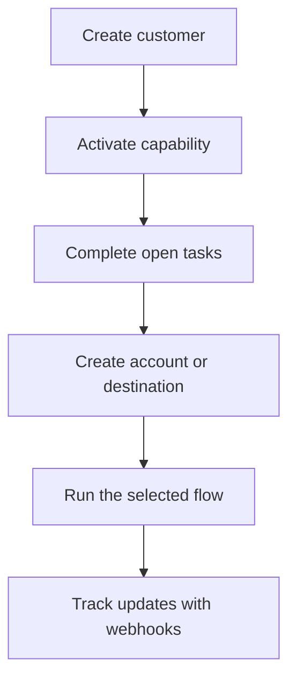

Swipelux dona al teu backend els blocs de construcció per incorporar clients i moure diners sense exposar la infraestructura de pagaments al teu producte.

## Què pots construir

<CardGroup cols={3}>
  <Card title="Rebre fons" icon="arrow-down-to-line" href="/ca/integration/receive-funds">
    Crea instruccions de finançament fiat d'un sol ús i liquida stablecoin en una cartera.
  </Card>
  <Card title="Enviar fons" icon="arrow-up-from-line" href="/ca/integration/send-funds">
    Envia des d'una cartera de client a un compte propi o a una destinació de tercers.
  </Card>
  <Card title="Emetre un compte bancari" icon="building-columns" href="/ca/integration/issue-bank-account">
    Provisiona dades bancàries reutilitzables vinculades a una cartera de liquidació.
  </Card>
</CardGroup>

## Com funciona una integració

Un client és l'individu o el negoci que és propietari del flux. Les capacitats descriuen quins resultats pot utilitzar aquest client. Les tasques obertes t'indiquen què cal completar abans que la capacitat o el recurs puguin avançar.

## Mira-ho en acció

Explora [demo.swipelux.com](https://demo.swipelux.com) per provar una experiència simulada de neobank. També pots [clonar la plantilla inicial](https://github.com/swipelux/neobank-starter) i personalitzar la seva interfície de producte.

La demo i la plantilla inicial són referències de producte i d'interfície. No substitueixen aquestes guies ni el contracte actual de l'API.

## Comença a construir

<CardGroup cols={3}>
  <Card title="Quickstart" icon="rocket" href="/ca/integration/quickstart">
    Crea un client i executa un flux de sandbox.
  </Card>
  <Card title="Fluxos comuns" icon="route" href="/ca/integration/common-flows">
    Compara la configuració necessària per a cada resultat.
  </Card>
  <Card title="Referència de l'API" icon="code" href="/ca/api-reference/introduction">
    Llegeix les convencions de sol·licitud i inspecciona cada operació de l'API.
  </Card>
</CardGroup>
