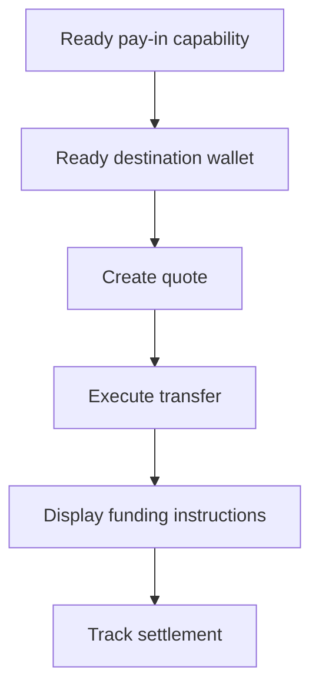

Utilitza un cobrament cotitzat quan el client necessiti finançar un import específic. La transferència liquida stablecoin en una cartera emesa.



## Abans de començar

Necessites una capacitat de cobrament preparada i una cartera de destinació emesa preparada per al mateix client. Completa qualsevol treball obert mitjançant [Capacitats i tasques](/ca/integration/onboarding/capabilities-and-requirements), i després torna a obtenir els dos recursos.

## 1. Crea una cotització

Crea el preu amb [`POST /v3/quotes`](/api-reference/money-movement/post-v3-quotes). Envia aquestes capçaleres:

```http
X-API-Key: ${SWIPELUX_API_KEY}
Idempotency-Key: payin-quote-001
Content-Type: application/json
```

```json
{
  "customerId": "${CUSTOMER_ID}",
  "capabilityId": "${CAPABILITY_ID}",
  "externalId": "payin-order-123",
  "in": {
    "amount": "150.00",
    "currency": "USD"
  },
  "destinationId": "${SETTLEMENT_WALLET_ID}",
  "out": {
    "currency": "USDC"
  }
}
```

Emmagatzema `data.id` com a `QUOTE_ID`. Presenta els imports i les comissions retornats en lloc de reconstruir-los a partir de la taxa.

## 2. Executa la cotització

Executa la cotització actual abans que expiri amb [`POST /v3/transfers`](/api-reference/money-movement/post-v3-transfers). Utilitza una nova clau per a aquesta transferència prevista:

```http
X-API-Key: ${SWIPELUX_API_KEY}
Idempotency-Key: payin-transfer-001
Content-Type: application/json
```

```json
{
  "quoteId": "${QUOTE_ID}"
}
```

Emmagatzema el `data.id` de la transferència com a `TRANSFER_ID` i conserva el seu estat actual.

## 3. Recupera les instruccions de finançament

Llegeix [`GET /v3/transfers/{transferId}/instructions`](/api-reference/money-movement/get-v3-transfers-by-transfer-id-instructions). Renderitza la variant `data.instructions` retornada sense assumir el seu tipus.

Aquests detalls són específics de la transferència. No reutilitzis mai les coordenades bancàries, el codi, la URL allotjada, l'import, la referència o la data de caducitat d'una transferència per a un altre cobrament.

Per a instruccions bancàries, quan `reference.required` és true, mostra el `reference.value` exacte al costat de les coordenades bancàries i fes-lo copiable. Mostra l'import i la moneda retornats del mateix conjunt d'instruccions.

Les instruccions bancàries també poden incloure els camps opcionals `bankName`, `bankAddress`, `accountHolderName` i `accountHolderAddress` en els mètodes `ach`, `wire`, `rtp` i `swift`. Mostra cada camp retornat al costat de les altres coordenades bancàries. Els bancs emissors sovint requereixen l'adreça del banc receptor per a `swift` i altres transferències internacionals, així que mostra `bankAddress` sempre que es retorni.

```json
{
  "type": "bank",
  "method": "swift",
  "amount": { "amount": "150.00", "currency": "USD" },
  "accountHolderName": "Swipelux FBO Customer",
  "accountHolderAddress": "8 The Green, Dover, DE",
  "bankName": "JPMorgan Chase",
  "bankAddress": "383 Madison Avenue, New York, NY",
  "details": {
    "swiftCode": "CHASUS33",
    "accountNumber": "123456789"
  },
  "reference": { "value": "SWIFTMEMO1", "required": true }
}
```

Un compte bancari emès és diferent: proporciona dades reutilitzables per a dipòsits posteriors. Consulta [Emet un compte bancari](/ca/integration/issue-bank-account) quan aquesta sigui l'experiència prevista.

## 4. Fes el seguiment de la liquidació

Llegeix [`GET /v3/transfers/{transferId}`](/api-reference/money-movement/get-v3-transfers-by-transfer-id) després de l'execució i després de cada esdeveniment. Impulsa l'estat mostrat al client a partir de l'últim `data.state`.

Utilitza `data.stateDetail` i `data.openTaskIds` quan la transferència necessiti una altra acció. No la marquis com a completada a partir d'un calendari previst.

A continuació, afegeix [Webhooks](/ca/integration/webhooks) i manté l'estat de la transferència sincronitzat fins que arribi a un resultat que el teu producte gestioni.
