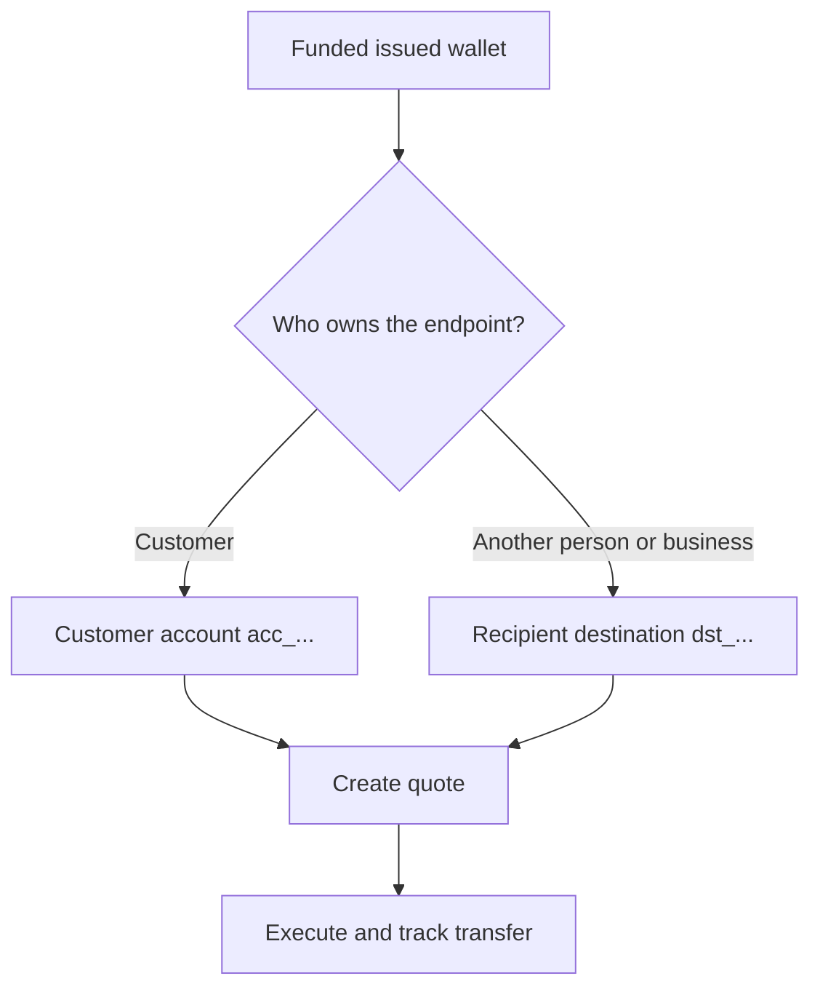

Cada pagament comença des d'una cartera emesa preparada i finançada. El model de destinació depèn de qui és propietari del punt final.



## Abans de començar

Torna a obtenir la cartera d'origen. Confirma que el seu estat actual permet el pagament i que el seu saldo disponible cobreix l'import d'origen previst. Emmagatzema l'ID derivat de la resposta com a `SOURCE_WALLET_ID`.

També necessites una capacitat de pagament preparada per al client actual i la destinació seleccionada.

## 1. Prepara la destinació

<Tabs>
  <Tab title="Propi">

Utilitza un compte bancari extern propietat del client quan el client sigui propietari del punt final. Crea'l amb [`POST /v3/customers/{customerId}/accounts`](/api-reference/accounts/post-v3-customers-by-customer-id-accounts) i aquestes capçaleres:

```http
X-API-Key: ${SWIPELUX_API_KEY}
Idempotency-Key: payout-account-001
Content-Type: application/json
```

```json
{
  "origin": "external",
  "type": "bank",
  "methods": ["ach", "wire"],
  "country": "US",
  "currency": "USD",
  "details": {
    "routingNumber": "021000021",
    "accountNumber": "123456789",
    "accountType": "checking",
    "bankName": "Example Bank",
    "accountHolderName": "Acme Payments SAS"
  },
  "label": "Customer operating account"
}
```

Llegeix-lo amb [`GET /v3/customers/{customerId}/accounts/{accountId}`](/api-reference/accounts/get-v3-customers-by-customer-id-accounts-by-account-id). Continua només quan el seu estat actual permeti el pagament. Emmagatzema el seu ID `acc_` com a `PAYOUT_DESTINATION_ID`.

  </Tab>
  <Tab title="Tercers">

Crea la persona o el negoci i el seu punt final bancari o de cartera mitjançant [Destinataris i destinacions](/ca/integration/recipients). Continua només quan la destinació estigui preparada.

Emmagatzema l'ID `dst_` retornat com a `PAYOUT_DESTINATION_ID`. No utilitzis l'ID `rcp_` del destinatari com a destinació de la cotització.

  </Tab>
</Tabs>

## 2. Crea la cotització del pagament

Utilitza [`POST /v3/quotes`](/api-reference/money-movement/post-v3-quotes) amb aquestes capçaleres:

```http
X-API-Key: ${SWIPELUX_API_KEY}
Idempotency-Key: payout-quote-001
Content-Type: application/json
```

```json
{
  "customerId": "${CUSTOMER_ID}",
  "capabilityId": "${CAPABILITY_ID}",
  "in": {
    "amount": "150.00",
    "currency": "USDC",
    "accountId": "${SOURCE_WALLET_ID}"
  },
  "destinationId": "${PAYOUT_DESTINATION_ID}",
  "out": {
    "currency": "USD"
  }
}
```

Emmagatzema `data.id` com a `QUOTE_ID` i presenta el preu i les comissions retornats.

## 3. Executa el pagament

Crea la transferència amb [`POST /v3/transfers`](/api-reference/money-movement/post-v3-transfers). Utilitza una nova clau per a aquesta execució prevista:

```http
X-API-Key: ${SWIPELUX_API_KEY}
Idempotency-Key: payout-transfer-001
Content-Type: application/json
```

```json
{
  "quoteId": "${QUOTE_ID}"
}
```

Emmagatzema el `data.id` de la transferència com a `TRANSFER_ID`. Una creació correcta inicia el pagament; no demostra el lliurament.

## 4. Fes el seguiment del lliurament

Llegeix [`GET /v3/transfers/{transferId}`](/api-reference/money-movement/get-v3-transfers-by-transfer-id) després de la creació i després de cada esdeveniment. Utilitza els `data.state`, `data.stateDetail` i `data.openTaskIds` més recents per decidir si esperar, actuar o mostrar un resultat terminal.

A continuació, revisa [Cotitzacions i transferències](/ca/integration/quotes-and-transfers) per als imports exactes, la recuperació segura d'execució i les tasques de transferència.
