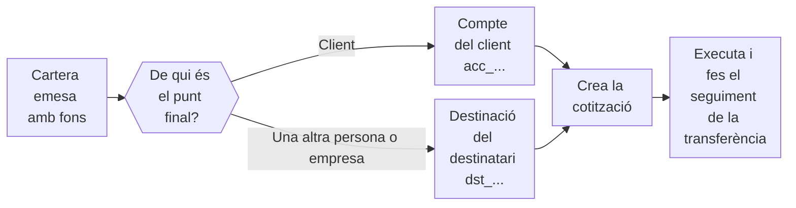

Cada pagament comença des d'una cartera emesa preparada i finançada. El model de destinació depèn de qui és propietari del punt final.


```mermaid
%%{init: {"flowchart": {"rankSpacing": 20, "nodeSpacing": 16, "wrappingWidth": 80, "padding": 8}}}%%
flowchart LR
  A["Cartera emesa amb fons"] --> B{{"De qui és el punt final?"}}
  B -->|"Client"| C["Compte del client acc_..."]
  B -->|"Una altra persona o empresa"| D["Destinació del destinatari dst_..."]
  C --> E["Crea la cotització"]
  D --> E
  E --> F["Executa i fes el seguiment de la transferència"]
```

## Abans de començar

Torna a obtenir la cartera d'origen. Confirma que el seu estat actual permet el pagament i que el seu saldo disponible cobreix l'import d'origen previst. Emmagatzema l'ID derivat de la resposta com a `SOURCE_WALLET_ID`.

També necessites una capacitat de pagament preparada per al client actual i la destinació seleccionada.

Les carteres de Tron existents poden enviar USDT a una altra cartera de Tron amb una cotització `stablecoin_transfers`. L'entrada i la sortida han d'utilitzar la mateixa xarxa i la mateixa stablecoin. No pots crear noves carteres emeses a Tron.

## 1. Prepara la destinació

<Tabs>
  <Tab title="Propi">

Utilitza un compte bancari extern propietat del client quan el client sigui propietari del punt final. Crea'l amb [`POST /v3/customers/{customerId}/accounts`](/api-reference/accounts/post-v3-customers-by-customer-id-accounts) i aquestes capçaleres:

```http Request headers
X-API-Key: ${SWIPELUX_API_KEY}
Idempotency-Key: payout-account-001
Content-Type: application/json
```

```json Request body
{
  "origin": "external",
  "type": "bank",
  "methods": ["ach", "wire"],
  "country": "US",
  "currency": "USD",
  "details": {
    "routingNumber": "021000021",
    "accountNumber": "123456789",
    "accountType": "checking",
    "bankName": "Example Bank",
    "accountHolderName": "Acme Payments SAS"
  },
  "label": "Customer operating account"
}
```

Llegeix-lo amb [`GET /v3/customers/{customerId}/accounts/{accountId}`](/api-reference/accounts/get-v3-customers-by-customer-id-accounts-by-account-id). Continua només quan el seu estat actual permeti el pagament. Emmagatzema el seu ID `acc_` com a `PAYOUT_DESTINATION_ID`.

  </Tab>
  <Tab title="Tercers">

Crea la persona o el negoci i el seu punt final bancari o de cartera mitjançant [Destinataris i destinacions](/ca/integration/recipients). Continua només quan la destinació estigui preparada.

Emmagatzema l'ID `dst_` retornat com a `PAYOUT_DESTINATION_ID`. No utilitzis l'ID `rcp_` del destinatari com a destinació de la cotització.

  </Tab>
</Tabs>

## 2. Crea la cotització del pagament

Utilitza [`POST /v3/quotes`](/api-reference/money-movement/post-v3-quotes) amb aquestes capçaleres:

```http Request headers
X-API-Key: ${SWIPELUX_API_KEY}
Idempotency-Key: payout-quote-001
Content-Type: application/json
```

```json Request body
{
  "customerId": "${CUSTOMER_ID}",
  "capabilityId": "${CAPABILITY_ID}",
  "in": {
    "amount": "150.00",
    "currency": "USDC",
    "accountId": "${SOURCE_WALLET_ID}"
  },
  "destinationId": "${PAYOUT_DESTINATION_ID}",
  "out": {
    "currency": "USD"
  }
}
```

Emmagatzema `data.id` com a `QUOTE_ID` i presenta el preu i les comissions retornats.

### Escull una ruta bancària {#choose-a-bank-route}

Per a un pagament de cripto a fiat, pots establir l'`institutionId` opcional per exigir una ruta bancària aprovada per al client. Omet-lo per utilitzar l'encaminament automàtic.

```json Request body with institutionId
{
  "customerId": "${CUSTOMER_ID}",
  "capabilityId": "${CAPABILITY_ID}",
  "institutionId": "${INSTITUTION_ID}",
  "in": {
    "amount": "150.00",
    "currency": "USDC",
    "accountId": "${SOURCE_WALLET_ID}"
  },
  "destinationId": "${PAYOUT_DESTINATION_ID}",
  "out": {
    "currency": "USD"
  }
}
```

- Un `institutionId` explícit mai no recorre a un altre banc. Quan el banc seleccionat no té cap ruta preparada per a aquest client, capacitat i destinació, `POST /v3/quotes` retorna `422` [`bank_not_supported_for_customer`](/integration/errors#bank-not-supported-for-customer) amb el punter `/institutionId`.
- `institutionId` només és vàlid en cotitzacions de pagament de cripto a fiat. Enviar-lo en una cotització de cobrament, de targeta o de transferència de stablecoin retorna `400` [`validation_error`](/integration/errors#validation-error).
- Les lectures de la cotització i de la transferència retornen l'`institutionId` de la ruta seleccionada, inclosa una seleccionada automàticament, quan es pot identificar el banc.

### Pagaments SWIFT {#swift-payouts}

En producció, els pagaments SWIFT en USD necessiten una capacitat SWIFT preparada que admeti pagaments (`swift_pooled` o `swift_named`) i es financen amb USDC a Ethereum, Base o Polygon, o amb USDT a Ethereum o Polygon. L'import per al destinatari després de comissions ha de ser com a mínim de 100.00 USD.

Una destinació SWIFT necessita l'adreça postal del banc a `bankAddress`, `bankCity`, `bankState` i `bankPostalCode`. El país del BIC ha de coincidir amb el país del banc. Swipelux obté l'adreça del beneficiari del perfil del client o del destinatari.

### Pagaments Pix {#pix-payouts}

Les [destinacions de destinataris](/ca/integration/recipients) Pix i Pix Safe reben BRL. Cotitza el pagament amb la capacitat Pix preparada del client (`pix_pooled`), finança'l amb USDC i defineix `out.currency` com a `BRL`. USDT no pot finançar un pagament en BRL.

Un pagament Pix no pot portar comissió de desenvolupador. Si el compte d'origen té comissions de desenvolupador, defineix `fees.breakdown.developer` com a `{"fixed": "0.00", "bips": 0}` a la sol·licitud de cotització. Altrament, `POST /v3/quotes` retorna `400` [`validation_error`](/integration/errors#validation-error).

Swipelux calcula el preu de la cotització només després que s'aprovin les dades bancàries de la destinació. Mentre s'estan verificant, `POST /v3/quotes` retorna `400` [`validation_error`](/integration/errors#validation-error) amb un `detail` que indica que la destinació encara s'està verificant, així que sol·licita una cotització nova quan acabi la verificació. Si les dades bancàries s'han rebutjat o la configuració de la destinació està incompleta, el `detail` et demana que contactis amb el suport, i les noves cotitzacions continuen fallant fins que el suport completi la configuració. Si no es pot comprovar la verificació, retorna `503` [`quote_temporarily_unavailable`](/integration/errors#quote-temporarily-unavailable); torna-ho a provar més tard.

## 3. Executa el pagament

Crea la transferència amb [`POST /v3/transfers`](/api-reference/money-movement/post-v3-transfers). Utilitza una nova clau per a aquesta execució prevista:

```http Request headers
X-API-Key: ${SWIPELUX_API_KEY}
Idempotency-Key: payout-transfer-001
Content-Type: application/json
```

```json Request body
{
  "quoteId": "${QUOTE_ID}"
}
```

Emmagatzema el `data.id` de la transferència com a `TRANSFER_ID`. Una creació correcta inicia el pagament; no demostra el lliurament.

## 4. Fes el seguiment del lliurament

Llegeix [`GET /v3/transfers/{transferId}`](/api-reference/money-movement/get-v3-transfers-by-transfer-id) després de la creació i després de cada esdeveniment. Utilitza els `data.state`, `data.stateDetail` i `data.openTaskIds` més recents per decidir si esperar, actuar o mostrar un resultat terminal.

A continuació, revisa [Cotitzacions i transferències](/ca/integration/quotes-and-transfers) per als imports exactes, la recuperació segura d'execució i les tasques de transferència.
