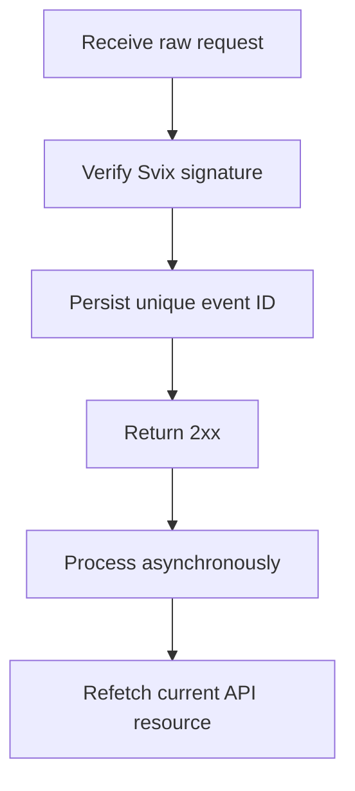

Utilitza els webhooks per reaccionar a canvis asíncrons. El lliurament és almenys una vegada, de manera que els esdeveniments duplicats, retardats i fora d'ordre són normals.



## Registra només els esdeveniments que necessites

Crea un endpoint amb [`POST /v3/webhooks`](/api-reference/webhooks/post-v3-webhooks). Subscriu-te només als esdeveniments documentats que impulsen la teva integració. Aquest exemple utilitza [`transfer.state_changed`](/api-reference/webhooks/transfer-state-changed).

```bash
export API_BASE='https://platform.swipelux.com'
export SWIPELUX_API_KEY='replace-with-your-api-key'

curl --request POST \
  "${API_BASE}/v3/webhooks" \
  --header "X-API-Key: ${SWIPELUX_API_KEY}" \
  --header "Idempotency-Key: webhook-endpoint-001" \
  --header "Content-Type: application/json" \
  --data @- <<'JSON'
{
  "url": "https://example.com/webhooks/swipelux",
  "events": ["transfer.state_changed"]
}
JSON
```

Emmagatzema `data.id` de la resposta com a `WEBHOOK_ID`. Obre el portal retornat per [`GET /v3/webhooks/portal`](/api-reference/webhooks/get-v3-webhooks-portal), recupera el secret de signatura d'aquest endpoint i emmagatzema'l per separat de la teva clau d'API en un gestor de secrets.

## Verifica abans d'analitzar

Swipelux lliura les noves integracions de webhooks a través de Svix. Verifica el cos brut de la sol·licitud amb el secret de signatura del teu endpoint i aquestes capçaleres:

- `svix-id`
- `svix-timestamp`
- `svix-signature`

No analitzis el JSON ni provoquis efectes secundaris abans que la verificació tingui èxit.

```javascript
import { Webhook } from "svix";

const verifier = new Webhook(process.env.SWIPELUX_WEBHOOK_SECRET);

export async function handleSwipeluxWebhook(request) {
  const rawBody = await request.text();
  const event = verifier.verify(rawBody, {
    "svix-id": request.headers.get("svix-id"),
    "svix-timestamp": request.headers.get("svix-timestamp"),
    "svix-signature": request.headers.get("svix-signature"),
  });

  await webhookInbox.insertIfAbsent({
    id: event.id,
    payload: event,
    status: "pending",
  });

  return new Response(null, { status: 204 });
}
```

Rebutja les sol·licituds amb signatures absents o no vàlides. Manté el cos brut disponible fins que la verificació es completi.

## Persisteix, reconeix, i després processa

Posa una restricció d'unicitat sobre l'`id` de l'envolupant. Persisteix l'envolupant verificat, retorna `2xx` ràpidament i després processa'l de manera asíncrona.

Si l'ID de l'esdeveniment ja existeix, reconeix el lliurament sense repetir els efectes secundaris ja completats. Reprèn el treball local pendent o fallit mitjançant la teva pròpia cua de reintents. No utilitzis el camp `attempt` de l'envolupant com a clau de deduplicació o comptador de reintents de transport.

## Torna a obtenir l'estat actual

L'ordre dels webhooks no és un historial autoritatiu del recurs. Utilitza `resource.type` i `resource.id` per localitzar l'objecte, i després obté el seu estat actual abans d'actualitzar el teu sistema.

Per a un esdeveniment de transferència, crida [`GET /v3/transfers/{transferId}`](/api-reference/money-movement/get-v3-transfers-by-transfer-id):

```bash
curl --request GET \
  "${API_BASE}/v3/transfers/${TRANSFER_ID}" \
  --header "X-API-Key: ${SWIPELUX_API_KEY}"
```

Impulsa l'estat visible per al client i les accions posteriors a partir de la resposta actual de l'API. Dissenya els efectes secundaris perquè siguin segurs si dos treballadors processen esdeveniments relacionats en un ordre diferent.

## Recupera lliuraments

Utilitza [`GET /v3/webhooks/portal`](/api-reference/webhooks/get-v3-webhooks-portal) per obrir registres de lliurament, reintentar lliuraments fallits o iniciar una repetició manual.

Cada repetició ha de passar per la mateixa verificació de signatura i safata d'entrada durable. Per recuperar-te després d'una inactivitat, repeteix la finestra afectada i torna a obtenir cada recurs referenciat. Els IDs d'esdeveniments completats romanen com a no-ops; els registres incomplets es reprenen de manera asíncrona.

A continuació, verifica els lliuraments duplicats i fora d'ordre al sandbox, i després completa la llista de comprovació [Anar en producció](/ca/integration/go-live).
