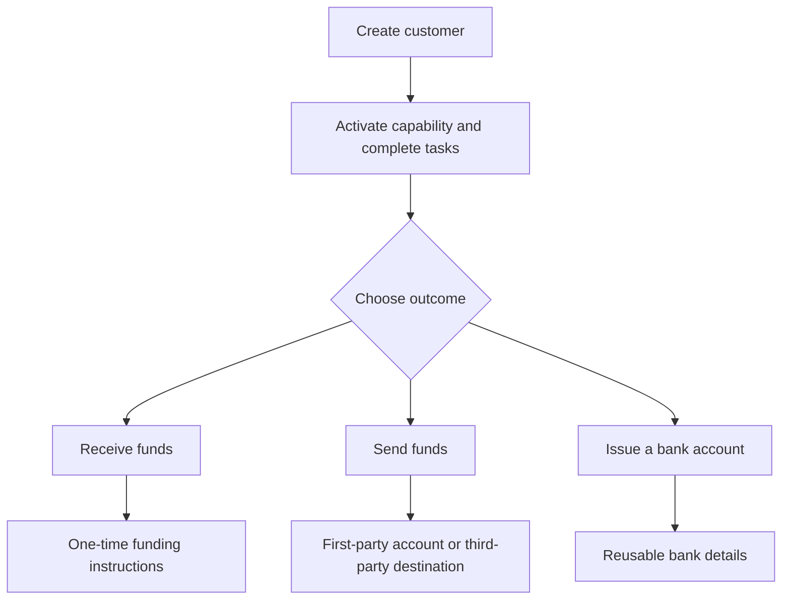

从客户想要的业务结果出发。每种流程都使用相同的入驻模型,然后分叉到不同的账户和资金流转步骤。

## 流程对比

| 业务结果 | 事先需要准备 | 您将获得 |
| --- | --- | --- |
| 入金 | 已就绪的入金能力和作为目的地的发行钱包 | 针对本次转账的入金指令,以及稳定币结算 |
| 出金 | 已就绪的出金能力、已充值的发行钱包,以及已就绪的账户或目的地 | 一笔发送到所选收款端点的转账 |
| 发行的银行账户 | 已就绪的银行能力,以及作为结算钱包的发行钱包 | 开通完成后可复用的银行账户信息 |

获得报价的入金会为一笔转账生成入金指令。发行的银行账户会创建可供后续入账使用的可复用账户信息。出金则从发行钱包中已经可用的资金开始。

## 选择您的流程

<CardGroup cols={3}>
  <Card title="接收资金" icon="arrow-down-to-line" href="/cn/integration/receive-funds">
    创建并跟踪一笔法币到稳定币的入金。
  </Card>
  <Card title="发送资金" icon="arrow-up-from-line" href="/cn/integration/send-funds">
    构建一笔第一方或第三方出金。
  </Card>
  <Card title="发行银行账户" icon="building-columns" href="/cn/integration/issue-bank-account">
    开通与钱包关联的可复用银行账户信息。
  </Card>
</CardGroup>
