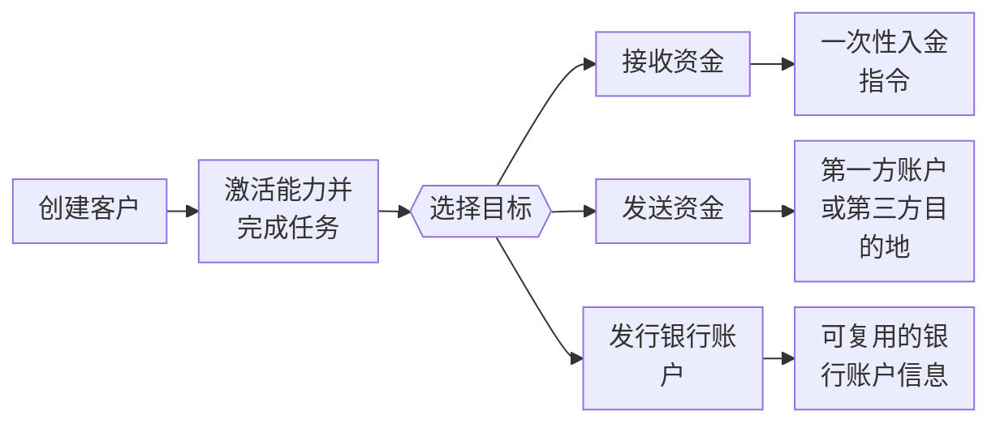

从客户想要的业务结果出发。每种流程都使用相同的入驻模型,然后分叉到不同的账户和资金流转步骤。

```mermaid
%%{init: {"flowchart": {"rankSpacing": 20, "nodeSpacing": 16, "wrappingWidth": 80, "padding": 8}}}%%
flowchart LR
  A["创建客户"] --> B["激活能力并完成任务"]
  B --> C{{"选择目标"}}
  C --> D["接收资金"]
  C --> E["发送资金"]
  C --> F["发行银行账户"]
  D --> G["一次性入金指令"]
  E --> H["第一方账户或第三方目的地"]
  F --> I["可复用的银行账户信息"]
```

## 流程对比

| 业务结果 | 事先需要准备 | 您将获得 |
| --- | --- | --- |
| 入金 | 已就绪的入金能力和作为目的地的发行钱包 | 针对本次转账的入金指令,以及稳定币结算 |
| 出金 | 已就绪的出金能力、已充值的发行钱包,以及已就绪的账户或目的地 | 一笔发送到所选收款端点的转账 |
| 发行的银行账户 | 已就绪的银行能力,以及作为结算钱包的发行钱包 | 开通完成后可复用的银行账户信息 |

获得报价的入金会为一笔转账生成入金指令。发行的银行账户会创建可供后续入账使用的可复用账户信息。出金则从发行钱包中已经可用的资金开始。

## Onramp 与 offramp

Swipelux 使用入金和出金这两个术语,而不是 onramp 和 offramp。入金会将稳定币结算到发行钱包中。出金则从发行钱包发送资金。

| 如果您要构建 | 使用 | 报价和转账的 `direction` |
| --- | --- | --- |
| Onramp(法币到稳定币) | [接收资金](/cn/integration/receive-funds) | `fiat_to_stablecoin` |
| Offramp(稳定币到法币) | [发送资金](/cn/integration/send-funds)到银行账户或银行目的地 | `stablecoin_to_fiat` |
| 钱包到钱包的稳定币转账 | [发送资金](/cn/integration/send-funds)到钱包 | `stablecoin_move` |

您无需在请求中发送 `direction`。Swipelux 会根据报价中的 `in` 和 `out` 币种推导出该值。请参阅[报价与转账](/cn/integration/quotes-and-transfers)。

## 选择您的流程

<CardGroup cols={3}>
  <Card title="接收资金" icon="arrow-down-to-line" href="/cn/integration/receive-funds">
    创建并跟踪一笔法币到稳定币的入金。
  </Card>
  <Card title="发送资金" icon="arrow-up-from-line" href="/cn/integration/send-funds">
    构建一笔第一方或第三方出金。
  </Card>
  <Card title="发行银行账户" icon="building-columns" href="/cn/integration/issue-bank-account">
    开通与钱包关联的可复用银行账户信息。
  </Card>
</CardGroup>
