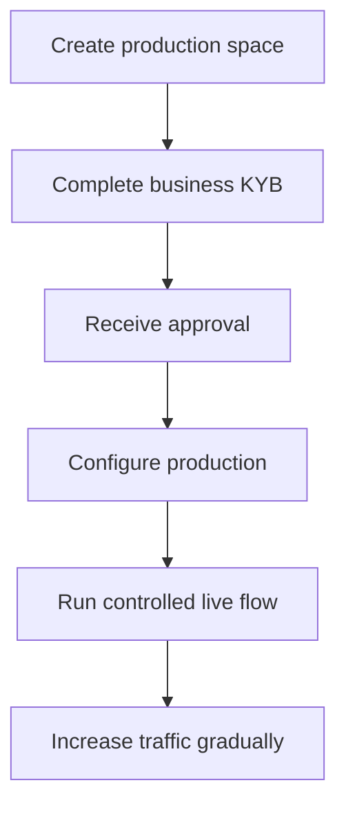

生产环境激活会对接入方企业本身进行核验。它与您为自己产品所创建的 API 客户是相互独立的。

## 开通您的生产空间

1. 登录 Swipelux 控制台,选择 **Create a production space**。
2. 打开 KYB 页签,或访问[企业核验](https://www.swipelux.app/kyb)。
3. 完整填写所有要求的字段,并上传所需文件。
4. 提交您的接入方企业进行核验,并等待批准。

只有当您的接入方企业和生产空间获得批准后,您才能创建生产环境下的 API 客户和交易。

## 保持生产环境独立

请显式地创建生产环境资源。仅仅切换 API 密钥并不会迁移沙盒的状态。

- 将生产环境凭证存放在独立的密钥管理条目中。
- 使用仅用于生产环境的部署配置和资源 ID。
- 注册一个独立的生产环境 Webhook 端点和签名密钥。
- 在生产环境中重新创建所需的客户、能力、账户、收款方和目的地。
- 将生产环境访问权限限定给真正需要的服务和操作人员。

沙盒和生产环境都使用 `https://platform.swipelux.com`;由 API 密钥选择环境。

## 完成上线清单

- [ ] 在沙盒中测试成功路径和预期的失败路径。
- [ ] 对每一个需要 `Idempotency-Key` 的写入操作都发送该键,并保留以便安全重试。
- [ ] 在解析前先校验 Webhook 签名,持久化事件 ID,并测试重放。
- [ ] 处理不可用的能力、待办任务,以及任务版本发生变化的情况。
- [ ] 处理已记录的 [API 错误与重试](/cn/integration/errors),包括使用原始键进行幂等重试。
- [ ] 向您的运营人员透出转账失败与可执行的处理说明。
- [ ] 确认日志保留了 `X-Request-Id` 或 `correlationId`,同时不暴露密钥或敏感的金融信息。

## 运行一次受控的实盘流程

从一个已知的客户和一次小额交易开始。请记录:

| 控制项 | 在测试前先明确 |
| --- | --- |
| 范围 | 客户、能力、账户或目的地、金额和支付方式。 |
| 预期结果 | 期望观察到的 API 状态、余额或入金指令,以及 Webhook 事件。 |
| 负责人 | 负责观察整个流程的人员。 |
| 停止条件 | 任何非预期的状态、缺失的 Webhook、错误的金额,或未解决的任务。 |

请同时核验当前的 API 资源和经过身份验证的 Webhook 投递。如果任一项与预期结果不一致,请先停止,并在发送更多流量之前先行排查。

在整个流程成功之后,请一边监控能力、账户、目的地和转账的状态,一边逐步放量。

请返回[常见流程](/cn/integration/common-flows)查看产品路径,查看[错误与重试](/cn/integration/errors)了解失败处理,或使用 [API 参考](/cn/api-reference/introduction)获取准确契约。
