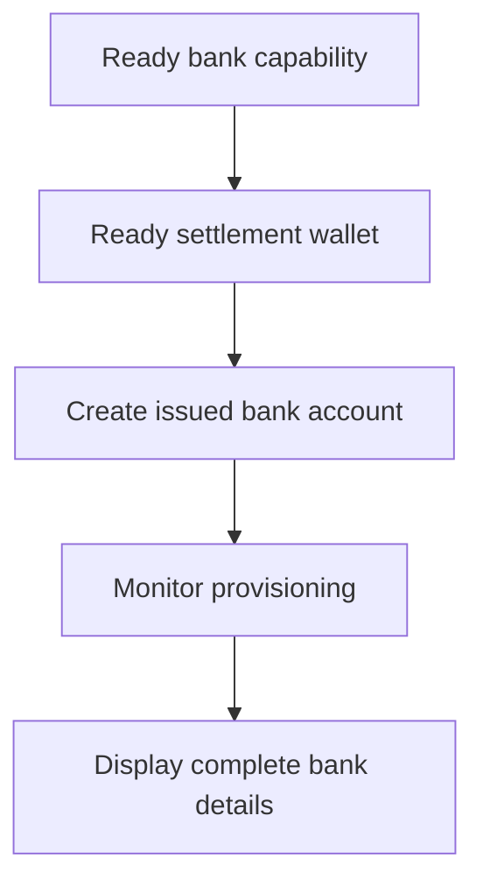

当客户需要可复用的银行账户信息时,请使用发行的银行账户。如果只需要与特定金额绑定的一次性入金指令,请改为使用[接收资金](/cn/integration/receive-funds)。



## 开始之前

您需要一个客户 ID、一个针对目标支付方式和币种的已就绪银行能力,以及一个属于同一客户的已就绪发行钱包。请通过[能力与任务](/cn/integration/onboarding/capabilities-and-requirements)完成所有待办事项。

## 1. 创建或选择结算钱包

通过[账户与钱包](/cn/integration/accounts#create-the-account)创建一个发行的钱包,然后再次读取该钱包。仅当其当前状态允许结算时才继续。

将其响应中的 `data.id` 保存为 `SETTLEMENT_WALLET_ID`。切勿将外部钱包用作 `settlement.accountId`。

## 2. 创建发行的银行账户

使用 [`POST /v3/customers/{customerId}/accounts`](/api-reference/accounts/post-v3-customers-by-customer-id-accounts) 并带上以下请求头:

```http
X-API-Key: ${SWIPELUX_API_KEY}
Idempotency-Key: issued-bank-account-001
Content-Type: application/json
```

请求体如下:

```json
{
  "origin": "issued",
  "type": "bank",
  "method": "ach",
  "country": "US",
  "currency": "USD",
  "settlement": {
    "accountId": "${SETTLEMENT_WALLET_ID}"
  },
  "label": "USD account"
}
```

将返回的 `data.id` 保存为 `BANK_ACCOUNT_ID`。同时保留 `data.status`、`data.openTaskIds`、`data.details` 以及结算关系。

银行账户 ID 与钱包 ID 承担不同的角色。使用银行账户 ID 来读取开通进度和银行账户信息。使用结算钱包 ID 来标识入金记账到哪里。

## 3. 监控开通进度

创建之后以及每次收到相关 Webhook 之后,请读取 [`GET /v3/customers/{customerId}/accounts/{accountId}`](/api-reference/accounts/get-v3-customers-by-customer-id-accounts-by-account-id)。

在 `details` 缺失期间,保持客户界面处于待处理状态。如果 `openTaskIds` 非空,请完成最新任务,然后重新拉取该账户。切勿仅凭经过的时间来推断就绪状态。

如果最新的 `statusReason.code` 为 `awaiting_assignment`,请通过[接收资金](/cn/integration/receive-funds)为同一客户、能力和结算钱包创建第一笔入金,然后再次读取该银行账户。仅当当前账户明确要求时才走此分支。

## 4. 安全展示银行账户信息

请只展示最新一次账户读取所返回的完整信息。当 `details.referenceRequired` 为 true 时,请展示准确的 `details.reference` 并允许复制。当其为 false 时,请勿自行编造 reference。

这些银行账户信息是可复用的。切勿用来自某次获得报价入金中的入金指令替换它们,那些指令仅属于那一笔转账。

接下来,请添加 [Webhook](/cn/integration/webhooks),让开通更新可以推送到您的应用,而无需让客户停留在轮询页面。
