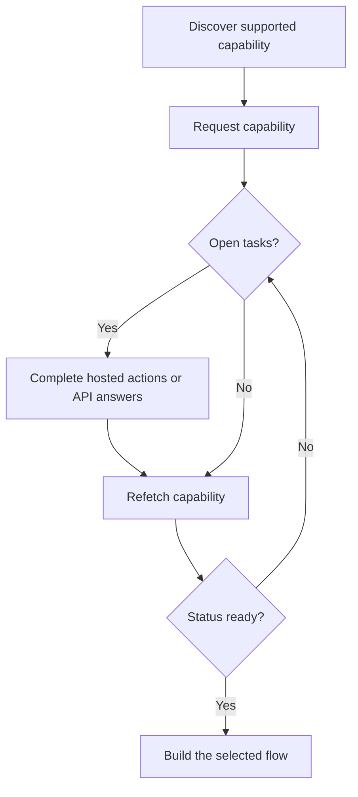

能力告诉您某个客户是否可以使用特定的业务结果、支付方式和方向。待办任务告诉您在该能力或相关资源可以继续推进之前必须完成哪些事项。



```bash
export API_BASE='https://platform.swipelux.com'
export SWIPELUX_API_KEY='replace-with-your-api-key'
```

## 发现受支持的能力

使用 [`GET /v3/customers/{customerId}/capabilities/supported`](/api-reference/capabilities/get-v3-customers-by-customer-id-capabilities-supported) 读取该客户当前可用的选项:

```bash
curl --request GET \
  "${API_BASE}/v3/customers/${CUSTOMER_ID}/capabilities/supported" \
  --header "X-API-Key: ${SWIPELUX_API_KEY}"
```

选择在 `directions`、`method` 和 `accountType` 上与您意图匹配的响应条目。仅当 `availability` 为 `available` 或 `beta`,并且 `eligibility.eligible` 为 `true` 时才继续。如果返回了 `institutions`,请只从该响应中的 ID 中做选择。

将选中的 `data[].id` 保存为 `CAPABILITY_ID`。切勿从其他客户或其他环境复制能力 ID。

### 共享账户 vs 专属账户

银行类能力有两种变体,通过 `accountType` 字段以及能力 ID 后缀(例如 `ach_pooled`、`wire_named`)标识:

- **`pooled`**:共享的 Swipelux 银行账户。每笔入金使用唯一的备注信息进行路由。适用于一次性转账。
- **`named`**:为该客户专属的银行账户信息(虚拟 IBAN、专属 ACH 账户)。可复用,可分享给任何付款方。[发行的银行账户](/cn/integration/issue-bank-account)必须使用此类型。

默认使用 `pooled`。仅在客户需要可复用的银行账户信息时才使用 `named`。请查看 `supported` 响应以确认哪些变体可用。

## 申请能力

使用 [`POST /v3/customers/{customerId}/capabilities/{capabilityId}`](/api-reference/capabilities/post-v3-customers-by-customer-id-capabilities-by-capability-id) 申请所选选项:

```bash
curl --request POST \
  "${API_BASE}/v3/customers/${CUSTOMER_ID}/capabilities/${CAPABILITY_ID}" \
  --header "X-API-Key: ${SWIPELUX_API_KEY}" \
  --header "Idempotency-Key: capability-request-001" \
  --header "Content-Type: application/json" \
  --data '{}'
```

仅当您需要从受支持能力响应返回的 ID 中做出选择时,才显式传入 `institutions` 数组。

将 `data.status` 保存为 `CAPABILITY_STATUS`,`data.openTaskIds` 保存为 `OPEN_TASK_IDS`,并将每个 `data.applications[].id` 保存到 `APPLICATION_IDS`。

## 完成当前任务 {#complete-current-tasks}

使用 [`GET /v3/customers/{customerId}/tasks`](/api-reference/tasks/list-customer-tasks) 列出任务,从 `OPEN_TASK_IDS` 中选择 ID,然后使用 [`GET /v3/customers/{customerId}/tasks/{taskId}`](/api-reference/tasks/get-customer-task) 读取每个当前任务:

```bash
curl --request GET \
  "${API_BASE}/v3/customers/${CUSTOMER_ID}/tasks/${TASK_ID}" \
  --header "X-API-Key: ${SWIPELUX_API_KEY}"
```

请使用最新的 `data.revision` 和 `data.requirements`。如果它们可能已经变化,请在提交前立即重新拉取任务。

### 托管操作

当任务返回 `verificationSessions` 或 `tosSessions` 时,请保存每个会话的 `id` 和当前的 `url`。将客户引导到返回的 URL,然后重新读取该任务。这些是任务范围内的操作,而不是独立的客户验证生命周期。

### 上传文件 {#upload-documents}

当某个要求需要一份文件时,使用 [`POST /v3/customers/{customerId}/documents`](/api-reference/documents/post-v3-customers-by-customer-id-documents) 上传:

```bash
export DOCUMENT_PATH='/absolute/path/to/requested-document.pdf'

curl --request POST \
  "${API_BASE}/v3/customers/${CUSTOMER_ID}/documents" \
  --header "X-API-Key: ${SWIPELUX_API_KEY}" \
  --header "Idempotency-Key: customer-document-001" \
  --form "file=@${DOCUMENT_PATH}"
```

在提交引用它的答案之前,将返回的 `data.id` 保存为 `DOCUMENT_ID`。

### API 答案

使用 [`POST /v3/customers/{customerId}/tasks/{taskId}/submissions`](/api-reference/task-submissions/create-customer-task-submission) 针对当前版本提交一份完整的答案集:

```bash
curl --request POST \
  "${API_BASE}/v3/customers/${CUSTOMER_ID}/tasks/${TASK_ID}/submissions" \
  --header "X-API-Key: ${SWIPELUX_API_KEY}" \
  --header "Idempotency-Key: task-submission-001" \
  --header "Content-Type: application/json" \
  --data @- <<'JSON'
{
  "taskRevision": 3,
  "answers": [
    {
      "requirementId": "req_from_current_task",
      "answer": {
        "type": "text",
        "value": "Current answer"
      }
    }
  ]
}
JSON
```

请从最新的任务中获取每个要求 ID 和答案类型。如果 API 报告任务已发生变化,请重新拉取该任务,并基于新的版本重新构建提交内容。

## 在能力就绪时继续

使用 [`GET /v3/customers/{customerId}/capabilities/{capabilityId}`](/api-reference/capabilities/get-v3-customers-by-customer-id-capabilities-by-capability-id) 再次读取该能力:

```bash
curl --request GET \
  "${API_BASE}/v3/customers/${CUSTOMER_ID}/capabilities/${CAPABILITY_ID}" \
  --header "X-API-Key: ${SWIPELUX_API_KEY}"
```

用最新响应替换已保存的状态和任务 ID。仅当能力的当前状态允许您计划创建的账户、报价或转账时才继续。

接下来,请在[常见流程](/cn/integration/common-flows)中选择匹配的路径。
