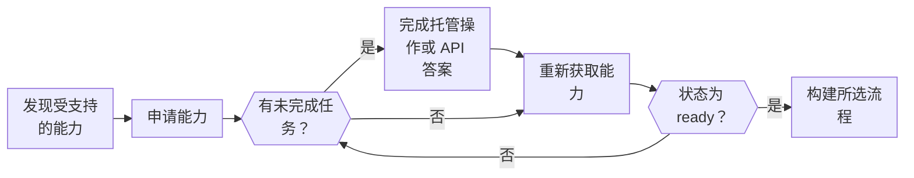

能力告诉您某个客户是否可以使用特定的业务结果、支付方式和方向。待办任务告诉您在该能力或相关资源可以继续推进之前必须完成哪些事项。


```mermaid
%%{init: {"flowchart": {"rankSpacing": 20, "nodeSpacing": 16, "wrappingWidth": 80, "padding": 8}}}%%
flowchart LR
  A["发现受支持的能力"] --> B["申请能力"]
  B --> C{{"有未完成任务？"}}
  C -->|"是"| D["完成托管操作或 API 答案"]
  D --> E["重新获取能力"]
  C -->|"否"| E
  E --> F{{"状态为 ready？"}}
  F -->|"否"| C
  F -->|"是"| G["构建所选流程"]
```

```bash Environment variables
export API_BASE='https://platform.swipelux.com'
export SWIPELUX_API_KEY='replace-with-your-api-key'
```

## 发现受支持的能力

使用 [`GET /v3/customers/{customerId}/capabilities/supported`](/api-reference/capabilities/get-v3-customers-by-customer-id-capabilities-supported) 读取该客户当前可用的选项:

```bash List supported capabilities
curl --request GET \
  "${API_BASE}/v3/customers/${CUSTOMER_ID}/capabilities/supported" \
  --header "X-API-Key: ${SWIPELUX_API_KEY}"
```

选择在 `directions`、`method` 和 `accountType` 上与您意图匹配的响应条目。仅当 `availability` 为 `available` 或 `beta`,并且 `eligibility.eligible` 为 `true` 时才继续。如果返回了 `institutions`,请只从该响应中的 ID 中做选择。

每个机构条目都包含 `logoUrl` 和 `isDefault` 标志。使用 `logoUrl` 在银行选择界面中显示银行的徽标；当其为 `null` 时，请显示您自己的通用银行图标。`isDefault` 仅适用于该客户和该能力，而非全局适用于该机构。[`GET /v3/institutions`](/api-reference/institutions/get-v3-institutions) 返回同样可为空的 `logoUrl`。机构 ID 是不透明的，因此请在不修改代码的情况下处理新的 ID。

```json Institution entry
{
  "institutions": [
    {
      "id": "jpmorgan",
      "name": "JPMorgan Chase",
      "bic": "CHASUS33",
      "logoUrl": "https://wallet.swipelux.com/bank-logos/jpmorgan.png",
      "countries": ["US"],
      "isDefault": true
    }
  ]
}
```

将选中的 `data[].id` 保存为 `CAPABILITY_ID`。切勿从其他客户或其他环境复制能力 ID。

### 共享账户 vs 专属账户

银行类能力有两种变体,通过 `accountType` 字段以及能力 ID 后缀(例如 `ach_pooled`、`wire_named`)标识:

- **`pooled`**:共享的 Swipelux 银行账户。每笔入金使用唯一的备注信息进行路由。适用于一次性转账。
- **`named`**:为该客户专属的银行账户信息(虚拟 IBAN、专属 ACH 账户)。可复用,可分享给任何付款方。[发行的银行账户](/cn/integration/issue-bank-account)必须使用此类型。

默认使用 `pooled`。仅在客户需要可复用的银行账户信息时才使用 `named`。请查看 `supported` 响应以确认哪些变体可用。

如需接收 SWIFT 入金或发行 SWIFT 银行账户信息,请使用 `swift_named`。`swift_pooled` 仅支持出金,因此请在受支持能力响应中查看每个选项的 `directions`。专属 SWIFT 账户会返回可复用的收款信息,包括银行的 BIC、在需要时提供的 reference,以及在银行提供时返回的受益人地址。

对于发行的 ACH、Wire 和 SWIFT 账户,您可以通过 `institution` 指定具体的银行,并在银行批准该客户之前保存账户申请。请参阅[发行银行账户](/cn/integration/issue-bank-account#choose-the-bank)。

## 申请能力

使用 [`POST /v3/customers/{customerId}/capabilities/{capabilityId}`](/api-reference/capabilities/post-v3-customers-by-customer-id-capabilities-by-capability-id) 申请所选选项:

```bash Request capability
curl --request POST \
  "${API_BASE}/v3/customers/${CUSTOMER_ID}/capabilities/${CAPABILITY_ID}" \
  --header "X-API-Key: ${SWIPELUX_API_KEY}" \
  --header "Idempotency-Key: capability-request-001" \
  --header "Content-Type: application/json" \
  --data '{}'
```

仅当您需要从受支持能力响应返回的 ID 中做出选择时,才显式传入 `institutions` 数组。

将 `data.status` 保存为 `CAPABILITY_STATUS`,`data.accountProvisioning` 保存为 `ACCOUNT_PROVISIONING_STATUS`,`data.openTaskIds` 保存为 `OPEN_TASK_IDS`,并将每个 `data.applications[].id` 保存到 `APPLICATION_IDS`。

### 按银行共享的申请 {#shared-applications-per-bank}

对于专属银行能力，每个客户在每家银行只有一个申请案例。共享能力和平台能力使用不关联银行的案例。Swipelux 会在您申请的所有兼容能力之间共享同一个案例：

- 一次批准可以覆盖多个能力。例如，某家银行已批准的案例可以让 ACH 能力和 wire 能力都变为 `ready`。
- 之后与现有案例匹配的请求会复用该案例。Swipelux 不会开启第二个申请，也不会添加重复任务。
- 不同银行的案例相互独立。一家银行的拒绝不会影响另一家银行的案例。

请求响应会告诉您 Swipelux 使用了哪个案例：

- `201` 表示该请求开启了一个新的申请案例。
- `200` 表示该请求解析到了客户已有的申请案例，例如对客户已持有的银行能力的重复请求，或对已取消能力的请求。对 `card` 或 `stablecoin_transfers` 的重复请求仍会返回 [`409 capability_already_exists`](/integration/errors#capability-already-exists)。
- `selectedApplicationId` 是与 `data` 并列的顶层字段，包含该请求所选择或开启的案例 ID。当请求未选择任何案例时，Swipelux 会省略该字段。幂等重放会返回相同的值。

简化响应：

```json Response (abbreviated)
{
  "data": {
    "id": "ach_named",
    "status": "pending",
    "openTaskIds": ["tsk_000000000000000002"],
    "applications": [{ "id": "apl_000000000000000005", "status": "in_review" }]
  },
  "selectedApplicationId": "apl_000000000000000005"
}
```

对于专属能力，再次发送相同的 `institutions` 列表可选择同一个案例，或者发送单个机构 ID 以指定该银行。已最终拒绝该客户的银行会被跳过。当您只指定了该银行，或所有符合条件的银行都已拒绝该客户时，请求会返回 [`409 capability_terminally_rejected`](/integration/errors#capability-terminally-rejected)。如需在被拒绝后尝试另一家银行，请使用该银行的机构 ID 再次申请该能力。

能力的状态反映该客户所有相关案例的情况。对于专属能力，只要有一个 `ready` 案例的批准覆盖了它，它就会变为 `ready`，无论其他银行报告什么。共享能力还需等待其方式检查完成，检查结果会在客户申请列表的 `probes` 中报告。

#### 列出客户的申请 {#list-the-customers-applications}

使用 [`GET /v3/customers/{customerId}/applications`](/api-reference/capabilities/get-v3-customers-by-customer-id-applications) 列出该客户的所有申请案例。结果通过 `nextCursor` 和 `hasMore` 分页，并支持 `updatedAfter`：

```bash List applications
curl --request GET \
  "${API_BASE}/v3/customers/${CUSTOMER_ID}/applications" \
  --header "X-API-Key: ${SWIPELUX_API_KEY}"
```

每个条目都包含能力的 `applications[]` 中返回的申请字段，另外还有：

- `scope`：单家银行的案例为 `named`，不关联银行的案例为 `provider_pooled` 或 `platform`，未分类的历史案例为 `null`。`provider_pooled` 和 `platform` 案例不包含 `institution`。
- `requestedScope[]`：针对该案例申请过的能力键，每个都带有其首次的 `requestedAt`。条目永远不会被移除。
- `coverage[]`：该案例的批准所覆盖的能力键，每个都带有 `grantedAt` 和 `source`。覆盖记录的是范围，而非授权。请读取能力以获取其当前状态。
- `probes[]`：针对该案例所覆盖的共享能力键的方式检查，每个都带有 `capabilityKey`、`status` 和 `reason`。专属能力键从不需要检查。
- `generation`、`predecessorApplicationId` 和 `supersededByApplicationId`：继承关系链接。当设置了 `supersededByApplicationId` 时，表示该案例已被替换。请根据该 ID 找到当前案例。

简化响应：

```json Response (abbreviated)
{
  "data": [
    {
      "id": "apl_000000000000000005",
      "status": "ready",
      "scope": "named",
      "institution": { "id": "jpmorgan", "name": "JPMorgan Chase", "bic": "CHASUS33" },
      "requestedScope": [
        { "capabilityKey": "ach_named", "requestedAt": "2026-09-20T10:00:00.000Z" }
      ],
      "coverage": [
        { "capabilityKey": "ach_named", "grantedAt": "2026-09-22T12:00:00.000Z", "source": "approval" },
        { "capabilityKey": "wire_named", "grantedAt": "2026-09-22T12:00:00.000Z", "source": "approval" }
      ],
      "probes": [],
      "generation": 1,
      "predecessorApplicationId": null,
      "supersededByApplicationId": null
    }
  ],
  "nextCursor": null,
  "hasMore": false
}
```

## 完成当前任务 {#complete-current-tasks}

使用 [`GET /v3/customers/{customerId}/tasks`](/api-reference/tasks/list-customer-tasks) 列出任务,从 `OPEN_TASK_IDS` 中选择 ID,然后使用 [`GET /v3/customers/{customerId}/tasks/{taskId}`](/api-reference/tasks/get-customer-task) 读取每个当前任务:

```bash List open tasks
curl --request GET \
  "${API_BASE}/v3/customers/${CUSTOMER_ID}/tasks/${TASK_ID}" \
  --header "X-API-Key: ${SWIPELUX_API_KEY}"
```

请使用最新的 `data.revision` 和 `data.requirements`。如果它们可能已经变化,请在提交前立即重新拉取任务。

### 复用的资料证据 {#reused-profile-evidence}

对于接受直接通过 API 提交的申请信息采集任务，Swipelux 会复用客户已经提供的信息。当此类任务被创建或重新核对时，Swipelux 会检查客户资料以及客户本人上传的文件。已由可用的资料值或文件支撑的符合条件的要求会转为 `in_review`，而不再保持可执行状态。资料更新和新文件上传会对现有任务触发同样的检查。

只有缺失或不兼容的值会保持可执行状态。复用并不代表批准该证据，Swipelux 仍会对其进行审核。明确的更正请求以及此前已作答的要求会保持可执行状态。所有人和相关方的文件不会被复用，仅通过托管会话收集的要求会保持其常规流程。

### 渲染要求 {#render-requirements}

请根据每个要求返回的元数据构建表单，而不是根据要求键。要求可以包含一个可选的简短 `title`，并且每个 `request` 都包含一个 `prompt`，用于显示在标题下方。

`request.type: "profile"` 的要求通过 `profilePointer` 标识资料字段，并添加输入元数据：

- `allowedValues`：标量字段的允许值，或数组字段中每一项的允许值。请提交这些值，而不是翻译后的显示标签。
- `valueSchema`：一个自包含的 JSON Schema Draft 7 文档，描述输入的结构、嵌套属性、必填字段和结构约束。对象上的枚举出现在相应的属性上，例如税务识别号的 `valueSchema.items.properties.type.enum`。Swipelux 在提交后仍会进行跨字段校验和审核校验，因此通过 schema 校验的值仍可能被拒绝。
- `valueType: "country"`，或数组的 `itemValueType: "country"`：该字段接受大写的 ISO 3166-1 alpha-2 代码。`valueSchema` 中嵌套的国家属性使用 `format: "iso-3166-1-alpha-2"`。请使用标准国家列表来获取本地化标签。

```json Requirement
{
  "id": "req_000000000000000010",
  "key": "account_purposes",
  "title": "Account purpose",
  "status": "action_required",
  "request": {
    "type": "profile",
    "prompt": "Select every purpose that applies.",
    "required": true,
    "profilePointer": "/financialProfile/accountPurposes",
    "valueType": "array",
    "itemValueType": "string",
    "allowedValues": ["business_expenses", "ecommerce", "payroll"],
    "valueSchema": {
      "$schema": "http://json-schema.org/draft-07/schema#",
      "type": "array",
      "items": { "enum": ["business_expenses", "ecommerce", "payroll"] }
    }
  }
}
```

此示例对值目录做了缩减；API 会返回所有允许的值。部分资料要求没有已发布的 schema，会省略 `valueSchema` 和 `allowedValues`。请根据 `prompt` 和 `valueType` 渲染这些要求。

每个未完成任务都包含 `dueAt` 时间戳。当 Swipelux 创建任务且未显式指定到期日期时,`dueAt` 默认为任务 `createdAt` 之后整 31 天。请将 `dueAt` 视为仅供参考:您无法通过 API 设置它,它也不会触发任何自动生命周期转换。只有单独的 `deadline` 字段(如存在)才会触发自动转换。

### 托管操作 {#hosted-actions}

在任务详情响应中，`verificationSessions` 和 `tosSessions` 的每个条目都包含 `action` 对象。任务列表响应不包含这些操作链接。请保存每个会话的 `id`，并在引导客户之前读取 `action.kind`；不要根据会话的 `status` 推断链接是否可用。

- `action.kind: "available"` 包含 `action.url` 和 `action.expiresAt`（目前始终为 `null`）。请保存 `action.url`，将客户引导到该地址，然后重新读取任务。会话级别的 `url` 和 `expiresAt` 字段包含相同的值。
- `action.kind: "unavailable"` 表示不应展示链接。此时会话级别的 `url` 和 `expiresAt` 字段不存在。仅凭会话的 `status` 无法确定会收到哪种操作类型。

```json Verification session
{
  "data": {
    "verificationSessions": [
      {
        "id": "vfy_000000000000000003",
        "key": "identity_verification",
        "type": "identity_verification",
        "status": "action_required",
        "action": {
          "kind": "available",
          "url": "https://platform.swipelux.com/kyc/redirect/cus_000000000000000001/tsk_000000000000000002/vfy_000000000000000003",
          "expiresAt": null
        },
        "url": "https://platform.swipelux.com/kyc/redirect/cus_000000000000000001/tsk_000000000000000002/vfy_000000000000000003",
        "expiresAt": null
      }
    ],
    "tosSessions": [
      {
        "id": "vfy_000000000000000004",
        "key": "terms_of_service",
        "type": "terms_of_service",
        "status": "completed",
        "action": { "kind": "unavailable" }
      }
    ]
  }
}
```

这些是任务范围内的操作,而不是独立的客户验证生命周期。

### 上传文件 {#upload-documents}

当某个要求需要一份文件时,使用 [`POST /v3/customers/{customerId}/documents`](/api-reference/documents/post-v3-customers-by-customer-id-documents) 上传:

```bash Upload document
export DOCUMENT_PATH='/absolute/path/to/requested-document.pdf'

curl --request POST \
  "${API_BASE}/v3/customers/${CUSTOMER_ID}/documents" \
  --header "X-API-Key: ${SWIPELUX_API_KEY}" \
  --header "Idempotency-Key: customer-document-001" \
  --form "file=@${DOCUMENT_PATH}"
```

在提交引用它的答案之前,将返回的 `data.id` 保存为 `DOCUMENT_ID`。

如需之后取回已存储的文件,请调用 [`GET /v3/customers/{customerId}/documents/{documentId}/download`](/api-reference/documents/get-v3-customers-by-customer-id-documents-by-document-id-download)。Swipelux 会返回一个 `url`,该 `url` 以附件形式下载文件,并在一小时后过期。已归档的文件会返回 `404`。

### API 答案

使用 [`POST /v3/customers/{customerId}/tasks/{taskId}/submissions`](/api-reference/task-submissions/create-customer-task-submission) 针对当前版本提交一份完整的答案集:

```bash Submit task answers
curl --request POST \
  "${API_BASE}/v3/customers/${CUSTOMER_ID}/tasks/${TASK_ID}/submissions" \
  --header "X-API-Key: ${SWIPELUX_API_KEY}" \
  --header "Idempotency-Key: task-submission-001" \
  --header "Content-Type: application/json" \
  --data @- <<'JSON'
{
  "taskRevision": 3,
  "answers": [
    {
      "requirementId": "req_from_current_task",
      "answer": {
        "type": "text",
        "value": "Current answer"
      }
    }
  ]
}
JSON
```

请从最新的任务中获取每个要求 ID 和答案类型。如果 API 报告任务已发生变化,请重新拉取该任务,并基于新的版本重新构建提交内容。

### 企业的受益所有人前提条件 {#beneficial-owner-prerequisite-for-businesses}

申请一个需要受益所有人证据的企业能力时,即使客户尚无符合条件的所有人,申请也会成功。该能力会以 `restricted` 状态创建,并带有 `statusReason.code: tasks_due`,同时企业信息采集任务会请求缺失的所有权信息,包括股权结构。

同一任务包含一个 `resource_reference` 要求,其请求中包含 `qualification: "beneficial_owner"`:

```json Beneficial owner requirement
{
  "type": "resource_reference",
  "prompt": "Add or select a qualifying beneficial owner.",
  "required": true,
  "resourceType": "related_party",
  "qualification": "beneficial_owner"
}
```

当相关方是同一客户下处于活跃状态的 `person` 相关方,且 `ownership.declared: true` 或提供的持股比例不低于 25 时,该相关方即符合条件。

该要求由当前的相关方名单推导得出,因此你通常无需直接作答:

- 创建或更新一个符合条件的相关方会在同一次重新评估中满足该要求,并开启该所有人自己的资料和材料工作。参见[添加企业相关人员](/cn/integration/onboarding/customers#add-business-related-parties)。
- 你也可以通过携带其 `relatedPartyId` 的 `resource_reference` 答案显式引用一个符合条件的相关方。
- 该要求在被满足后仍会列在当前任务中。当没有其他未完成的义务时,任务会变为 `satisfied`。
- 归档最后一个符合条件的相关方,或移除使其符合条件的信息,会重新开启该要求,即使任务已经是 `satisfied`。

## 在能力就绪时继续 {#continue-when-the-capability-is-ready}

使用 [`GET /v3/customers/{customerId}/capabilities/{capabilityId}`](/api-reference/capabilities/get-v3-customers-by-customer-id-capabilities-by-capability-id) 再次读取该能力:

```bash Refetch capability
curl --request GET \
  "${API_BASE}/v3/customers/${CUSTOMER_ID}/capabilities/${CAPABILITY_ID}" \
  --header "X-API-Key: ${SWIPELUX_API_KEY}"
```

用最新响应替换已保存的状态、账户签发状态和任务 ID。能力的 `status` 表示权限是否已获批准。对于会签发账户的能力,`accountProvisioning` 会单独报告该账户是 `not_started`、`in_progress`、`issued` 还是 `failed`;不签发账户的能力返回 `not_applicable`。

当能力处于 `pending` 时，它可能报告的 `statusReason.code` 值中有两个可以表明审核是否正在进行。`preparing_submission` 表示 Swipelux 仍在准备提交申请，尚未开始审核，即使另一家银行的申请为 `rejected` 或需要处理也是如此。`review_in_progress` 表示审核正在进行，例如申请处于 `in_review` 或[托管验证](#hosted-actions)处于打开状态时。两者都使用 `resolution: wait`。在这两个代码之间切换时状态仍为 `pending`，因此不会发送 `capability.status_changed` 事件。读取能力即可查看当前代码。

仅当能力的当前状态允许您计划创建的账户、报价或转账时才继续。当流程需要一个已签发的账户时,还需等待 `accountProvisioning` 变为 `issued`。

接下来,请在[常见流程](/cn/integration/common-flows)中选择匹配的路径。
