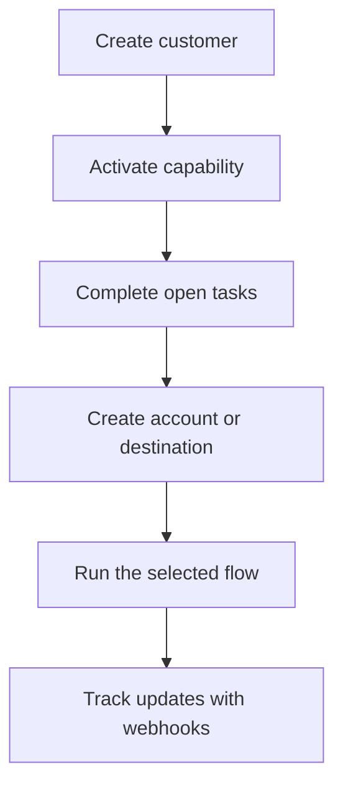

Swipelux 为您的后端提供了入驻客户与资金流转所需的核心组件,无需在您的产品中暴露支付基础设施。

## 您能构建什么

<CardGroup cols={3}>
  <Card title="接收资金" icon="arrow-down-to-line" href="/cn/integration/receive-funds">
    创建一次性的法币入金指令,并将稳定币结算到钱包中。
  </Card>
  <Card title="发送资金" icon="arrow-up-from-line" href="/cn/integration/send-funds">
    从客户钱包发送至其名下账户或第三方目的地。
  </Card>
  <Card title="发行银行账户" icon="building-columns" href="/cn/integration/issue-bank-account">
    开通可重复使用的银行账户信息,并与结算钱包关联。
  </Card>
</CardGroup>

## 一次集成的运作方式

客户(customer)是拥有该资金流的个人或企业。能力(capability)描述该客户可以使用哪些业务结果。待办事项(open task)会告知您在能力或资源可以继续推进之前需要完成哪些事项。

## 现场体验

访问 [demo.swipelux.com](https://demo.swipelux.com) 体验一个模拟的新型银行使用流程。您也可以[克隆起步模板](https://github.com/swipelux/neobank-starter),并对其产品界面进行定制。

演示和起步模板仅作为产品与界面参考,并不能替代本指南或当前的 API 契约。

## 开始构建

<CardGroup cols={3}>
  <Card title="快速开始" icon="rocket" href="/cn/integration/quickstart">
    创建一个客户,并跑通一个沙盒流程。
  </Card>
  <Card title="常见流程" icon="route" href="/cn/integration/common-flows">
    对比每种业务结果所需的配置。
  </Card>
  <Card title="API 参考" icon="code" href="/cn/api-reference/introduction">
    了解请求约定,并查看每一个 API 操作。
  </Card>
</CardGroup>
