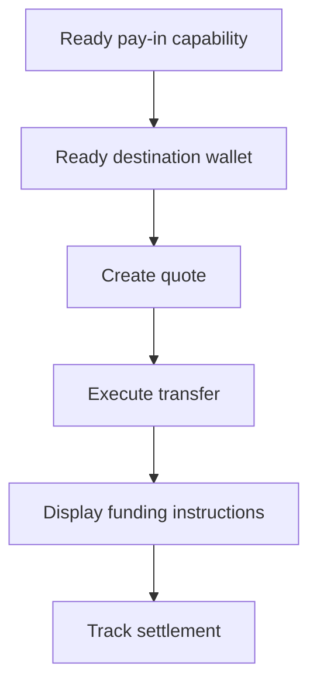

当客户需要按特定金额入金时,请使用获得报价的入金。该笔转账会将稳定币结算到一个发行的钱包中。



## 开始之前

您需要为同一客户准备好已就绪的入金能力和已就绪的发行目的钱包。请通过[能力与任务](/cn/integration/onboarding/capabilities-and-requirements)完成所有待办事项,然后重新拉取这两个资源。

## 1. 创建报价

使用 [`POST /v3/quotes`](/api-reference/money-movement/post-v3-quotes) 创建价格。请使用以下请求头:

```http
X-API-Key: ${SWIPELUX_API_KEY}
Idempotency-Key: payin-quote-001
Content-Type: application/json
```

```json
{
  "customerId": "${CUSTOMER_ID}",
  "capabilityId": "${CAPABILITY_ID}",
  "externalId": "payin-order-123",
  "in": {
    "amount": "150.00",
    "currency": "USD"
  },
  "destinationId": "${SETTLEMENT_WALLET_ID}",
  "out": {
    "currency": "USDC"
  }
}
```

将 `data.id` 保存为 `QUOTE_ID`。请展示返回的金额和费用,而不要基于汇率自行重新计算。

## 2. 执行报价

在过期前使用 [`POST /v3/transfers`](/api-reference/money-movement/post-v3-transfers) 执行当前报价。请为这笔预期的转账使用一个新的幂等键:

```http
X-API-Key: ${SWIPELUX_API_KEY}
Idempotency-Key: payin-transfer-001
Content-Type: application/json
```

```json
{
  "quoteId": "${QUOTE_ID}"
}
```

将转账的 `data.id` 保存为 `TRANSFER_ID` 并保留其当前状态。

## 3. 获取入金指令

读取 [`GET /v3/transfers/{transferId}/instructions`](/api-reference/money-movement/get-v3-transfers-by-transfer-id-instructions)。按返回的 `data.instructions` 变体进行渲染,不要臆测其类型。

这些信息与本次转账绑定。切勿将某一笔转账的银行账户信息、代码、托管页面 URL、金额、备注或过期时间用于另一笔入金。

对于银行入金指令,当 `reference.required` 为 true 时,请在银行账户信息旁展示准确的 `reference.value` 并允许复制。请展示同一指令集中返回的金额和币种。

银行入金指令还可在 `ach`、`wire`、`rtp` 和 `swift` 方式下返回可选的 `bankName`、`bankAddress`、`accountHolderName` 和 `accountHolderAddress` 字段。请将返回的每个字段与其他银行账户信息一并展示。对于 `swift` 及其他国际电汇,汇出银行通常要求提供收款银行地址,因此只要返回了 `bankAddress` 就请展示。

```json
{
  "type": "bank",
  "method": "swift",
  "amount": { "amount": "150.00", "currency": "USD" },
  "accountHolderName": "Swipelux FBO Customer",
  "accountHolderAddress": "8 The Green, Dover, DE",
  "bankName": "JPMorgan Chase",
  "bankAddress": "383 Madison Avenue, New York, NY",
  "details": {
    "swiftCode": "CHASUS33",
    "accountNumber": "123456789"
  },
  "reference": { "value": "SWIFTMEMO1", "required": true }
}
```

发行的银行账户则不同:它提供可用于后续入账的可复用账户信息。若您期望的是这种体验,请参阅[发行银行账户](/cn/integration/issue-bank-account)。

## 4. 跟踪结算

在执行后以及每次事件之后,读取 [`GET /v3/transfers/{transferId}`](/api-reference/money-movement/get-v3-transfers-by-transfer-id)。根据最新的 `data.state` 驱动面向客户的状态。

当转账需要下一步操作时,请使用 `data.stateDetail` 和 `data.openTaskIds`。不要根据预期的时间表就将其标记为已完成。

接下来,请添加 [Webhook](/cn/integration/webhooks),并持续同步转账状态,直到其达到您产品所能处理的最终结果。
