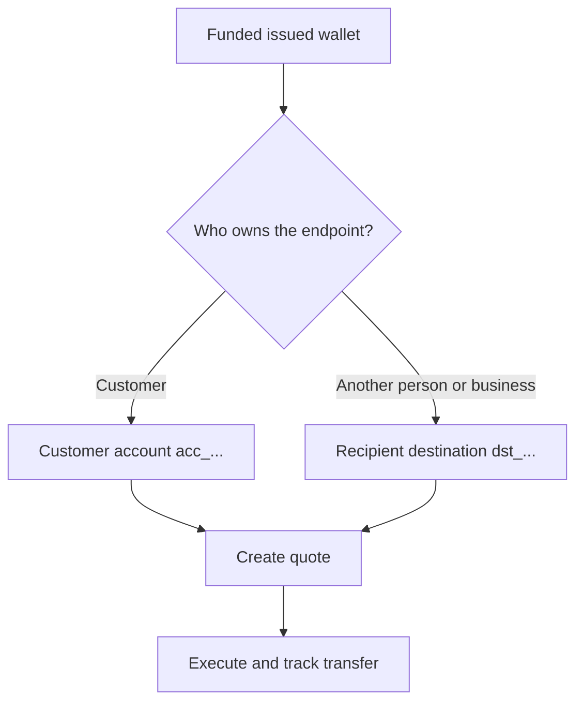

每次出金都从一个已就绪且有资金的发行钱包开始。目的地模型取决于该端点属于谁。



## 开始之前

请重新拉取来源钱包。确认其当前状态允许出金,并且可用余额足以支付预期的来源金额。将其响应中的 ID 保存为 `SOURCE_WALLET_ID`。

您还需要一个针对当前客户与所选目的地的已就绪出金能力。

## 1. 准备目的地

<Tabs>
  <Tab title="第一方">

当端点属于客户本人时,请使用客户名下的外部银行账户。使用 [`POST /v3/customers/{customerId}/accounts`](/api-reference/accounts/post-v3-customers-by-customer-id-accounts) 创建,并使用以下请求头:

```http
X-API-Key: ${SWIPELUX_API_KEY}
Idempotency-Key: payout-account-001
Content-Type: application/json
```

```json
{
  "origin": "external",
  "type": "bank",
  "methods": ["ach", "wire"],
  "country": "US",
  "currency": "USD",
  "details": {
    "routingNumber": "021000021",
    "accountNumber": "123456789",
    "accountType": "checking",
    "bankName": "Example Bank",
    "accountHolderName": "Acme Payments SAS"
  },
  "label": "Customer operating account"
}
```

使用 [`GET /v3/customers/{customerId}/accounts/{accountId}`](/api-reference/accounts/get-v3-customers-by-customer-id-accounts-by-account-id) 读取该账户。仅当其当前状态允许出金时才继续。将其 `acc_` 开头的 ID 保存为 `PAYOUT_DESTINATION_ID`。

  </Tab>
  <Tab title="第三方">

通过[收款方与目的地](/cn/integration/recipients)创建对应的个人或企业以及其银行或钱包端点。仅当目的地已就绪时才继续。

将返回的 `dst_` 开头的 ID 保存为 `PAYOUT_DESTINATION_ID`。切勿将收款方的 `rcp_` 开头 ID 用作报价目的地。

  </Tab>
</Tabs>

## 2. 创建出金报价

使用 [`POST /v3/quotes`](/api-reference/money-movement/post-v3-quotes) 并使用以下请求头:

```http
X-API-Key: ${SWIPELUX_API_KEY}
Idempotency-Key: payout-quote-001
Content-Type: application/json
```

```json
{
  "customerId": "${CUSTOMER_ID}",
  "capabilityId": "${CAPABILITY_ID}",
  "in": {
    "amount": "150.00",
    "currency": "USDC",
    "accountId": "${SOURCE_WALLET_ID}"
  },
  "destinationId": "${PAYOUT_DESTINATION_ID}",
  "out": {
    "currency": "USD"
  }
}
```

将 `data.id` 保存为 `QUOTE_ID`,并展示返回的价格与费用。

## 3. 执行出金

使用 [`POST /v3/transfers`](/api-reference/money-movement/post-v3-transfers) 创建转账。请为这次预期的执行使用一个新的幂等键:

```http
X-API-Key: ${SWIPELUX_API_KEY}
Idempotency-Key: payout-transfer-001
Content-Type: application/json
```

```json
{
  "quoteId": "${QUOTE_ID}"
}
```

将转账的 `data.id` 保存为 `TRANSFER_ID`。创建成功意味着出金已启动,但并不代表已完成交付。

## 4. 跟踪交付

在创建之后以及每次事件之后,读取 [`GET /v3/transfers/{transferId}`](/api-reference/money-movement/get-v3-transfers-by-transfer-id)。请依据最新的 `data.state`、`data.stateDetail` 和 `data.openTaskIds` 来判断是继续等待、采取行动,还是展示一个终态结果。

接下来,请查阅[报价与转账](/cn/integration/quotes-and-transfers)以了解准确金额、安全的执行重试恢复,以及转账任务的处理。
