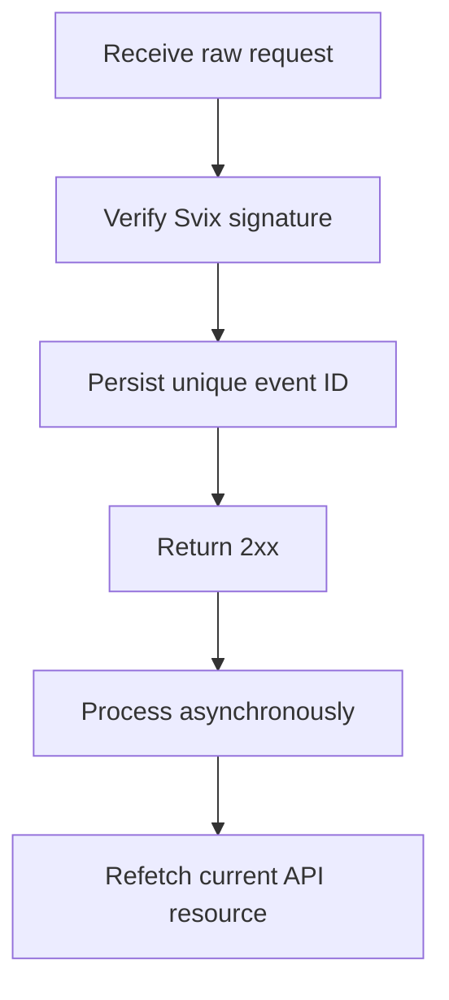

使用 Webhook 来响应异步的变更。投递采用至少一次(at-least-once)语义,因此重复、延迟以及乱序的事件都是正常现象。



## 只订阅您需要的事件

使用 [`POST /v3/webhooks`](/api-reference/webhooks/post-v3-webhooks) 创建一个端点。仅订阅您集成中真正需要处理的、有文档记录的事件。以下示例订阅 [`transfer.state_changed`](/api-reference/webhooks/transfer-state-changed)。

```bash
export API_BASE='https://platform.swipelux.com'
export SWIPELUX_API_KEY='replace-with-your-api-key'

curl --request POST \
  "${API_BASE}/v3/webhooks" \
  --header "X-API-Key: ${SWIPELUX_API_KEY}" \
  --header "Idempotency-Key: webhook-endpoint-001" \
  --header "Content-Type: application/json" \
  --data @- <<'JSON'
{
  "url": "https://example.com/webhooks/swipelux",
  "events": ["transfer.state_changed"]
}
JSON
```

将响应的 `data.id` 保存为 `WEBHOOK_ID`。打开 [`GET /v3/webhooks/portal`](/api-reference/webhooks/get-v3-webhooks-portal) 返回的管理入口,获取该端点的签名密钥,并将其与 API 密钥分开存放在密钥管理系统中。

## 在解析前先校验

Swipelux 通过 Svix 投递新的 Webhook 集成。请使用您的端点签名密钥与以下请求头,对原始请求体进行校验:

- `svix-id`
- `svix-timestamp`
- `svix-signature`

在校验通过之前,请勿解析 JSON,也不要产生任何副作用。

```javascript
import { Webhook } from "svix";

const verifier = new Webhook(process.env.SWIPELUX_WEBHOOK_SECRET);

export async function handleSwipeluxWebhook(request) {
  const rawBody = await request.text();
  const event = verifier.verify(rawBody, {
    "svix-id": request.headers.get("svix-id"),
    "svix-timestamp": request.headers.get("svix-timestamp"),
    "svix-signature": request.headers.get("svix-signature"),
  });

  await webhookInbox.insertIfAbsent({
    id: event.id,
    payload: event,
    status: "pending",
  });

  return new Response(null, { status: 204 });
}
```

对缺少或非法签名的请求请直接拒绝。在校验完成之前,请始终保留原始请求体。

## 先持久化,再确认,最后处理

请在信封的 `id` 上加上唯一性约束。先持久化经过验证的信封,及时返回 `2xx`,然后再异步处理。

如果事件 ID 已经存在,请仅确认投递,不要重复执行已经完成的副作用。通过您自己的重试队列继续处理挂起或失败的本地任务。切勿将信封的 `attempt` 字段用作去重键或传输层的重试计数器。

## 重新获取当前状态

Webhook 的顺序并不是资源历史的权威依据。请使用 `resource.type` 和 `resource.id` 定位对象,并在更新您的系统之前先获取其当前状态。

对于转账事件,请调用 [`GET /v3/transfers/{transferId}`](/api-reference/money-movement/get-v3-transfers-by-transfer-id):

```bash
curl --request GET \
  "${API_BASE}/v3/transfers/${TRANSFER_ID}" \
  --header "X-API-Key: ${SWIPELUX_API_KEY}"
```

请根据当前的 API 响应驱动面向客户的状态和下游动作。请把副作用设计成:即便两个 worker 以不同顺序处理相关事件也保持安全。

## 恢复投递

使用 [`GET /v3/webhooks/portal`](/api-reference/webhooks/get-v3-webhooks-portal) 打开投递日志、重试失败的投递,或者启动一次人工重放。

每次重放都必须经过同样的签名校验和持久化的收件箱。当服务中断后,请重放受影响的时间窗口,并重新获取每个引用的资源。已完成的事件 ID 仍然视为无操作;未完成的记录会异步继续处理。

接下来,请在沙盒中验证重复与乱序投递,然后完成[上线](/cn/integration/go-live)清单。
