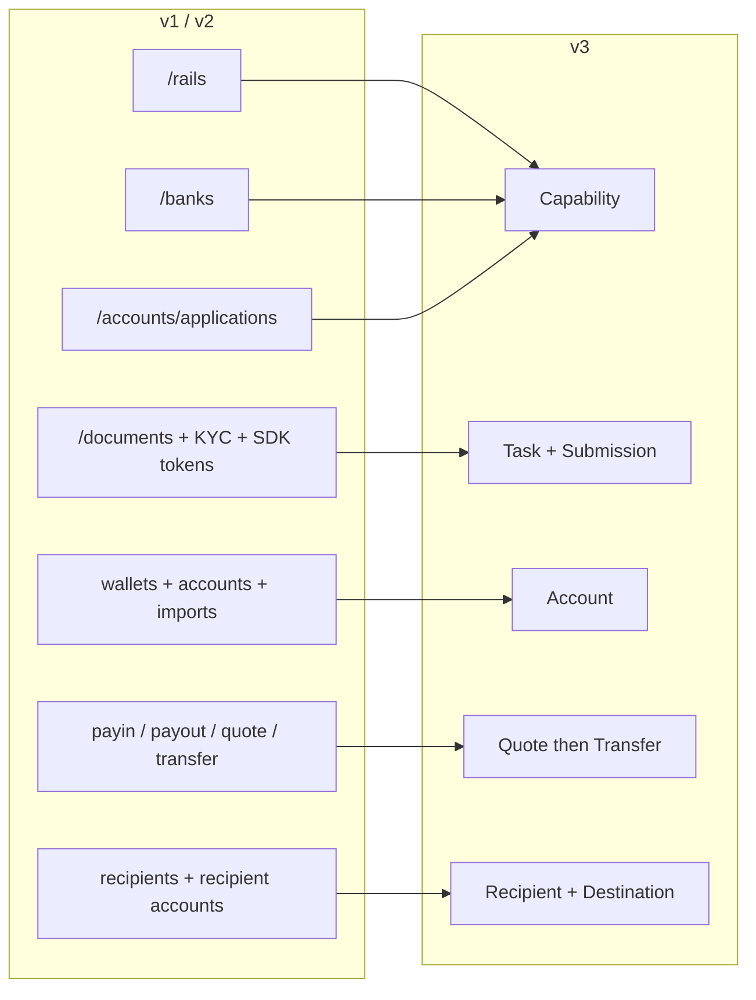
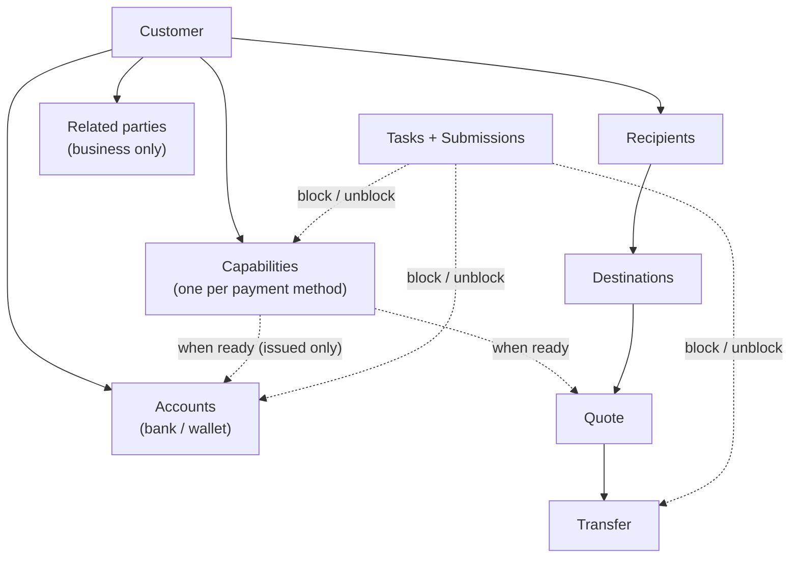
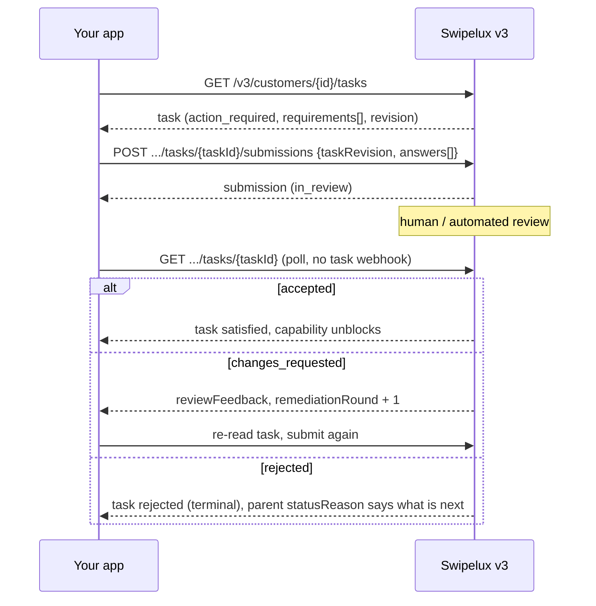
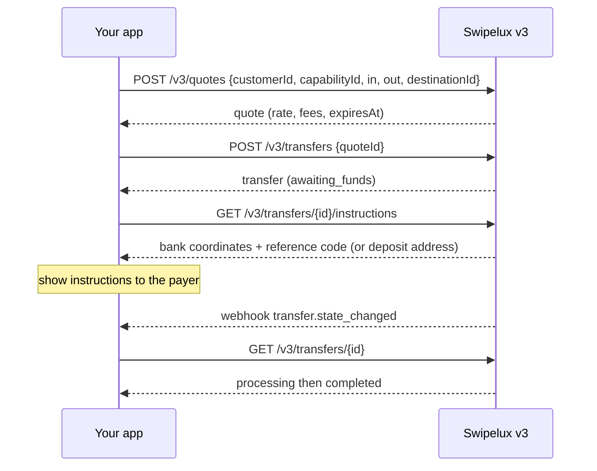
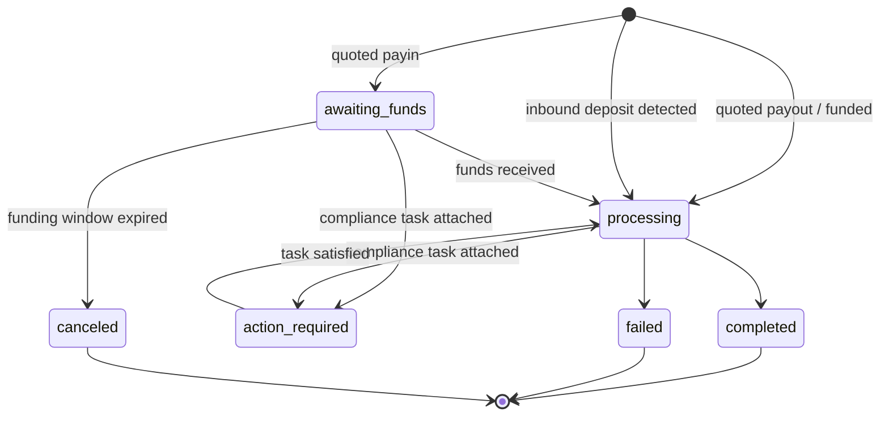
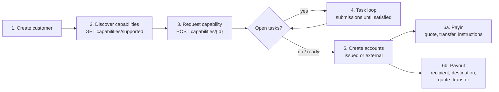

Migrujte svou integraci z API v1 a v2 na v3 ve dvou fázích:

- **Část 1, koncept.** Přečtěte si nejprve. v3 je přepracování, nikoli přejmenování: pokud budete staré endpointy mapovat jeden ku jednomu, budete s API bojovat. Deset minut zde vám ušetří dny později.
- **Část 2, API.** Mapování endpoint po endpointu, ukázky požadavků, stavové automaty a kontrolní seznam migrace.

Založeno na produkční OpenAPI specifikaci ([platform.swipelux.com/openapi.json](https://platform.swipelux.com/openapi.json)). v1 a v2 zůstávají v provozu a zatím nejsou zastaralé; všechny nové funkce capability, recipient, task a quoting jsou dodávány pouze ve v3. Přihlaste se k odběru webhook události `api.deprecation` pro oznámení o ukončení podpory.

<Info>
  **Obsah.** Část 1: 1.1 proč existuje v3, 1.2 objektový model, 1.3 připravenost per capability, 1.4 task smyčka, 1.5 pohyb peněz, 1.6 stavové automaty, 1.7 konvence, 1.8 zlatá cesta. Část 2: 2.1 customers, 2.2 capabilities, 2.3 tasks a submissions, 2.4 accounts, 2.5 recipients a destinations, 2.6 quotes a transfers, 2.7 webhooks, 2.8 sandbox, 2.9 legacy endpointy, 2.10 pořadí migrace, 2.11 checklist záludností.
</Info>

---

## Část 1, koncept

### 1.1 Proč existuje v3

v1 a v2 vyvinuly čtyři překrývající se způsoby, jak připravit customera na platby: `/rails`, `/banks`, `/accounts/applications` a rozhraní business `rail-applications`, každé s vlastní stavovou terminologií. Sběr dokumentů (`/documents`, KYC importy, tokeny verifikačního SDK) byl odpojen od toho, co ve skutečnosti odblokovával. v3 to vše sbaluje do šesti zdrojů, tedy customera plus pěti věcí, které vlastní:



| Zdroj | Jednořádková definice |
| --- | --- |
| **Customer** | Osoba nebo podnik. **Nemá žádné veřejné pole status**, připravenost je na capabilities. |
| **Capability** | Jedna platební metoda, kterou customer může používat (`sepa`, `ach`, `swift`, `stablecoin_transfers` atd.), s vlastním stavem. Nahrazuje `/rails`, `/banks` a vstupní body pro account-application. |
| **Task** | Jednotka práce, kterou Swipelux potřebuje (data, dokumenty, verifikace), zodpovězená pomocí **Submission**. Nahrazuje document a KYC rozhraní. |
| **Account** | Funding endpoint, který customer vlastní: `bank` nebo `wallet`, `issued` Swipeluxem nebo `external`. |
| **Recipient / Destination** | Příjemce payoutu (kdo) a jeho bankovní nebo wallet endpoint (kam). |
| **Quote / Transfer** | Veškerý pohyb peněz. Transfer provede uložený quote; ne-quoted transfery jsou pryč. |

### 1.2 Objektový model



Dvě strukturální pravidla, která je třeba si zvnitřnit:

1. **Capabilities řídí vše.** Accounts se poskytují pod `ready` capability; quotes se cení proti capability. Onboarding se rovná získání capabilities, které potřebujete, do stavu `ready`.
2. **Tasks se připojují kdekoli.** Capability, account nebo probíhající transfer mohou nést `openTaskIds`. Kdekoli je uvidíte, smyčka je stejná: přečíst task, odeslat odpovědi, počkat na kontrolu, znovu přečíst rodiče.

### 1.3 Připravenost je per capability, ne per customer

v1 zapletla připravenost `/rails` s KYC branou napříč celým customerem. Ve v3 neexistuje stav customera: customer může být plně použitelný na `stablecoin_transfers`, zatímco jeho capability `sepa` má stále otevřené tasks. Capabilities typu pooled-account se obecně dostávají do stavu `ready` rychleji než named, začněte tedy transakce provádět na tom, co je `ready`, místo abyste čekali na vše.

Pokud váš kód v1 nebo v2 řídí UI odznaky podle stavu verifikace customera, přepište jej:

- „Mohou obchodovat na X?" se stává capability X `status == "ready"`.
- „Musí něco udělat?" se stává jakýkoli task se stavem `action_required` (capability typicky ukazuje `restricted` s `statusReason.resolution: "complete_tasks"`).
- „Čekáme na Swipelux?" se stává tasks `in_review`, capability `pending`.

### 1.4 Task smyčka

Vše, co dělalo staré document a KYC rozhraní, je nyní tato jediná smyčka:



Klíčové vlastnosti:

- Task nese `requirements[]`, jednotlivé požadavky. Každý má `requirementId` v rámci tasku, stabilní `key` pojmenovávající požadavek (například doklad o adrese, deduplikujte podle něj své UI) a typované `request` popisující přesně, jaký vstup se očekává (text, date, select, document, attestation atd.).
- Odesílání je **řízené kontrolou**: nikdy přímo nemění stav capability ani accountu, to dělá až akceptace. Jedna výjimka: odpovědi typu `profile` se při odeslání propisují do profilu customera (2.3). Po odeslání polluj task nebo rodičovský zdroj.
- `taskRevision` (ozvěna hodnoty `revision` u tasku) je ochrana konkurence: pokud se task od doby, co jste jej četli, změnil, přečtěte jej znovu a znovu sestavte své odpovědi.
- `absence` je plnohodnotná odpověď („Toto nemám, protože…"), použijte ji místo ponechávání požadavků nevyřešených.

### 1.5 Pohyb peněz

Jeden tok pro payins, payouts a stablecoin pohyby. **Neexistuje vstup směru**, nikdy nedeklarujete payin vs payout. Tvar vstupní a výstupní měny odvozuje na quote a transfer read-only `direction`: `fiat_to_stablecoin` (payin), `stablecoin_to_fiat` (payout) nebo `stablecoin_move`.



### 1.6 Jeden stavový automat na zdroj

Každý zdroj se stavem má vlastní enum a každý ne-šťastný stav nese strukturovaný důvod. Accounts, applications a transfers sdílí tvar `{ code, message, actor, retryable }`: accounts a applications jej vystavují jako `statusReason`, transfers jako `stateDetail`. `actor` říká, kdo musí jednat (`customer`, `developer`, `provider`, `network`, `swipelux`), `retryable` říká, zda opakování může pomoci. Capabilities používají `{ code, resolution, message }`, kde `resolution` (`complete_tasks`, `wait`, `contact_support`, `none`) říká, co posouvá capability vpřed. Hodnoty `code` jsou otevřený, pouze rozšiřovaný katalog: větvte podle `resolution` (nebo `actor` plus `retryable`) a tolerujte kódy, které jste nikdy neviděli.

| Zdroj | Stavy |
| --- | --- |
| Capability | `pending`, `restricted`, `ready`, `rejected`, `canceled` |
| Application (pokus per požadavek pod capability, 2.2) | `requested`, `in_review`, `action_required`, `ready`, `rejected`, `disabled`, `canceled` |
| Task | `action_required`, `in_review`, `satisfied`, `rejected`, `canceled` |
| Submission | `in_review`, `accepted`, `changes_requested`, `rejected` |
| Account | `provisioning`, `in_review`, `ready`, `action_required`, `suspended`, `rejected`, `archived` |
| Quote | `active`, `executed`, `expired`, `failed` |
| Transfer | `awaiting_funds`, `processing`, `action_required`, `completed`, `failed`, `canceled` |
| Recipient | `active`, `rejected`, `archived` |
| Destination | `in_review`, `ready`, `action_required`, `archived` |

Stavy, kterými se tato příručka nezabývá (`rejected`, `suspended`, `disabled`, `failed`, `canceled`), jsou terminální nebo řízené podporou; definice per zdroj jsou ve specifikaci.

Transfer, podrobně:



### 1.7 Konvence

| Oblast | v1 / v2 | v3 |
| --- | --- | --- |
| Ověření | hlavička `X-API-Key` | Stejné. Prostředí (produkce vs sandbox) je vybráno klíčem; jedna base URL. |
| Idempotence | Nevynucená | Hlavička `Idempotency-Key` **povinná u každého požadavku s efektem** (POST, PATCH, PUT, DELETE), s výjimkou sandbox endpointů. Stejný klíč plus stejné body přehraje původní odpověď. |
| Peníze | Smíšená čísla a řetězce | Pouze řetězce (`"amount": "150.00"`). Nikdy floaty. |
| Stránkování | offset/limit varianty | Cursor: seznamy vracejí `{ data, nextCursor, hasMore }`. |
| Aktualizace | Převažuje PUT | `PATCH` částečné aktualizace. |
| Webhooks | Jediná konfigurace endpointu | Více endpointů, přihlášení per událost. Události jsou **náznaky**, pravdou je čtení (2.7). |

Pravidla idempotence, která si stojí za to zvnitřnit před psaním kódu:

- Použití klíče s **jiným** body je `409 idempotency_conflict`, dokud je klíč uchováván (nejméně 7 dní), takže nikdy neplánujte znovu použití klíče. Generujte čerstvý UUID na logickou operaci a uchovávejte jej se svou úlohou.
- Přehrání pokrývá i chyby: pokud původní požadavek skončil terminálním 4xx, stejný klíč plus body vrátí znovu stejnou problem odpověď.
- Dva souběžné požadavky se stejným klíčem: jeden vyhraje, druhý dostane `409`. Poražený zkuste znovu po tom, co se vítěz usadí; přehrání vrátí původní odpověď.

### 1.8 Zlatá cesta



---

## Část 2, API

### 2.1 Customers

| v1 / v2 | v3 |
| --- | --- |
| `POST /v1/customers`, `POST /v1/customers/business`, `POST /v2/customers` | `POST /v3/customers` (jeden endpoint, `type: individual \| business`) |
| `GET/PUT/DELETE /v1/customers/{id}`, `/v1/customers/business/{id}`, `/v2/customers/{customerId}` | `GET/PATCH/DELETE /v3/customers/{customerId}` |
| `GET /v1/customers` (seznam) | `GET /v3/customers` (cursor-paged, vkládá souhrny capabilities) |
| `GET /v1/customers/balances` (batch), `GET /v1/customers/{id}/balances` | Žádný endpoint pro balance, zůstatky žijí na accounts: čtěte `balances` na `GET /v3/customers/{customerId}/accounts` |
| `POST/GET .../shareholders` (v1 business) | `POST/GET /v3/customers/{customerId}/related-parties` (plus `GET/PATCH/DELETE .../related-parties/{relatedPartyId}`) |
| `POST /v1/customers/business/{id}/kyb` (submit), `GET .../kyb` (status) | Žádné volání KYB submit, požádejte o capability (2.2) a odpovídejte na její tasks (2.3); verdikt se projeví jako stav capability a tasku |
| `POST /v1/customers/{id}/kyc`, `.../kyc/import`, endpointy pro SDK tokeny | Systém tasků (2.3); hostovaná verifikace se objevuje jako `verificationSessions` uvnitř tasků |

Vytvoření, rozlišené podle `type` (ilustrativní hodnoty, názvy polí dle specifikace):

```jsonc
// POST /v3/customers        Idempotency-Key: <fresh uuid>
{
  "type": "individual",
  "externalId": "user-1042",
  "individual": {
    "firstName": "Maria",
    "lastName": "Silva",
    "birthDate": "1990-04-12",
    "nationalities": ["BR"],
    "residenceCountry": "BR",
    "email": "maria@example.com",
    "residentialAddress": {
      "streetLine1": "Av. Paulista 1000",
      "city": "Sao Paulo",
      "postalCode": "01310-100",
      "country": "BR"
    }
  },
  "financialProfile": {
    "accountPurposes": ["cross_border_remittance"],
    "sourcesOfFunds": ["salary"]
  }
}
```

- **Vytváření je progresivní**: samotné `{ "type": "individual" }` je platné vytvoření. Chybějící fakta customera nikdy neznehodnotí, později se objeví jako intake tasks na capabilities, které je potřebují.
- Podniky nesou `business` plus registrační data. CRUD nad shareholdery ve v1 se mapuje na **related parties**, rozšířeno tak, aby pokrývalo directors, officers a owners: vytvořte je inline při vytváření customera (každý dostane stabilní `rp_` id) nebo je spravujte přes dedikované related-parties endpointy.
- **Neexistuje pole `status` na customerovi**, viz 1.3.
- **Stávající customers přecházejí**: customers vytvoření na v1 nebo v2 jsou adresovatelní stejným id na v3 endpointech. v3 čtení je _sanitizovaný pohled_, legacy hodnoty, které selžou validací v3, přijdou nazpět chybějící. Po vašem **prvním v3 zápisu se ten pohled stane trvalým**: chybějící hodnoty se samy nevrátí. Proto obohaťte data brzy, naplánujte jednorázový průchod, který `PATCH`ne plný profil ze svých vlastních záznamů předtím, než se začnete spoléhat na v3 čtení. `metadata` z v1 je oddělený namespace a **není** přeneseno, znovu jej nastavte ve v3.
- `externalId` je prvotřídní pole a **unikátní napříč vašimi customers** na v3, per prostředí (`409 duplicate_external_id`). Archivace customera neuvolní jeho `externalId`, vymažte jej pomocí PATCH před DELETE, pokud jej hodláte znovu použít.
- `DELETE` je **archivační kaskáda** (žádné obnovení; id se nikdy nepoužijí znovu). Blokuje se s `409 customer_has_active_resources` plus `blockingResources[]`, dokud existuje jakýkoli nearchivovaný account nebo probíhající transfer.
- Pravidla slučování PATCH: explicitní `null` vymaže nullable pole, pole se nahrazují celá (kromě inline related parties, které se upsertují podle id), klíče `metadata` se slučují. Kompletní schémata a filtry seznamů jsou v OpenAPI specifikaci.

### 2.2 Z `/rails`, `/banks`, applications se stanou Capabilities

| v1 / v2 | v3 |
| --- | --- |
| `GET /v1/.../rails/capabilities` | `GET /v3/customers/{customerId}/capabilities/supported` |
| `GET /v2/.../banks` (plus `/banks/{bank}`), `GET /v2/meta/banks` | `GET /v3/customers/{customerId}/capabilities/supported` |
| `GET /v1/customers/{customerId}/rails` (seznam) | `GET /v3/customers/{customerId}/capabilities` |
| `GET /v2/customers/{customerId}/rails` (přehled) | `GET /v3/customers/{customerId}/capabilities` |
| `POST /v1/.../rails`, `POST /v2/.../banks` | `POST /v3/customers/{customerId}/capabilities/{capabilityId}` |
| `POST /v2/.../accounts/applications` | `POST /v3/customers/{customerId}/capabilities/{capabilityId}` |
| `GET /v1/.../rails/{rail}` | `GET /v3/.../capabilities/{capabilityId}` |
| `GET /v2/.../accounts/applications` (plus `/{applicationId}`, `/{applicationId}/history`) | `GET /v3/.../capabilities/{capabilityId}` (plus `/applications`, `/applications/{id}/history`) |
| Business-rail rozhraní: `GET/POST /v2/customers/business/{customerId}/rail-applications` (plus `/{rail}`) | Stejné v3 capability endpointy, žádné oddělené business rozhraní |
| Business-rail rozhraní: `GET .../business/{customerId}/rails` (plus `/{rail}`) | Stejné v3 capability endpointy, žádné oddělené business rozhraní |
| `GET /v1/meta/rails` (statický katalog) | `GET /v3/customers/{customerId}/capabilities/supported`, dostupnost je per customer; neexistuje statický katalog |
| `GET /v1/meta/accounts/banks` | `GET /v3/institutions` (adresář bank: id, name, BIC, countries) |
| Není k dispozici | `GET /v3/capabilities`, merchant-wide seznam udělených capabilities napříč customery (filtr podle `status`, `method`, `customerId`) |
| Není k dispozici | `GET /v3/.../capabilities/{capabilityId}/tasks-preview` (podívejte se na požadavky před podáním žádosti) |
| Není k dispozici | `POST /v3/.../capabilities/{capabilityId}/cancel` |

- Capability se rovná `method` (`ach`, `wire`, `rtp`, `pix`, `sepa`, `swift`, `spei`, `pse`, `transfers_3_0`, `faster_payments`, `sepa_instant`, `uaefts`, `card`, `stablecoin_transfers` atd.) plus `accountType` (`pooled` nebo `named`, `null` pro nebankovní metody) plus `directions` (`payin` nebo `payout`). Veřejné `capabilityId` je kvalifikovaná dvojice (`sepa_pooled`, `ach_named`) nebo prostá metoda pro `card` a `stablecoin_transfers`.
- Každý požadavek na capability zplodí **application**, záznam za pokus pod `.../capabilities/{capabilityId}/applications` (plus `/{applicationId}/history`), s vlastními stavy (1.6) a `statusReason`. Je to audit trail požadavku; každodenně polluj samotnou capability.
- `capabilities/supported` vrací dostupnost (`available`, `beta` nebo `disabled`), způsobilost a nabízené instituce. Výběr banky probíhá při žádosti prostřednictvím volitelného pole `institutions`, neexistuje samostatný zdroj `/banks`. Vynechání (nebo poslání `[]`) vybere všechny výchozí instituce; `isDefault: true` je příznak specifický pro customera a capability, nikoli globální. Neprázdný seznam přepíše výchozí a bankovní capability bez použitelné výchozí instituce vrátí `422 capability_institutions_required`. Id institucí jsou neprůhledná, tolerujte nová.
- `stablecoin_transfers` je **automaticky udělena při vytvoření customera** a rodí se `ready` (proto se o ni nikdy nežádá a nelze ji zrušit). `card` je jen pro individual.
- `openTaskIds` na capability je váš ukazatel „co dělat dál". Otevřený se rovná `action_required` **nebo** `in_review`, a souhrn zahrnuje sdílené tasky na úrovni customera dosažené přes aktivní závislosti.
- `cancel` funguje pouze z `pending` nebo `restricted` **a** bez blokujících zdrojů, jinak `409 capability_not_cancelable`, jehož problem body uvádí `blockingResources`. Nové vyžádání po zrušení je čerstvé vytvoření s novým idempotency klíčem.
- **Polluj GET.** Stav capability se obnovuje při čtení; polluj `GET .../capabilities/{capabilityId}` nebo se přihlaste k odběru `capability.status_changed`, neukládejte do cache.
- Vyžádání jedné metody může naráz zpřístupnit související metody, ke capabilities přistupujte jako k množině, kterou znovu čtete, nikoli k jednomu řádku, který sledujete.
- Použijte `tasks-preview`, abyste ukázali onboarding požadavky **před** podáním žádosti.
- Verifikace není jednorázová: nové tasky se mohou objevit na už `ready` capability (periodická nebo událostmi řízená reverifikace). Držte task smyčku zapojenou po celou dobu života customera, ne jen během onboardingu.

### 2.3 Z Documents a KYC se stanou Tasks a Submissions

<Note>
  **Poznámka k pojmenování.** Tyto endpointy krátce vycházely jako `requirements` a `fulfillments`. Od 2026-08-02 jsou veřejné názvy **tasks** a **submissions**. Přejmenování se týkalo pouze zdrojů a cest endpointů, pole `requirements[]` uvnitř tasku a jeho `requirementId` si tyto názvy ponechávají.
</Note>

Každé legacy document rozhraní se mapuje na tutéž náhradu: čtěte `GET /v3/customers/{customerId}/tasks`, odpovídejte pomocí `POST .../tasks/{taskId}/submissions`.

| v1 / v2 | v3 |
| --- | --- |
| `POST/GET/DELETE /v1/documents` | `GET /v3/.../tasks` plus `POST .../tasks/{taskId}/submissions` |
| `POST /v1/customers/{id}/documents` | `GET /v3/.../tasks` plus `POST .../tasks/{taskId}/submissions` |
| `GET/POST /v1/customers/business/{id}/documents` (plus `PUT/DELETE .../{docId}`) | `GET /v3/.../tasks` plus `POST .../tasks/{taskId}/submissions` |
| `GET/POST .../shareholders/{shareholderId}/documents` (plus `GET/PUT/DELETE .../{docId}`) | `GET /v3/.../tasks` plus `POST .../tasks/{taskId}/submissions` |
| `GET/POST/DELETE /v2/.../documents` (plus `/{documentId}`) | `GET /v3/.../tasks` plus `POST .../tasks/{taskId}/submissions` |
| `POST /v2/.../documents/upload-token` plus `POST /v2/documents/direct-upload` | Zrušeno, nahrávejte přímo se svým API klíčem (níže) |
| `POST /v1/customers/documents/upload`, `POST /v1/document` (legacy intakes) | Zrušeno, nahrávejte přímo se svým API klíčem (níže) |
| `POST /v1/customers/{id}/kyc` plus SDK tokeny | Task `verificationSessions` (hostovaná verifikace); žádné přímé volání „spustit KYC" |

Kolem té smyčky:

- **Úložiště surových souborů**: `POST/GET/DELETE /v3/customers/{customerId}/documents` (plus `/{documentId}`), nahrajte jednou se svým API klíčem, poté odkazujte na document ids v odpovědích submission. Toto nahrazuje každý upload-token a direct-upload intake.
- **Zcela nová čtení**: `GET /v3/tasks` (merchant-wide schránka), `GET /v3/transfers/{transferId}/tasks`, `GET .../tasks/{taskId}/history`, `GET .../tasks/{taskId}/submissions` (plus `/{submissionId}`).

Submission (ilustrativní):

```jsonc
// POST /v3/customers/{cus}/tasks/{task}/submissions   Idempotency-Key: <fresh uuid>
{
  "taskRevision": 3,
  "answers": [
    { "requirementId": "req_a1", "answer": { "type": "document", "documentIds": ["doc_passport1"] } },
    { "requirementId": "req_b2", "answer": { "type": "text", "value": "Import/export business" } },
    { "requirementId": "req_c3", "answer": { "type": "absence", "reason": "not_applicable" } }
  ]
}
```

- Typy odpovědí: `profile`, `text`, `date`, `single_select`, `multi_select`, `boolean`, `attestation`, `document`, `resource_reference`, `absence`. Objekt `request` každého požadavku vám řekne, jaký typ očekává.
- Submission musí odpovědět **na každý akční požadavek v aktuálním kole**, s přesnou hodnotou `taskRevision`, kterou jste přečetli. Částečná submissiona jsou odmítána.
- Odpovědi typu `profile` **propisují**: aktualizují profil customera přes běžnou validační cestu a okamžitě přehodnotí každou capability odkazující na stejnou intake práci. Sourozenecké intake tasky, jejichž požadavky jsou všechny splněny, se automaticky uzavírají.
- Požadavky mohou tvořit alternativní skupiny (`alternativeKey`): odešlete přesně jeden ze skupiny.
- `changes_requested` inkrementuje `remediationRound` a nese `reviewFeedback`. Přečtěte task znovu, znovu odešlete **s čerstvým idempotency klíčem**.
- URL hostované verifikace se objevují **jen** v detailu tasku scoped na customera (`GET /v3/customers/{customerId}/tasks/{taskId}`) a jen dokud je session akční; seznamy a `GET /v3/tasks/{taskId}` jsou záměrně bez URL.
- Podmínky služby jsou také task: `openTaskIds` může obsahovat task s `category: "terms_of_service"`, jehož hostovaná stránka akceptace je odkazována stejně (jen v detailu scoped na customera). Obecná submissiona nemohou akceptovat podmínky a schválení KYC nikdy neimplikuje akceptaci podmínek.
- Tasks jsou scoped per capability, takže „stejný" požadavek (například doklad o adrese) se může objevit jednou per capability. Deduplikujte ve svém UI podle `key` požadavku.
- **Žádná vrstva překladu**: postování na `/v1/documents` neodblokuje v3 capabilities. Jakmile je customer na v3, veškeré požadavky žeňte přes tasky.

### 2.4 Accounts a wallets

| v1 / v2 | v3 |
| --- | --- |
| `POST/GET /v1/.../accounts` (plus `/import`), `/v2/.../accounts` (plus `/import`) | `POST/GET /v3/customers/{customerId}/accounts` |
| `POST/GET /v1/.../wallets` (plus `/import`) | Stejný endpoint, `type: wallet` |
| `GET/DELETE /v1/customers/{customerId}/accounts/{accountId}` (a varianta wallets), `GET /v2/.../accounts/{accountId}` | `GET/PATCH/DELETE /v3/.../accounts/{accountId}` |
| `PATCH /v2/.../accounts/{accountId}/fees` | `GET/PUT /v3/.../accounts/{accountId}/fees` |

Vytvoření, rozlišené podle `origin` plus `type`. Issued bankovní účty berou jednu `method`; external bankovní účty berou místo toho pole `methods` (odeslání `method` je tam odmítnuto):

```jsonc
// issued bank account (capability must be ready)
{ "origin": "issued", "type": "bank", "method": "sepa",
  "currency": "EUR", "settlement": { "accountId": "acc_wallet1" } }

// external wallet the customer already owns (replaces /import)
{ "origin": "external", "type": "wallet", "currency": "USDC",
  "network": "polygon", "details": { "address": "0x71C7656EC7ab88b098defB751B7401B5f6d8976F" } }
```

- `country` u issued bankovních účtů je volitelné (výchozí per metoda); u external **bankovních** účtů jej uveďte explicitně. Wallet účty nemají zemi vůbec.
- `settlement.accountId` je povinné u issued bankovních účtů: pojmenovává issued wallet účet, který přijímá vypořádané prostředky z vkladů na bankovní účet.
- Issued účty vystavují `details` (IBAN nebo routing plus account nebo address), verzované `routing` (souřadnice pro vklad se mohou rotovat, vždy vykreslete nejnovější čtení), `fees`, `balances`.
- Sítě: `polygon`, `ethereum`, `base`, `arbitrum`, `optimism`, `bsc`, `avalanche`.
- Brána capability platí jen pro **issued** účty: vytvořit jeden proti neready capability selže s chybou kódovanou capability, nejprve požádejte o capability (2.2). External účty capability nepotřebují (a ani schválení customera); dostanou jen validaci request-schema a bankovních detailů.
- Issued bankovní účty se rodí `provisioning` s `details: null`. Polluj účet nebo sleduj `account.status_changed`, dokud nebude `ready`.
- `DELETE` archivuje, nikdy nemaže natvrdo. Účty odkazované probíhajícími transfery vrátí `409 account_has_active_transfers`. Opakujte po tom, co ty transfery dosáhnou terminálního stavu.
- Zcela nové ve v3: **Rules**, trvalé pokyny na issued wallet účtu (`POST/GET /v3/customers/{customerId}/rules`, `GET/PATCH/DELETE .../rules/{ruleId}`), které automaticky přesouvají příchozí prostředky na jiný účet nebo wallet destination. Bez ekvivalentu ve v1 nebo v2.

### 2.5 Recipients a destinations

| v1 | v3 |
| --- | --- |
| `POST/GET /v1/.../recipients` | `POST/GET /v3/customers/{customerId}/recipients` |
| Není k dispozici (v1 recipients měli jen create a list) | `GET/PATCH/DELETE /v3/.../recipients/{recipientId}`, zcela nový detail, update, archive |
| `POST/GET .../recipients/{recipientId}/accounts` | `POST/GET /v3/.../recipients/{recipientId}/destinations` |
| `GET/DELETE .../recipients/{recipientId}/accounts/{recipientAccountId}` | `GET/DELETE /v3/.../recipients/{recipientId}/destinations/{destinationId}` (žádný PATCH destination, archivujte a znovu vytvořte) |

v2 neměla koncept recipient. Pokud jste na v2 a vyplácíte třetím stranám, je to nové rozhraní, nikoli přejmenování.

- **Recipient** se rovná kdo: `individual` (křestní a příjmení) nebo `business` (název společnosti), s povinným `relationship` (`employee`, `contractor`, `vendor`, `subsidiary`, `merchant`, `customer`, `landlord`, `family`, `other`). Recipients a destinations jsou jen pro třetí strany. First-party payout recipienta vůbec nepoužívá: cíluj jeden z customerových vlastních `acc_` účtů jako `destinationId` u quote (2.6).
- **Destination** se rovná kam: typované per metoda, `sepa` (iban, bic volitelně), `ach` nebo `wire` (routing plus account), `swift` (plné souřadnice plus volitelně intermediary), `spei` (clabe), `pse`, `transfers_3_0` (cbu) atd., plus wallet destinations. Každá destination má vlastní stav. Sledujte `destination.status_changed`.
- Fiat destinations vyžadují úplnou `address` recipienta (street, city, postal code, country) **před** vytvořením. Chybějící části selžou s `422 recipient_address_required`. Wallet destinations vynechávají adresu, ale vyžadují top-level `ownership` (`self_custodied` nebo `custodial` se jménem custodiana).
- Přesnost jména beneficienta má význam: přijímající banky porovnávají **právní** jméno účtu. Posílejte přesné právní jméno a příjmení nebo název společnosti, nikoli zobrazovací přezdívku.
- Schémata polí destination per metoda jsou v OpenAPI specifikaci.

### 2.6 Quotes a transfers

| v1 / v2 | v3 |
| --- | --- |
| `POST /v1/payin/quote`, `/v1/payout/quote`, `/v2/quote` | `POST /v3/quotes` |
| `POST /v1/payin`, `/v1/payout`, `POST /v1/transfers`, `/v2/transfer` | `POST /v3/transfers` (provede quote, unquoted vytvoření jsou pryč) |
| `GET /v1/transfers` (seznam), `GET /v1/transfers/{id}` | `GET /v3/transfers`, `/v3/transfers/{transferId}` |
| Není k dispozici (v1 a v2 quotes neměly čtení) | `GET /v3/quotes/{quoteId}` |
| `GET /v1/rate/{base}/{quote}` | `GET /v3/rates` |
| (implicitní v odpovědi payin) | `GET /v3/transfers/{transferId}/instructions` |
| Není k dispozici | `POST /v3/transfers/{transferId}/cancel`, `GET /v3/transfers/{transferId}/tasks` |

```jsonc
// 1. Quote: amount on exactly one side picks mode (exact_in / exact_out).
// POST /v3/quotes            Idempotency-Key: <fresh uuid>
{
  "customerId": "cus_123",
  "capabilityId": "sepa_named",
  "in":  { "currency": "EUR", "amount": "150.00" },
  "out": { "currency": "USDC" },
  "destinationId": "acc_wallet1",   // fiat-funded: must be a customer-owned acc_ account
  "fees": { "breakdown": { "developer": { "fixed": "1.00", "bips": 50 } } }
}
// -> { mode: "exact_in", direction: "fiat_to_stablecoin", rate, fees[], expiresAt, ... }

// 2. Execute before expiresAt.
// POST /v3/transfers         Idempotency-Key: <fresh uuid>
{ "quoteId": "quo_789", "externalId": "order-991", "memo": "invoice 44" }
```

- `destinationId` bere `acc_` (customer-owned account) nebo `dst_` (recipient destination) id. **Fiat-funded quotes (payins) musí cílit `acc_` účet**, `dst_` cíl vždy znamená payout (jinak `422 quote_direction_invalid`).
- `externalId` na quotes a transfers je neunikátní korelační reference (vrácená při čtení, filtrovatelná v seznamech). Pravidlo unikátnosti per prostředí (2.1) platí jen pro customer `externalId`.
- Quote proveďte přesně jednou, před `expiresAt`. Vypršelý quote selže s `409 quote_expired`, druhé provedení s `409 quote_already_executed` (problem nese stávající `transferId`).
- Zrušení transferu zatím není podporováno: `POST .../cancel` vrací `409 transfer_not_cancelable` v každém stavu. Dnešní `canceled` transfery přicházejí z vypršení funding okna u nefinancovaného payin, ne z tohoto endpointu.
- Payins začínají `awaiting_funds`: vykreslete `GET .../instructions` plátci, souřadnice banky plus **referenční nebo memo kód** pro fiat, deposit adresa pro krypto. Referenční kód je způsob, jak se vklad páruje. Vždy jej zobrazte.
- `state` plus `stateDetail` pro strojově čitelné podstavy; `action_required` znamená, že je připojen compliance task (`openTaskIds`, `GET .../tasks`), odpovídejte přes submissions.
- Příchozí vklady detekované na issued účtech se objevují jako transfery s `origin: "inbound_deposit"` (oproti `"quoted"`).
- Reference platebních sítí jsou konsolidované pod `references`: `transactionHash`, `traceNumber`, `imad`, `uetr`, `explorerUrl`, `returnedTransferId`.

Překlad stavů v1:

| Koncept v1 | v3 |
| --- | --- |
| oddělené payin a payout objekty | jeden transfer s `direction` |
| vrácení nebo zrušení na straně poskytovatele (sloučeno do `failed`) | stále `failed`, nyní se strojově čitelným `stateDetail` a `references.returnedTransferId`, když vrácení zplodilo zpětný transfer |

Dvě migrační varování:

- **Transfery nepřecházejí mezi verzemi.** Transfery vytvořené na v1 nebo v2 nejsou čitelné z v3. Seznam je vynechá a `GET /v3/transfers/{transferId}` vrátí 404. Přenechte nejprve _vytváření_, ponechte v1 čtecí cestu, dokud tyto transfery nedosáhnou terminálních stavů, a pak ji zahoďte.
- **Žádné swapy tokenů.** `stablecoin_move` vyžaduje stejnou měnu in a out: USDC na USDT selže s `422 recipient_destination_invalid` nesoucí chybu pole `currency_mismatch`. Stejná síť na obou stranách, žádný bridging, a wallet-to-wallet přesuny aktuálně podporují jen doručení bez poplatku: quote s nenulovým platform nebo developer fee selže s `422 amount_not_deliverable`.

### 2.7 Webhooks

| v1 | v3 |
| --- | --- |
| `GET/PATCH /v1/webhooks` (konfigurace jednoho endpointu) | `POST/GET /v3/webhooks`, `PATCH/DELETE /v3/webhooks/{webhookId}`, `GET /v3/webhooks/portal` |

Katalog událostí: `customer.created`, `customer.updated`, `customer.archived`, `capability.created`, `capability.status_changed`, `application.status_changed`, `recipient.status_changed`, `destination.status_changed`, `account.created`, `account.status_changed`, `account.details_changed`, `transfer.created`, `transfer.state_changed`, `api.deprecation`.

- `GET /v3/webhooks/portal` vrací URL hostovaného management portálu pro delivery logy, opakování a manuální přehrání.
- `transfer.created` se aktuálně doručuje s legacy tvarem payloadu z v1 (v3 obálka se aktivuje, až v1 webhooks skončí). Berte to čistě jako náznak a GET si transfer; nestavějte proti jeho body.
- Události jsou náznaky: po přijetí GETněte zdroj a jednejte podle čtení. Nikdy nestavějte stav podle payloadu události nebo pořadí. Doručení je at-least-once a může být opožděné nebo přeuspořádané. Deduplikujte podle event id a chybějící události zotavujte pomocí inkluzivního filtru `updatedAfter` každého seznamu.
- Přihlaste se k odběru `api.deprecation`, strojového kanálu pro ukončení podpory verzí.
- Dnes žádná událost `task.*`: po odeslání polluj task nebo jeho rodiče.

### 2.8 Sandbox

Stejná base URL; sandbox API klíč vybírá prostředí.

| v1 | v3 |
| --- | --- |
| `POST /v1/sandbox/topup` | `POST /v3/sandbox/accounts/{accountId}/topup` |
| `POST /v1/sandbox/payins/simulate`, `.../payouts/simulate`, `POST /v1/customers/{id}/simulate-transactions` | `POST /v3/sandbox/transfers/{transferId}/state` (proveďte skutečný transfer skrz stavy) |
| Není k dispozici | `POST /v3/sandbox/customers/{customerId}/verification` (dokončit verifikaci) |
| Není k dispozici | `POST /v3/sandbox/customers/{customerId}/capabilities/{capabilityId}/status` (vynutit stav capability) |
| Není k dispozici | `POST /v3/sandbox/tasks`, `POST /v3/sandbox/tasks/{taskId}/review` (vytvořit task, poté simulovat verdikt) |

v3 sandbox simuluje celou smyčku kontroly od začátku do konce: vytvořte task, odešlete proti němu, `review` jej na `accepted` nebo `rejected`, sledujte, jak se capability odblokuje. Nazkoušejte si UX pro nápravu před produkcí. Sandboxem vytvořené tasky i běžné intake tasky, které se objevují na vyžádaných capabilities, jsou tímto způsobem přezkoumatelné; stejně jako v produkci se nespouštějí žádné task webhooks, polluj (2.7).

### 2.9 Legacy endpointy bez náhrady ve v3

Tyto nemají v3 náhradu. Většina zůstává na v1 beze změny (ponechte svá stávající volání); dvě jsou zcela vyřazeny (viz Dispozice):

| Endpoint | Dispozice |
| --- | --- |
| `GET /v1/merchant-kyb/creation-gate`, `POST /v1/merchant-kyb/{customerId}/submit`, `POST /v1/merchant-kyb/parked-url`, `POST /v1/merchant-kyb/upload-token` | Váš vlastní merchant KYB onboarding (ne customer KYB), beze změny na v1 |
| `POST /v1/merchant-wallets/get-or-create` | Pomocník merchant treasury wallet, beze změny na v1 |
| `GET /v1/meta/accounts/relationships` | Vyřazeno, enum `relationship` recipienta je pevný a inline zdokumentovaný (2.5) |
| `GET /v1/meta/kyb/documents` | Vyřazeno, v3 tasks deklarují požadované dokumenty per případ přes `requirements[]` (2.3); neexistuje statický katalog |
| `GET /statecharts` (plus `/{machineId}`, `/{machineId}/svg`, `/explorer`, `/validate`) | Verzově neutrální veřejné referenční stránky stavových automatů, beze změny |

Každý další veřejný endpoint v1 nebo v2 se objevuje v mapovací tabulce výše.

### 2.10 Doporučené pořadí migrace

Každý krok jde nasadit nezávisle; v1 nebo v2 a v3 běží vedle sebe proti stejné customer bázi. Nazkoušejte každý krok proti svému sandbox klíči (2.8) předtím, než jej zopakujete v produkci.

<Steps>
  <Step title="Instalatérské práce">
    `Idempotency-Key` na všech požadavcích s efektem (POST, PATCH, PUT, DELETE; sandbox endpointy vyňaty); peníze jako řetězce; pomocníci pro cursor pagination.
  </Step>
  <Step title="Webhooks">
    Zaregistrujte v3 endpointy per událost, včetně `api.deprecation`. Konfigurace jednoho endpointu ve v1 je samostatné rozhraní, nechte ji být; oba běží vedle sebe až do vypuštění v kroku 9.
  </Step>
  <Step title="Obohacení profilu">
    `PATCH /v3/customers/{id}` s celým profilem, který máte (v1 sbírala méně, než v3 vystavuje) a znovu nastavte `metadata`. Udělejte z toho záměrně **první v3 zápis** per customer: naplní sanitizovaný pohled dřív, než se ten pohled stane trvalým (2.1).
  </Step>
  <Step title="Čtení">
    Nasměrujte čtení customer, capability a account na v3; přepište logiku stavu customera dle 1.3. Až po kroku 3 se neobohacená čtení vracejí s chybějícími legacy-invalidními poli.
  </Step>
  <Step title="Onboarding zápisy">
    Vytvářejte přes `POST /v3/customers`; požadujte capabilities místo `/rails`, `/banks` nebo applications; postavte task smyčku (největší zcela nová UI práce, `tasks-preview` pomáhá ukazovat požadavky předem). Od tohoto bodu přestaňte postovat `/v1/documents` u customerů řízených v3, neodblokují capabilities (2.3).
  </Step>
  <Step title="Accounts">
    Vydávejte přes v3; přesuňte importy na `origin: external`.
  </Step>
  <Step title="Payouts">
    Recipients plus destinations, poté quote a transfer.
  </Step>
  <Step title="Payins">
    Quote, transfer, instructions; nadále vykreslujte referenční kód.
  </Step>
  <Step title="Vypuštění">
    Transfery nepřecházejí mezi verzemi (2.6). Ponechte čtecí cestu v1 nebo v2 a v1 webhook endpoint pro transfery tam vytvořené, čtěte duálně, dokud nedosáhnou terminálních stavů, poté vyhoďte starého klienta a v1 webhook konfiguraci.
  </Step>
</Steps>

### 2.11 Checklist záludností

- [ ] Čerstvý UUID per **logická operace**, uchovávaný s vaší úlohou a použitý znovu při opakování; nikdy nepoužívejte klíč znovu se změněným body (`409 idempotency_conflict`). Sandbox endpointy jsou z hlavičky vyňaty.
- [ ] Obohaťte stávající customery (`PATCH` celý profil, znovu nastavte `metadata`, nepřenáší se) **před jakýmkoli dalším v3 zápisem**, první v3 zápis učiní sanitizovaný pohled trvalým.
- [ ] `externalId` je unikátní per prostředí a **archivací se neuvolní**, vymažte jej přes `PATCH` před `DELETE`, pokud jej plánujete znovu použít.
- [ ] Neexistuje pole `status` u customera, připravenost odvozujte per capability.
- [ ] `action_required` **i** `in_review` obojí znamenají otevřený task.
- [ ] Submissions jsou řízené kontrolou (odeslání není totéž co odblokování) a musí odpovědět na **každý** akční požadavek s přesným `taskRevision`. Při neshodě přečtěte znovu a přebudujte.
- [ ] Neexistuje webhook `task.*`, po každém odeslání polluj task (nebo jeho rodiče).
- [ ] Opakování při `changes_requested` se rovná přečtení tasku znovu, čerstvé odpovědi, **čerstvý idempotency klíč**.
- [ ] Postování na `/v1/documents` nikdy neodblokuje v3 capability, jakmile je customer na tascích, veďte všechny požadavky přes tasky.
- [ ] Nové tasky se mohou objevit na už `ready` capability, držte task smyčku zapojenou i po onboardingu, ne jen během něj.
- [ ] `cancel` capability funguje jen z `pending` nebo `restricted` bez blokujících zdrojů (`409 capability_not_cancelable`); nové vyžádání po zrušení je čerstvé vytvoření s čerstvým idempotency klíčem.
- [ ] Capability musí být `ready` předtím, než pod ní vydáváte účty nebo proti ní quotujete.
- [ ] Quote má částku přesně na jedné straně; žádné pole směru; proveďte přesně jednou před `expiresAt` (`409 quote_expired` nebo `409 quote_already_executed`).
- [ ] Stablecoin přesuny jsou pouze same-currency, same-network (USDC na USDT selže `422`); wallet-to-wallet podporuje jen doručení bez poplatku.
- [ ] `DELETE` archivuje, nikdy nemaže natvrdo. Smazání účtu je blokováno probíhajícími transfery (`409 account_has_active_transfers`); smazání customera navíc jakýmkoli nearchivovaným účtem (`409 customer_has_active_resources`, `blockingResources[]` je jmenuje).
- [ ] Transfery v1 nebo v2 jsou pro čtení z v3 neviditelné (seznam vynechá, GET 404), čtěte duálně, dokud se nevypustí, poté zahoďte staré cesty.
- [ ] Deposit `routing` a instrukce se mohou měnit, vždy vykreslete nejnovější GET a vždy zobrazte referenční kód.
- [ ] Webhooks jsou náznaky; GET je pravda, deduplikujte podle event id, chybějící události zotavte pomocí `updatedAfter`.

## Další krok

Začněte krokem 1 pořadí migrace (2.10), idempotency klíče, peníze jako řetězce, cursor pagination, a nazkoušejte každý krok proti svému sandbox klíči (2.8), než jej zopakujete v produkci.
