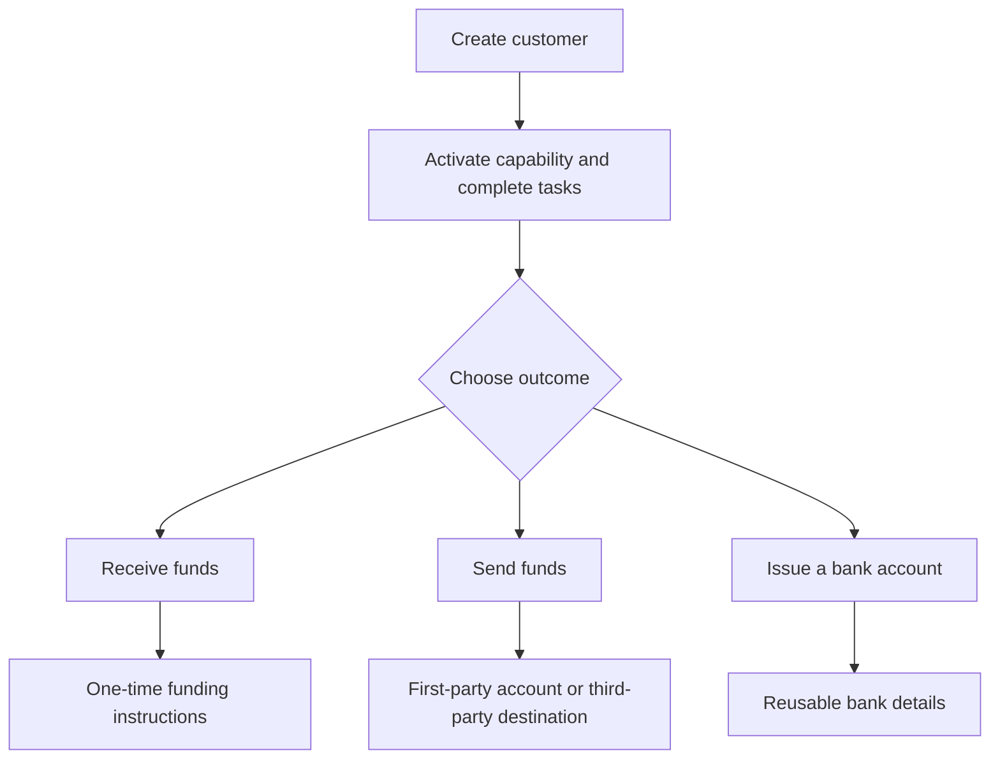

Vycházejte z výsledku zákazníka. Každý tok používá stejný model onboardingu, poté se větví do různých účtů a přesunů peněz.

## Porovnání toků

| Výsledek | Nejprve připravte | Co obdržíte |
| --- | --- | --- |
| Příchozí platba | Připravenou capability příchozí platby a vydanou cílovou peněženku | Pokyny specifické pro převod a vypořádání ve stablecoinu |
| Výplata | Připravenou capability výplaty, financovanou vydanou peněženku a připravený účet nebo cíl | Převod na vybraný koncový bod příjemce |
| Vydaný bankovní účet | Připravenou bankovní capability a vydanou vypořádací peněženku | Opakovaně použitelné bankovní údaje po provisioningu |

Odkvótovaná příchozí platba vytváří pokyny pro jeden převod. Vydaný bankovní účet vytváří opakovaně použitelné údaje pro pozdější vklady. Výplata začíná z prostředků již dostupných ve vydané peněžence.

## Vyberte svůj tok

<CardGroup cols={3}>
  <Card title="Přijímat prostředky" icon="arrow-down-to-line" href="/cs/integration/receive-funds">
    Vytvořte a sledujte příchozí platbu fiat na stablecoin.
  </Card>
  <Card title="Odesílat prostředky" icon="arrow-up-from-line" href="/cs/integration/send-funds">
    Sestavte výplatu první nebo třetí straně.
  </Card>
  <Card title="Vydat bankovní účet" icon="building-columns" href="/cs/integration/issue-bank-account">
    Poskytněte opakovaně použitelné bankovní údaje propojené s peněženkou.
  </Card>
</CardGroup>
