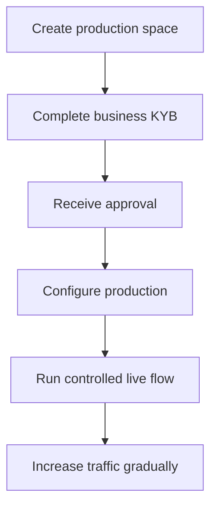

Produkční aktivace ověřuje vaši integrující firmu. Je oddělená od API zákazníků, které vytváříte pro svůj produkt.

## Aktivujte svůj produkční prostor

1. Přihlaste se do Swipelux Dashboardu a vyberte **Create a production space**.
2. Otevřete záložku KYB nebo přejděte na [Ověření firmy](https://www.swipelux.app/kyb).
3. Vyplňte každé vyžádané pole a nahrajte požadované dokumenty.
4. Odešlete svou integrující firmu k ověření a počkejte na schválení.

Až po schválení vaší integrující firmy a produkčního prostoru můžete vytvářet produkční API zákazníky a transakce.

## Udržujte produkci nezávislou

Produkční zdroje vytvářejte explicitně. Změna API klíče nemigruje stav ze sandboxu.

- Produkční přihlašovací údaje ukládejte do odděleného záznamu secret manageru.
- Používejte konfiguraci nasazení a ID zdrojů pouze pro produkci.
- Zaregistrujte samostatný produkční webhookový endpoint a podpisové tajemství.
- V produkci znovu vytvořte potřebné zákazníky, capabilities, účty, příjemce a cíle.
- Omezte produkční přístup na služby a operátory, kteří jej potřebují.

Sandbox a produkce používají `https://platform.swipelux.com`; prostředí vybírá API klíč.

## Dokončete kontrolní seznam pro spuštění

- [ ] Otestujte šťastnou cestu a očekávané chybové cesty v sandboxu.
- [ ] Odesílejte `Idempotency-Key` s každým zápisem, který jej vyžaduje, a uchovávejte jej pro bezpečné opakování.
- [ ] Ověřujte podpisy webhooků před parsováním, trvale ukládejte ID událostí a otestujte přehrání.
- [ ] Zpracovávejte nedostupné capabilities, otevřené úkoly a změněné revize úkolů.
- [ ] Zpracovávejte zdokumentované [API chyby a opakování](/cs/integration/errors), včetně idempotentních opakování s původním klíčem.
- [ ] Zveřejňujte svým operátorům selhání převodů a akční pokyny.
- [ ] Ověřte, že logy uchovávají `X-Request-Id` nebo `correlationId` bez vystavení tajemství či citlivých finančních dat.

## Spusťte jeden řízený živý tok

Začněte se známým zákazníkem a jednou transakcí s nízkou hodnotou. Zaznamenejte:

| Kontrola | Definujte před testem |
| --- | --- |
| Rozsah | Zákazník, capability, účet nebo cíl, částka a metoda. |
| Očekávaný výsledek | Stav v API, zůstatek nebo pokyny a webhookovou událost, kterou očekáváte pozorovat. |
| Vlastník | Osoba odpovědná za sledování celého toku. |
| Stop podmínka | Jakýkoli neočekávaný stav, chybějící webhook, nesprávná částka nebo nevyřešený úkol. |

Ověřte aktuální API zdroj i autentizované doručení webhooku. Pokud se cokoli liší od očekávaného výsledku, zastavte se a před odesláním dalšího provozu prošetřete.

Po úspěchu úplného toku postupně zvyšujte objem a monitorujte stavy capability, účtů, cílů a převodů.

Vraťte se k [Běžné toky](/cs/integration/common-flows) pro produktovou cestu, projděte [Chyby a opakování](/cs/integration/errors) pro zpracování selhání nebo použijte [API Reference](/cs/api-reference/introduction) pro přesné kontrakty.
