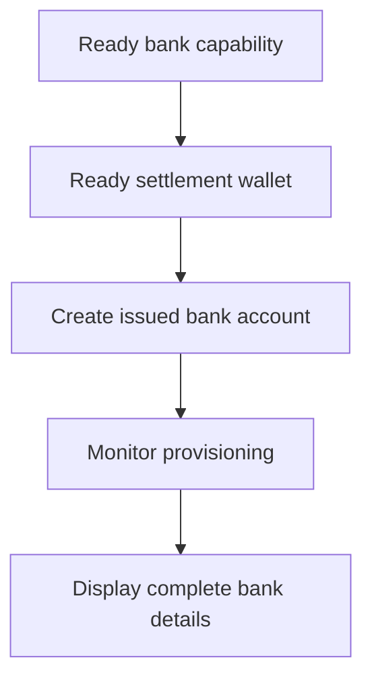

Vydaný bankovní účet použijte, když zákazník potřebuje opakovaně použitelné bankovní údaje. Pro jednorázové financovací pokyny vázané na konkrétní částku použijte místo toho [Přijímat prostředky](/cs/integration/receive-funds).



## Než začnete

Potřebujete ID zákazníka, připravenou bankovní capability pro zamýšlenou metodu a měnu a připravenou vydanou peněženku vlastněnou stejným zákazníkem. Otevřenou práci dokončete přes [Capabilities a úkoly](/cs/integration/onboarding/capabilities-and-requirements).

## 1. Vytvořte nebo vyberte vypořádací peněženku

Vytvořte vydanou peněženku podle [Účty a peněženky](/cs/integration/accounts#create-the-account), poté ji znovu přečtěte. Pokračujte jen tehdy, když její aktuální stav umožňuje vypořádání.

Uložte její `data.id` z odpovědi jako `SETTLEMENT_WALLET_ID`. Nepoužívejte externí peněženku pro `settlement.accountId`.

## 2. Vytvořte vydaný bankovní účet

Použijte [`POST /v3/customers/{customerId}/accounts`](/api-reference/accounts/post-v3-customers-by-customer-id-accounts) s těmito hlavičkami:

```http
X-API-Key: ${SWIPELUX_API_KEY}
Idempotency-Key: issued-bank-account-001
Content-Type: application/json
```

Odešlete toto tělo požadavku:

```json
{
  "origin": "issued",
  "type": "bank",
  "method": "ach",
  "country": "US",
  "currency": "USD",
  "settlement": {
    "accountId": "${SETTLEMENT_WALLET_ID}"
  },
  "label": "USD account"
}
```

Uložte vrácené `data.id` jako `BANK_ACCOUNT_ID`. Také uchovejte `data.status`, `data.openTaskIds`, `data.details` a vazbu na vypořádání.

ID bankovního účtu a ID peněženky mají různé role. Přes ID bankovního účtu čtěte provisioning a bankovní údaje. ID vypořádací peněženky používejte k identifikaci místa, kde jsou vklady připisovány.

## 3. Sledujte provisioning

Přečtěte [`GET /v3/customers/{customerId}/accounts/{accountId}`](/api-reference/accounts/get-v3-customers-by-customer-id-accounts-by-account-id) po vytvoření a po každém relevantním webhooku.

Nechte zákaznické rozhraní ve stavu čekajícím, dokud `details` chybí. Pokud `openTaskIds` není prázdný, dokončete nejnovější úkoly a znovu načtěte účet. Neodvozujte připravenost z uplynulého času.

Pokud je nejnovější `statusReason.code` `awaiting_assignment`, vytvořte první příchozí platbu pro stejného zákazníka, capability a vypořádací peněženku přes [Přijímat prostředky](/cs/integration/receive-funds) a poté bankovní účet znovu přečtěte. Touto větví postupujte pouze tehdy, když ji aktuální účet vyžaduje.

## 4. Prezentujte bankovní údaje bezpečně

Zobrazte pouze úplné údaje vrácené nejnovějším čtením účtu. Když je `details.referenceRequired` true, zobrazte přesnou `details.reference` a umožněte její zkopírování. Když je false, referenci si nevymýšlejte.

Tyto bankovní údaje jsou opakovaně použitelné. Nenahrazujte je financovacími souřadnicemi z odkvótované příchozí platby, které patří pouze k danému převodu.

Dále přidejte [Webhooky](/cs/integration/webhooks), aby aktualizace provisioningu dosáhly vaší aplikace, aniž byste zákazníka drželi na pollingové obrazovce.
