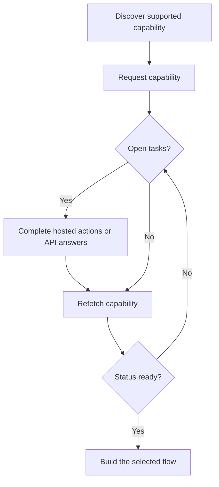

Capability vám říká, zda zákazník může využívat konkrétní výsledek, platební metodu a směr. Otevřené úkoly vám říkají, co se musí stát, než capability nebo související zdroj může postoupit.



```bash
export API_BASE='https://platform.swipelux.com'
export SWIPELUX_API_KEY='replace-with-your-api-key'
```

## Objevte podporované capabilities

Přečtěte aktuální možnosti zákazníka pomocí [`GET /v3/customers/{customerId}/capabilities/supported`](/api-reference/capabilities/get-v3-customers-by-customer-id-capabilities-supported):

```bash
curl --request GET \
  "${API_BASE}/v3/customers/${CUSTOMER_ID}/capabilities/supported" \
  --header "X-API-Key: ${SWIPELUX_API_KEY}"
```

Vyberte položku odpovědi, která odpovídá zamýšleným `directions`, `method` a `accountType`. Pokračujte jen tehdy, když `availability` je `available` nebo `beta` a `eligibility.eligible` je `true`. Pokud jsou vráceny `institutions`, vyberte pouze ID z této odpovědi.

Uložte vybrané `data[].id` jako `CAPABILITY_ID`. Nikdy nekopírujte ID capability od jiného zákazníka nebo z jiného prostředí.

### Sdružené vs. pojmenované typy účtů

Bankovní capabilities přicházejí ve dvou variantách, kódovaných jako pole `accountType` a přípona ID capability (například `ach_pooled`, `wire_named`):

- **`pooled`**: sdílený bankovní účet Swipelux. Každá příchozí platba používá unikátní referenci ke směrování prostředků. Zvolte pro jednorázové převody.
- **`named`**: vyhrazené bankovní údaje pro zákazníka (virtuální IBAN, vyhrazený ACH účet). Opakovaně použitelné a sdílitelné s jakýmkoli plátcem. Vyžadováno pro [vydané bankovní účty](/cs/integration/issue-bank-account).

Výchozí volba je `pooled`. Používejte `named` pouze tehdy, když zákazník potřebuje opakovaně použitelné bankovní údaje. Zkontrolujte odpověď `supported`, které varianty jsou k dispozici.

## Požádejte o capability

Požádejte o vybranou možnost pomocí [`POST /v3/customers/{customerId}/capabilities/{capabilityId}`](/api-reference/capabilities/post-v3-customers-by-customer-id-capabilities-by-capability-id):

```bash
curl --request POST \
  "${API_BASE}/v3/customers/${CUSTOMER_ID}/capabilities/${CAPABILITY_ID}" \
  --header "X-API-Key: ${SWIPELUX_API_KEY}" \
  --header "Idempotency-Key: capability-request-001" \
  --header "Content-Type: application/json" \
  --data '{}'
```

Explicitní pole `institutions` používejte pouze tehdy, když potřebujete vybrat z ID vrácených v odpovědi na podporované capabilities.

Uložte `data.status` jako `CAPABILITY_STATUS`, `data.openTaskIds` jako `OPEN_TASK_IDS` a každé `data.applications[].id` do `APPLICATION_IDS`.

## Dokončete aktuální úkoly {#complete-current-tasks}

Zjistěte úkoly pomocí [`GET /v3/customers/{customerId}/tasks`](/api-reference/tasks/list-customer-tasks), vyberte ID z `OPEN_TASK_IDS`, poté přečtěte každý aktuální úkol pomocí [`GET /v3/customers/{customerId}/tasks/{taskId}`](/api-reference/tasks/get-customer-task):

```bash
curl --request GET \
  "${API_BASE}/v3/customers/${CUSTOMER_ID}/tasks/${TASK_ID}" \
  --header "X-API-Key: ${SWIPELUX_API_KEY}"
```

Použijte nejnovější `data.revision` a `data.requirements`. Znovu načtěte úkol bezprostředně před odesláním, pokud se některé z nich mohlo změnit.

### Hostované akce

Každá položka v `verificationSessions` a `tosSessions` publikuje explicitní objekt `action`. Před odesláním zákazníka si přečtěte `action.kind`; neodvozujte dostupnost odkazu ze `status` relace.

- `action.kind: "available"` obsahuje `action.url` a `action.expiresAt` (aktuálně vždy `null`). Odešlete zákazníka na `action.url` a poté znovu přečtěte úkol. Ploché pole `url` a `expiresAt` na relaci jsou kompatibilitní zrcadla dostupné akce.
- `action.kind: "unavailable"` znamená, že by neměl být předložen žádný odkaz. Znovu použité, dokončené, zamítnuté a zrušené relace publikují tento tvar a ploché pole `url` a `expiresAt` jsou vynechány.

```json
{
  "verificationSessions": [
    {
      "id": "vfy_...",
      "status": "action_required",
      "action": {
        "kind": "available",
        "url": "https://api.swipelux.com/kyc/redirect/cus_.../tsk_.../vfy_...",
        "expiresAt": null
      },
      "url": "https://api.swipelux.com/kyc/redirect/cus_.../tsk_.../vfy_...",
      "expiresAt": null
    }
  ],
  "tosSessions": [
    {
      "id": "tos_...",
      "status": "completed",
      "action": { "kind": "unavailable" }
    }
  ]
}
```

Jde o akce v rozsahu úkolu, nikoli o samostatný životní cyklus ověření zákazníka.

### Nahrání dokumentů {#upload-documents}

Když požadavek vyžaduje dokument, nahrajte jej pomocí [`POST /v3/customers/{customerId}/documents`](/api-reference/documents/post-v3-customers-by-customer-id-documents):

```bash
export DOCUMENT_PATH='/absolute/path/to/requested-document.pdf'

curl --request POST \
  "${API_BASE}/v3/customers/${CUSTOMER_ID}/documents" \
  --header "X-API-Key: ${SWIPELUX_API_KEY}" \
  --header "Idempotency-Key: customer-document-001" \
  --form "file=@${DOCUMENT_PATH}"
```

Uložte vrácené `data.id` jako `DOCUMENT_ID` předtím, než odešlete odpověď, která na něj odkazuje.

### API odpovědi

Odešlete jednu kompletní sadu odpovědí pro aktuální revizi pomocí [`POST /v3/customers/{customerId}/tasks/{taskId}/submissions`](/api-reference/task-submissions/create-customer-task-submission):

```bash
curl --request POST \
  "${API_BASE}/v3/customers/${CUSTOMER_ID}/tasks/${TASK_ID}/submissions" \
  --header "X-API-Key: ${SWIPELUX_API_KEY}" \
  --header "Idempotency-Key: task-submission-001" \
  --header "Content-Type: application/json" \
  --data @- <<'JSON'
{
  "taskRevision": 3,
  "answers": [
    {
      "requirementId": "req_from_current_task",
      "answer": {
        "type": "text",
        "value": "Current answer"
      }
    }
  ]
}
JSON
```

Každé ID požadavku a typ odpovědi vezměte z nejnovějšího úkolu. Pokud API oznámí, že se úkol změnil, znovu jej načtěte a rebuildujte odeslání z nové revize.

## Pokračujte, když je capability připravena

Přečtěte capability znovu pomocí [`GET /v3/customers/{customerId}/capabilities/{capabilityId}`](/api-reference/capabilities/get-v3-customers-by-customer-id-capabilities-by-capability-id):

```bash
curl --request GET \
  "${API_BASE}/v3/customers/${CUSTOMER_ID}/capabilities/${CAPABILITY_ID}" \
  --header "X-API-Key: ${SWIPELUX_API_KEY}"
```

Nahraďte uložený stav a ID úkolů nejnovější odpovědí. Pokračujte jen tehdy, když aktuální stav capability umožňuje účet, quote nebo převod, který zamýšlíte vytvořit.

Dále vyberte odpovídající cestu v [Běžných tocích](/cs/integration/common-flows).
