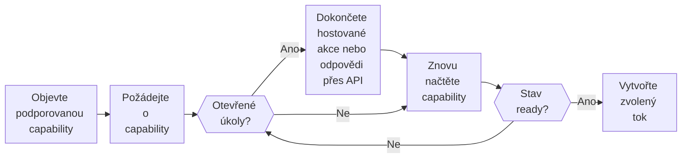

Capability vám říká, zda zákazník může využívat konkrétní výsledek, platební metodu a směr. Otevřené úkoly vám říkají, co se musí stát, než capability nebo související zdroj může postoupit.


```mermaid
%%{init: {"flowchart": {"rankSpacing": 20, "nodeSpacing": 16, "wrappingWidth": 80, "padding": 8}}}%%
flowchart LR
  A["Objevte podporovanou capability"] --> B["Požádejte o capability"]
  B --> C{{"Otevřené úkoly?"}}
  C -->|"Ano"| D["Dokončete hostované akce nebo odpovědi přes API"]
  D --> E["Znovu načtěte capability"]
  C -->|"Ne"| E
  E --> F{{"Stav ready?"}}
  F -->|"Ne"| C
  F -->|"Ano"| G["Vytvořte zvolený tok"]
```

```bash Environment variables
export API_BASE='https://platform.swipelux.com'
export SWIPELUX_API_KEY='replace-with-your-api-key'
```

## Objevte podporované capabilities

Přečtěte aktuální možnosti zákazníka pomocí [`GET /v3/customers/{customerId}/capabilities/supported`](/api-reference/capabilities/get-v3-customers-by-customer-id-capabilities-supported):

```bash List supported capabilities
curl --request GET \
  "${API_BASE}/v3/customers/${CUSTOMER_ID}/capabilities/supported" \
  --header "X-API-Key: ${SWIPELUX_API_KEY}"
```

Vyberte položku odpovědi, která odpovídá zamýšleným `directions`, `method` a `accountType`. Pokračujte jen tehdy, když `availability` je `available` nebo `beta` a `eligibility.eligible` je `true`. Pokud jsou vráceny `institutions`, vyberte pouze ID z této odpovědi.

Každá položka instituce obsahuje `logoUrl` a příznak `isDefault`. Pomocí `logoUrl` zobrazte logo banky v rozhraní pro výběr banky, a když je `null`, vykreslete vlastní obecnou ikonu banky. `isDefault` platí pouze pro tohoto zákazníka a tuto capability, nikoli pro instituci globálně. [`GET /v3/institutions`](/api-reference/institutions/get-v3-institutions) vrací stejné `logoUrl`, které může být `null`. ID institucí jsou neprůhledná, proto nová ID zpracovávejte bez změn kódu.

```json Institution entry
{
  "institutions": [
    {
      "id": "jpmorgan",
      "name": "JPMorgan Chase",
      "bic": "CHASUS33",
      "logoUrl": "https://wallet.swipelux.com/bank-logos/jpmorgan.png",
      "countries": ["US"],
      "isDefault": true
    }
  ]
}
```

Uložte vybrané `data[].id` jako `CAPABILITY_ID`. Nikdy nekopírujte ID capability od jiného zákazníka nebo z jiného prostředí.

### Sdružené vs. pojmenované typy účtů

Bankovní capabilities přicházejí ve dvou variantách, kódovaných jako pole `accountType` a přípona ID capability (například `ach_pooled`, `wire_named`):

- **`pooled`**: sdílený bankovní účet Swipelux. Každá příchozí platba používá unikátní referenci ke směrování prostředků. Zvolte pro jednorázové převody.
- **`named`**: vyhrazené bankovní údaje pro zákazníka (virtuální IBAN, vyhrazený ACH účet). Opakovaně použitelné a sdílitelné s jakýmkoli plátcem. Vyžadováno pro [vydané bankovní účty](/cs/integration/issue-bank-account).

Výchozí volba je `pooled`. Používejte `named` pouze tehdy, když zákazník potřebuje opakovaně použitelné bankovní údaje. Zkontrolujte odpověď `supported`, které varianty jsou k dispozici.

Chcete-li přijímat vklady SWIFT nebo vydávat bankovní údaje SWIFT, použijte `swift_named`. `swift_pooled` podporuje pouze výplaty, proto u každé možnosti zkontrolujte `directions` v odpovědi na podporované capabilities. Pojmenovaný účet SWIFT vrací opakovaně použitelné údaje pro příjem plateb, včetně BIC banky, reference, pokud je vyžadována, a adresy příjemce, pokud ji banka poskytne.

U vydaných účtů ACH, Wire a SWIFT můžete pomocí `institution` vybrat konkrétní banku a uložit požadavek na účet ještě předtím, než banka zákazníka schválí. Viz [Vydat bankovní účet](/cs/integration/issue-bank-account#choose-the-bank).

## Požádejte o capability

Požádejte o vybranou možnost pomocí [`POST /v3/customers/{customerId}/capabilities/{capabilityId}`](/api-reference/capabilities/post-v3-customers-by-customer-id-capabilities-by-capability-id):

```bash Request capability
curl --request POST \
  "${API_BASE}/v3/customers/${CUSTOMER_ID}/capabilities/${CAPABILITY_ID}" \
  --header "X-API-Key: ${SWIPELUX_API_KEY}" \
  --header "Idempotency-Key: capability-request-001" \
  --header "Content-Type: application/json" \
  --data '{}'
```

Explicitní pole `institutions` používejte pouze tehdy, když potřebujete vybrat z ID vrácených v odpovědi na podporované capabilities.

Uložte `data.status` jako `CAPABILITY_STATUS`, `data.accountProvisioning` jako `ACCOUNT_PROVISIONING_STATUS`, `data.openTaskIds` jako `OPEN_TASK_IDS` a každé `data.applications[].id` do `APPLICATION_IDS`.

### Sdílené aplikace pro každou banku {#shared-applications-per-bank}

U pojmenovaných bankovních capabilities má každý zákazník jeden případ aplikace pro každou banku. Sdružené a platformní capabilities používají případy bez banky. Swipelux sdílí případ napříč všemi kompatibilními capabilities, o které požádáte:

- Jedno schválení může pokrýt několik capabilities. Například schválený případ u jedné banky může převést capability ACH i wire do stavu `ready`.
- Pozdější požadavek, který odpovídá existujícímu případu, jej znovu použije. Swipelux neotevře druhou aplikaci a nepřidá duplicitní úkoly.
- Případy u různých bank jsou nezávislé. Zamítnutí u jedné banky neovlivní případ u jiné banky.

Odpověď na požadavek vám sdělí, který případ Swipelux použil:

- `201` znamená, že požadavek otevřel nový případ aplikace.
- `200` znamená, že požadavek byl přiřazen k případu aplikace, který zákazník již měl, například při opakovaném požadavku na bankovní capability, kterou zákazník již má, nebo při požadavku na zrušenou capability. Opakovaný požadavek na `card` nebo `stablecoin_transfers` stále vrací [`409 capability_already_exists`](/integration/errors#capability-already-exists).
- `selectedApplicationId` je pole nejvyšší úrovně vedle `data` s ID případu, který požadavek vybral nebo otevřel. Swipelux jej vynechá, když požadavek žádný případ nevybral. Idempotentní opakování vrací stejnou hodnotu.

Zkrácená odpověď:

```json Response (abbreviated)
{
  "data": {
    "id": "ach_named",
    "status": "pending",
    "openTaskIds": ["tsk_000000000000000002"],
    "applications": [{ "id": "apl_000000000000000005", "status": "in_review" }]
  },
  "selectedApplicationId": "apl_000000000000000005"
}
```

U pojmenovaných capabilities pošlete znovu stejný seznam `institutions`, abyste vybrali stejný případ, nebo pošlete jedno ID instituce, abyste cílili na danou banku. Banka, která zákazníka definitivně zamítla, se přeskočí. Když uvedete pouze tuto banku, nebo když zákazníka zamítly všechny způsobilé banky, požadavek vrátí [`409 capability_terminally_rejected`](/integration/errors#capability-terminally-rejected). Chcete-li po zamítnutí zkusit jinou banku, požádejte o capability znovu s ID instituce této banky.

Stav capability odráží všechny související případy zákazníka. U pojmenované capability stačí k tomu, aby byla `ready`, jeden případ ve stavu `ready`, jehož schválení ji pokrývá, bez ohledu na to, co hlásí ostatní banky. Sdružená capability navíc čeká na kontrolu své metody, která je uvedena v `probes` v seznamu aplikací zákazníka.

#### Zobrazte aplikace zákazníka {#list-the-customers-applications}

Vypište všechny případy aplikací zákazníka pomocí [`GET /v3/customers/{customerId}/applications`](/api-reference/capabilities/get-v3-customers-by-customer-id-applications). Výsledky jsou stránkované pomocí `nextCursor` a `hasMore` a přijímají `updatedAfter`:

```bash List applications
curl --request GET \
  "${API_BASE}/v3/customers/${CUSTOMER_ID}/applications" \
  --header "X-API-Key: ${SWIPELUX_API_KEY}"
```

Každá položka obsahuje pole aplikace, která se vracejí v `applications[]` capability, a navíc:

- `scope`: `named` pro případ u jedné banky, `provider_pooled` nebo `platform` pro případy bez banky, nebo `null` pro nezařazený historický případ. U případů `provider_pooled` a `platform` pole `institution` chybí.
- `requestedScope[]`: klíče capabilities, o které bylo v rámci případu požádáno, každý s prvním `requestedAt`. Položky se nikdy neodstraňují.
- `coverage[]`: klíče capabilities, které schválení případu pokrývá, každý s `grantedAt` a `source`. Pokrytí zaznamenává rozsah, nikoli autorizaci. Aktuální stav zjistěte přečtením capability.
- `probes[]`: kontroly metod pro klíče sdružených capabilities, které případ pokrývá, každá s `capabilityKey`, `status` a `reason`. Pojmenované klíče kontrolu nikdy nevyžadují.
- `generation`, `predecessorApplicationId` a `supersededByApplicationId`: odkazy na posloupnost případů. Když je nastaveno `supersededByApplicationId`, případ byl nahrazen. Pokračujte podle tohoto ID k aktuálnímu případu. Seznam `applications[]` capability obsahuje pouze aktuální případy, takže nahrazený případ se objeví pouze v tomto seznamu.

Zkrácená odpověď:

```json Response (abbreviated)
{
  "data": [
    {
      "id": "apl_000000000000000005",
      "status": "ready",
      "scope": "named",
      "institution": { "id": "jpmorgan", "name": "JPMorgan Chase", "bic": "CHASUS33" },
      "requestedScope": [
        { "capabilityKey": "ach_named", "requestedAt": "2026-09-20T10:00:00.000Z" }
      ],
      "coverage": [
        { "capabilityKey": "ach_named", "grantedAt": "2026-09-22T12:00:00.000Z", "source": "approval" },
        { "capabilityKey": "wire_named", "grantedAt": "2026-09-22T12:00:00.000Z", "source": "approval" }
      ],
      "probes": [],
      "generation": 1,
      "predecessorApplicationId": null,
      "supersededByApplicationId": null
    }
  ],
  "nextCursor": null,
  "hasMore": false
}
```

## Dokončete aktuální úkoly {#complete-current-tasks}

Zjistěte úkoly pomocí [`GET /v3/customers/{customerId}/tasks`](/api-reference/tasks/list-customer-tasks), vyberte ID z `OPEN_TASK_IDS`, poté přečtěte každý aktuální úkol pomocí [`GET /v3/customers/{customerId}/tasks/{taskId}`](/api-reference/tasks/get-customer-task):

```bash List open tasks
curl --request GET \
  "${API_BASE}/v3/customers/${CUSTOMER_ID}/tasks/${TASK_ID}" \
  --header "X-API-Key: ${SWIPELUX_API_KEY}"
```

Použijte nejnovější `data.revision` a `data.requirements`. Znovu načtěte úkol bezprostředně před odesláním, pokud se některé z nich mohlo změnit.

### Znovu použité důkazy z profilu {#reused-profile-evidence}

U úkolů příjmu aplikace, které přijímají přímé odeslání přes API, Swipelux znovu používá informace, které zákazník již poskytl. Když je takový úkol vytvořen nebo sladěn, Swipelux zkontroluje profil zákazníka a dokumenty, které zákazník sám nahrál. Způsobilé požadavky, které již podkládá použitelná hodnota profilu nebo dokument, přejdou do `in_review`, místo aby zůstaly akční. Aktualizace profilu a nahrání nových dokumentů spouštějí stejnou kontrolu u existujících úkolů.

Akční zůstávají pouze chybějící nebo nekompatibilní hodnoty. Opětovné použití důkazy neschvaluje. Swipelux je stále posuzuje. Explicitní žádosti o opravu a dříve zodpovězené požadavky zůstávají akční. Dokumenty vlastníků a propojených stran se znovu nepoužívají a požadavky shromažďované pouze prostřednictvím hostované relace si zachovávají svůj běžný postup.

### Vykreslete požadavky {#render-requirements}

Formuláře sestavujte z metadat, která vrací každý požadavek, nikoli z klíčů požadavků. Požadavek může obsahovat volitelný krátký `title` a každý `request` obsahuje `prompt`, který se zobrazí pod nadpisem.

Požadavky s `request.type: "profile"` identifikují pole profilu pomocí `profilePointer` a přidávají metadata vstupu:

- `allowedValues`: povolené hodnoty skalárního pole nebo každé položky pole typu array. Odesílejte tyto hodnoty, nikoli přeložené zobrazované popisky.
- `valueSchema`: samostatný dokument JSON Schema Draft 7, který popisuje tvar vstupu, vnořené vlastnosti, povinná pole a strukturální omezení. Výčty u objektů se objevují u příslušné vlastnosti, například `valueSchema.items.properties.type.enum` u daňových identifikátorů. Swipelux po odeslání stále provádí validaci napříč poli a validaci v rámci posouzení, takže hodnota, která projde schématem, může být přesto zamítnuta.
- `valueType: "country"`, nebo `itemValueType: "country"` u polí typu array: pole přijímá kódy ISO 3166-1 alpha-2 velkými písmeny. Vnořené vlastnosti země ve `valueSchema` používají `format: "iso-3166-1-alpha-2"`. Pro lokalizované popisky použijte standardní seznam zemí.

```json Requirement
{
  "id": "req_000000000000000010",
  "key": "account_purposes",
  "title": "Account purpose",
  "status": "action_required",
  "request": {
    "type": "profile",
    "prompt": "Select every purpose that applies.",
    "required": true,
    "profilePointer": "/financialProfile/accountPurposes",
    "valueType": "array",
    "itemValueType": "string",
    "allowedValues": ["business_expenses", "ecommerce", "payroll"],
    "valueSchema": {
      "$schema": "http://json-schema.org/draft-07/schema#",
      "type": "array",
      "items": { "enum": ["business_expenses", "ecommerce", "payroll"] }
    }
  }
}
```

Tento příklad zkracuje katalog hodnot; API vrací všechny povolené hodnoty. Některé požadavky profilu nemají publikované schéma a vynechávají `valueSchema` a `allowedValues`. Ty vykreslete z `prompt` a `valueType`.

Každý otevřený úkol obsahuje časové razítko `dueAt`. Když Swipelux vytvoří úkol bez explicitního data splatnosti, nastaví se `dueAt` výchozím způsobem přesně na 31 dní po `createdAt` úkolu. Berte `dueAt` jako informativní: nelze jej nastavit přes API a nespouští žádný automatický přechod životního cyklu. Pouze samostatné pole `deadline`, pokud je nastaveno, způsobí automatický přechod.

### Hostované akce {#hosted-actions}

V odpovědi s detailem úkolu obsahuje každá položka v `verificationSessions` a `tosSessions` objekt `action`. Odpovědi se seznamem úkolů tyto odkazy na akce neobsahují. Uložte `id` každé relace a před odesláním zákazníka přečtěte `action.kind`; neodvozujte dostupnost odkazu ze `status` relace.

- `action.kind: "available"` obsahuje `action.url` a `action.expiresAt` (aktuálně vždy `null`). Uložte `action.url`, odešlete na něj zákazníka a poté úkol znovu načtěte. Pole `url` a `expiresAt` na úrovni relace obsahují stejné hodnoty.
- `action.kind: "unavailable"` znamená, že se nemá zobrazit žádný odkaz. Pole `url` a `expiresAt` na úrovni relace chybí. Samotný `status` relace neurčuje, který druh akce obdržíte.

```json Verification session
{
  "data": {
    "verificationSessions": [
      {
        "id": "vfy_000000000000000003",
        "key": "identity_verification",
        "type": "identity_verification",
        "status": "action_required",
        "action": {
          "kind": "available",
          "url": "https://platform.swipelux.com/kyc/redirect/cus_000000000000000001/tsk_000000000000000002/vfy_000000000000000003",
          "expiresAt": null
        },
        "url": "https://platform.swipelux.com/kyc/redirect/cus_000000000000000001/tsk_000000000000000002/vfy_000000000000000003",
        "expiresAt": null
      }
    ],
    "tosSessions": [
      {
        "id": "vfy_000000000000000004",
        "key": "terms_of_service",
        "type": "terms_of_service",
        "status": "completed",
        "action": { "kind": "unavailable" }
      }
    ]
  }
}
```

Jde o akce v rozsahu úkolu, nikoli o samostatný životní cyklus ověření zákazníka.

Hostovaná odpověď na profilový požadavek na strukturovanou hodnotu, například adresu nebo daňové identifikátory, musí projít stejnými kontrolami schématu a omezení jako přímá odpověď. Pokud neprojde, požadavek zůstane otevřený. Požadavek, který Swipelux z tohoto důvodu vrátí do stavu `action_required`, nese `reviewFeedback.code: hosted_profile_direct_submission_required`. Získejte tuto hodnotu od zákazníka a odešlete ji jako [API odpověď](#api-answers).

### Nahrání dokumentů {#upload-documents}

Když požadavek vyžaduje dokument, nahrajte jej pomocí [`POST /v3/customers/{customerId}/documents`](/api-reference/documents/post-v3-customers-by-customer-id-documents):

```bash Upload document
export DOCUMENT_PATH='/absolute/path/to/requested-document.pdf'

curl --request POST \
  "${API_BASE}/v3/customers/${CUSTOMER_ID}/documents" \
  --header "X-API-Key: ${SWIPELUX_API_KEY}" \
  --header "Idempotency-Key: customer-document-001" \
  --form "file=@${DOCUMENT_PATH}"
```

Uložte vrácené `data.id` jako `DOCUMENT_ID` předtím, než odešlete odpověď, která na něj odkazuje.

Pro pozdější načtení uloženého souboru zavolejte [`GET /v3/customers/{customerId}/documents/{documentId}/download`](/api-reference/documents/get-v3-customers-by-customer-id-documents-by-document-id-download). Swipelux vrátí `url`, která stáhne soubor jako přílohu a vyprší po jedné hodině. Archivované dokumenty vracejí `404`.

### API odpovědi {#api-answers}

Odešlete jednu kompletní sadu odpovědí pro aktuální revizi pomocí [`POST /v3/customers/{customerId}/tasks/{taskId}/submissions`](/api-reference/task-submissions/create-customer-task-submission):

```bash Submit task answers
curl --request POST \
  "${API_BASE}/v3/customers/${CUSTOMER_ID}/tasks/${TASK_ID}/submissions" \
  --header "X-API-Key: ${SWIPELUX_API_KEY}" \
  --header "Idempotency-Key: task-submission-001" \
  --header "Content-Type: application/json" \
  --data @- <<'JSON'
{
  "taskRevision": 3,
  "answers": [
    {
      "requirementId": "req_from_current_task",
      "answer": {
        "type": "text",
        "value": "Current answer"
      }
    }
  ]
}
JSON
```

Každé ID požadavku a typ odpovědi vezměte z nejnovějšího úkolu. Pokud API oznámí, že se úkol změnil, znovu jej načtěte a rebuildujte odeslání z nové revize.

### Předpoklad skutečného majitele pro firmy {#beneficial-owner-prerequisite-for-businesses}

Žádost o firemní capability, která potřebuje důkazy o skutečném majiteli, uspěje i tehdy, když zákazník zatím nemá žádného kvalifikujícího se vlastníka. Capability se vytvoří jako `restricted` s `statusReason.code: tasks_due` a firemní vstupní úkol si vyžádá chybějící fakta o vlastnictví, včetně vlastnické struktury.

Tentýž úkol nese požadavek `resource_reference`, jehož žádost obsahuje `qualification: "beneficial_owner"`:

```json Beneficial owner requirement
{
  "type": "resource_reference",
  "prompt": "Add or select a qualifying beneficial owner.",
  "required": true,
  "resourceType": "related_party",
  "qualification": "beneficial_owner"
}
```

Související strana se kvalifikuje, když je aktivní stranou typu `person` téhož zákazníka s poskytnutým procentem vlastnictví alespoň 25, nebo s `ownership.declared: true` bez uvedeného procenta.

Požadavek je odvozen z aktuálního seznamu souvisejících stran, takže na něj obvykle neodpovídáte přímo:

- Vytvoření nebo aktualizace kvalifikující se související strany splní požadavek ve stejném přehodnocení a otevře vlastní profilovou a dokumentovou práci tohoto vlastníka. Viz [Přidejte propojené strany firmy](/cs/integration/onboarding/customers#add-business-related-parties).
- Na kvalifikující se stranu můžete také explicitně odkázat odpovědí `resource_reference`, která nese její `relatedPartyId`.
- Požadavek zůstává uveden v aktuálním úkolu i po svém splnění. Když nezůstává otevřená žádná jiná povinnost, úkol se stane `satisfied`.
- Archivace poslední kvalifikující se strany, nebo odstranění faktů, které ji kvalifikovaly, požadavek znovu otevře, a to i poté, co byl úkol `satisfied`.

## Pokračujte, když je capability připravena {#continue-when-the-capability-is-ready}

Přečtěte capability znovu pomocí [`GET /v3/customers/{customerId}/capabilities/{capabilityId}`](/api-reference/capabilities/get-v3-customers-by-customer-id-capabilities-by-capability-id):

```bash Refetch capability
curl --request GET \
  "${API_BASE}/v3/customers/${CUSTOMER_ID}/capabilities/${CAPABILITY_ID}" \
  --header "X-API-Key: ${SWIPELUX_API_KEY}"
```

Nahraďte uložený stav, stav vydávání účtu a ID úkolů nejnovější odpovědí. `status` capability oznamuje, zda je oprávnění schváleno. U capability, která vydává účet, `accountProvisioning` samostatně oznamuje, zda je daný účet `not_started`, `in_progress`, `issued` nebo `failed`; capability, která účet nevydává, vrací `not_applicable`.

Dokud je capability ve stavu `pending`, dvě z hodnot `statusReason.code`, které může hlásit, ukazují, zda probíhá kontrola. `preparing_submission` znamená, že Swipelux stále připravuje žádost k odeslání a neprobíhá žádná kontrola, a to i v případě, že žádost u jiné banky je `rejected` nebo vyžaduje pozornost. `review_in_progress` znamená, že kontrola probíhá, například když je žádost ve stavu `in_review` nebo je otevřené [hostované ověření](#hosted-actions). Oba používají `resolution: wait`. Změna mezi těmito kódy ponechá stav `pending`, takže se neodešle žádná událost `capability.status_changed`. Aktuální kód zjistíte načtením capability.

Pokračujte jen tehdy, když aktuální stav capability umožňuje účet, quote nebo převod, který zamýšlíte vytvořit. Když tok potřebuje vydaný účet, počkejte také, až se `accountProvisioning` změní na `issued`.

Dále vyberte odpovídající cestu v [Běžných tocích](/cs/integration/common-flows).
