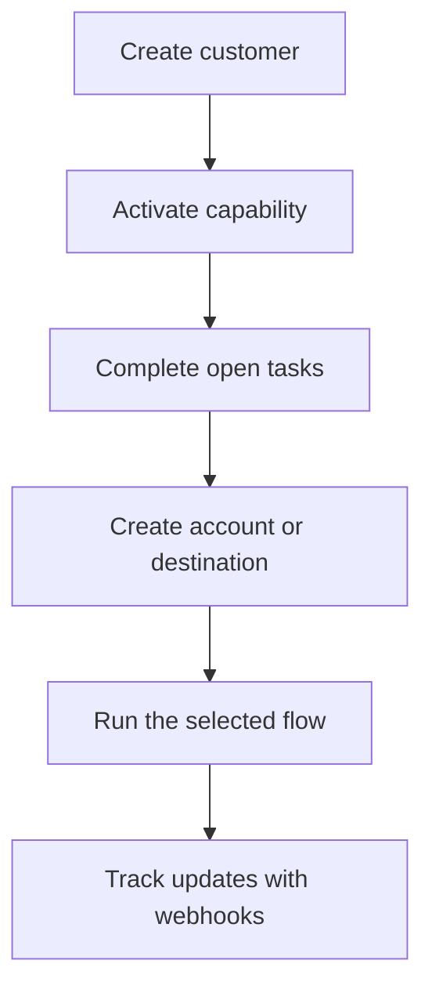

Swipelux poskytuje vašemu backendu stavební bloky pro onboarding zákazníků a přesun peněz, aniž byste museli ve svém produktu vystavovat platební infrastrukturu.

## Co můžete vytvořit

<CardGroup cols={3}>
  <Card title="Přijímat prostředky" icon="arrow-down-to-line" href="/cs/integration/receive-funds">
    Vytvářejte jednorázové pokyny pro financování ve fiat a vypořádávejte stablecoin do peněženky.
  </Card>
  <Card title="Odesílat prostředky" icon="arrow-up-from-line" href="/cs/integration/send-funds">
    Odesílejte z peněženky zákazníka na účet první strany nebo na cíl třetí strany.
  </Card>
  <Card title="Vydat bankovní účet" icon="building-columns" href="/cs/integration/issue-bank-account">
    Poskytněte opakovaně použitelné bankovní údaje propojené s vypořádací peněženkou.
  </Card>
</CardGroup>

## Jak integrace funguje

Zákazník je fyzická osoba nebo firma, která vlastní daný tok. Capabilities popisují, které výsledky může zákazník využívat. Otevřené úkoly vám říkají, co musí být dokončeno, než capability nebo zdroj může postoupit.

## Podívejte se, jak to funguje

Prozkoumejte [demo.swipelux.com](https://demo.swipelux.com) a vyzkoušejte si simulovaný zážitek neobanky. Můžete si také [naklonovat starter](https://github.com/swipelux/neobank-starter) a přizpůsobit jeho produktové rozhraní.

Demo a starter jsou produktové a UI reference. Nenahrazují tyto průvodce ani aktuální API kontrakt.

## Začněte vytvářet

<CardGroup cols={3}>
  <Card title="Rychlý start" icon="rocket" href="/cs/integration/quickstart">
    Vytvořte zákazníka a spusťte jeden sandboxový tok.
  </Card>
  <Card title="Běžné toky" icon="route" href="/cs/integration/common-flows">
    Porovnejte nastavení potřebné pro každý výsledek.
  </Card>
  <Card title="API reference" icon="code" href="/cs/api-reference/introduction">
    Přečtěte si konvence požadavků a prohlédněte si každou API operaci.
  </Card>
</CardGroup>
