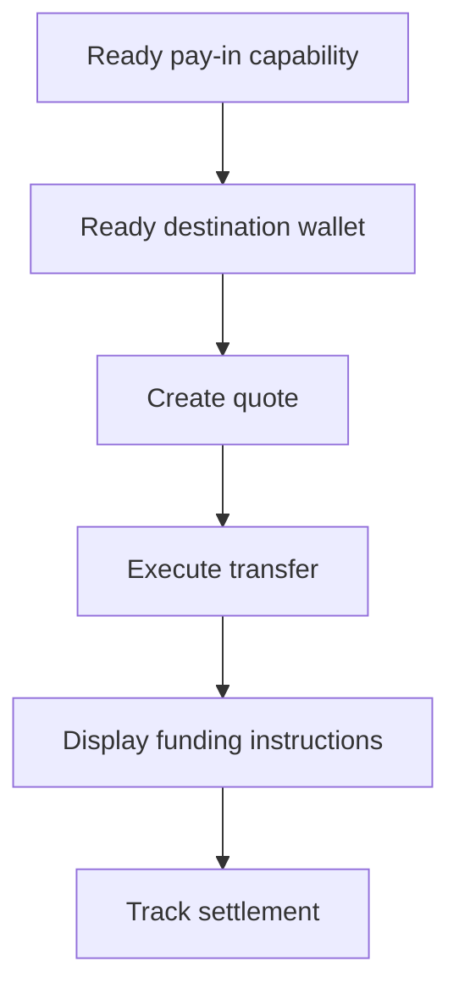

Odkvótovanou příchozí platbu použijte, když zákazník potřebuje financovat konkrétní částku. Převod vypořádá stablecoin do vydané peněženky.



## Než začnete

Potřebujete připravenou capability příchozí platby a připravenou vydanou cílovou peněženku pro stejného zákazníka. Otevřenou práci dokončete přes [Capabilities a úkoly](/cs/integration/onboarding/capabilities-and-requirements), poté oba zdroje znovu načtěte.

## 1. Vytvořte quote

Vytvořte cenu pomocí [`POST /v3/quotes`](/api-reference/money-movement/post-v3-quotes). Odešlete tyto hlavičky:

```http
X-API-Key: ${SWIPELUX_API_KEY}
Idempotency-Key: payin-quote-001
Content-Type: application/json
```

```json
{
  "customerId": "${CUSTOMER_ID}",
  "capabilityId": "${CAPABILITY_ID}",
  "externalId": "payin-order-123",
  "in": {
    "amount": "150.00",
    "currency": "USD"
  },
  "destinationId": "${SETTLEMENT_WALLET_ID}",
  "out": {
    "currency": "USDC"
  }
}
```

Uložte `data.id` jako `QUOTE_ID`. Zobrazte vrácené částky a poplatky místo jejich přepočítávání ze směnného kurzu.

## 2. Proveďte quote

Aktuální quote proveďte před vypršením pomocí [`POST /v3/transfers`](/api-reference/money-movement/post-v3-transfers). Pro tento zamýšlený převod použijte nový klíč:

```http
X-API-Key: ${SWIPELUX_API_KEY}
Idempotency-Key: payin-transfer-001
Content-Type: application/json
```

```json
{
  "quoteId": "${QUOTE_ID}"
}
```

Uložte `data.id` převodu jako `TRANSFER_ID` a uchovejte jeho aktuální stav.

## 3. Získejte financovací pokyny

Přečtěte [`GET /v3/transfers/{transferId}/instructions`](/api-reference/money-movement/get-v3-transfers-by-transfer-id-instructions). Vykreslete vrácenou variantu `data.instructions`, aniž byste předpokládali její typ.

Tyto údaje jsou specifické pro daný převod. Nikdy nepoužívejte bankovní souřadnice, kód, hostovanou URL, částku, referenci ani expiraci jednoho převodu pro jinou příchozí platbu.

Pro bankovní pokyny, když je `reference.required` true, zobrazte přesnou `reference.value` vedle bankovních souřadnic a umožněte její zkopírování. Zobrazte vrácenou částku a měnu ze stejné sady pokynů.

Vydaný bankovní účet je něco jiného: poskytuje opakovaně použitelné údaje pro pozdější vklady. Když je to zamýšlené použití, viz [Vydat bankovní účet](/cs/integration/issue-bank-account).

## 4. Sledujte vypořádání

Přečtěte [`GET /v3/transfers/{transferId}`](/api-reference/money-movement/get-v3-transfers-by-transfer-id) po provedení a po každé události. Stav pro zákazníka odvozujte z nejnovějšího `data.state`.

Použijte `data.stateDetail` a `data.openTaskIds`, když převod vyžaduje další akci. Neoznačujte jej jako dokončený z očekávaného harmonogramu.

Dále přidejte [Webhooky](/cs/integration/webhooks) a udržujte stav převodu synchronizovaný, dokud nedosáhne výsledku, který váš produkt zpracovává.
