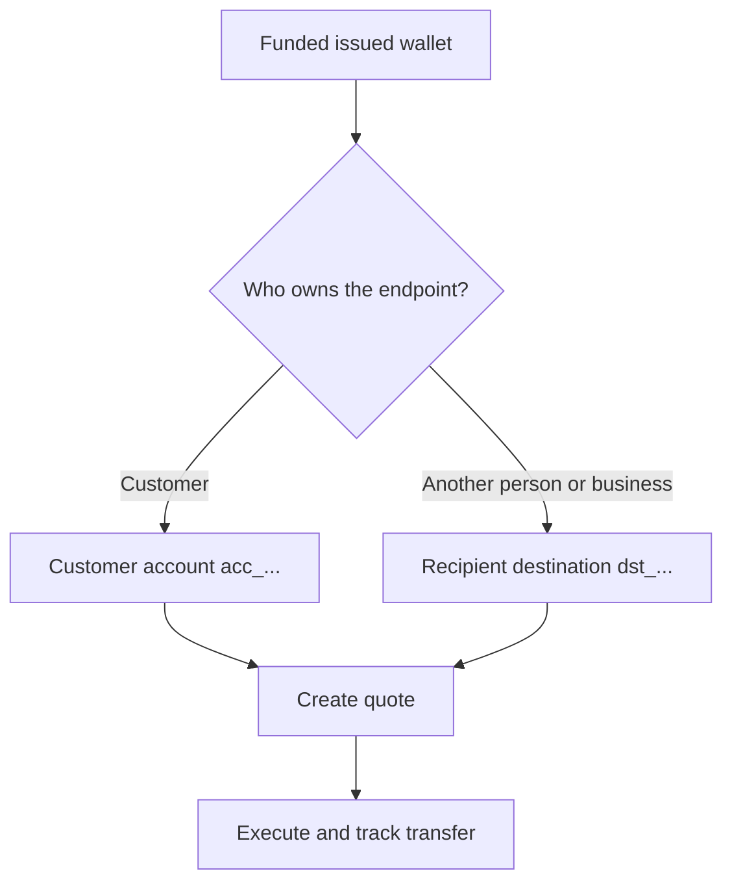

Každá výplata začíná z připravené a financované vydané peněženky. Model cíle závisí na tom, kdo koncový bod vlastní.



## Než začnete

Znovu načtěte zdrojovou peněženku. Ověřte, že její aktuální stav umožňuje výplatu a její dostupný zůstatek pokryje zamýšlenou zdrojovou částku. Uložte její ID odvozené z odpovědi jako `SOURCE_WALLET_ID`.

Potřebujete také připravenou výplatní capability pro aktuálního zákazníka a vybraný cíl.

## 1. Připravte cíl

<Tabs>
  <Tab title="První strana">

Použijte externí bankovní účet vlastněný zákazníkem, když zákazník koncový bod vlastní. Vytvořte jej pomocí [`POST /v3/customers/{customerId}/accounts`](/api-reference/accounts/post-v3-customers-by-customer-id-accounts) a těchto hlaviček:

```http
X-API-Key: ${SWIPELUX_API_KEY}
Idempotency-Key: payout-account-001
Content-Type: application/json
```

```json
{
  "origin": "external",
  "type": "bank",
  "methods": ["ach", "wire"],
  "country": "US",
  "currency": "USD",
  "details": {
    "routingNumber": "021000021",
    "accountNumber": "123456789",
    "accountType": "checking",
    "bankName": "Example Bank",
    "accountHolderName": "Acme Payments SAS"
  },
  "label": "Customer operating account"
}
```

Přečtěte jej pomocí [`GET /v3/customers/{customerId}/accounts/{accountId}`](/api-reference/accounts/get-v3-customers-by-customer-id-accounts-by-account-id). Pokračujte jen tehdy, když jeho aktuální stav umožňuje výplatu. Uložte jeho ID `acc_` jako `PAYOUT_DESTINATION_ID`.

  </Tab>
  <Tab title="Třetí strana">

Vytvořte osobu nebo firmu a jejich bankovní nebo peněženkový koncový bod přes [Příjemci a cíle](/cs/integration/recipients). Pokračujte jen tehdy, když je cíl připraven.

Uložte vrácené ID `dst_` jako `PAYOUT_DESTINATION_ID`. ID příjemce `rcp_` nepoužívejte jako cíl quote.

  </Tab>
</Tabs>

## 2. Vytvořte výplatní quote

Použijte [`POST /v3/quotes`](/api-reference/money-movement/post-v3-quotes) s těmito hlavičkami:

```http
X-API-Key: ${SWIPELUX_API_KEY}
Idempotency-Key: payout-quote-001
Content-Type: application/json
```

```json
{
  "customerId": "${CUSTOMER_ID}",
  "capabilityId": "${CAPABILITY_ID}",
  "in": {
    "amount": "150.00",
    "currency": "USDC",
    "accountId": "${SOURCE_WALLET_ID}"
  },
  "destinationId": "${PAYOUT_DESTINATION_ID}",
  "out": {
    "currency": "USD"
  }
}
```

Uložte `data.id` jako `QUOTE_ID` a zobrazte vrácenou cenu a poplatky.

## 3. Proveďte výplatu

Vytvořte převod pomocí [`POST /v3/transfers`](/api-reference/money-movement/post-v3-transfers). Pro toto zamýšlené provedení použijte jeden nový klíč:

```http
X-API-Key: ${SWIPELUX_API_KEY}
Idempotency-Key: payout-transfer-001
Content-Type: application/json
```

```json
{
  "quoteId": "${QUOTE_ID}"
}
```

Uložte `data.id` převodu jako `TRANSFER_ID`. Úspěšné vytvoření spustí výplatu; nedokládá doručení.

## 4. Sledujte doručení

Přečtěte [`GET /v3/transfers/{transferId}`](/api-reference/money-movement/get-v3-transfers-by-transfer-id) po vytvoření a po každé události. Podle nejnovějšího `data.state`, `data.stateDetail` a `data.openTaskIds` rozhodněte, zda čekat, jednat, nebo zobrazit konečný výsledek.

Dále si projděte [Quotes a převody](/cs/integration/quotes-and-transfers) pro přesné částky, bezpečné obnovení provedení a úkoly převodu.
