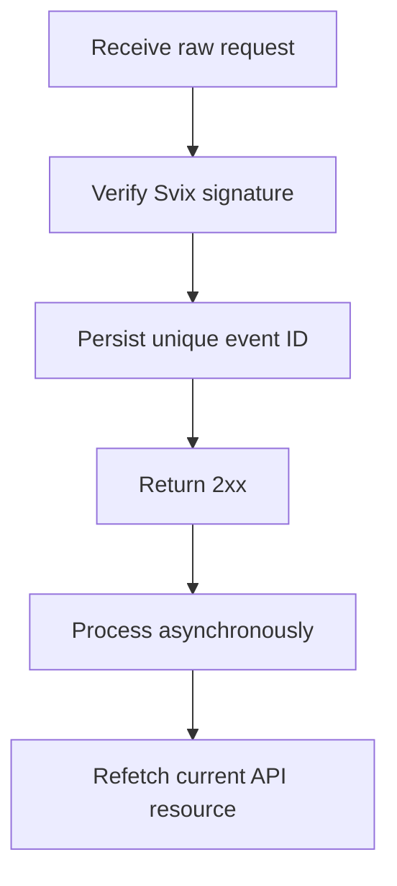

Webhooky používejte k reakci na asynchronní změny. Doručení je alespoň jednou, takže duplicitní, zpožděné a mimo pořadí příchozí události jsou běžné.



## Registrujte pouze potřebné události

Vytvořte endpoint pomocí [`POST /v3/webhooks`](/api-reference/webhooks/post-v3-webhooks). Odebírejte pouze zdokumentované události, které řídí vaši integraci. Tento příklad používá [`transfer.state_changed`](/api-reference/webhooks/transfer-state-changed).

```bash
export API_BASE='https://platform.swipelux.com'
export SWIPELUX_API_KEY='replace-with-your-api-key'

curl --request POST \
  "${API_BASE}/v3/webhooks" \
  --header "X-API-Key: ${SWIPELUX_API_KEY}" \
  --header "Idempotency-Key: webhook-endpoint-001" \
  --header "Content-Type: application/json" \
  --data @- <<'JSON'
{
  "url": "https://example.com/webhooks/swipelux",
  "events": ["transfer.state_changed"]
}
JSON
```

Uložte `data.id` z odpovědi jako `WEBHOOK_ID`. Otevřete portál vrácený z [`GET /v3/webhooks/portal`](/api-reference/webhooks/get-v3-webhooks-portal), získejte podpisové tajemství tohoto endpointu a uložte jej odděleně od API klíče v secret manageru.

## Ověřte před parsováním

Swipelux doručuje nové webhookové integrace přes Svix. Ověřte surové tělo požadavku pomocí podpisového tajemství vašeho endpointu a těchto hlaviček:

- `svix-id`
- `svix-timestamp`
- `svix-signature`

Neparsujte JSON ani nezpůsobujte vedlejší efekty, dokud ověření neuspěje.

```javascript
import { Webhook } from "svix";

const verifier = new Webhook(process.env.SWIPELUX_WEBHOOK_SECRET);

export async function handleSwipeluxWebhook(request) {
  const rawBody = await request.text();
  const event = verifier.verify(rawBody, {
    "svix-id": request.headers.get("svix-id"),
    "svix-timestamp": request.headers.get("svix-timestamp"),
    "svix-signature": request.headers.get("svix-signature"),
  });

  await webhookInbox.insertIfAbsent({
    id: event.id,
    payload: event,
    status: "pending",
  });

  return new Response(null, { status: 204 });
}
```

Odmítejte požadavky s chybějícím nebo neplatným podpisem. Surové tělo mějte k dispozici, dokud ověření nedokončí.

## Uložte, potvrďte a poté zpracujte

Zaveďte omezení unikátnosti na `id` obálky. Uložte ověřenou obálku, rychle vraťte `2xx` a poté ji zpracujte asynchronně.

Pokud ID události již existuje, potvrďte doručení bez opakování dokončených vedlejších efektů. Rozpracovanou nebo neúspěšnou lokální práci obnovte přes vlastní frontu pro opakování. Nepoužívejte pole `attempt` obálky jako deduplikační klíč ani jako čítač transportních opakování.

## Znovu načtěte aktuální stav

Pořadí webhooků není autoritativní historií zdroje. Pomocí `resource.type` a `resource.id` najděte objekt a poté před aktualizací vašeho systému načtěte jeho aktuální stav.

Pro událost převodu volejte [`GET /v3/transfers/{transferId}`](/api-reference/money-movement/get-v3-transfers-by-transfer-id):

```bash
curl --request GET \
  "${API_BASE}/v3/transfers/${TRANSFER_ID}" \
  --header "X-API-Key: ${SWIPELUX_API_KEY}"
```

Stav viditelný zákazníkovi a navazující akce odvozujte z aktuální API odpovědi. Vedlejší efekty navrhujte tak, aby zůstaly bezpečné, i když dva pracovníci zpracují související události v jiném pořadí.

## Obnovte doručení

Použijte [`GET /v3/webhooks/portal`](/api-reference/webhooks/get-v3-webhooks-portal) k otevření logů doručení, k opakování neúspěšných doručení nebo ke spuštění manuálního přehrání.

Každé přehrání musí projít stejným ověřením podpisu a trvanlivou schránkou. Pro obnovu po výpadku přehrajte dotčené okno a znovu načtěte každý odkazovaný zdroj. Dokončená ID událostí zůstávají bez efektu; nedokončené záznamy pokračují asynchronně.

Dále v sandboxu ověřte duplicitní a mimo pořadí doručené doručení, poté dokončete kontrolní seznam [Uvedení do provozu](/cs/integration/go-live).
