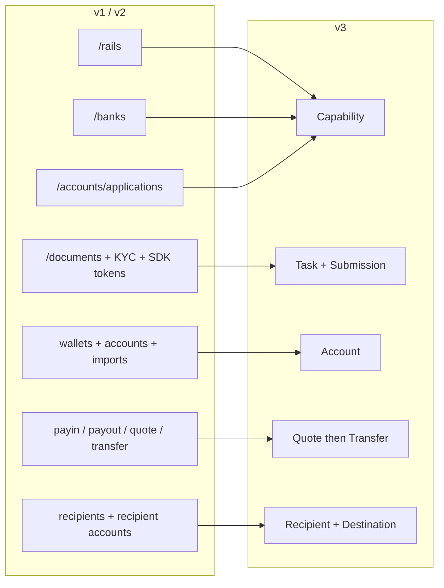
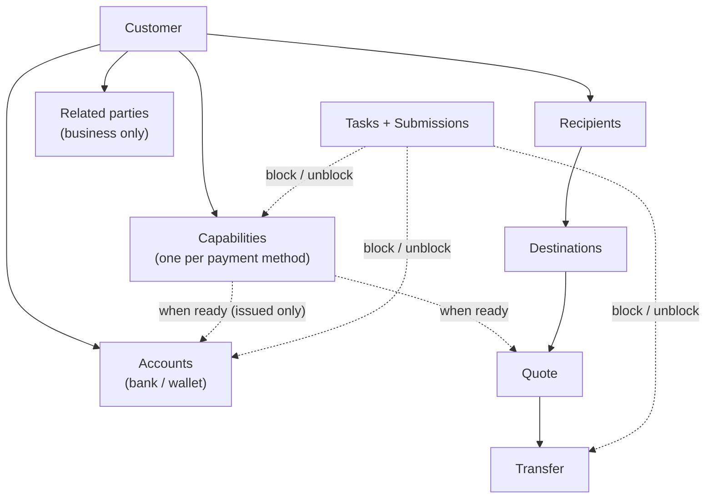
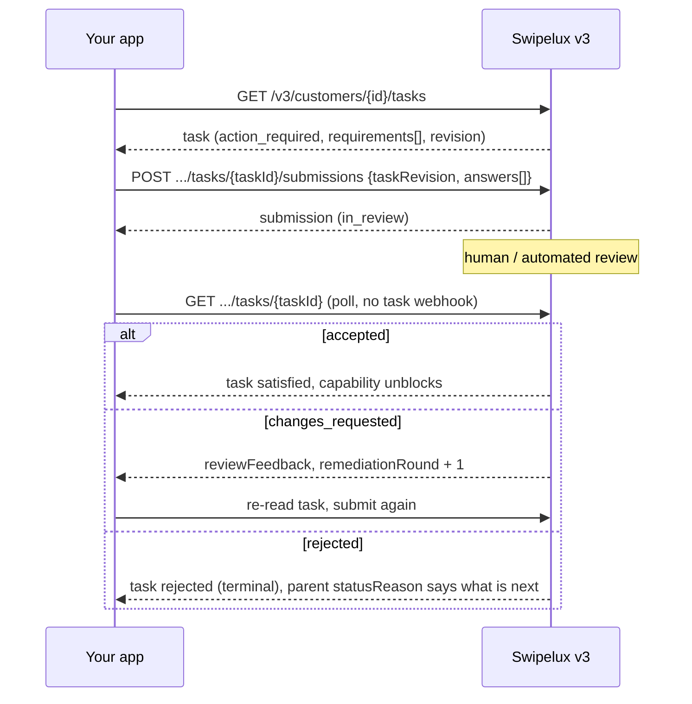
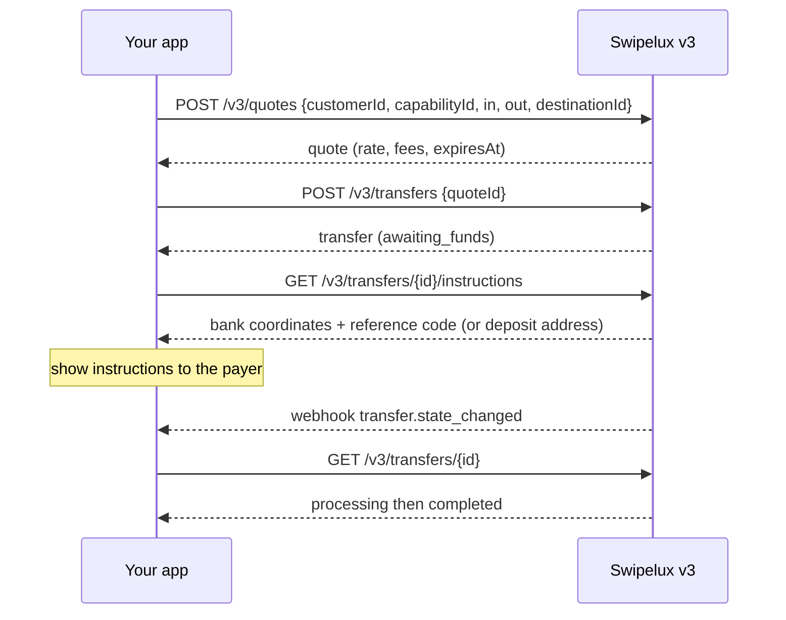
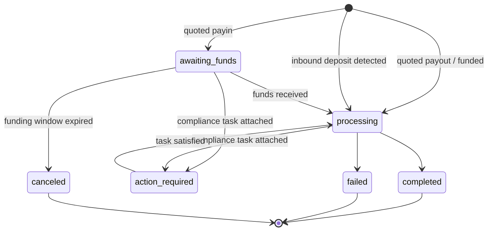
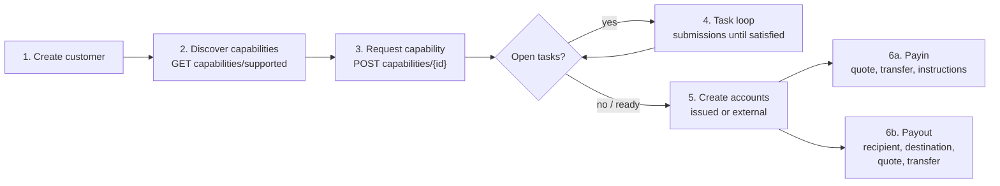

Migrieren Sie Ihre Integration von API v1 und v2 in zwei Durchgängen zu v3:

- **Teil 1, das Konzept.** Lesen Sie dies zuerst. v3 ist eine Neugestaltung, keine Umbenennung: Wenn Sie alte Endpunkte eins zu eins abbilden, arbeiten Sie gegen die API. Zehn Minuten hier sparen Ihnen später Tage.
- **Teil 2, die API.** Endpunkt-für-Endpunkt-Mapping, Anfragebeispiele, Zustandsautomaten und eine Migrations-Checkliste.

Basiert auf der Produktions-OpenAPI-Spezifikation ([platform.swipelux.com/openapi.json](https://platform.swipelux.com/openapi.json)). v1 und v2 bleiben aktiv und sind noch nicht als veraltet markiert; alle neuen Capability-, Empfänger-, Task- und Quoting-Funktionen erscheinen ausschließlich in v3. Abonnieren Sie das Webhook-Ereignis `api.deprecation`, um Abschaltmitteilungen zu erhalten.

<Info>
  **Inhalt.** Teil 1: 1.1 warum v3 existiert, 1.2 Objektmodell, 1.3 Bereitschaft pro Capability, 1.4 Task-Schleife, 1.5 Geldbewegung, 1.6 Zustandsautomaten, 1.7 Konventionen, 1.8 goldener Pfad. Teil 2: 2.1 Kunden, 2.2 Capabilities, 2.3 Tasks und Submissions, 2.4 Accounts, 2.5 Empfänger und Destinations, 2.6 Quotes und Transfers, 2.7 Webhooks, 2.8 Sandbox, 2.9 Legacy-Endpunkte, 2.10 Migrationsreihenfolge, 2.11 Stolperfallen-Checkliste.
</Info>

---

## Teil 1, das Konzept

### 1.1 Warum v3 existiert

v1 und v2 haben vier sich überschneidende Wege entwickelt, um einen Kunden zahlungsbereit zu machen: `/rails`, `/banks`, `/accounts/applications` und die Business-Oberfläche `rail-applications`, jede mit ihrem eigenen Statusvokabular. Die Dokumentenerfassung (`/documents`, KYC-Importe, Verification-SDK-Tokens) war losgelöst von dem, was sie eigentlich freischalten sollte. v3 fasst all dies in sechs Ressourcen zusammen: den Kunden plus fünf Dinge, die er besitzt:



| Ressource | Definition in einer Zeile |
| --- | --- |
| **Customer** | Die Person oder das Unternehmen. Hat **kein öffentliches Statusfeld**, Bereitschaft liegt auf den Capabilities. |
| **Capability** | Eine Zahlungsmethode, die der Kunde nutzen kann (`sepa`, `ach`, `swift`, `stablecoin_transfers` usw.), mit eigenem Status. Ersetzt `/rails`, `/banks` und die Einstiegspunkte für Account-Anträge. |
| **Task** | Eine Arbeitseinheit, die Swipelux benötigt (Daten, Dokumente, Verifizierung), beantwortet mit einer **Submission**. Ersetzt die Oberfläche für Dokumente und KYC. |
| **Account** | Ein Finanzierungs-Endpunkt, den der Kunde besitzt: `bank` oder `wallet`, `issued` von Swipelux oder `external`. |
| **Recipient / Destination** | Auszahlungsbegünstigter (wer) und dessen Bank- oder Wallet-Endpunkt (wohin). |
| **Quote / Transfer** | Alle Geldbewegungen. Ein Transfer führt einen persistierten Quote aus; Transfers ohne Quote gibt es nicht mehr. |

### 1.2 Das Objektmodell



Zwei strukturelle Regeln, die Sie verinnerlichen sollten:

1. **Capabilities steuern alles.** Accounts werden unter einer `ready` Capability bereitgestellt; Quotes werden gegen eine Capability bepreist. Onboarding heißt, die benötigten Capabilities auf `ready` zu bringen.
2. **Tasks können überall hängen.** Eine Capability, ein Account oder ein laufender Transfer kann `openTaskIds` tragen. Wo immer Sie sie sehen, ist die Schleife dieselbe: Task lesen, Antworten übermitteln, auf Prüfung warten, das übergeordnete Objekt erneut lesen.

### 1.3 Bereitschaft gilt pro Capability, nicht pro Kunde

v1 verknüpfte die Bereitschaft von `/rails` mit einem kundenweiten KYC-Gate. In v3 gibt es keinen Kundenstatus: Ein Kunde kann `stablecoin_transfers` vollständig nutzen, während seine `sepa`-Capability noch offene Tasks hat. Capabilities mit gepoolten Accounts erreichen in der Regel schneller den Status `ready` als benannte, beginnen Sie also mit dem, was `ready` ist, statt auf alles zu warten.

Wenn Ihr v1- oder v2-Code UI-Badges anhand des Verifizierungsstatus des Kunden anzeigt, schreiben Sie ihn um:

- "Kann er auf X handeln?" wird zu Capability X `status == "ready"`.
- "Muss er etwas tun?" wird zu einem beliebigen Task mit Status `action_required` (die Capability zeigt typischerweise `restricted` mit `statusReason.resolution: "complete_tasks"`).
- "Warten wir auf Swipelux?" wird zu Tasks `in_review`, Capability `pending`.

### 1.4 Die Task-Schleife

Alles, was die alte Dokumenten- und KYC-Oberfläche tat, ist jetzt diese eine Schleife:



Wichtige Eigenschaften:

- Ein Task enthält `requirements[]`, die einzelnen Anforderungen. Jede hat eine task-spezifische `requirementId`, einen stabilen `key`, der die Anforderung benennt (zum Beispiel Adressnachweis, deduplizieren Sie damit Ihre UI), und ein typisiertes `request`, das genau beschreibt, welche Eingabe erwartet wird (Text, Datum, Auswahl, Dokument, Attestierung usw.).
- Das Übermitteln ist **prüfungsgesteuert**: Es verändert weder Capability- noch Account-Status direkt, das tut erst die Annahme. Eine Ausnahme: `profile`-Antworten schreiben beim Übermitteln direkt ins Kundenprofil durch (2.3). Nach dem Übermitteln pollen Sie den Task oder die übergeordnete Ressource.
- `taskRevision` (Echo der `revision` des Tasks) ist ein Nebenläufigkeitsschutz: Hat sich der Task seit Ihrem Lesen geändert, lesen Sie neu und bauen Ihre Antworten neu auf.
- `absence` ist eine vollwertige Antwort ("Ich habe das nicht, weil ..."), verwenden Sie sie, statt Anforderungen offen zu lassen.

### 1.5 Geldbewegung

Ein Ablauf für Payins, Payouts und Stablecoin-Bewegungen. Es gibt **keine Richtungsangabe**, Sie erklären nie Payin gegenüber Payout. Die Ein- und Ausgangswährungsformen leiten eine schreibgeschützte `direction` am Quote und Transfer ab: `fiat_to_stablecoin` (Payin), `stablecoin_to_fiat` (Payout) oder `stablecoin_move`.



### 1.6 Ein Zustandsautomat pro Ressource

Jede statusführende Ressource hat ihr eigenes Enum, und jeder Nicht-Gut-Status trägt einen strukturierten Grund. Accounts, Applications und Transfers teilen die Form `{ code, message, actor, retryable }`: Accounts und Applications zeigen sie als `statusReason`, Transfers als `stateDetail`. `actor` sagt, wer handeln muss (`customer`, `developer`, `provider`, `network`, `swipelux`), `retryable` sagt, ob ein erneuter Versuch helfen kann. Capabilities verwenden `{ code, resolution, message }`, wobei `resolution` (`complete_tasks`, `wait`, `contact_support`, `none`) angibt, was die Capability weiterbringt. `code`-Werte sind ein offener, nur-erweiternder Katalog: Verzweigen Sie über `resolution` (oder `actor` plus `retryable`) und tolerieren Sie Codes, die Sie noch nie gesehen haben.

| Ressource | Zustände |
| --- | --- |
| Capability | `pending`, `restricted`, `ready`, `rejected`, `canceled` |
| Application (Versuch pro Antrag unter einer Capability, 2.2) | `requested`, `in_review`, `action_required`, `ready`, `rejected`, `disabled`, `canceled` |
| Task | `action_required`, `in_review`, `satisfied`, `rejected`, `canceled` |
| Submission | `in_review`, `accepted`, `changes_requested`, `rejected` |
| Account | `provisioning`, `in_review`, `ready`, `action_required`, `suspended`, `rejected`, `archived` |
| Quote | `active`, `executed`, `expired`, `failed` |
| Transfer | `awaiting_funds`, `processing`, `action_required`, `completed`, `failed`, `canceled` |
| Recipient | `active`, `rejected`, `archived` |
| Destination | `in_review`, `ready`, `action_required`, `archived` |

Zustände, die dieser Leitfaden nicht durchspielt (`rejected`, `suspended`, `disabled`, `failed`, `canceled`), sind terminal oder support-getrieben; die Definitionen pro Ressource finden sich in der Spezifikation.

Transfer im Detail:



### 1.7 Konventionen

| Bereich | v1 / v2 | v3 |
| --- | --- | --- |
| Auth | `X-API-Key` Header | Gleich. Die Umgebung (Produktion oder Sandbox) wird über den Schlüssel gewählt; eine Basis-URL. |
| Idempotenz | Nicht erzwungen | `Idempotency-Key` Header **erforderlich bei jeder wirksamen Anfrage** (POST, PATCH, PUT, DELETE), Sandbox-Endpunkte ausgenommen. Gleicher Schlüssel plus gleicher Body wiederholt die ursprüngliche Antwort. |
| Geld | Gemischte Zahlen und Strings | Nur Strings (`"amount": "150.00"`). Niemals Floats. |
| Paginierung | Offset/Limit-Varianten | Cursor: Listen liefern `{ data, nextCursor, hasMore }`. |
| Aktualisierungen | Überwiegend PUT | `PATCH` für Teil-Updates. |
| Webhooks | Konfiguration mit einem Endpunkt | Mehrere Endpunkte, Abonnement pro Ereignis. Ereignisse sind **Hinweise**, das Lesen ist die Wahrheit (2.7). |

Idempotenzregeln, die Sie vor dem Programmieren verinnerlichen sollten:

- Ein Schlüssel mit **abweichendem** Body ergibt `409 idempotency_conflict`, solange der Schlüssel aufbewahrt wird (mindestens 7 Tage), planen Sie also nie eine Wiederverwendung. Erzeugen Sie pro logischem Vorgang eine neue UUID und speichern Sie sie mit Ihrem Job.
- Der Replay umfasst auch Fehler: Endete die ursprüngliche Anfrage in einem terminalen 4xx, liefert derselbe Schlüssel plus Body dieselbe Problemantwort erneut.
- Zwei gleichzeitige Anfragen mit demselben Schlüssel: Eine gewinnt, die andere erhält `409`. Wiederholen Sie den Verlierer, nachdem der Gewinner beendet ist; der Replay liefert die ursprüngliche Antwort.

### 1.8 Der goldene Pfad



---

## Teil 2, die API

### 2.1 Kunden

| v1 / v2 | v3 |
| --- | --- |
| `POST /v1/customers`, `POST /v1/customers/business`, `POST /v2/customers` | `POST /v3/customers` (ein Endpunkt, `type: individual \| business`) |
| `GET/PUT/DELETE /v1/customers/{id}`, `/v1/customers/business/{id}`, `/v2/customers/{customerId}` | `GET/PATCH/DELETE /v3/customers/{customerId}` |
| `GET /v1/customers` (Liste) | `GET /v3/customers` (cursorbasiert, mit eingebetteten Capability-Zusammenfassungen) |
| `GET /v1/customers/balances` (Batch), `GET /v1/customers/{id}/balances` | Kein Balance-Endpunkt, Guthaben liegen auf Accounts: lesen Sie `balances` in `GET /v3/customers/{customerId}/accounts` |
| `POST/GET .../shareholders` (v1 Business) | `POST/GET /v3/customers/{customerId}/related-parties` (plus `GET/PATCH/DELETE .../related-parties/{relatedPartyId}`) |
| `POST /v1/customers/business/{id}/kyb` (Übermittlung), `GET .../kyb` (Status) | Kein KYB-Übermittlungsaufruf, fordern Sie eine Capability an (2.2) und beantworten Sie ihre Tasks (2.3); das Ergebnis erscheint als Capability- und Task-Status |
| `POST /v1/customers/{id}/kyc`, `.../kyc/import`, SDK-Token-Endpunkte | Task-System (2.3); gehostete Verifizierung erscheint als `verificationSessions` innerhalb von Tasks |

Erstellen, unterschieden nach `type` (beispielhafte Werte, Feldnamen laut Spezifikation):

```jsonc
// POST /v3/customers        Idempotency-Key: <fresh uuid>
{
  "type": "individual",
  "externalId": "user-1042",
  "individual": {
    "firstName": "Maria",
    "lastName": "Silva",
    "birthDate": "1990-04-12",
    "nationalities": ["BR"],
    "residenceCountry": "BR",
    "email": "maria@example.com",
    "residentialAddress": {
      "streetLine1": "Av. Paulista 1000",
      "city": "Sao Paulo",
      "postalCode": "01310-100",
      "country": "BR"
    }
  },
  "financialProfile": {
    "accountPurposes": ["cross_border_remittance"],
    "sourcesOfFunds": ["salary"]
  }
}
```

- **Die Erstellung ist progressiv**: `{ "type": "individual" }` allein ist ein gültiger Create. Fehlende Angaben machen den Kunden nie ungültig, sie erscheinen später als Intake-Tasks an den Capabilities, die sie benötigen.
- Unternehmen führen `business` plus Registrierungsdaten. Das Shareholder-CRUD aus v1 wird auf **Related Parties** abgebildet, erweitert um Directors, Officers und Owners: Erstellen Sie sie inline bei der Kundenerstellung (jede erhält eine stabile `rp_`-Id) oder verwalten Sie sie über die dedizierten Related-Parties-Endpunkte.
- **Kein Kunden-`status`-Feld**, siehe 1.3.
- **Bestehende Kunden werden übernommen**: Kunden, die auf v1 oder v2 erstellt wurden, sind unter derselben Id über v3-Endpunkte erreichbar. Das v3-Lesen ist eine _bereinigte Ansicht_, Legacy-Werte, die die v3-Validierung nicht bestehen, fehlen. Nach Ihrem **ersten v3-Write wird diese Ansicht dauerhaft**: fehlende Werte kommen nicht von selbst zurück. Reichern Sie also frühzeitig an, planen Sie einen einmaligen Durchgang ein, der das vollständige Profil aus Ihren eigenen Datensätzen per `PATCH` einspielt, bevor Sie sich auf v3-Reads verlassen. v1-`metadata` ist ein separater Namespace und wird **nicht** übernommen, setzen Sie sie auf v3 erneut.
- `externalId` ist erstklassig und **eindeutig über alle Ihre Kunden** in v3, pro Umgebung (`409 duplicate_external_id`). Das Archivieren eines Kunden gibt seine `externalId` nicht frei, leeren Sie sie per PATCH vor DELETE, wenn Sie sie wiederverwenden möchten.
- `DELETE` ist eine **Archivierungskaskade** (keine Wiederherstellung; Ids werden nie wiederverwendet). Sie wird mit `409 customer_has_active_resources` plus `blockingResources[]` blockiert, solange ein nicht archivierter Account oder ein laufender Transfer existiert.
- PATCH-Merge-Regeln: explizites `null` leert ein nullbares Feld, Arrays ersetzen komplett (außer inline Related Parties, die per Id upgeserted werden), `metadata`-Schlüssel werden gemerged. Vollständige Schemata und Listenfilter finden sich in der OpenAPI-Spezifikation.

### 2.2 `/rails`, `/banks`, Applications werden zu Capabilities

| v1 / v2 | v3 |
| --- | --- |
| `GET /v1/.../rails/capabilities` | `GET /v3/customers/{customerId}/capabilities/supported` |
| `GET /v2/.../banks` (plus `/banks/{bank}`), `GET /v2/meta/banks` | `GET /v3/customers/{customerId}/capabilities/supported` |
| `GET /v1/customers/{customerId}/rails` (Liste) | `GET /v3/customers/{customerId}/capabilities` |
| `GET /v2/customers/{customerId}/rails` (Übersicht) | `GET /v3/customers/{customerId}/capabilities` |
| `POST /v1/.../rails`, `POST /v2/.../banks` | `POST /v3/customers/{customerId}/capabilities/{capabilityId}` |
| `POST /v2/.../accounts/applications` | `POST /v3/customers/{customerId}/capabilities/{capabilityId}` |
| `GET /v1/.../rails/{rail}` | `GET /v3/.../capabilities/{capabilityId}` |
| `GET /v2/.../accounts/applications` (plus `/{applicationId}`, `/{applicationId}/history`) | `GET /v3/.../capabilities/{capabilityId}` (plus `/applications`, `/applications/{id}/history`) |
| Business-Rail-Oberfläche: `GET/POST /v2/customers/business/{customerId}/rail-applications` (plus `/{rail}`) | Gleiche v3-Capability-Endpunkte, keine separate Business-Oberfläche |
| Business-Rail-Oberfläche: `GET .../business/{customerId}/rails` (plus `/{rail}`) | Gleiche v3-Capability-Endpunkte, keine separate Business-Oberfläche |
| `GET /v1/meta/rails` (statischer Katalog) | `GET /v3/customers/{customerId}/capabilities/supported`, Verfügbarkeit ist kundenspezifisch; es gibt keinen statischen Katalog |
| `GET /v1/meta/accounts/banks` | `GET /v3/institutions` (Bankverzeichnis: Id, Name, BIC, Länder) |
| Nicht verfügbar | `GET /v3/capabilities`, händlerweite Liste der gewährten Capabilities über alle Kunden (Filter nach `status`, `method`, `customerId`) |
| Nicht verfügbar | `GET /v3/.../capabilities/{capabilityId}/tasks-preview` (Anforderungen ansehen, bevor angefordert wird) |
| Nicht verfügbar | `POST /v3/.../capabilities/{capabilityId}/cancel` |

- Eine Capability besteht aus `method` (`ach`, `wire`, `rtp`, `pix`, `sepa`, `swift`, `spei`, `pse`, `transfers_3_0`, `faster_payments`, `sepa_instant`, `uaefts`, `card`, `stablecoin_transfers` usw.) plus `accountType` (`pooled` oder `named`, `null` für Nicht-Bank-Methoden) plus `directions` (`payin` oder `payout`). Die öffentliche `capabilityId` ist das qualifizierte Paar (`sepa_pooled`, `ach_named`) oder die reine Methode für `card` und `stablecoin_transfers`.
- Jede Capability-Anfrage erzeugt eine **Application**, den Datensatz pro Versuch unter `.../capabilities/{capabilityId}/applications` (plus `/{applicationId}/history`), mit eigenen Status (1.6) und `statusReason`. Sie ist der Prüfpfad einer Anfrage; im Alltag pollen Sie die Capability selbst.
- `capabilities/supported` liefert Verfügbarkeit (`available`, `beta` oder `disabled`), Berechtigung und angebotene Institute. Die Bankauswahl geschieht zum Anfragezeitpunkt über das optionale `institutions`-Array, es gibt keine separate `/banks`-Ressource. Wird es weggelassen (oder `[]` gesendet), werden alle Standardinstitute ausgewählt; `isDefault: true` ist ein kunden- und capability-spezifisches Flag, keines global. Eine nicht leere Liste überschreibt die Standards, und eine bankgestützte Capability ohne anwendbaren Standard liefert `422 capability_institutions_required`. Instituts-Ids sind opak, tolerieren Sie neue.
- `stablecoin_transfers` wird **bei der Kundenerstellung automatisch gewährt** und ist von Geburt an `ready` (wird also nie angefordert und ist nicht kündbar). `card` ist nur für Individuen.
- `openTaskIds` an der Capability ist Ihr "was tue ich als Nächstes"-Zeiger. Offen bedeutet `action_required` **oder** `in_review`, und die Aggregation umfasst gemeinsame Tasks auf Kundenebene, die über aktive Abhängigkeiten erreichbar sind.
- `cancel` funktioniert nur aus `pending` oder `restricted` **und** ohne blockierende Ressourcen, sonst `409 capability_not_cancelable`, dessen Problem-Body die `blockingResources` auflistet. Ein erneutes Anfordern nach dem Abbrechen ist ein frisches Create mit einem neuen Idempotency-Key.
- **Pollen Sie das GET.** Der Capability-Status aktualisiert sich beim Lesen; pollen Sie `GET .../capabilities/{capabilityId}` oder abonnieren Sie `capability.status_changed`, cachen Sie nicht.
- Das Anfordern einer Methode kann verwandte Methoden sofort verfügbar machen, behandeln Sie Capabilities als Menge, die Sie neu lesen, nicht als einzelne Zeile, die Sie verfolgen.
- Verwenden Sie `tasks-preview`, um Onboarding-Anforderungen **vor** dem Absetzen einer Anfrage anzuzeigen.
- Verifizierung ist nicht einmalig: Neue Tasks können an einer bereits `ready` Capability auftauchen (periodische oder ereignisgesteuerte Re-Verifizierung). Halten Sie die Task-Schleife für die gesamte Kundenlebensdauer aktiv, nicht nur beim Onboarding.

### 2.3 Dokumente und KYC werden zu Tasks und Submissions

<Note>
  **Hinweis zur Benennung.** Diese Endpunkte wurden kurz als `requirements` und `fulfillments` ausgeliefert. Seit dem 02.08.2026 sind die öffentlichen Namen **tasks** und **submissions**. Die Umbenennung betraf nur die Ressourcen und Endpunktpfade, das `requirements[]`-Array innerhalb eines Tasks und seine `requirementId` behalten diese Namen.
</Note>

Jede alte Dokumentenoberfläche wird auf denselben Ersatz abgebildet: lesen Sie `GET /v3/customers/{customerId}/tasks`, antworten Sie mit `POST .../tasks/{taskId}/submissions`.

| v1 / v2 | v3 |
| --- | --- |
| `POST/GET/DELETE /v1/documents` | `GET /v3/.../tasks` plus `POST .../tasks/{taskId}/submissions` |
| `POST /v1/customers/{id}/documents` | `GET /v3/.../tasks` plus `POST .../tasks/{taskId}/submissions` |
| `GET/POST /v1/customers/business/{id}/documents` (plus `PUT/DELETE .../{docId}`) | `GET /v3/.../tasks` plus `POST .../tasks/{taskId}/submissions` |
| `GET/POST .../shareholders/{shareholderId}/documents` (plus `GET/PUT/DELETE .../{docId}`) | `GET /v3/.../tasks` plus `POST .../tasks/{taskId}/submissions` |
| `GET/POST/DELETE /v2/.../documents` (plus `/{documentId}`) | `GET /v3/.../tasks` plus `POST .../tasks/{taskId}/submissions` |
| `POST /v2/.../documents/upload-token` plus `POST /v2/documents/direct-upload` | Laden Sie direkt mit Ihrem API-Schlüssel hoch (unten), oder senden Sie einen frischen Direct-Upload-`storageKey` innerhalb von fünf Minuten als JSON an `POST /v3/.../documents` |
| `POST /v1/customers/documents/upload`, `POST /v1/document` (Legacy-Intakes) | Entfällt, laden Sie direkt mit Ihrem API-Schlüssel hoch (unten) |
| `POST /v1/customers/{id}/kyc` plus SDK-Tokens | Task `verificationSessions` (gehostete Verifizierung); kein direkter "KYC starten"-Aufruf |

Rund um diese Schleife:

- **Rohdateispeicher**: `POST/GET/DELETE /v3/customers/{customerId}/documents` (plus `/{documentId}` und `GET .../{documentId}/download`), einmal mit Ihrem API-Schlüssel hochladen, dann Dokument-Ids in Submission-Antworten referenzieren. Dies ersetzt jeden Upload-Token und jedes Direct-Upload-Intake. `POST .../documents` akzeptiert auch einen JSON-Body (`storageKey`, `fileName`, `type`), der eine noch frische kundenbezogene Referenz aus `POST /v2/documents/direct-upload` verbraucht, sodass geparkte Uploads ohne erneutes Senden der Bytes migrieren.
- **Neu**: `GET /v3/tasks` (händlerweiter Posteingang), `GET /v3/transfers/{transferId}/tasks`, `GET .../tasks/{taskId}/history`, `GET .../tasks/{taskId}/submissions` (plus `/{submissionId}`).

Submission (beispielhaft):

```jsonc
// POST /v3/customers/{cus}/tasks/{task}/submissions   Idempotency-Key: <fresh uuid>
{
  "taskRevision": 3,
  "answers": [
    { "requirementId": "req_a1", "answer": { "type": "document", "documentIds": ["doc_passport1"] } },
    { "requirementId": "req_b2", "answer": { "type": "text", "value": "Import/export business" } },
    { "requirementId": "req_c3", "answer": { "type": "absence", "reason": "not_applicable" } }
  ]
}
```

- Antworttypen: `profile`, `text`, `date`, `single_select`, `multi_select`, `boolean`, `attestation`, `document`, `resource_reference`, `absence`. Das `request`-Objekt jeder Anforderung sagt, welchen Typ sie erwartet.
- Eine Submission muss **jede aktionierbare Anforderung in der aktuellen Runde** beantworten, mit der exakten `taskRevision`, die Sie gelesen haben. Teilsubmissions werden abgelehnt.
- `profile`-Antworten **schreiben durch**: Sie aktualisieren das Kundenprofil über den normalen Validierungspfad und bewerten sofort jede Capability neu, die auf dieselbe Intake-Arbeit verweist. Geschwister-Intake-Tasks, deren Anforderungen alle erfüllt sind, schließen automatisch.
- Anforderungen können alternative Gruppen bilden (`alternativeKey`): reichen Sie genau eine aus der Gruppe ein.
- `changes_requested` erhöht `remediationRound` und trägt `reviewFeedback`. Lesen Sie den Task erneut und übermitteln Sie erneut **mit einem frischen Idempotency-Key**.
- Gehostete Verifizierungs-URLs erscheinen **nur** im kundenspezifischen Task-Detail (`GET /v3/customers/{customerId}/tasks/{taskId}`) und nur, solange die Session aktionierbar ist; Listen und `GET /v3/tasks/{taskId}` sind bewusst URL-frei.
- Nutzungsbedingungen sind ebenfalls ein Task: `openTaskIds` kann einen Task mit `category: "terms_of_service"` enthalten, dessen gehostete Akzeptanzseite auf demselben Weg verlinkt wird (nur kundenspezifisches Detail). Generische Submissions können Bedingungen nicht annehmen, und eine KYC-Freigabe impliziert nie eine Annahme der Bedingungen.
- Tasks sind pro Capability abgegrenzt, daher kann die "gleiche" Anforderung (z. B. Adressnachweis) einmal pro Capability erscheinen. Deduplizieren Sie in Ihrer UI über den `key` der Anforderung.
- **Keine Übersetzungsebene**: Das Posten auf `/v1/documents` entsperrt keine v3-Capabilities. Sobald ein Kunde auf v3 ist, steuern Sie alle Anforderungen über Tasks.

### 2.4 Accounts und Wallets

| v1 / v2 | v3 |
| --- | --- |
| `POST/GET /v1/.../accounts` (plus `/import`), `/v2/.../accounts` (plus `/import`) | `POST/GET /v3/customers/{customerId}/accounts` |
| `POST/GET /v1/.../wallets` (plus `/import`) | Gleicher Endpunkt, `type: wallet` |
| `GET/DELETE /v1/customers/{customerId}/accounts/{accountId}` (und die Wallet-Variante), `GET /v2/.../accounts/{accountId}` | `GET/PATCH/DELETE /v3/.../accounts/{accountId}` |
| `PATCH /v2/.../accounts/{accountId}/fees` | `GET/PUT /v3/.../accounts/{accountId}/fees` |

Erstellen, unterschieden nach `origin` plus `type`. Ausgestellte Bankkonten nehmen eine einzelne `method`; externe Bankkonten nehmen stattdessen ein `methods`-Array (das Senden von `method` dort wird abgelehnt):

```jsonc
// issued bank account (capability must be ready)
{ "origin": "issued", "type": "bank", "method": "sepa",
  "currency": "EUR", "settlement": { "accountId": "acc_wallet1" } }

// external wallet the customer already owns (replaces /import)
{ "origin": "external", "type": "wallet", "currency": "USDC",
  "network": "polygon", "details": { "address": "0x71C7656EC7ab88b098defB751B7401B5f6d8976F" } }
```

- `country` bei ausgestellten Bankkonten ist optional (methodenabhängig voreingestellt); bei externen **Bank**-Konten geben Sie es explizit an. Wallet-Konten führen überhaupt kein Land.
- `settlement.accountId` ist bei ausgestellten Bankkonten erforderlich: Er benennt das ausgestellte Wallet-Konto, das die abgewickelten Gelder aus Einzahlungen auf das Bankkonto empfängt.
- Ausgestellte Konten stellen `details` (IBAN oder Routing plus Kontonummer oder Adresse) bereit, versioniertes `routing` (Einzahlungskoordinaten können rotieren, rendern Sie immer den neuesten Lesestand), `fees`, `balances`.
- Netzwerke: `polygon`, `ethereum`, `base`, `arbitrum`, `optimism`, `bsc`, `avalanche`.
- Das Capability-Gate gilt nur für **ausgestellte** Konten: Die Erstellung gegen eine nicht bereite Capability schlägt mit einem capability-codierten Fehler fehl, fordern Sie die Capability zuerst an (2.2). Externe Konten benötigen keine Capability (und keine Kundenzustimmung); sie erhalten nur eine Request-Schema- und Bankdaten-Validierung.
- Ausgestellte Bankkonten werden `provisioning` mit `details: null` geboren. Pollen Sie das Konto oder beobachten Sie `account.status_changed`, bis `ready`.
- `DELETE` archiviert, löscht nie hart. Konten, die von laufenden Transfers referenziert werden, liefern `409 account_has_active_transfers`. Wiederholen Sie, nachdem diese Transfers einen terminalen Status erreicht haben.
- Neu in v3: **Rules**, stehende Anweisungen an einem ausgestellten Wallet-Konto (`POST/GET /v3/customers/{customerId}/rules`, `GET/PATCH/DELETE .../rules/{ruleId}`), die eingehende Gelder automatisch an ein anderes Konto oder eine Wallet-Destination weiterleiten. Kein v1- oder v2-Äquivalent.

### 2.5 Empfänger und Destinations

| v1 | v3 |
| --- | --- |
| `POST/GET /v1/.../recipients` | `POST/GET /v3/customers/{customerId}/recipients` |
| Nicht verfügbar (v1 Recipients waren nur Create und List) | `GET/PATCH/DELETE /v3/.../recipients/{recipientId}`, neu: Detail, Update, Archivierung |
| `POST/GET .../recipients/{recipientId}/accounts` | `POST/GET /v3/.../recipients/{recipientId}/destinations` |
| `GET/DELETE .../recipients/{recipientId}/accounts/{recipientAccountId}` | `GET/DELETE /v3/.../recipients/{recipientId}/destinations/{destinationId}` (kein PATCH für Destinations, archivieren und neu erstellen) |

v2 hatte kein Empfänger-Konzept. Wenn Sie auf v2 sind und an Dritte auszahlen, ist dies eine neue Oberfläche, keine Umbenennung.

- **Recipient** ist das Wer: `individual` (Vor- und Nachname) oder `business` (Firmenname), mit erforderlicher `relationship` (`employee`, `contractor`, `vendor`, `subsidiary`, `merchant`, `customer`, `landlord`, `family`, `other`). Recipients und Destinations sind ausschließlich für Dritte. Eine First-Party-Auszahlung verwendet keinen Recipient: Zielen Sie eines der eigenen `acc_`-Konten des Kunden als `destinationId` des Quotes an (2.6).
- **Destination** ist das Wohin: pro Methode typisiert, `sepa` (IBAN, BIC optional), `ach` oder `wire` (Routing plus Konto), `swift` (vollständige Koordinaten plus optionale Zwischenbank), `spei` (clabe), `pse`, `transfers_3_0` (cbu) usw., sowie Wallet-Destinationen. Jede Destination hat ihren eigenen Status. Beobachten Sie `destination.status_changed`.
- Fiat-Destinations erfordern die vollständige `address` des Recipients (Straße, Stadt, Postleitzahl, Land) **vor** der Erstellung. Fehlende Angaben schlagen mit `422 recipient_address_required` fehl. Wallet-Destinationen überspringen die Adresse, verlangen aber `ownership` auf oberster Ebene (`self_custodied` oder `custodial` mit Custodian-Namen).
- Die Genauigkeit des Empfängernamens zählt: Empfangende Banken gleichen den **rechtlichen** Namen des Kontos ab. Senden Sie den exakten rechtlichen Vor- plus Nachnamen oder Firmennamen, keinen Anzeige-Spitznamen.
- Feldschemata für Destinations pro Methode finden sich in der OpenAPI-Spezifikation.

### 2.6 Quotes und Transfers

| v1 / v2 | v3 |
| --- | --- |
| `POST /v1/payin/quote`, `/v1/payout/quote`, `/v2/quote` | `POST /v3/quotes` |
| `POST /v1/payin`, `/v1/payout`, `POST /v1/transfers`, `/v2/transfer` | `POST /v3/transfers` (führt einen Quote aus, Creates ohne Quote gibt es nicht mehr) |
| `GET /v1/transfers` (Liste), `GET /v1/transfers/{id}` | `GET /v3/transfers`, `/v3/transfers/{transferId}` |
| Nicht verfügbar (v1- und v2-Quotes hatten kein Read) | `GET /v3/quotes/{quoteId}` |
| `GET /v1/rate/{base}/{quote}` | `GET /v3/rates` |
| (implizit in der Payin-Antwort) | `GET /v3/transfers/{transferId}/instructions` |
| Nicht verfügbar | `POST /v3/transfers/{transferId}/cancel`, `GET /v3/transfers/{transferId}/tasks` |

```jsonc
// 1. Quote: amount on exactly one side picks mode (exact_in / exact_out).
// POST /v3/quotes            Idempotency-Key: <fresh uuid>
{
  "customerId": "cus_123",
  "capabilityId": "sepa_named",
  "in":  { "currency": "EUR", "amount": "150.00" },
  "out": { "currency": "USDC" },
  "destinationId": "acc_wallet1",   // fiat-funded: must be a customer-owned acc_ account
  "fees": { "breakdown": { "developer": { "fixed": "1.00", "bips": 50 } } }
}
// -> { mode: "exact_in", direction: "fiat_to_stablecoin", rate, fees[], expiresAt, ... }

// 2. Execute before expiresAt.
// POST /v3/transfers         Idempotency-Key: <fresh uuid>
{ "quoteId": "quo_789", "externalId": "order-991", "memo": "invoice 44" }
```

- `destinationId` nimmt eine `acc_`-Id (kundeneigenes Konto) oder eine `dst_`-Id (Empfänger-Destination). **Fiat-finanzierte Quotes (Payins) müssen auf ein `acc_`-Konto zielen**, ein `dst_`-Ziel bedeutet immer eine Auszahlung (`422 quote_direction_invalid` sonst).
- `externalId` auf Quotes und Transfers ist eine nicht eindeutige Korrelationsreferenz (in Reads gespiegelt, in Listen filterbar). Die Eindeutigkeit pro Umgebung (2.1) gilt nur für die `externalId` des Kunden.
- Führen Sie einen Quote genau einmal aus, vor `expiresAt`. Ein abgelaufener Quote schlägt mit `409 quote_expired` fehl, eine zweite Ausführung mit `409 quote_already_executed` (das Problem enthält die existierende `transferId`).
- Das Stornieren von Transfers wird noch nicht unterstützt: `POST .../cancel` liefert in jedem Zustand `409 transfer_not_cancelable`. Aktuelle `canceled` Transfers stammen aus dem Ablaufen des Finanzierungsfensters eines unfinanzierten Payins, nicht von diesem Endpunkt.
- Payins starten in `awaiting_funds`: Zeigen Sie `GET .../instructions` dem Zahler an, Bankkoordinaten plus **Referenz- oder Verwendungszweck-Code** für Fiat, Einzahlungsadresse für Krypto. Der Referenz-Code ist, wie die Einzahlung zugeordnet wird. Zeigen Sie ihn immer an.
- `state` plus `stateDetail` für maschinenlesbare Sub-Zustände; `action_required` bedeutet, dass ein Compliance-Task angehängt ist (`openTaskIds`, `GET .../tasks`), antworten Sie über Submissions.
- Auf ausgestellten Konten erkannte eingehende Einzahlungen erscheinen als Transfers mit `origin: "inbound_deposit"` (statt `"quoted"`).
- Zahlungsnetzwerk-Referenzen sind unter `references` konsolidiert: `transactionHash`, `traceNumber`, `imad`, `uetr`, `explorerUrl`, `returnedTransferId`.

Übersetzung des v1-Status:

| v1-Konzept | v3 |
| --- | --- |
| separate Payin- und Payout-Objekte | ein Transfer mit `direction` |
| Rückläufer oder providerseitige Stornierungen (zusammengefasst in `failed`) | weiterhin `failed`, jetzt mit maschinenlesbarem `stateDetail` und `references.returnedTransferId`, wenn ein Rückläufer einen Rücktransfer erzeugt hat |

Zwei Migrationswarnungen:

- **Transfers wechseln nicht zwischen Versionen.** Auf v1 oder v2 erstellte Transfers sind aus v3 nicht lesbar. Die Liste lässt sie aus und `GET /v3/transfers/{transferId}` liefert 404. Stellen Sie zuerst die _Erstellung_ um, behalten Sie den v1-Lesepfad, bis diese Transfers terminale Zustände erreichen, und entfernen Sie ihn dann.
- **Keine Token-Swaps.** `stablecoin_move` erfordert dieselbe Ein- und Ausgangswährung: USDC zu USDT schlägt mit `422 recipient_destination_invalid` und einem `currency_mismatch`-Feldfehler fehl. Dasselbe Netzwerk auf beiden Seiten, kein Bridging, und Wallet-zu-Wallet-Bewegungen unterstützen derzeit nur gebührenfreie Zustellung: Ein Quote, dessen Plattform- oder Entwicklergebühr ungleich Null ist, schlägt mit `422 amount_not_deliverable` fehl.

### 2.7 Webhooks

| v1 | v3 |
| --- | --- |
| `GET/PATCH /v1/webhooks` (Konfiguration mit einem Endpunkt) | `POST/GET /v3/webhooks`, `PATCH/DELETE /v3/webhooks/{webhookId}`, `GET /v3/webhooks/portal` |

Ereigniskatalog: `customer.created`, `customer.updated`, `customer.archived`, `capability.created`, `capability.status_changed`, `application.status_changed`, `recipient.status_changed`, `destination.status_changed`, `account.created`, `account.status_changed`, `account.details_changed`, `transfer.created`, `transfer.state_changed`, `api.deprecation`.

- `GET /v3/webhooks/portal` liefert eine gehostete Management-Portal-URL für Zustellprotokolle, Wiederholungen und manuelle Replays.
- `transfer.created` wird derzeit im alten v1-Payload-Format ausgeliefert (der v3-Envelope wird aktiv, wenn v1-Webhooks abgeschaltet werden). Behandeln Sie es rein als Hinweis und rufen Sie den Transfer per GET ab; bauen Sie nicht auf seinen Body.
- Ereignisse sind Hinweise: Rufen Sie beim Empfang die Ressource ab und handeln Sie nach dem Read. Bauen Sie den Zustand niemals auf Ereignisdaten oder Reihenfolgen auf. Zustellung ist mindestens einmal und kann verzögert oder umgeordnet sein. Deduplizieren Sie nach Event-Id und holen Sie verpasste Ereignisse mit dem inklusiven `updatedAfter`-Filter jeder Liste nach.
- Abonnieren Sie `api.deprecation`, den maschinellen Kanal für Versionsabschaltungen.
- Kein `task.*`-Ereignis heute: Pollen Sie nach dem Übermitteln den Task oder seinen übergeordneten Datensatz.

### 2.8 Sandbox

Gleiche Basis-URL; der Sandbox-API-Schlüssel wählt die Umgebung.

| v1 | v3 |
| --- | --- |
| `POST /v1/sandbox/topup` | `POST /v3/sandbox/accounts/{accountId}/topup` |
| `POST /v1/sandbox/payins/simulate`, `.../payouts/simulate`, `POST /v1/customers/{id}/simulate-transactions` | `POST /v3/sandbox/transfers/{transferId}/state` (einen realen Transfer durch Zustände treiben) |
| Nicht verfügbar | `POST /v3/sandbox/customers/{customerId}/verification` (Verifizierung abschließen) |
| Nicht verfügbar | `POST /v3/sandbox/customers/{customerId}/capabilities/{capabilityId}/status` (Capability-Status erzwingen) |
| Nicht verfügbar | `POST /v3/sandbox/tasks`, `POST /v3/sandbox/tasks/{taskId}/review` (Task erstellen und dann das Urteil simulieren) |

Die v3-Sandbox simuliert die Prüfschleife von Anfang bis Ende: Erstellen Sie einen Task, reichen Sie dagegen ein, `review`en Sie ihn auf `accepted` oder `rejected` und beobachten Sie, wie die Capability entsperrt wird. Proben Sie Ihre Remediation-UX vor der Produktion. Sowohl in der Sandbox erstellte Tasks als auch die regulären Intake-Tasks, die auf angeforderten Capabilities erscheinen, können auf diese Weise geprüft werden; wie in der Produktion feuern keine Task-Webhooks, pollen Sie (2.7).

### 2.9 Legacy-Endpunkte ohne v3-Ersatz

Diese haben keinen v3-Ersatz. Die meisten bleiben unverändert auf v1 (behalten Sie Ihre bestehenden Aufrufe bei); zwei werden komplett stillgelegt (siehe Verwendung):

| Endpunkt | Verwendung |
| --- | --- |
| `GET /v1/merchant-kyb/creation-gate`, `POST /v1/merchant-kyb/{customerId}/submit`, `POST /v1/merchant-kyb/parked-url`, `POST /v1/merchant-kyb/upload-token` | Ihr eigenes Merchant-KYB-Onboarding (nicht Kunden-KYB), unverändert auf v1 |
| `POST /v1/merchant-wallets/get-or-create` | Merchant-Treasury-Wallet-Helper, unverändert auf v1 |
| `GET /v1/meta/accounts/relationships` | Stillgelegt, das Recipient-`relationship`-Enum ist fest und inline dokumentiert (2.5) |
| `GET /v1/meta/kyb/documents` | Stillgelegt, v3-Tasks deklarieren die erforderlichen Dokumente pro Fall über `requirements[]` (2.3); es gibt keinen statischen Katalog |
| `GET /statecharts` (plus `/{machineId}`, `/{machineId}/svg`, `/explorer`, `/validate`) | Versions-neutrale öffentliche Referenzseiten zu Zustandsautomaten, unverändert |

Jeder andere öffentliche v1- oder v2-Endpunkt erscheint in einer der Mapping-Tabellen oben.

### 2.10 Vorgeschlagene Migrationsreihenfolge

Jeder Schritt lässt sich unabhängig ausliefern; v1 oder v2 und v3 laufen parallel gegen dieselbe Kundenbasis. Proben Sie jeden Schritt gegen Ihren Sandbox-Schlüssel (2.8), bevor Sie ihn in der Produktion wiederholen.

<Steps>
  <Step title="Grundgerüst">
    `Idempotency-Key` für alle wirksamen Anfragen (POST, PATCH, PUT, DELETE; Sandbox-Endpunkte ausgenommen); Geld als Strings; Cursor-Paginierungs-Helfer.
  </Step>
  <Step title="Webhooks">
    Registrieren Sie v3-Endpunkte pro Ereignis, einschließlich `api.deprecation`. Die Single-Endpoint-Konfiguration von v1 ist eine separate Oberfläche, lassen Sie sie stehen; beide laufen parallel bis zum Drain in Schritt 9.
  </Step>
  <Step title="Profilanreicherung">
    `PATCH /v3/customers/{id}` mit dem vollständigen Profil, das Sie haben (v1 hat weniger erfasst, als v3 offenlegt), und setzen Sie `metadata` neu. Machen Sie dies bewusst zum **ersten v3-Write** pro Kunde: Er füllt die bereinigte Ansicht, bevor diese Ansicht dauerhaft wird (2.1).
  </Step>
  <Step title="Reads">
    Richten Sie Kunden-, Capability- und Account-Reads auf v3; schreiben Sie die Logik zum Kundenstatus gemäß 1.3 um. Erst nach Schritt 3, nicht angereicherte Reads liefern Legacy-invalide Felder als abwesend zurück.
  </Step>
  <Step title="Onboarding-Writes">
    Erstellen Sie über `POST /v3/customers`; fordern Sie Capabilities an, statt `/rails`, `/banks` oder Applications; bauen Sie die Task-Schleife (größte neue UI-Arbeit, `tasks-preview` hilft, Anforderungen vorab anzuzeigen). Ab hier hören Sie auf, `/v1/documents` für v3-gesteuerte Kunden zu posten, sie entsperren keine Capabilities (2.3).
  </Step>
  <Step title="Konten">
    Über v3 ausstellen; Imports auf `origin: external` umstellen.
  </Step>
  <Step title="Auszahlungen">
    Recipients plus Destinations, dann Quote und Transfer.
  </Step>
  <Step title="Einzahlungen">
    Quote, Transfer, Instructions; zeigen Sie den Referenz-Code weiter an.
  </Step>
  <Step title="Drain">
    Transfers wechseln nicht zwischen Versionen (2.6). Behalten Sie den v1- oder v2-Lesepfad und den v1-Webhook-Endpunkt für dort erstellte Transfers, lesen Sie doppelt, bis sie terminale Zustände erreichen, und entfernen Sie dann den alten Client und die v1-Webhook-Konfiguration.
  </Step>
</Steps>

### 2.11 Stolperfallen-Checkliste

- [ ] Frische UUID pro **logischem Vorgang**, mit Ihrem Job gespeichert und bei Wiederholung wiederverwendet; niemals einen Schlüssel mit geändertem Body wiederverwenden (`409 idempotency_conflict`). Sandbox-Endpunkte sind vom Header ausgenommen.
- [ ] Reichern Sie bestehende Kunden an (`PATCH` das vollständige Profil, `metadata` neu setzen, sie wird nicht übernommen) **vor jedem anderen v3-Write**, der erste v3-Write macht die bereinigte Ansicht dauerhaft.
- [ ] `externalId` ist pro Umgebung eindeutig und wird **nicht durch Archivierung freigegeben**, leeren Sie sie per `PATCH` vor `DELETE`, wenn Sie sie wiederverwenden möchten.
- [ ] Es gibt kein Kunden-`status`-Feld, leiten Sie die Bereitschaft pro Capability ab.
- [ ] `action_required` **und** `in_review` bedeuten beide einen offenen Task.
- [ ] Submissions sind prüfungsgesteuert (Übermitteln ist nicht dasselbe wie entsperrt) und müssen **jede** aktionierbare Anforderung mit der exakten `taskRevision` beantworten. Bei Nichtübereinstimmung erneut lesen und neu aufbauen.
- [ ] Es gibt kein `task.*`-Webhook, pollen Sie den Task (oder sein übergeordnetes Objekt) nach jedem Übermitteln.
- [ ] Wiederholung bei `changes_requested` bedeutet: Task erneut lesen, frische Antworten, **frischer Idempotency-Key**.
- [ ] Das Posten auf `/v1/documents` entsperrt niemals eine v3-Capability, sobald ein Kunde auf Tasks ist, treiben Sie jede Anforderung über Tasks.
- [ ] Neue Tasks können an einer bereits `ready` Capability erscheinen, halten Sie die Task-Schleife nach dem Onboarding weiterhin aktiv, nicht nur währenddessen.
- [ ] Capability-`cancel` funktioniert nur aus `pending` oder `restricted` ohne blockierende Ressourcen (`409 capability_not_cancelable`); erneutes Anfordern nach dem Abbrechen ist ein frisches Create mit einem frischen Idempotency-Key.
- [ ] Die Capability muss `ready` sein, bevor Konten unter ihr ausgestellt oder gegen sie Quotes erstellt werden.
- [ ] Ein Quote hat einen Betrag auf genau einer Seite; kein Richtungsfeld; genau einmal vor `expiresAt` ausführen (`409 quote_expired` oder `409 quote_already_executed`).
- [ ] Stablecoin-Bewegungen sind nur gleichwährungs- und gleichnetzwerk-basiert (USDC zu USDT schlägt `422` fehl); Wallet-zu-Wallet unterstützt nur gebührenfreie Zustellung.
- [ ] `DELETE` archiviert, löscht nie hart. Konto-Löschungen werden von laufenden Transfers blockiert (`409 account_has_active_transfers`); Kunden-Löschungen zusätzlich durch jedes nicht archivierte Konto (`409 customer_has_active_resources`, `blockingResources[]` benennt sie).
- [ ] v1- oder v2-Transfers sind für v3-Reads unsichtbar (Liste lässt aus, GET liefert 404), doppelt lesen bis zum Drain, dann alte Pfade entfernen.
- [ ] Einzahlungs-`routing` und Instructions können rotieren, immer den neuesten GET rendern und immer den Referenz-Code anzeigen.
- [ ] Webhooks sind Hinweise; GET ist die Wahrheit, deduplizieren Sie nach Event-Id, holen Sie verpasste Ereignisse mit `updatedAfter` nach.

## Nächster Schritt

Beginnen Sie bei Schritt 1 der Migrationsreihenfolge (2.10), Idempotency-Keys, Geld als Strings, Cursor-Paginierung, und proben Sie jeden Schritt gegen Ihren Sandbox-Schlüssel (2.8), bevor Sie ihn in der Produktion wiederholen.
