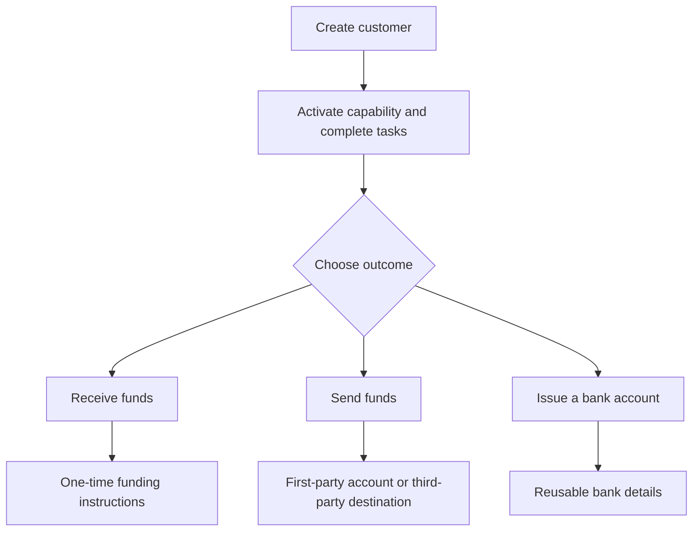

Beginnen Sie beim Kundenergebnis. Jeder Flow nutzt dasselbe Onboarding-Modell und verzweigt sich dann in unterschiedliche Konten und Geldbewegungen.

## Abläufe vergleichen

| Ergebnis | Zuerst vorbereiten | Was Sie erhalten |
| --- | --- | --- |
| Pay-in | Bereite Pay-in-Fähigkeit und ausgegebene Ziel-Wallet | Transferspezifische Anweisungen und Stablecoin-Settlement |
| Payout | Bereite Payout-Fähigkeit, finanzierte ausgegebene Wallet und bereites Konto oder Ziel | Ein Transfer an den ausgewählten Empfänger-Endpunkt |
| Ausgegebenes Bankkonto | Bereite Bank-Fähigkeit und ausgegebene Settlement-Wallet | Wiederverwendbare Bankdaten nach der Bereitstellung |

Ein quotiertes Pay-in erstellt Anweisungen für einen Transfer. Ein ausgegebenes Bankkonto erstellt wiederverwendbare Daten für spätere Einzahlungen. Ein Payout beginnt mit Geldern, die bereits in einer ausgegebenen Wallet verfügbar sind.

## Wählen Sie Ihren Flow

<CardGroup cols={3}>
  <Card title="Gelder empfangen" icon="arrow-down-to-line" href="/de/integration/receive-funds">
    Erstellen und verfolgen Sie ein Fiat-zu-Stablecoin-Pay-in.
  </Card>
  <Card title="Gelder senden" icon="arrow-up-from-line" href="/de/integration/send-funds">
    Bauen Sie einen Erstpartei- oder Drittparteien-Payout auf.
  </Card>
  <Card title="Bankkonto ausgeben" icon="building-columns" href="/de/integration/issue-bank-account">
    Stellen Sie wiederverwendbare, mit einer Wallet verknüpfte Bankdaten bereit.
  </Card>
</CardGroup>
