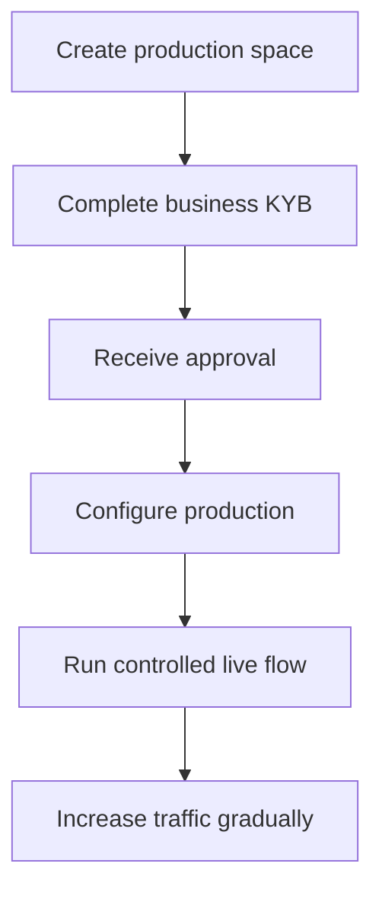

Die Produktionsaktivierung verifiziert Ihr integrierendes Unternehmen. Sie ist getrennt von den API-Kunden, die Sie für Ihr Produkt anlegen.

## Produktions-Space aktivieren

1. Melden Sie sich im Swipelux Dashboard an und wählen Sie **Produktions-Space erstellen**.
2. Öffnen Sie den KYB-Tab oder gehen Sie zu [Unternehmensverifizierung](https://www.swipelux.app/kyb).
3. Füllen Sie jedes angeforderte Feld aus und laden Sie die erforderlichen Dokumente hoch.
4. Reichen Sie Ihr integrierendes Unternehmen zur Verifizierung ein und warten Sie auf die Freigabe.

Erst nachdem Ihr integrierendes Unternehmen und Ihr Produktions-Space freigegeben sind, können Sie produktive API-Kunden und Transaktionen anlegen.

## Produktion unabhängig halten

Legen Sie Produktionsressourcen explizit an. Das Ändern eines API-Schlüssels migriert den Sandbox-Zustand nicht.

- Speichern Sie Produktions-Credentials in einem separaten Secret-Manager-Eintrag.
- Verwenden Sie ausschließlich produktive Deployment-Konfigurationen und Ressourcen-IDs.
- Registrieren Sie einen separaten Produktions-Webhook-Endpunkt und ein separates Signaturgeheimnis.
- Legen Sie die erforderlichen Kunden, Fähigkeiten, Konten, Empfänger und Ziele in der Produktion neu an.
- Beschränken Sie den Produktionszugriff auf die Dienste und Bediener, die ihn benötigen.

Sandbox und Produktion verwenden `https://platform.swipelux.com`; der API-Schlüssel wählt die Umgebung.

## Launch-Checkliste abschließen

- [ ] Testen Sie den Happy Path und die erwarteten Fehlerpfade in der Sandbox.
- [ ] Senden Sie einen `Idempotency-Key` bei jedem Schreibvorgang, der einen erfordert, und bewahren Sie ihn für sichere Wiederholungen auf.
- [ ] Verifizieren Sie Webhook-Signaturen vor dem Parsen, persistieren Sie Ereignis-IDs dauerhaft und testen Sie den Replay.
- [ ] Behandeln Sie nicht verfügbare Fähigkeiten, offene Aufgaben und geänderte Aufgabenrevisionen.
- [ ] Machen Sie Transferfehler und umsetzbare Anweisungen für Ihre Bediener sichtbar.
- [ ] Stellen Sie sicher, dass Logs `X-Request-Id` oder `correlationId` beibehalten, ohne Secrets oder sensible Finanzdaten offenzulegen.

## Einen kontrollierten Live-Flow ausführen

Beginnen Sie mit einem bekannten Kunden und einer geringwertigen Transaktion. Halten Sie fest:

| Kontrolle | Vor dem Test festlegen |
| --- | --- |
| Geltungsbereich | Kunde, Fähigkeit, Konto oder Ziel, Betrag und Methode. |
| Erwartetes Ergebnis | API-Zustand, Guthaben oder Anweisungen und erwartetes Webhook-Ereignis. |
| Verantwortlich | Person, die den vollständigen Flow beobachtet. |
| Stoppbedingung | Jeder unerwartete Zustand, fehlender Webhook, falscher Betrag oder ungelöste Aufgabe. |

Verifizieren Sie sowohl die aktuelle API-Ressource als auch die authentifizierte Webhook-Zustellung. Wenn eines davon vom erwarteten Ergebnis abweicht, stoppen Sie und untersuchen Sie es, bevor Sie weiteren Traffic senden.

Nachdem der vollständige Flow erfolgreich war, erhöhen Sie das Volumen schrittweise und überwachen Sie Zustände von Fähigkeiten, Konten, Zielen und Transfers.

Kehren Sie zu [Häufige Abläufe](/de/integration/common-flows) für die Produktreise zurück oder verwenden Sie die [API-Referenz](/de/api-reference/introduction) für die exakten Verträge.
