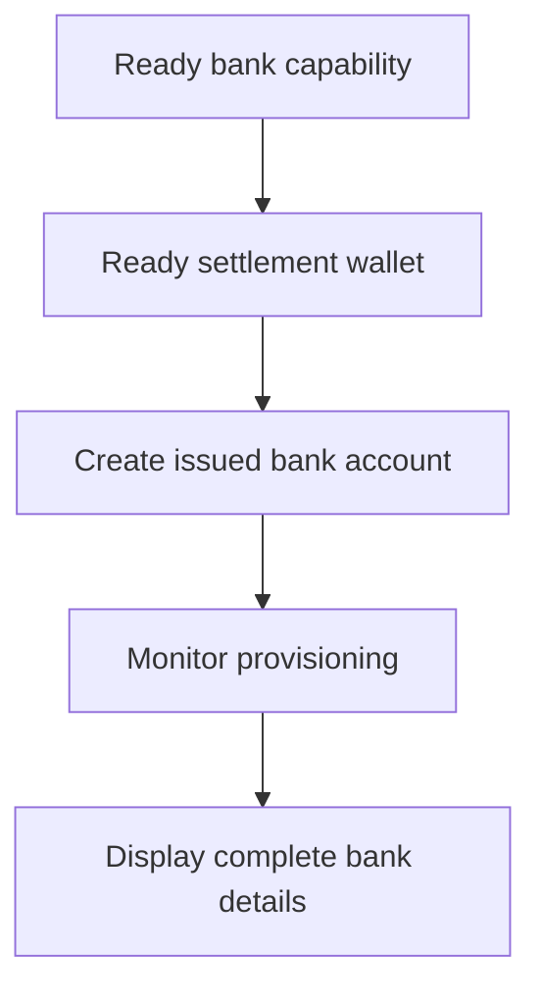

Verwenden Sie ein ausgegebenes Bankkonto, wenn der Kunde wiederverwendbare Bankdaten benötigt. Für einmalige, an einen bestimmten Betrag gebundene Finanzierungsanweisungen verwenden Sie stattdessen [Gelder empfangen](/de/integration/receive-funds).



## Bevor Sie beginnen

Sie benötigen eine Kunden-ID, eine bereite Bank-Fähigkeit für die beabsichtigte Methode und Währung sowie eine bereite ausgegebene Wallet, die demselben Kunden gehört. Erledigen Sie offene Arbeit über [Fähigkeiten und Aufgaben](/de/integration/onboarding/capabilities-and-requirements).

## 1. Settlement-Wallet anlegen oder auswählen

Legen Sie eine ausgegebene Wallet über [Konten und Wallets](/de/integration/accounts#create-the-account) an und lesen Sie sie dann erneut. Fahren Sie nur fort, wenn ihr aktueller Status Settlement erlaubt.

Speichern Sie ihre aus der Antwort abgeleitete `data.id` als `SETTLEMENT_WALLET_ID`. Verwenden Sie keine externe Wallet für `settlement.accountId`.

## 2. Ausgegebenes Bankkonto anlegen

Verwenden Sie [`POST /v3/customers/{customerId}/accounts`](/api-reference/accounts/post-v3-customers-by-customer-id-accounts) mit diesen Headern:

```http
X-API-Key: ${SWIPELUX_API_KEY}
Idempotency-Key: issued-bank-account-001
Content-Type: application/json
```

Senden Sie diesen Request-Body:

```json
{
  "origin": "issued",
  "type": "bank",
  "method": "ach",
  "country": "US",
  "currency": "USD",
  "settlement": {
    "accountId": "${SETTLEMENT_WALLET_ID}"
  },
  "label": "USD account"
}
```

Speichern Sie die zurückgegebene `data.id` als `BANK_ACCOUNT_ID`. Behalten Sie außerdem `data.status`, `data.openTaskIds`, `data.details` und die Settlement-Beziehung.

Die Bankkonto-ID und die Wallet-ID haben unterschiedliche Rollen. Lesen Sie Bereitstellung und Bankdaten über die Bankkonto-ID. Verwenden Sie die Settlement-Wallet-ID, um zu kennzeichnen, wohin Einzahlungen gutgeschrieben werden.

## 3. Bereitstellung überwachen

Lesen Sie [`GET /v3/customers/{customerId}/accounts/{accountId}`](/api-reference/accounts/get-v3-customers-by-customer-id-accounts-by-account-id) nach der Erstellung und nach jedem relevanten Webhook.

Halten Sie die Kundenoberfläche im Wartezustand, solange `details` fehlt. Wenn `openTaskIds` nicht leer ist, erledigen Sie die neuesten Aufgaben und rufen Sie das Konto erneut ab. Leiten Sie die Bereitschaft nicht aus verstrichener Zeit ab.

Wenn der neueste `statusReason.code` gleich `awaiting_assignment` ist, erstellen Sie das erste Pay-in für denselben Kunden, dieselbe Fähigkeit und dieselbe Settlement-Wallet über [Gelder empfangen](/de/integration/receive-funds) und lesen Sie das Bankkonto anschließend erneut. Folgen Sie diesem Zweig nur, wenn das aktuelle Konto es verlangt.

## 4. Bankdaten sicher präsentieren

Zeigen Sie nur die vollständigen Details an, die von der neuesten Kontenlesung zurückgegeben wurden. Wenn `details.referenceRequired` true ist, zeigen Sie die genaue `details.reference` an und machen Sie sie kopierbar. Wenn sie false ist, erfinden Sie keine Referenz.

Diese Bankdaten sind wiederverwendbar. Ersetzen Sie sie nicht durch Finanzierungskoordinaten aus einem quotierten Pay-in, die nur zu diesem Transfer gehören.

Fügen Sie als Nächstes [Webhooks](/de/integration/webhooks) hinzu, damit Bereitstellungs-Updates Ihre Anwendung erreichen, ohne den Kunden auf einem Polling-Bildschirm zu halten.
