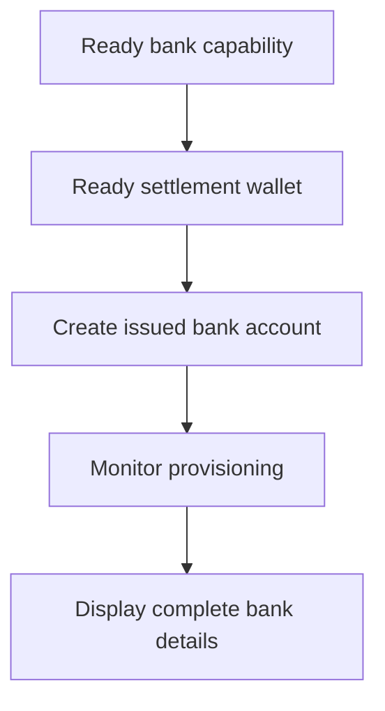

Verwenden Sie ein ausgegebenes Bankkonto, wenn der Kunde wiederverwendbare Bankdaten benötigt. Für einmalige, an einen bestimmten Betrag gebundene Finanzierungsanweisungen verwenden Sie stattdessen [Gelder empfangen](/de/integration/receive-funds).


```mermaid
flowchart TD
  A["Ready bank capability"] --> B["Ready settlement wallet"]
  B --> C["Create issued bank account"]
  C --> D["Monitor provisioning"]
  D --> E["Display complete bank details"]
```

## Bevor Sie beginnen

Sie benötigen eine Kunden-ID, eine bereite Bank-Fähigkeit für die beabsichtigte Methode und Währung sowie eine bereite ausgegebene Wallet, die demselben Kunden gehört. Erledigen Sie offene Arbeit über [Fähigkeiten und Aufgaben](/de/integration/onboarding/capabilities-and-requirements).

## 1. Settlement-Wallet anlegen oder auswählen

Legen Sie eine ausgegebene Wallet über [Konten und Wallets](/de/integration/accounts#create-the-account) an und lesen Sie sie dann erneut. Fahren Sie nur fort, wenn ihr aktueller Status Settlement erlaubt.

Speichern Sie ihre aus der Antwort abgeleitete `data.id` als `SETTLEMENT_WALLET_ID`. Verwenden Sie keine externe Wallet für `settlement.accountId`.

## 2. Ausgegebenes Bankkonto anlegen

Verwenden Sie [`POST /v3/customers/{customerId}/accounts`](/api-reference/accounts/post-v3-customers-by-customer-id-accounts) mit diesen Headern:

```http
X-API-Key: ${SWIPELUX_API_KEY}
Idempotency-Key: issued-bank-account-001
Content-Type: application/json
```

Senden Sie diesen Request-Body:

```json
{
  "origin": "issued",
  "type": "bank",
  "method": "ach",
  "country": "US",
  "currency": "USD",
  "settlement": {
    "accountId": "${SETTLEMENT_WALLET_ID}"
  },
  "label": "USD account"
}
```

Speichern Sie die zurückgegebene `data.id` als `BANK_ACCOUNT_ID`. Behalten Sie außerdem `data.status`, `data.openTaskIds`, `data.details` und die Settlement-Beziehung.

Optionale Anfragefelder:

| Feld | Gilt für | Verhalten |
| --- | --- | --- |
| `institution` | Ausgegebene `ach`, `wire` und `swift` | Wählt genau diese Bank aus. Swipelux weicht nicht auf eine andere Bank aus. Verwenden Sie eine Institutions-ID aus der Antwort zu den unterstützten Fähigkeiten. |
| `allowPending` | Ausgegebene `ach`, `wire` und `swift` | Auf `true` setzen, um die Anfrage zu speichern, während der Antrag bei der ausgewählten Bank auf Genehmigung wartet. Erfordert `institution`. |
| `settlement.currency` | Ausgegebene `USD`-Bankkonten | `USDC` oder `USDT`. Legt den Stablecoin fest, der an die Settlement-Wallet geliefert wird. |

### Bank auswählen {#choose-the-bank}

Senden Sie `institution`, wenn der Kunde Bankdaten von einer bestimmten Bank benötigt. Swipelux reserviert ein ausgegebenes Konto pro Kunde, Methode, Währung und Institution. Wenn Sie `institution` weglassen, deckt ein ausgegebenes Konto pro Methode und Währung alle Banken ab. Eine zweite Erstellungsanfrage für diese Methode und Währung gibt dann `409 conflict` zurück.

Kontolesungen geben die ausgewählte Bank als `institution` mit `id`, `name` und `bic` zurück. `bic` kann `null` sein.

Die Idempotenz bezieht sich auf die ausgewählte Bank. Das erneute Senden derselben Anfrage gibt das ursprüngliche Konto zurück. Eine Änderung von `institution` unter demselben `Idempotency-Key` gibt `409 idempotency_conflict` zurück.

### Anfrage vor der Bankgenehmigung speichern {#save-the-request-before-bank-approval}

Standardmäßig akzeptiert Swipelux eine Anfrage für ein ausgegebenes Bankkonto erst, wenn die Bank-Fähigkeit bereit ist. Um die Kontoeinrichtung des Kunden früher zu erfassen, senden Sie `allowPending: true` zusammen mit `institution`:

```json
{
  "origin": "issued",
  "type": "bank",
  "method": "wire",
  "country": "US",
  "currency": "USD",
  "institution": "${INSTITUTION_ID}",
  "allowPending": true,
  "settlement": {
    "accountId": "${SETTLEMENT_WALLET_ID}"
  },
  "label": "USD wire account"
}
```

Solange der Antrag bei der Bank geprüft wird, gibt das Konto `status: "in_review"` zurück, wobei `statusReason.code` auf `waiting_for_approval` gesetzt ist. Die Antwort enthält außerdem `applicationId` und die `openTaskIds` des Antrags. Erledigen Sie diese Aufgaben über [Fähigkeiten und Aufgaben](/de/integration/onboarding/capabilities-and-requirements).

Die gespeicherte Anfrage behält ihre Konto-ID, ihre Settlement-Wallet und ihren Konto-Slot. Sobald Antrag und Fähigkeit bereit sind, stellt Swipelux die Bankdaten unter derselben `BANK_ACCOUNT_ID` bereit. Lesen Sie weiterhin diese ID. Erstellen Sie keine weitere Anfrage.

Wenn der Antrag zuvor abgelehnt, storniert oder archiviert wird, wechselt das Konto zu `rejected`. Es belegt dann keinen Konto-Slot mehr, sodass Sie eine neue Anfrage senden können.

### Settlement-Währung auswählen {#choose-the-settlement-currency}

Standardmäßig werden Einzahlungen in der Währung der Settlement-Wallet abgewickelt. Setzen Sie `settlement.currency` auf `USDC` oder `USDT`, um das gelieferte Asset unabhängig von der Währung der Wallet zu wählen:

```json
{
  "settlement": {
    "accountId": "${SETTLEMENT_WALLET_ID}",
    "currency": "USDT"
  }
}
```

Kontolesungen geben die gespeicherte Auswahl zurück, auch während das Konto bereitgestellt wird. Eine spätere Änderung der Settlement-Währung ändert weder die Wallet noch bewertet sie Einzahlungen neu, die Swipelux dem Konto bereits zugeordnet hat.

Die Bankkonto-ID und die Wallet-ID haben unterschiedliche Rollen. Lesen Sie Bereitstellung und Bankdaten über die Bankkonto-ID. Verwenden Sie die Settlement-Wallet-ID, um zu kennzeichnen, wohin Einzahlungen gutgeschrieben werden.

## 3. Bereitstellung überwachen

Lesen Sie [`GET /v3/customers/{customerId}/accounts/{accountId}`](/api-reference/accounts/get-v3-customers-by-customer-id-accounts-by-account-id) nach der Erstellung und nach jedem relevanten Webhook.

Halten Sie die Kundenoberfläche im Wartezustand, solange `details` fehlt. Wenn `openTaskIds` nicht leer ist, erledigen Sie die neuesten Aufgaben und rufen Sie das Konto erneut ab. Leiten Sie die Bereitschaft nicht aus verstrichener Zeit ab.

Wenn das Konto mit `allowPending: true` gespeichert wurde, bleibt es im Status `in_review` mit `statusReason.code` gleich `waiting_for_approval`, bis die Bank den Antrag genehmigt.

Wenn der neueste `statusReason.code` gleich `awaiting_assignment` ist, erstellen Sie das erste Pay-in für denselben Kunden, dieselbe Fähigkeit und dieselbe Settlement-Wallet über [Gelder empfangen](/de/integration/receive-funds) und lesen Sie das Bankkonto anschließend erneut. Folgen Sie diesem Zweig nur, wenn das aktuelle Konto es verlangt.

## 4. Bankdaten sicher präsentieren

Zeigen Sie nur die vollständigen Details an, die von der neuesten Kontenlesung zurückgegeben wurden. Wenn `details.referenceRequired` true ist, zeigen Sie die genaue `details.reference` an und machen Sie sie kopierbar. Wenn sie false ist, erfinden Sie keine Referenz.

Zeigen Sie bei ausgegebenen `swift`-Konten `details.swiftCode` (die BIC der empfangenden Bank), `details.accountNumber`, `details.accountHolderName` und `details.accountHolderAddress` an, sofern sie zurückgegeben werden. Absender müssen die Begünstigtenadresse exakt in die internationale Überweisung übernehmen. Zeigen Sie außerdem `details.bankAddress` und alle Felder zu zwischengeschalteten Banken an, die das Konto zurückgibt.

Diese Bankdaten sind wiederverwendbar. Ersetzen Sie sie nicht durch Finanzierungskoordinaten aus einem quotierten Pay-in, die nur zu diesem Transfer gehören.

Fügen Sie als Nächstes [Webhooks](/de/integration/webhooks) hinzu, damit Bereitstellungs-Updates Ihre Anwendung erreichen, ohne den Kunden auf einem Polling-Bildschirm zu halten.
