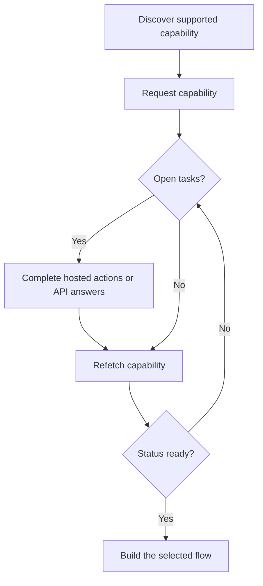

Eine Fähigkeit sagt Ihnen, ob ein Kunde ein bestimmtes Ergebnis, eine Zahlungsmethode und Richtung verwenden kann. Offene Aufgaben sagen Ihnen, was passieren muss, bevor diese Fähigkeit oder eine zugehörige Ressource fortgesetzt werden kann.



```bash
export API_BASE='https://platform.swipelux.com'
export SWIPELUX_API_KEY='replace-with-your-api-key'
```

## Unterstützte Fähigkeiten entdecken

Lesen Sie die aktuellen Optionen des Kunden mit [`GET /v3/customers/{customerId}/capabilities/supported`](/api-reference/capabilities/get-v3-customers-by-customer-id-capabilities-supported):

```bash
curl --request GET \
  "${API_BASE}/v3/customers/${CUSTOMER_ID}/capabilities/supported" \
  --header "X-API-Key: ${SWIPELUX_API_KEY}"
```

Wählen Sie einen Antwort-Eintrag, der den beabsichtigten `directions`, `method` und `accountType` entspricht. Fahren Sie nur fort, wenn `availability` gleich `available` oder `beta` und `eligibility.eligible` gleich `true` ist. Wenn `institutions` zurückgegeben werden, wählen Sie nur eine ID aus dieser Antwort aus.

Speichern Sie die ausgewählte `data[].id` als `CAPABILITY_ID`. Kopieren Sie niemals eine Fähigkeits-ID von einem anderen Kunden oder aus einer anderen Umgebung.

### Pooled vs. named Kontotypen

Bank-Fähigkeiten gibt es in zwei Varianten, kodiert im Feld `accountType` und dem Fähigkeits-ID-Suffix (zum Beispiel `ach_pooled`, `wire_named`):

- **`pooled`**: gemeinsam genutztes Swipelux-Bankkonto. Jedes Pay-in verwendet eine eindeutige Referenz, um Gelder weiterzuleiten. Wählen Sie dies für einmalige Transfers.
- **`named`**: dedizierte Bankdaten für den Kunden (virtuelle IBAN, dediziertes ACH-Konto). Wiederverwendbar und mit jedem Zahler teilbar. Erforderlich für [ausgegebene Bankkonten](/de/integration/issue-bank-account).

Standardmäßig `pooled`. Verwenden Sie `named` nur, wenn der Kunde wiederverwendbare Bankdaten benötigt. Prüfen Sie die `supported`-Antwort, um zu sehen, welche Varianten verfügbar sind.

## Fähigkeit anfordern

Fordern Sie die ausgewählte Option mit [`POST /v3/customers/{customerId}/capabilities/{capabilityId}`](/api-reference/capabilities/post-v3-customers-by-customer-id-capabilities-by-capability-id) an:

```bash
curl --request POST \
  "${API_BASE}/v3/customers/${CUSTOMER_ID}/capabilities/${CAPABILITY_ID}" \
  --header "X-API-Key: ${SWIPELUX_API_KEY}" \
  --header "Idempotency-Key: capability-request-001" \
  --header "Content-Type: application/json" \
  --data '{}'
```

Verwenden Sie ein explizites `institutions`-Array nur, wenn Sie aus IDs auswählen müssen, die von der Supported-Capability-Antwort zurückgegeben wurden.

Speichern Sie `data.status` als `CAPABILITY_STATUS`, `data.openTaskIds` als `OPEN_TASK_IDS` und jede `data.applications[].id` in `APPLICATION_IDS`.

## Aktuelle Aufgaben erledigen {#complete-current-tasks}

Listen Sie Aufgaben mit [`GET /v3/customers/{customerId}/tasks`](/api-reference/tasks/list-customer-tasks) auf, wählen Sie IDs aus `OPEN_TASK_IDS` aus und lesen Sie dann jede aktuelle Aufgabe mit [`GET /v3/customers/{customerId}/tasks/{taskId}`](/api-reference/tasks/get-customer-task):

```bash
curl --request GET \
  "${API_BASE}/v3/customers/${CUSTOMER_ID}/tasks/${TASK_ID}" \
  --header "X-API-Key: ${SWIPELUX_API_KEY}"
```

Verwenden Sie die neuesten `data.revision` und `data.requirements`. Rufen Sie die Aufgabe unmittelbar vor dem Absenden erneut ab, wenn sich eines von beiden geändert haben könnte.

### Gehostete Aktionen

In der Antwort mit den Aufgabendetails enthält jeder Eintrag in `verificationSessions` und `tosSessions` ein `action`-Objekt. Antworten der Aufgabenliste enthalten diese Aktionslinks nicht. Speichern Sie die `id` jeder Sitzung und lesen Sie `action.kind`, bevor Sie den Kunden weiterleiten; leiten Sie die Verfügbarkeit des Links nicht aus dem `status` der Sitzung ab.

- `action.kind: "available"` enthält `action.url` und `action.expiresAt` (derzeit immer `null`). Speichern Sie `action.url`, senden Sie den Kunden dorthin und lesen Sie die Aufgabe anschließend erneut. Die Felder `url` und `expiresAt` auf Sitzungsebene enthalten dieselben Werte.
- `action.kind: "unavailable"` bedeutet, dass kein Link angezeigt werden soll. Die Felder `url` und `expiresAt` auf Sitzungsebene fehlen. Der `status` einer Sitzung allein bestimmt nicht, welche Aktionsart Sie erhalten.

```json
{
  "data": {
    "verificationSessions": [
      {
        "id": "vfy_000000000000000003",
        "key": "identity_verification",
        "type": "identity_verification",
        "status": "action_required",
        "action": {
          "kind": "available",
          "url": "https://platform.swipelux.com/kyc/redirect/cus_000000000000000001/tsk_000000000000000002/vfy_000000000000000003",
          "expiresAt": null
        },
        "url": "https://platform.swipelux.com/kyc/redirect/cus_000000000000000001/tsk_000000000000000002/vfy_000000000000000003",
        "expiresAt": null
      }
    ],
    "tosSessions": [
      {
        "id": "vfy_000000000000000004",
        "key": "terms_of_service",
        "type": "terms_of_service",
        "status": "completed",
        "action": { "kind": "unavailable" }
      }
    ]
  }
}
```

Dies sind aufgabenbezogene Aktionen, kein separater Kundenverifizierungs-Lebenszyklus.

### Dokumente hochladen {#upload-documents}

Wenn eine Anforderung ein Dokument verlangt, laden Sie es mit [`POST /v3/customers/{customerId}/documents`](/api-reference/documents/post-v3-customers-by-customer-id-documents) hoch:

```bash
export DOCUMENT_PATH='/absolute/path/to/requested-document.pdf'

curl --request POST \
  "${API_BASE}/v3/customers/${CUSTOMER_ID}/documents" \
  --header "X-API-Key: ${SWIPELUX_API_KEY}" \
  --header "Idempotency-Key: customer-document-001" \
  --form "file=@${DOCUMENT_PATH}"
```

Speichern Sie die zurückgegebene `data.id` als `DOCUMENT_ID`, bevor Sie die Antwort einreichen, die darauf verweist.

Um eine gespeicherte Datei später abzurufen, rufen Sie [`GET /v3/customers/{customerId}/documents/{documentId}/download`](/api-reference/documents/get-v3-customers-by-customer-id-documents-by-document-id-download) auf. Swipelux liefert eine `url`, die die Datei als Anhang herunterlädt und nach einer Stunde abläuft. Archivierte Dokumente liefern `404`.

### API-Antworten

Reichen Sie einen vollständigen Antwortsatz für die aktuelle Revision mit [`POST /v3/customers/{customerId}/tasks/{taskId}/submissions`](/api-reference/task-submissions/create-customer-task-submission) ein:

```bash
curl --request POST \
  "${API_BASE}/v3/customers/${CUSTOMER_ID}/tasks/${TASK_ID}/submissions" \
  --header "X-API-Key: ${SWIPELUX_API_KEY}" \
  --header "Idempotency-Key: task-submission-001" \
  --header "Content-Type: application/json" \
  --data @- <<'JSON'
{
  "taskRevision": 3,
  "answers": [
    {
      "requirementId": "req_from_current_task",
      "answer": {
        "type": "text",
        "value": "Current answer"
      }
    }
  ]
}
JSON
```

Übernehmen Sie jede Anforderungs-ID und jeden Antworttyp aus der neuesten Aufgabe. Wenn die API meldet, dass sich die Aufgabe geändert hat, rufen Sie sie erneut ab und bauen Sie die Einreichung aus der neuen Revision neu auf.

## Fortfahren, wenn die Fähigkeit bereit ist

Lesen Sie die Fähigkeit erneut mit [`GET /v3/customers/{customerId}/capabilities/{capabilityId}`](/api-reference/capabilities/get-v3-customers-by-customer-id-capabilities-by-capability-id):

```bash
curl --request GET \
  "${API_BASE}/v3/customers/${CUSTOMER_ID}/capabilities/${CAPABILITY_ID}" \
  --header "X-API-Key: ${SWIPELUX_API_KEY}"
```

Ersetzen Sie den gespeicherten Status und die Aufgaben-IDs durch die neueste Antwort. Fahren Sie nur fort, wenn der aktuelle Fähigkeitsstatus das Konto, das Quote oder den Transfer erlaubt, den Sie erstellen möchten.

Wählen Sie als Nächstes die passende Reise in [Häufige Abläufe](/de/integration/common-flows).
