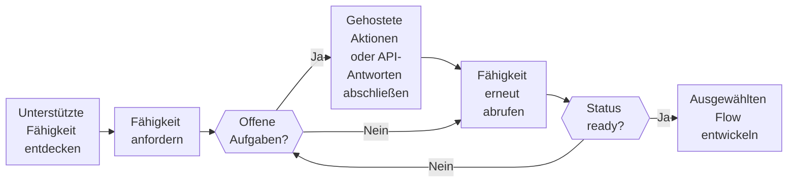

Eine Fähigkeit sagt Ihnen, ob ein Kunde ein bestimmtes Ergebnis, eine Zahlungsmethode und Richtung verwenden kann. Offene Aufgaben sagen Ihnen, was passieren muss, bevor diese Fähigkeit oder eine zugehörige Ressource fortgesetzt werden kann.


```mermaid
%%{init: {"flowchart": {"rankSpacing": 20, "nodeSpacing": 16, "wrappingWidth": 80, "padding": 8}}}%%
flowchart LR
  A["Unterstützte Fähigkeit entdecken"] --> B["Fähigkeit anfordern"]
  B --> C{{"Offene Aufgaben?"}}
  C -->|"Ja"| D["Gehostete Aktionen oder API-Antworten abschließen"]
  D --> E["Fähigkeit erneut abrufen"]
  C -->|"Nein"| E
  E --> F{{"Status ready?"}}
  F -->|"Nein"| C
  F -->|"Ja"| G["Ausgewählten Flow entwickeln"]
```

```bash Environment variables
export API_BASE='https://platform.swipelux.com'
export SWIPELUX_API_KEY='replace-with-your-api-key'
```

## Unterstützte Fähigkeiten entdecken

Lesen Sie die aktuellen Optionen des Kunden mit [`GET /v3/customers/{customerId}/capabilities/supported`](/api-reference/capabilities/get-v3-customers-by-customer-id-capabilities-supported):

```bash List supported capabilities
curl --request GET \
  "${API_BASE}/v3/customers/${CUSTOMER_ID}/capabilities/supported" \
  --header "X-API-Key: ${SWIPELUX_API_KEY}"
```

Wählen Sie einen Antwort-Eintrag, der den beabsichtigten `directions`, `method` und `accountType` entspricht. Fahren Sie nur fort, wenn `availability` gleich `available` oder `beta` und `eligibility.eligible` gleich `true` ist. Wenn `institutions` zurückgegeben werden, wählen Sie nur eine ID aus dieser Antwort aus.

Jeder Institutionseintrag enthält eine `logoUrl` und ein `isDefault`-Flag. Verwenden Sie `logoUrl`, um das Logo der Bank in einer Bankauswahl-UI anzuzeigen, und rendern Sie Ihr eigenes generisches Banksymbol, wenn der Wert `null` ist. `isDefault` gilt nur für diesen Kunden und diese Fähigkeit, nicht global für die Institution. [`GET /v3/institutions`](/api-reference/institutions/get-v3-institutions) gibt dieselbe nullable `logoUrl` zurück. Institutions-IDs sind opak, verarbeiten Sie neue IDs daher ohne Codeänderungen.

```json Institution entry
{
  "institutions": [
    {
      "id": "jpmorgan",
      "name": "JPMorgan Chase",
      "bic": "CHASUS33",
      "logoUrl": "https://wallet.swipelux.com/bank-logos/jpmorgan.png",
      "countries": ["US"],
      "isDefault": true
    }
  ]
}
```

Speichern Sie die ausgewählte `data[].id` als `CAPABILITY_ID`. Kopieren Sie niemals eine Fähigkeits-ID von einem anderen Kunden oder aus einer anderen Umgebung.

### Pooled vs. named Kontotypen

Bank-Fähigkeiten gibt es in zwei Varianten, kodiert im Feld `accountType` und dem Fähigkeits-ID-Suffix (zum Beispiel `ach_pooled`, `wire_named`):

- **`pooled`**: gemeinsam genutztes Swipelux-Bankkonto. Jedes Pay-in verwendet eine eindeutige Referenz, um Gelder weiterzuleiten. Wählen Sie dies für einmalige Transfers.
- **`named`**: dedizierte Bankdaten für den Kunden (virtuelle IBAN, dediziertes ACH-Konto). Wiederverwendbar und mit jedem Zahler teilbar. Erforderlich für [ausgegebene Bankkonten](/de/integration/issue-bank-account).

Standardmäßig `pooled`. Verwenden Sie `named` nur, wenn der Kunde wiederverwendbare Bankdaten benötigt. Prüfen Sie die `supported`-Antwort, um zu sehen, welche Varianten verfügbar sind.

Um SWIFT-Einzahlungen zu empfangen oder SWIFT-Bankdaten auszugeben, verwenden Sie `swift_named`. `swift_pooled` unterstützt nur Payouts, prüfen Sie also die `directions` jeder Option in der Antwort zu den unterstützten Fähigkeiten. Ein named SWIFT-Konto gibt wiederverwendbare Empfangsdaten zurück, darunter die BIC der Bank, eine Referenz, falls eine erforderlich ist, und die Begünstigtenadresse, sofern die Bank sie bereitstellt.

Für ausgegebene ACH-, Wire- und SWIFT-Konten können Sie mit `institution` eine bestimmte Bank auswählen und die Kontoanfrage speichern, bevor die Bank den Kunden genehmigt. Siehe [Bankkonto ausgeben](/de/integration/issue-bank-account#choose-the-bank).

## Fähigkeit anfordern

Fordern Sie die ausgewählte Option mit [`POST /v3/customers/{customerId}/capabilities/{capabilityId}`](/api-reference/capabilities/post-v3-customers-by-customer-id-capabilities-by-capability-id) an:

```bash Request capability
curl --request POST \
  "${API_BASE}/v3/customers/${CUSTOMER_ID}/capabilities/${CAPABILITY_ID}" \
  --header "X-API-Key: ${SWIPELUX_API_KEY}" \
  --header "Idempotency-Key: capability-request-001" \
  --header "Content-Type: application/json" \
  --data '{}'
```

Verwenden Sie ein explizites `institutions`-Array nur, wenn Sie aus IDs auswählen müssen, die von der Supported-Capability-Antwort zurückgegeben wurden.

Speichern Sie `data.status` als `CAPABILITY_STATUS`, `data.accountProvisioning` als `ACCOUNT_PROVISIONING_STATUS`, `data.openTaskIds` als `OPEN_TASK_IDS` und jede `data.applications[].id` in `APPLICATION_IDS`.

### Gemeinsame Anträge pro Bank {#shared-applications-per-bank}

Bei named Bank-Fähigkeiten hat jeder Kunde einen Antragsfall pro Bank. Pooled- und Plattform-Fähigkeiten verwenden Fälle ohne Bank. Swipelux teilt einen Fall über alle kompatiblen Fähigkeiten, die Sie anfordern:

- Eine Genehmigung kann mehrere Fähigkeiten abdecken. Zum Beispiel kann ein genehmigter Fall bei einer Bank sowohl eine ACH- als auch eine Wire-Fähigkeit `ready` machen.
- Eine spätere Anfrage, die zu einem bestehenden Fall passt, verwendet diesen wieder. Swipelux eröffnet keinen zweiten Antrag und fügt keine doppelten Aufgaben hinzu.
- Fälle bei verschiedenen Banken sind unabhängig. Eine Ablehnung bei einer Bank wirkt sich nicht auf einen Fall bei einer anderen Bank aus.

Die Antwort auf die Anfrage zeigt Ihnen, welchen Fall Swipelux verwendet hat:

- `201` bedeutet, dass die Anfrage einen neuen Antragsfall eröffnet hat.
- `200` bedeutet, dass die Anfrage einem Antragsfall zugeordnet wurde, den der Kunde bereits hatte, zum Beispiel bei einer wiederholten Anfrage für eine Bank-Fähigkeit, die der Kunde bereits besitzt, oder bei einer Anfrage für eine stornierte Fähigkeit. Eine wiederholte Anfrage für `card` oder `stablecoin_transfers` gibt weiterhin [`409 capability_already_exists`](/integration/errors#capability-already-exists) zurück.
- `selectedApplicationId` ist ein Feld auf oberster Ebene neben `data` mit der ID des Falls, den die Anfrage ausgewählt oder eröffnet hat. Swipelux lässt es weg, wenn die Anfrage keinen Fall ausgewählt hat. Eine idempotente Wiederholung gibt denselben Wert zurück.

Gekürzte Antwort:

```json Response (abbreviated)
{
  "data": {
    "id": "ach_named",
    "status": "pending",
    "openTaskIds": ["tsk_000000000000000002"],
    "applications": [{ "id": "apl_000000000000000005", "status": "in_review" }]
  },
  "selectedApplicationId": "apl_000000000000000005"
}
```

Senden Sie bei named Fähigkeiten dieselbe `institutions`-Liste erneut, um denselben Fall auszuwählen, oder senden Sie eine einzelne Institutions-ID, um gezielt diese Bank anzusprechen. Eine Bank, die den Kunden endgültig abgelehnt hat, wird übersprungen. Wenn Sie nur diese Bank angeben oder alle berechtigten Banken den Kunden abgelehnt haben, gibt die Anfrage [`409 capability_terminally_rejected`](/integration/errors#capability-terminally-rejected) zurück. Um es nach einer Ablehnung bei einer anderen Bank zu versuchen, fordern Sie die Fähigkeit erneut mit der Institutions-ID dieser Bank an.

Der Status einer Fähigkeit spiegelt alle zugehörigen Fälle des Kunden wider. Bei einer named Fähigkeit genügt ein `ready`-Fall, dessen Genehmigung sie abdeckt, damit sie `ready` wird, unabhängig davon, was andere Banken melden. Eine pooled Fähigkeit wartet zusätzlich auf ihre Methodenprüfung, die in `probes` in der Antragsliste des Kunden gemeldet wird.

#### Anträge des Kunden auflisten {#list-the-customers-applications}

Listen Sie alle Antragsfälle des Kunden mit [`GET /v3/customers/{customerId}/applications`](/api-reference/capabilities/get-v3-customers-by-customer-id-applications) auf. Die Ergebnisse sind mit `nextCursor` und `hasMore` paginiert und akzeptieren `updatedAfter`:

```bash List applications
curl --request GET \
  "${API_BASE}/v3/customers/${CUSTOMER_ID}/applications" \
  --header "X-API-Key: ${SWIPELUX_API_KEY}"
```

Jeder Eintrag enthält die Antragsfelder, die in `applications[]` einer Fähigkeit zurückgegeben werden, und zusätzlich:

- `scope`: `named` für einen Fall bei einer Bank, `provider_pooled` oder `platform` für Fälle ohne Bank oder `null` für einen nicht klassifizierten historischen Fall. `institution` fehlt bei `provider_pooled`- und `platform`-Fällen.
- `requestedScope[]`: die Fähigkeitsschlüssel, die für den Fall angefordert wurden, jeweils mit ihrem ersten `requestedAt`. Einträge werden nie entfernt.
- `coverage[]`: die Fähigkeitsschlüssel, die die Genehmigung des Falls abdeckt, jeweils mit `grantedAt` und `source`. Coverage erfasst den Umfang, nicht die Autorisierung. Lesen Sie die Fähigkeit, um ihren aktuellen Status zu erhalten.
- `probes[]`: Methodenprüfungen für die pooled Fähigkeitsschlüssel, die der Fall abdeckt, jeweils mit `capabilityKey`, `status` und `reason`. Named Schlüssel erfordern nie eine Prüfung.
- `generation`, `predecessorApplicationId` und `supersededByApplicationId`: Nachfolgeverknüpfungen. Wenn `supersededByApplicationId` gesetzt ist, wurde der Fall ersetzt. Folgen Sie dieser ID zum aktuellen Fall.

Gekürzte Antwort:

```json Response (abbreviated)
{
  "data": [
    {
      "id": "apl_000000000000000005",
      "status": "ready",
      "scope": "named",
      "institution": { "id": "jpmorgan", "name": "JPMorgan Chase", "bic": "CHASUS33" },
      "requestedScope": [
        { "capabilityKey": "ach_named", "requestedAt": "2026-09-20T10:00:00.000Z" }
      ],
      "coverage": [
        { "capabilityKey": "ach_named", "grantedAt": "2026-09-22T12:00:00.000Z", "source": "approval" },
        { "capabilityKey": "wire_named", "grantedAt": "2026-09-22T12:00:00.000Z", "source": "approval" }
      ],
      "probes": [],
      "generation": 1,
      "predecessorApplicationId": null,
      "supersededByApplicationId": null
    }
  ],
  "nextCursor": null,
  "hasMore": false
}
```

## Aktuelle Aufgaben erledigen {#complete-current-tasks}

Listen Sie Aufgaben mit [`GET /v3/customers/{customerId}/tasks`](/api-reference/tasks/list-customer-tasks) auf, wählen Sie IDs aus `OPEN_TASK_IDS` aus und lesen Sie dann jede aktuelle Aufgabe mit [`GET /v3/customers/{customerId}/tasks/{taskId}`](/api-reference/tasks/get-customer-task):

```bash List open tasks
curl --request GET \
  "${API_BASE}/v3/customers/${CUSTOMER_ID}/tasks/${TASK_ID}" \
  --header "X-API-Key: ${SWIPELUX_API_KEY}"
```

Verwenden Sie die neuesten `data.revision` und `data.requirements`. Rufen Sie die Aufgabe unmittelbar vor dem Absenden erneut ab, wenn sich eines von beiden geändert haben könnte.

### Wiederverwendete Profilnachweise {#reused-profile-evidence}

Bei Antragsaufnahme-Aufgaben, die eine direkte API-Einreichung akzeptieren, verwendet Swipelux Informationen wieder, die der Kunde bereits bereitgestellt hat. Wenn eine solche Aufgabe erstellt oder abgeglichen wird, prüft Swipelux das Kundenprofil und die vom Kunden selbst hochgeladenen Dokumente. Berechtigte Anforderungen, die bereits durch einen verwendbaren Profilwert oder ein Dokument belegt sind, wechseln zu `in_review`, statt handlungsfähig zu bleiben. Profilaktualisierungen und neue Dokument-Uploads lösen dieselbe Prüfung für bestehende Aufgaben aus.

Nur fehlende oder inkompatible Werte bleiben handlungsfähig. Die Wiederverwendung genehmigt die Nachweise nicht. Swipelux prüft sie weiterhin. Ausdrückliche Korrekturanfragen und bereits beantwortete Anforderungen bleiben handlungsfähig. Dokumente von Eigentümern und verbundenen Parteien werden nicht wiederverwendet, und Anforderungen, die nur über eine gehostete Session erfasst werden, behalten ihren normalen Ablauf.

### Anforderungen rendern {#render-requirements}

Erstellen Sie Formulare aus den Metadaten, die jede Anforderung zurückgibt, statt aus Anforderungsschlüsseln. Eine Anforderung kann einen optionalen kurzen `title` enthalten, und jeder `request` enthält einen `prompt`, der unter der Überschrift angezeigt wird.

Anforderungen mit `request.type: "profile"` identifizieren das Profilfeld mit `profilePointer` und ergänzen Eingabemetadaten:

- `allowedValues`: die zulässigen Werte für ein skalares Feld oder für jedes Element eines Array-Felds. Senden Sie diese Werte, nicht übersetzte Anzeigebezeichnungen.
- `valueSchema`: ein eigenständiges JSON Schema Draft 7-Dokument, das die Eingabeform, verschachtelte Eigenschaften, Pflichtfelder und strukturelle Einschränkungen beschreibt. Enums für Objekte erscheinen an der jeweiligen Eigenschaft, zum Beispiel `valueSchema.items.properties.type.enum` für Steueridentifikatoren. Swipelux wendet nach der Einreichung weiterhin feldübergreifende Validierung und Prüfungsvalidierung an, daher kann ein Wert, der das Schema erfüllt, dennoch abgelehnt werden.
- `valueType: "country"` oder `itemValueType: "country"` für Arrays: Das Feld akzeptiert ISO 3166-1 alpha-2-Codes in Großbuchstaben. Verschachtelte Ländereigenschaften in `valueSchema` verwenden `format: "iso-3166-1-alpha-2"`. Verwenden Sie für lokalisierte Bezeichnungen eine Standard-Länderliste.

```json Requirement
{
  "id": "req_000000000000000010",
  "key": "account_purposes",
  "title": "Account purpose",
  "status": "action_required",
  "request": {
    "type": "profile",
    "prompt": "Select every purpose that applies.",
    "required": true,
    "profilePointer": "/financialProfile/accountPurposes",
    "valueType": "array",
    "itemValueType": "string",
    "allowedValues": ["business_expenses", "ecommerce", "payroll"],
    "valueSchema": {
      "$schema": "http://json-schema.org/draft-07/schema#",
      "type": "array",
      "items": { "enum": ["business_expenses", "ecommerce", "payroll"] }
    }
  }
}
```

Dieses Beispiel kürzt den Wertekatalog; die API gibt jeden zulässigen Wert zurück. Einige Profilanforderungen haben kein veröffentlichtes Schema und lassen `valueSchema` und `allowedValues` weg. Rendern Sie diese anhand von `prompt` und `valueType`.

Jede offene Aufgabe enthält einen `dueAt`-Zeitstempel. Wenn Swipelux eine Aufgabe ohne explizites Fälligkeitsdatum erstellt, wird `dueAt` standardmäßig auf genau 31 Tage nach dem `createdAt` der Aufgabe gesetzt. Behandeln Sie `dueAt` als informativ: Sie können es nicht über die API setzen, und es löst keinen automatischen Lebenszyklusübergang aus. Nur das separate Feld `deadline` verursacht, falls vorhanden, einen automatischen Übergang.

### Gehostete Aktionen

In der Antwort mit den Aufgabendetails enthält jeder Eintrag in `verificationSessions` und `tosSessions` ein `action`-Objekt. Antworten der Aufgabenliste enthalten diese Aktionslinks nicht. Speichern Sie die `id` jeder Sitzung und lesen Sie `action.kind`, bevor Sie den Kunden weiterleiten; leiten Sie die Verfügbarkeit des Links nicht aus dem `status` der Sitzung ab.

- `action.kind: "available"` enthält `action.url` und `action.expiresAt` (derzeit immer `null`). Speichern Sie `action.url`, senden Sie den Kunden dorthin und lesen Sie die Aufgabe anschließend erneut. Die Felder `url` und `expiresAt` auf Sitzungsebene enthalten dieselben Werte.
- `action.kind: "unavailable"` bedeutet, dass kein Link angezeigt werden soll. Die Felder `url` und `expiresAt` auf Sitzungsebene fehlen. Der `status` einer Sitzung allein bestimmt nicht, welche Aktionsart Sie erhalten.

```json Verification session
{
  "data": {
    "verificationSessions": [
      {
        "id": "vfy_000000000000000003",
        "key": "identity_verification",
        "type": "identity_verification",
        "status": "action_required",
        "action": {
          "kind": "available",
          "url": "https://platform.swipelux.com/kyc/redirect/cus_000000000000000001/tsk_000000000000000002/vfy_000000000000000003",
          "expiresAt": null
        },
        "url": "https://platform.swipelux.com/kyc/redirect/cus_000000000000000001/tsk_000000000000000002/vfy_000000000000000003",
        "expiresAt": null
      }
    ],
    "tosSessions": [
      {
        "id": "vfy_000000000000000004",
        "key": "terms_of_service",
        "type": "terms_of_service",
        "status": "completed",
        "action": { "kind": "unavailable" }
      }
    ]
  }
}
```

Dies sind aufgabenbezogene Aktionen, kein separater Kundenverifizierungs-Lebenszyklus.

### Dokumente hochladen {#upload-documents}

Wenn eine Anforderung ein Dokument verlangt, laden Sie es mit [`POST /v3/customers/{customerId}/documents`](/api-reference/documents/post-v3-customers-by-customer-id-documents) hoch:

```bash Upload document
export DOCUMENT_PATH='/absolute/path/to/requested-document.pdf'

curl --request POST \
  "${API_BASE}/v3/customers/${CUSTOMER_ID}/documents" \
  --header "X-API-Key: ${SWIPELUX_API_KEY}" \
  --header "Idempotency-Key: customer-document-001" \
  --form "file=@${DOCUMENT_PATH}"
```

Speichern Sie die zurückgegebene `data.id` als `DOCUMENT_ID`, bevor Sie die Antwort einreichen, die darauf verweist.

Um eine gespeicherte Datei später abzurufen, rufen Sie [`GET /v3/customers/{customerId}/documents/{documentId}/download`](/api-reference/documents/get-v3-customers-by-customer-id-documents-by-document-id-download) auf. Swipelux liefert eine `url`, die die Datei als Anhang herunterlädt und nach einer Stunde abläuft. Archivierte Dokumente liefern `404`.

### API-Antworten

Reichen Sie einen vollständigen Antwortsatz für die aktuelle Revision mit [`POST /v3/customers/{customerId}/tasks/{taskId}/submissions`](/api-reference/task-submissions/create-customer-task-submission) ein:

```bash Submit task answers
curl --request POST \
  "${API_BASE}/v3/customers/${CUSTOMER_ID}/tasks/${TASK_ID}/submissions" \
  --header "X-API-Key: ${SWIPELUX_API_KEY}" \
  --header "Idempotency-Key: task-submission-001" \
  --header "Content-Type: application/json" \
  --data @- <<'JSON'
{
  "taskRevision": 3,
  "answers": [
    {
      "requirementId": "req_from_current_task",
      "answer": {
        "type": "text",
        "value": "Current answer"
      }
    }
  ]
}
JSON
```

Übernehmen Sie jede Anforderungs-ID und jeden Antworttyp aus der neuesten Aufgabe. Wenn die API meldet, dass sich die Aufgabe geändert hat, rufen Sie sie erneut ab und bauen Sie die Einreichung aus der neuen Revision neu auf.

### Voraussetzung des wirtschaftlich Berechtigten für Unternehmen {#beneficial-owner-prerequisite-for-businesses}

Das Anfordern einer Unternehmens-Fähigkeit, die Nachweise zum wirtschaftlich Berechtigten benötigt, gelingt auch dann, wenn der Kunde noch keinen qualifizierenden Eigentümer hat. Die Fähigkeit wird als `restricted` mit `statusReason.code: tasks_due` erstellt, und die Unternehmens-Intake-Aufgabe fordert die fehlenden Eigentumsfakten an, einschließlich der Eigentumsstruktur.

Dieselbe Aufgabe trägt eine `resource_reference`-Anforderung, deren Anfrage `qualification: "beneficial_owner"` enthält:

```json Beneficial owner requirement
{
  "type": "resource_reference",
  "prompt": "Add or select a qualifying beneficial owner.",
  "required": true,
  "resourceType": "related_party",
  "qualification": "beneficial_owner"
}
```

Eine verbundene Partei qualifiziert sich, wenn sie eine aktive `person`-Partei desselben Kunden mit einem angegebenen Eigentumsanteil von mindestens 25 oder mit `ownership.declared: true` ohne Prozentangabe ist.

Die Anforderung wird aus dem aktuellen Bestand verbundener Parteien abgeleitet, daher beantworten Sie sie in der Regel nicht direkt:

- Das Erstellen oder Aktualisieren einer qualifizierenden verbundenen Partei erfüllt die Anforderung in derselben Neubewertung und eröffnet die eigene Profil- und Dokumentenarbeit dieses Eigentümers. Siehe [Verbundene Parteien für Unternehmen hinzufügen](/de/integration/onboarding/customers#add-business-related-parties).
- Sie können eine qualifizierende Partei auch explizit mit einer `resource_reference`-Antwort referenzieren, die ihre `relatedPartyId` trägt.
- Die Anforderung bleibt nach ihrer Erfüllung in der aktuellen Aufgabe aufgeführt. Wenn keine andere Verpflichtung mehr offen ist, wird die Aufgabe `satisfied`.
- Das Archivieren der letzten qualifizierenden Partei oder das Entfernen der Fakten, die sie qualifiziert haben, öffnet die Anforderung erneut, auch nachdem die Aufgabe `satisfied` war.

## Fortfahren, wenn die Fähigkeit bereit ist

Lesen Sie die Fähigkeit erneut mit [`GET /v3/customers/{customerId}/capabilities/{capabilityId}`](/api-reference/capabilities/get-v3-customers-by-customer-id-capabilities-by-capability-id):

```bash Refetch capability
curl --request GET \
  "${API_BASE}/v3/customers/${CUSTOMER_ID}/capabilities/${CAPABILITY_ID}" \
  --header "X-API-Key: ${SWIPELUX_API_KEY}"
```

Ersetzen Sie den gespeicherten Status, den Account-Provisioning-Status und die Aufgaben-IDs durch die neueste Antwort. Der `status` der Fähigkeit meldet, ob die Berechtigung genehmigt ist. Bei einer Fähigkeit, die ein Konto ausstellt, meldet `accountProvisioning` separat, ob dieses Konto `not_started`, `in_progress`, `issued` oder `failed` ist; eine Fähigkeit, die kein Konto ausstellt, gibt `not_applicable` zurück.

Fahren Sie nur fort, wenn der aktuelle Fähigkeitsstatus das Konto, das Quote oder den Transfer erlaubt, den Sie erstellen möchten. Wenn der Flow ein ausgestelltes Konto benötigt, warten Sie zusätzlich, bis `accountProvisioning` den Wert `issued` erreicht.

Wählen Sie als Nächstes die passende Reise in [Häufige Abläufe](/de/integration/common-flows).
