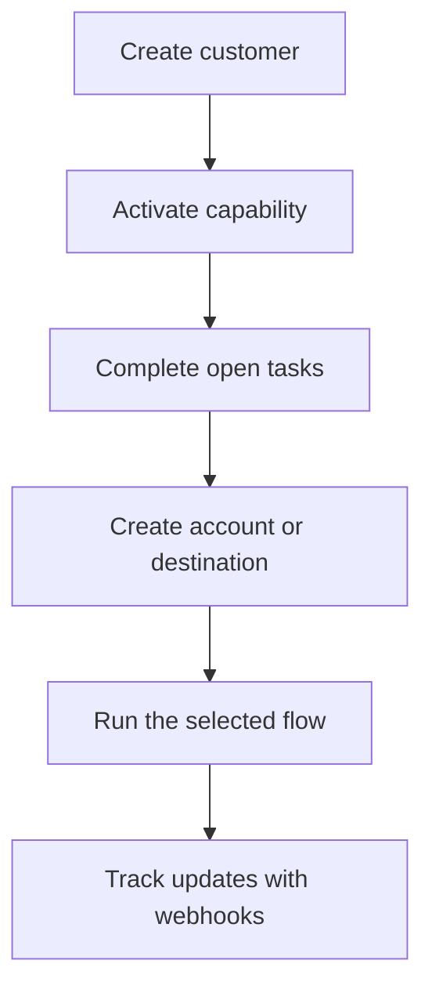

Swipelux stellt Ihrem Backend die Bausteine bereit, um Kunden zu onboarden und Geld zu bewegen, ohne die Zahlungsinfrastruktur in Ihrem Produkt offenzulegen.

## Was Sie entwickeln können

<CardGroup cols={3}>
  <Card title="Gelder empfangen" icon="arrow-down-to-line" href="/de/integration/receive-funds">
    Erstellen Sie einmalige Fiat-Zahlungsanweisungen und lassen Sie Stablecoins in einer Wallet abwickeln.
  </Card>
  <Card title="Gelder senden" icon="arrow-up-from-line" href="/de/integration/send-funds">
    Senden Sie von einer Kunden-Wallet an ein Erstpartei-Konto oder ein Drittziel.
  </Card>
  <Card title="Bankkonto ausgeben" icon="building-columns" href="/de/integration/issue-bank-account">
    Stellen Sie wiederverwendbare Bankdaten bereit, die mit einer Settlement-Wallet verknüpft sind.
  </Card>
</CardGroup>

## Wie eine Integration funktioniert

Ein Kunde ist die Einzelperson oder das Unternehmen, dem der Ablauf gehört. Fähigkeiten (Capabilities) beschreiben, welche Ergebnisse dieser Kunde nutzen kann. Offene Aufgaben (Open Tasks) sagen Ihnen, was erledigt werden muss, bevor die Fähigkeit oder Ressource weiter verwendet werden kann.

## In Aktion sehen

Erkunden Sie [demo.swipelux.com](https://demo.swipelux.com), um ein simuliertes Neobank-Erlebnis auszuprobieren. Sie können auch [den Starter klonen](https://github.com/swipelux/neobank-starter) und seine Produktoberfläche anpassen.

Die Demo und der Starter sind Produkt- und UI-Referenzen. Sie ersetzen weder diese Leitfäden noch den aktuellen API-Vertrag.

## Mit dem Entwickeln beginnen

<CardGroup cols={3}>
  <Card title="Quickstart" icon="rocket" href="/de/integration/quickstart">
    Legen Sie einen Kunden an und führen Sie einen Sandbox-Flow aus.
  </Card>
  <Card title="Häufige Abläufe" icon="route" href="/de/integration/common-flows">
    Vergleichen Sie das erforderliche Setup für jedes Ergebnis.
  </Card>
  <Card title="API-Referenz" icon="code" href="/de/api-reference/introduction">
    Lesen Sie die Anfragekonventionen und prüfen Sie jede API-Operation.
  </Card>
</CardGroup>
