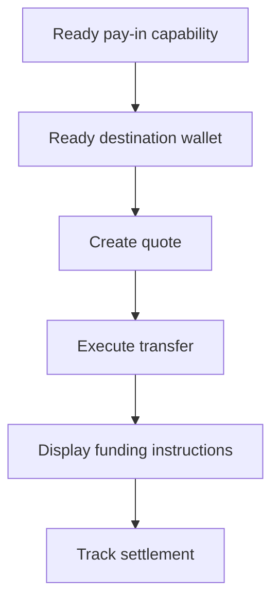

Verwenden Sie ein quotiertes Pay-in, wenn der Kunde einen bestimmten Betrag finanzieren muss. Der Transfer wickelt Stablecoins in eine ausgegebene Wallet ab.



## Bevor Sie beginnen

Sie benötigen eine bereite Pay-in-Fähigkeit und eine bereite ausgegebene Ziel-Wallet für denselben Kunden. Erledigen Sie offene Arbeit über [Fähigkeiten und Aufgaben](/de/integration/onboarding/capabilities-and-requirements) und rufen Sie dann beide Ressourcen erneut ab.

## 1. Ein Quote erstellen

Erstellen Sie den Preis mit [`POST /v3/quotes`](/api-reference/money-movement/post-v3-quotes). Senden Sie diese Header:

```http
X-API-Key: ${SWIPELUX_API_KEY}
Idempotency-Key: payin-quote-001
Content-Type: application/json
```

```json
{
  "customerId": "${CUSTOMER_ID}",
  "capabilityId": "${CAPABILITY_ID}",
  "externalId": "payin-order-123",
  "in": {
    "amount": "150.00",
    "currency": "USD"
  },
  "destinationId": "${SETTLEMENT_WALLET_ID}",
  "out": {
    "currency": "USDC"
  }
}
```

Speichern Sie `data.id` als `QUOTE_ID`. Präsentieren Sie die zurückgegebenen Beträge und Gebühren, statt sie aus dem Kurs neu zu berechnen.

## 2. Das Quote ausführen

Führen Sie das aktuelle Quote vor Ablauf mit [`POST /v3/transfers`](/api-reference/money-movement/post-v3-transfers) aus. Verwenden Sie einen neuen Schlüssel für diesen beabsichtigten Transfer:

```http
X-API-Key: ${SWIPELUX_API_KEY}
Idempotency-Key: payin-transfer-001
Content-Type: application/json
```

```json
{
  "quoteId": "${QUOTE_ID}"
}
```

Speichern Sie die Transfer-`data.id` als `TRANSFER_ID` und behalten Sie ihren aktuellen Zustand.

### Eine Rückkehr-URL für Karte und Apple Pay hinzufügen

Für ein Karten- oder Apple-Pay-Quote können Sie in derselben Anfrage optional eine `redirectUrl` angeben. Nachdem der Kunde den gehosteten Checkout abgeschlossen hat, öffnet die Checkout-Seite diese URL, um den Kunden zurück in Ihre App zu führen.

```json
{
  "quoteId": "${QUOTE_ID}",
  "redirectUrl": "https://your-app.example/payments/complete"
}
```

`redirectUrl` muss eine absolute HTTPS-URL mit höchstens 2048 Zeichen sein und darf keine eingebetteten Zugangsdaten enthalten. Das Senden einer `redirectUrl` für ein Quote, das keine Rückkehr-Navigation unterstützt, schlägt bei der Validierung fehl, statt ignoriert zu werden.

Das Erreichen der `redirectUrl` ist ausschließlich eine Browser-Navigation. Es bestätigt nicht, dass die Zahlung oder der Transfer abgeschlossen wurde. Ermitteln Sie den Abschluss anhand des Transferzustands in Schritt 4 und anhand von Webhook-Ereignissen.

## 3. Finanzierungsanweisungen abrufen

Lesen Sie [`GET /v3/transfers/{transferId}/instructions`](/api-reference/money-movement/get-v3-transfers-by-transfer-id-instructions). Rendern Sie die zurückgegebene Variante `data.instructions`, ohne ihren Typ anzunehmen.

Diese Details sind transferspezifisch. Verwenden Sie niemals die Bankkoordinaten, den Code, die gehostete URL, den Betrag, die Referenz oder das Ablaufdatum eines Transfers für ein anderes Pay-in.

Wenn bei Bankanweisungen `reference.required` true ist, zeigen Sie den genauen `reference.value` neben den Bankkoordinaten an und machen Sie ihn kopierbar. Zeigen Sie den zurückgegebenen Betrag und die Währung aus demselben Anweisungssatz.

Ein ausgegebenes Bankkonto ist anders: Es liefert wiederverwendbare Daten für spätere Einzahlungen. Siehe [Bankkonto ausgeben](/de/integration/issue-bank-account), wenn dies das gewünschte Erlebnis ist.

## 4. Settlement verfolgen

Lesen Sie [`GET /v3/transfers/{transferId}`](/api-reference/money-movement/get-v3-transfers-by-transfer-id) nach der Ausführung und nach jedem Ereignis. Steuern Sie den kundenseitigen Status anhand des neuesten `data.state`.

Verwenden Sie `data.stateDetail` und `data.openTaskIds`, wenn der Transfer eine weitere Aktion benötigt. Markieren Sie ihn nicht anhand eines erwarteten Zeitplans als abgeschlossen.

Fügen Sie als Nächstes [Webhooks](/de/integration/webhooks) hinzu und halten Sie den Transferstatus synchronisiert, bis er ein Ergebnis erreicht, das Ihr Produkt verarbeitet.
