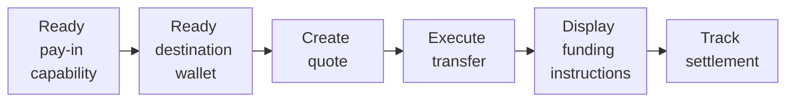

Verwenden Sie ein quotiertes Pay-in, wenn der Kunde einen bestimmten Betrag finanzieren muss. Der Transfer wickelt Stablecoins in eine ausgegebene Wallet ab.


```mermaid
%%{init: {"flowchart": {"rankSpacing": 20, "nodeSpacing": 16, "wrappingWidth": 80, "padding": 8}}}%%
flowchart LR
  A["Ready pay-in capability"] --> B["Ready destination wallet"]
  B --> C["Create quote"]
  C --> D["Execute transfer"]
  D --> E["Display funding instructions"]
  E --> F["Track settlement"]
```

## Bevor Sie beginnen

Sie benötigen eine bereite Pay-in-Fähigkeit und eine bereite ausgegebene Ziel-Wallet für denselben Kunden. Erledigen Sie offene Arbeit über [Fähigkeiten und Aufgaben](/de/integration/onboarding/capabilities-and-requirements) und rufen Sie dann beide Ressourcen erneut ab.

Pooled SWIFT unterstützt keine Pay-ins. Um SWIFT-Einzahlungen zu empfangen, geben Sie ein benanntes SWIFT-Konto aus. Siehe [Bankkonto ausgeben](/de/integration/issue-bank-account).

## 1. Ein Quote erstellen

Erstellen Sie den Preis mit [`POST /v3/quotes`](/api-reference/money-movement/post-v3-quotes). Senden Sie diese Header:

```http
X-API-Key: ${SWIPELUX_API_KEY}
Idempotency-Key: payin-quote-001
Content-Type: application/json
```

```json
{
  "customerId": "${CUSTOMER_ID}",
  "capabilityId": "${CAPABILITY_ID}",
  "externalId": "payin-order-123",
  "in": {
    "amount": "150.00",
    "currency": "USD"
  },
  "destinationId": "${SETTLEMENT_WALLET_ID}",
  "out": {
    "currency": "USDC"
  }
}
```

Speichern Sie `data.id` als `QUOTE_ID`. Präsentieren Sie die zurückgegebenen Beträge und Gebühren, statt sie aus dem Kurs neu zu berechnen.

### Mindestbeträge {#minimum-amounts}

Bank-Pay-in-Quotes können einen Mindestbetrag durchsetzen, zum Beispiel 20.00 USD für Pooled Wire. `POST /v3/quotes` gibt `422` [`amount_not_deliverable`](/integration/errors#amount-not-deliverable) zurück, wenn der Betrag unter dem Minimum liegt oder zu gering ist, um die Transfergebühren zu decken.

## 2. Das Quote ausführen

Führen Sie das aktuelle Quote vor Ablauf mit [`POST /v3/transfers`](/api-reference/money-movement/post-v3-transfers) aus. Verwenden Sie einen neuen Schlüssel für diesen beabsichtigten Transfer:

```http
X-API-Key: ${SWIPELUX_API_KEY}
Idempotency-Key: payin-transfer-001
Content-Type: application/json
```

```json
{
  "quoteId": "${QUOTE_ID}"
}
```

Speichern Sie die Transfer-`data.id` als `TRANSFER_ID` und behalten Sie ihren aktuellen Zustand.

### Eine Rückkehr-URL für Karte und Apple Pay hinzufügen

Für ein Karten- oder Apple-Pay-Quote können Sie in derselben Anfrage optional eine `redirectUrl` angeben. Nachdem der Kunde den gehosteten Checkout abgeschlossen hat, öffnet die Checkout-Seite diese URL, um den Kunden zurück in Ihre App zu führen.

```json
{
  "quoteId": "${QUOTE_ID}",
  "redirectUrl": "https://your-app.example/payments/complete"
}
```

`redirectUrl` muss eine absolute HTTPS-URL mit höchstens 2048 Zeichen sein und darf keine eingebetteten Zugangsdaten enthalten. Das Senden einer `redirectUrl` für ein Quote, das keine Rückkehr-Navigation unterstützt, schlägt bei der Validierung fehl, statt ignoriert zu werden.

Das Erreichen der `redirectUrl` ist ausschließlich eine Browser-Navigation. Es bestätigt nicht, dass die Zahlung oder der Transfer abgeschlossen wurde. Ermitteln Sie den Abschluss anhand des Transferzustands in Schritt 4 und anhand von Webhook-Ereignissen.

### Die Checkout-Methode für ein Karten-Quote vorauswählen

Für ein Karten-Quote können Sie in derselben Anfrage optional ein `checkoutMethod` angeben, um festzulegen, mit welcher Zahlungsoption sich der gehostete Checkout öffnet. Die aktuellen Werte sind `card`, `apple_pay`, `google_pay`, `cash_app`, `sepa` und `blik`. Die Liste ist offen und kann wachsen; tolerieren Sie daher bei Transfer-Lesevorgängen Werte, die Sie nicht kennen. Der Checkout öffnet sich mit der angeforderten Methode, wenn sie für den Kunden und sein Gerät verfügbar ist, und der Kunde kann weiterhin jede andere Methode wählen, die der Checkout anbietet. Lassen Sie das Feld weg, um die Standard-Vorauswahl beizubehalten.

```json
{
  "quoteId": "${QUOTE_ID}",
  "checkoutMethod": "apple_pay"
}
```

`checkoutMethod` ist eine Präferenz, keine Garantie. Die Verfügbarkeit hängt vom Kunden, seinem Gerät und dem Checkout ab; eine Anforderung macht die Methode nicht verfügbar. `sepa` und `blik` sind hier Zahlungsoptionen innerhalb des Karten-Checkouts, keine Fähigkeiten, Rails oder Konten von Swipelux. Die Vorauswahl ändert weder die Fähigkeit noch die Beträge oder Gebühren des Quotes, und der Checkout bestätigt die endgültigen Gebühren. Transfer-Lesevorgänge geben den angeforderten Wert zurück; sie bestätigen nicht, welche Methode der Kunde verwendet hat. Das Senden von `checkoutMethod` für ein Quote, das kein Karten-Quote ist, schlägt bei der Validierung fehl, statt ignoriert zu werden, und eine Wiederholung mit demselben Idempotenzschlüssel muss dasselbe `checkoutMethod` senden.

## 3. Finanzierungsanweisungen abrufen

Lesen Sie [`GET /v3/transfers/{transferId}/instructions`](/api-reference/money-movement/get-v3-transfers-by-transfer-id-instructions). Rendern Sie die zurückgegebene Variante `data.instructions`, ohne ihren Typ anzunehmen.

Diese Details sind transferspezifisch. Verwenden Sie niemals die Bankkoordinaten, den Code, die gehostete URL, den Betrag, die Referenz oder das Ablaufdatum eines Transfers für ein anderes Pay-in.

Wenn bei Bankanweisungen `reference.required` true ist, zeigen Sie den genauen `reference.value` neben den Bankkoordinaten an und machen Sie ihn kopierbar. Zeigen Sie den zurückgegebenen Betrag und die Währung aus demselben Anweisungssatz.

Bankanweisungen können zusätzlich die optionalen Felder `bankName`, `bankAddress`, `accountHolderName` und `accountHolderAddress` enthalten. Zeigen Sie jedes zurückgegebene Feld neben den übrigen Bankkoordinaten an. Absenderbanken verlangen für `swift` und andere internationale Überweisungen häufig die Adresse der Empfängerbank. Zeigen Sie `bankAddress` daher immer an, wenn es zurückgegeben wird.

```json
{
  "type": "bank",
  "method": "swift",
  "amount": { "amount": "150.00", "currency": "USD" },
  "accountHolderName": "Swipelux FBO Customer",
  "accountHolderAddress": "8 The Green, Dover, DE",
  "bankName": "JPMorgan Chase",
  "bankAddress": "383 Madison Avenue, New York, NY",
  "details": {
    "swiftCode": "CHASUS33",
    "accountNumber": "123456789"
  },
  "reference": { "value": "SWIFTMEMO1", "required": true }
}
```

Ein ausgegebenes Bankkonto ist anders: Es liefert wiederverwendbare Daten für spätere Einzahlungen. Siehe [Bankkonto ausgeben](/de/integration/issue-bank-account), wenn dies das gewünschte Erlebnis ist.

## 4. Settlement verfolgen

Lesen Sie [`GET /v3/transfers/{transferId}`](/api-reference/money-movement/get-v3-transfers-by-transfer-id) nach der Ausführung und nach jedem Ereignis. Steuern Sie den kundenseitigen Status anhand des neuesten `data.state`.

Verwenden Sie `data.stateDetail` und `data.openTaskIds`, wenn der Transfer eine weitere Aktion benötigt. Markieren Sie ihn nicht anhand eines erwarteten Zeitplans als abgeschlossen.

Fügen Sie als Nächstes [Webhooks](/de/integration/webhooks) hinzu und halten Sie den Transferstatus synchronisiert, bis er ein Ergebnis erreicht, das Ihr Produkt verarbeitet.
