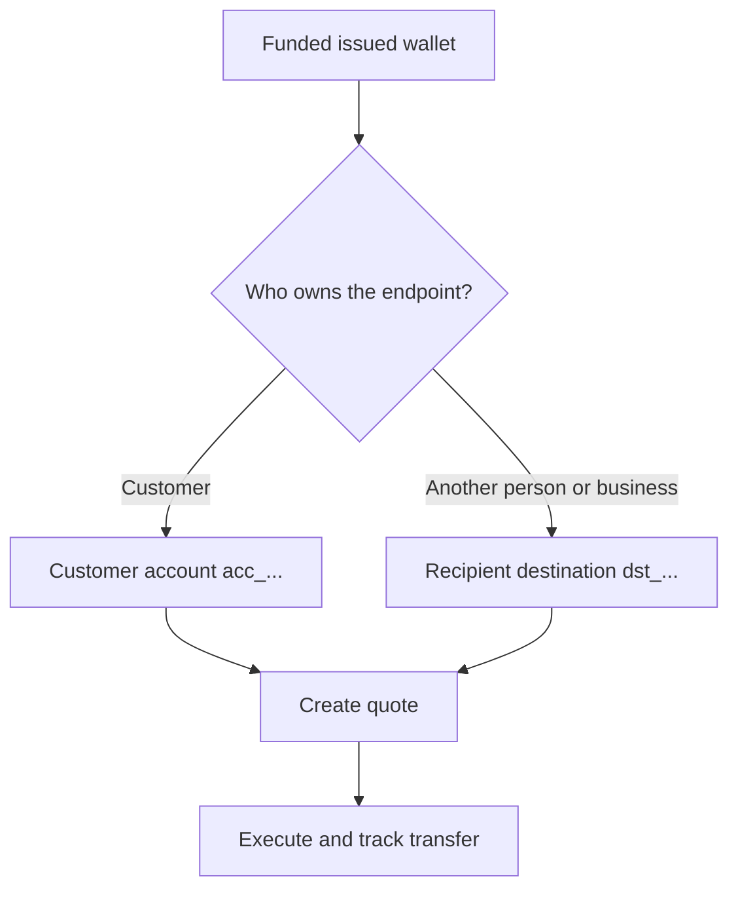

Jeder Payout beginnt aus einer bereiten, finanzierten ausgegebenen Wallet. Das Zielmodell hängt davon ab, wer den Endpunkt besitzt.



## Bevor Sie beginnen

Rufen Sie die Quell-Wallet erneut ab. Bestätigen Sie, dass ihr aktueller Status den Payout erlaubt und ihr verfügbares Guthaben den beabsichtigten Quellbetrag deckt. Speichern Sie ihre aus der Antwort abgeleitete ID als `SOURCE_WALLET_ID`.

Sie benötigen außerdem eine bereite Payout-Fähigkeit für den aktuellen Kunden und das ausgewählte Ziel.

## 1. Das Ziel vorbereiten

<Tabs>
  <Tab title="Erstpartei">

Verwenden Sie ein kundeneigenes externes Bankkonto, wenn der Kunde den Endpunkt besitzt. Legen Sie es mit [`POST /v3/customers/{customerId}/accounts`](/api-reference/accounts/post-v3-customers-by-customer-id-accounts) und diesen Headern an:

```http
X-API-Key: ${SWIPELUX_API_KEY}
Idempotency-Key: payout-account-001
Content-Type: application/json
```

```json
{
  "origin": "external",
  "type": "bank",
  "methods": ["ach", "wire"],
  "country": "US",
  "currency": "USD",
  "details": {
    "routingNumber": "021000021",
    "accountNumber": "123456789",
    "accountType": "checking",
    "bankName": "Example Bank",
    "accountHolderName": "Acme Payments SAS"
  },
  "label": "Customer operating account"
}
```

Lesen Sie es mit [`GET /v3/customers/{customerId}/accounts/{accountId}`](/api-reference/accounts/get-v3-customers-by-customer-id-accounts-by-account-id). Fahren Sie nur fort, wenn sein aktueller Status den Payout erlaubt. Speichern Sie seine `acc_`-ID als `PAYOUT_DESTINATION_ID`.

  </Tab>
  <Tab title="Drittpartei">

Legen Sie die Person oder das Unternehmen und deren Bank- oder Wallet-Endpunkt über [Empfänger und Ziele](/de/integration/recipients) an. Fahren Sie nur fort, wenn das Ziel bereit ist.

Speichern Sie die zurückgegebene `dst_`-ID als `PAYOUT_DESTINATION_ID`. Verwenden Sie nicht die `rcp_`-ID des Empfängers als Quote-Ziel.

  </Tab>
</Tabs>

## 2. Das Payout-Quote erstellen

Verwenden Sie [`POST /v3/quotes`](/api-reference/money-movement/post-v3-quotes) mit diesen Headern:

```http
X-API-Key: ${SWIPELUX_API_KEY}
Idempotency-Key: payout-quote-001
Content-Type: application/json
```

```json
{
  "customerId": "${CUSTOMER_ID}",
  "capabilityId": "${CAPABILITY_ID}",
  "in": {
    "amount": "150.00",
    "currency": "USDC",
    "accountId": "${SOURCE_WALLET_ID}"
  },
  "destinationId": "${PAYOUT_DESTINATION_ID}",
  "out": {
    "currency": "USD"
  }
}
```

Speichern Sie `data.id` als `QUOTE_ID` und präsentieren Sie den zurückgegebenen Preis und die Gebühren.

## 3. Payout ausführen

Erstellen Sie den Transfer mit [`POST /v3/transfers`](/api-reference/money-movement/post-v3-transfers). Verwenden Sie einen neuen Schlüssel für diese beabsichtigte Ausführung:

```http
X-API-Key: ${SWIPELUX_API_KEY}
Idempotency-Key: payout-transfer-001
Content-Type: application/json
```

```json
{
  "quoteId": "${QUOTE_ID}"
}
```

Speichern Sie die Transfer-`data.id` als `TRANSFER_ID`. Eine erfolgreiche Erstellung startet den Payout; sie belegt nicht die Zustellung.

## 4. Zustellung verfolgen

Lesen Sie [`GET /v3/transfers/{transferId}`](/api-reference/money-movement/get-v3-transfers-by-transfer-id) nach der Erstellung und nach jedem Ereignis. Verwenden Sie die neuesten `data.state`, `data.stateDetail` und `data.openTaskIds`, um zu entscheiden, ob Sie warten, handeln oder ein Endergebnis anzeigen sollen.

Prüfen Sie als Nächstes [Quotes und Transfers](/de/integration/quotes-and-transfers) für exakte Beträge, sichere Ausführungswiederherstellung und Transfer-Aufgaben.
