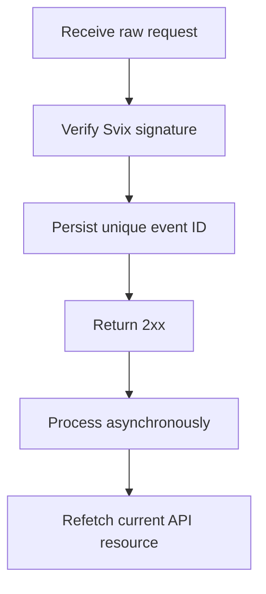

Verwenden Sie Webhooks, um auf asynchrone Änderungen zu reagieren. Die Zustellung erfolgt mindestens einmal, daher sind doppelte, verzögerte und außer der Reihenfolge eintreffende Ereignisse normal.



## Registrieren Sie nur die Ereignisse, die Sie benötigen

Legen Sie einen Endpunkt mit [`POST /v3/webhooks`](/api-reference/webhooks/post-v3-webhooks) an. Abonnieren Sie nur dokumentierte Ereignisse, die Ihre Integration steuern. Dieses Beispiel verwendet [`transfer.state_changed`](/api-reference/webhooks/transfer-state-changed).

```bash
export API_BASE='https://platform.swipelux.com'
export SWIPELUX_API_KEY='replace-with-your-api-key'

curl --request POST \
  "${API_BASE}/v3/webhooks" \
  --header "X-API-Key: ${SWIPELUX_API_KEY}" \
  --header "Idempotency-Key: webhook-endpoint-001" \
  --header "Content-Type: application/json" \
  --data @- <<'JSON'
{
  "url": "https://example.com/webhooks/swipelux",
  "events": ["transfer.state_changed"]
}
JSON
```

Speichern Sie das Antwort-`data.id` als `WEBHOOK_ID`. Öffnen Sie das Portal, das von [`GET /v3/webhooks/portal`](/api-reference/webhooks/get-v3-webhooks-portal) zurückgegeben wird, rufen Sie das Signaturgeheimnis dieses Endpunkts ab und speichern Sie es separat von Ihrem API-Schlüssel in einem Secret-Manager.

## Verifizieren vor dem Parsen

Swipelux liefert neue Webhook-Integrationen über Svix aus. Verifizieren Sie den rohen Request-Body mit Ihrem Endpunkt-Signaturgeheimnis und diesen Headern:

- `svix-id`
- `svix-timestamp`
- `svix-signature`

Parsen Sie kein JSON und lösen Sie keine Seiteneffekte aus, bevor die Verifizierung erfolgreich ist.

```javascript
import { Webhook } from "svix";

const verifier = new Webhook(process.env.SWIPELUX_WEBHOOK_SECRET);

export async function handleSwipeluxWebhook(request) {
  const rawBody = await request.text();
  const event = verifier.verify(rawBody, {
    "svix-id": request.headers.get("svix-id"),
    "svix-timestamp": request.headers.get("svix-timestamp"),
    "svix-signature": request.headers.get("svix-signature"),
  });

  await webhookInbox.insertIfAbsent({
    id: event.id,
    payload: event,
    status: "pending",
  });

  return new Response(null, { status: 204 });
}
```

Weisen Sie Anfragen mit fehlenden oder ungültigen Signaturen zurück. Halten Sie den rohen Body verfügbar, bis die Verifizierung abgeschlossen ist.

## Persistieren, bestätigen, dann verarbeiten

Setzen Sie eine Eindeutigkeitsbeschränkung auf die Envelope-`id`. Persistieren Sie den verifizierten Envelope, geben Sie zeitnah `2xx` zurück und verarbeiten Sie ihn anschließend asynchron.

Wenn die Ereignis-ID bereits existiert, bestätigen Sie die Zustellung, ohne abgeschlossene Seiteneffekte zu wiederholen. Setzen Sie anstehende oder fehlgeschlagene lokale Arbeit über Ihre eigene Retry-Warteschlange fort. Verwenden Sie das Envelope-Feld `attempt` weder als Deduplizierungsschlüssel noch als Transport-Retry-Zähler.

## Aktuellen Zustand erneut abrufen

Die Webhook-Reihenfolge ist keine maßgebliche Ressourcenhistorie. Verwenden Sie `resource.type` und `resource.id`, um das Objekt zu lokalisieren, und rufen Sie dann seinen aktuellen Zustand ab, bevor Sie Ihr System aktualisieren.

Für ein Transfer-Ereignis rufen Sie [`GET /v3/transfers/{transferId}`](/api-reference/money-movement/get-v3-transfers-by-transfer-id) auf:

```bash
curl --request GET \
  "${API_BASE}/v3/transfers/${TRANSFER_ID}" \
  --header "X-API-Key: ${SWIPELUX_API_KEY}"
```

Steuern Sie kundensichtbaren Status und nachgelagerte Aktionen anhand der aktuellen API-Antwort. Gestalten Sie Seiteneffekte so, dass sie sicher bleiben, wenn zwei Worker zusammenhängende Ereignisse in einer anderen Reihenfolge verarbeiten.

## Zustellungen wiederherstellen

Verwenden Sie [`GET /v3/webhooks/portal`](/api-reference/webhooks/get-v3-webhooks-portal), um Zustellungsprotokolle zu öffnen, fehlgeschlagene Zustellungen zu wiederholen oder einen manuellen Replay zu starten.

Jeder Replay muss dieselbe Signaturverifizierung und dieselbe dauerhafte Inbox durchlaufen. Um nach einem Ausfall wiederherzustellen, spielen Sie das betroffene Fenster erneut ab und rufen Sie jede referenzierte Ressource erneut ab. Abgeschlossene Ereignis-IDs bleiben No-Ops; unvollständige Datensätze werden asynchron fortgesetzt.

Verifizieren Sie als Nächstes doppelte und außer der Reihenfolge eintreffende Zustellungen in der Sandbox und schließen Sie dann die [Go-Live](/de/integration/go-live)-Checkliste ab.
