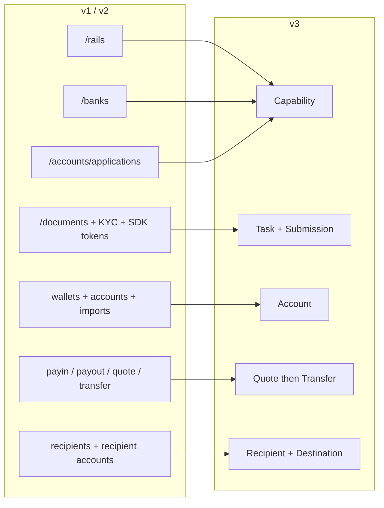
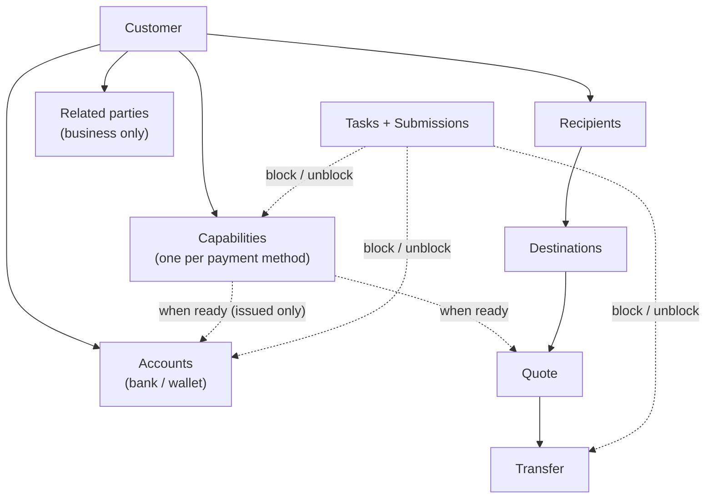
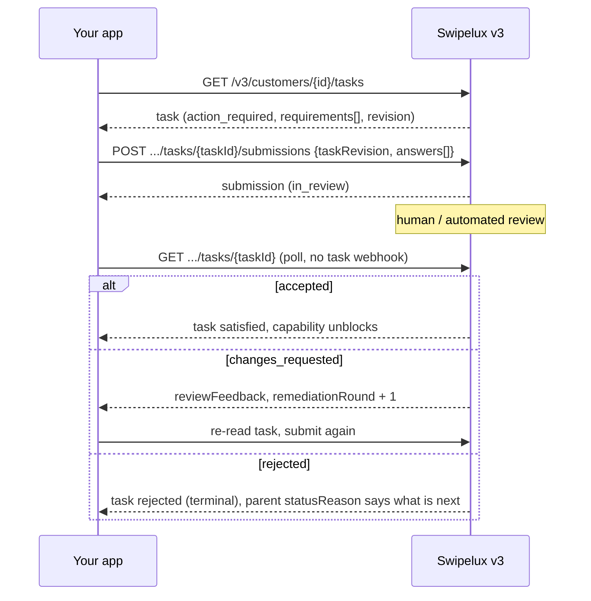
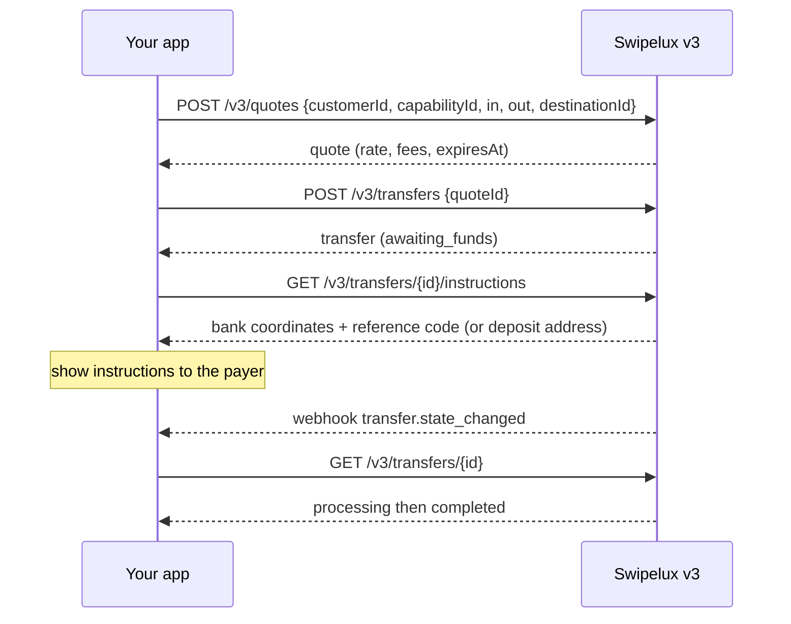
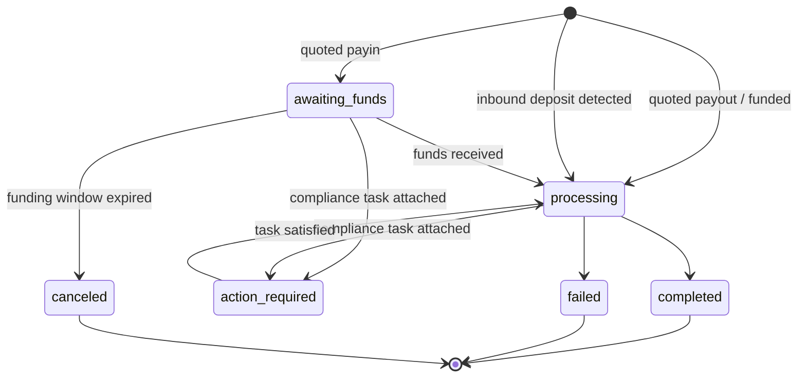
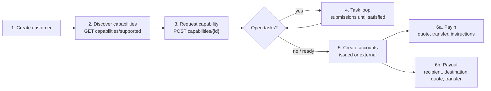

Migra tu integración de la API v1 y v2 a v3 en dos pasadas:

- **Parte 1, el concepto.** Léela primero. v3 es un rediseño, no un cambio de nombre: si mapeas endpoints antiguos uno a uno, lucharás contra la API. Diez minutos aquí te ahorrarán días después.
- **Parte 2, la API.** Mapeo endpoint por endpoint, ejemplos de peticiones, máquinas de estado y una lista de verificación de migración.

Basado en la especificación OpenAPI de producción ([platform.swipelux.com/openapi.json](https://platform.swipelux.com/openapi.json)). v1 y v2 siguen activas y aún no están obsoletas; todas las nuevas funciones de capability, recipient, task y quoting se publican solo en v3. Suscríbete al evento de webhook `api.deprecation` para recibir avisos de retirada.

<Info>
  **Contenidos.** Parte 1: 1.1 por qué existe v3, 1.2 modelo de objetos, 1.3 preparación por capability, 1.4 bucle de tareas, 1.5 movimiento de dinero, 1.6 máquinas de estado, 1.7 convenciones, 1.8 ruta dorada. Parte 2: 2.1 customers, 2.2 capabilities, 2.3 tasks y submissions, 2.4 accounts, 2.5 recipients y destinations, 2.6 quotes y transfers, 2.7 webhooks, 2.8 sandbox, 2.9 endpoints heredados, 2.10 orden de migración, 2.11 lista de escollos.
</Info>

---

## Parte 1, el concepto

### 1.1 Por qué existe v3

v1 y v2 desarrollaron cuatro formas superpuestas de dejar a un customer listo para pagos: `/rails`, `/banks`, `/accounts/applications` y la superficie empresarial `rail-applications`, cada una con su propio vocabulario de estados. La recopilación de documentos (`/documents`, importaciones de KYC, tokens SDK de verificación) estaba desconectada de aquello que en realidad desbloqueaba. v3 lo condensa todo en seis recursos: el customer más cinco cosas que posee:



| Recurso | Definición en una línea |
| --- | --- |
| **Customer** | La persona o empresa. **No tiene un campo público de estado**; la preparación vive en las capabilities. |
| **Capability** | Un método de pago que el customer puede usar (`sepa`, `ach`, `swift`, `stablecoin_transfers`, y demás), con su propio estado. Reemplaza `/rails`, `/banks` y los puntos de entrada de account-application. |
| **Task** | Una unidad de trabajo que Swipelux necesita (datos, documentos, verificación), respondida con una **Submission**. Reemplaza la superficie de documentos y KYC. |
| **Account** | Un endpoint de financiación que posee el customer: `bank` o `wallet`, `issued` por Swipelux o `external`. |
| **Recipient / Destination** | Beneficiario del pago (quién) y su endpoint bancario o de wallet (dónde). |
| **Quote / Transfer** | Todo el movimiento de dinero. Una transfer ejecuta una quote persistida; las transfers sin cotización desaparecen. |

### 1.2 El modelo de objetos



Dos reglas estructurales que debes interiorizar:

1. **Las capabilities regulan todo.** Las accounts se aprovisionan bajo una capability `ready`; las quotes se cotizan contra una capability. La incorporación equivale a obtener las capabilities que necesitas en estado `ready`.
2. **Las tasks se adjuntan en cualquier lugar.** Una capability, una account o una transfer en curso pueden llevar `openTaskIds`. Donde las veas, el bucle es el mismo: leer la task, enviar respuestas, esperar la revisión, releer el recurso padre.

### 1.3 La preparación es por capability, no por customer

v1 enredaba la preparación de `/rails` con una barrera de KYC a nivel de customer. En v3 no hay estado de customer: un customer puede ser totalmente usable en `stablecoin_transfers` mientras su capability `sepa` sigue teniendo tasks abiertas. Las capabilities de cuenta agrupada suelen pasar a `ready` más rápido que las nominales, así que empieza a operar en lo que esté `ready` en lugar de esperar a todo.

Si tu código v1 o v2 controla insignias de UI basándose en el estado de verificación del customer, reescríbelo:

- "¿Puede operar en X?" se convierte en capability X con `status == "ready"`.
- "¿Tiene que hacer algo?" se convierte en cualquier task con estado `action_required` (la capability suele mostrar `restricted` con `statusReason.resolution: "complete_tasks"`).
- "¿Estamos esperando a Swipelux?" se convierte en tasks `in_review`, capability `pending`.

### 1.4 El bucle de tareas

Todo lo que hacía la antigua superficie de documentos y KYC ahora es este único bucle:



Propiedades clave:

- Una task lleva `requirements[]`, las peticiones individuales. Cada una tiene un `requirementId` por task, una `key` estable que nombra la petición (por ejemplo prueba de domicilio, deduplica tu UI por ella) y una `request` tipada que describe exactamente qué entrada se desea (texto, fecha, selección, documento, atestación, y demás).
- Enviar está **sujeto a revisión**: nunca muta directamente el estado de la capability o la account, la aceptación sí. Una excepción: las respuestas `profile` se propagan al perfil del customer al enviarse (2.3). Después de enviar, consulta la task o el recurso padre.
- `taskRevision` (eco del `revision` de la task) es un mecanismo de concurrencia: si la task cambió desde que la leíste, reléela y reconstruye tus respuestas.
- `absence` es una respuesta de primer nivel ("no tengo esto porque..."), úsala en lugar de dejar requirements sin responder.

### 1.5 Movimiento de dinero

Un solo flujo para payins, payouts y movimientos de stablecoin. **No hay entrada de dirección**, nunca declaras payin frente a payout. Las formas de moneda de entrada y salida derivan un `direction` de solo lectura en la quote y en la transfer: `fiat_to_stablecoin` (payin), `stablecoin_to_fiat` (payout) o `stablecoin_move`.



### 1.6 Una máquina de estado por recurso

Cada recurso con estado tiene su propio enum, y cada estado no exitoso lleva una razón estructurada. Accounts, applications y transfers comparten la forma `{ code, message, actor, retryable }`: accounts y applications la exponen como `statusReason`, transfers como `stateDetail`. `actor` indica quién debe actuar (`customer`, `developer`, `provider`, `network`, `swipelux`), `retryable` indica si reintentar puede ayudar. Las capabilities usan `{ code, resolution, message }`, donde `resolution` (`complete_tasks`, `wait`, `contact_support`, `none`) indica qué hace avanzar la capability. Los valores de `code` forman un catálogo abierto y solo aditivo: ramifica según `resolution` (o `actor` más `retryable`), y tolera códigos que nunca hayas visto.

| Recurso | Estados |
| --- | --- |
| Capability | `pending`, `restricted`, `ready`, `rejected`, `canceled` |
| Application (intento por petición bajo una capability, 2.2) | `requested`, `in_review`, `action_required`, `ready`, `rejected`, `disabled`, `canceled` |
| Task | `action_required`, `in_review`, `satisfied`, `rejected`, `canceled` |
| Submission | `in_review`, `accepted`, `changes_requested`, `rejected` |
| Account | `provisioning`, `in_review`, `ready`, `action_required`, `suspended`, `rejected`, `archived` |
| Quote | `active`, `executed`, `expired`, `failed` |
| Transfer | `awaiting_funds`, `processing`, `action_required`, `completed`, `failed`, `canceled` |
| Recipient | `active`, `rejected`, `archived` |
| Destination | `in_review`, `ready`, `action_required`, `archived` |

Los estados que esta guía no recorre (`rejected`, `suspended`, `disabled`, `failed`, `canceled`) son terminales o gestionados por soporte; las definiciones por recurso están en la especificación.

Transfer, en detalle:



### 1.7 Convenciones

| Área | v1 / v2 | v3 |
| --- | --- | --- |
| Auth | Cabecera `X-API-Key` | Igual. El entorno (producción o sandbox) se selecciona por la clave; una sola URL base. |
| Idempotencia | No aplicada | Cabecera `Idempotency-Key` **obligatoria en toda petición con efectos** (POST, PATCH, PUT, DELETE), exceptuados los endpoints de sandbox. La misma clave con el mismo cuerpo repite la respuesta original. |
| Dinero | Números y cadenas mezclados | Solo cadenas (`"amount": "150.00"`). Nunca floats. |
| Paginación | Variantes offset/limit | Cursor: las listas devuelven `{ data, nextCursor, hasMore }`. |
| Actualizaciones | Muy orientadas a PUT | Actualizaciones parciales con `PATCH`. |
| Webhooks | Configuración de un único endpoint | Múltiples endpoints, suscripción por evento. Los eventos son **pistas**, la lectura es la verdad (2.7). |

Reglas de idempotencia que conviene interiorizar antes de escribir código:

- Reutilizar una clave con un cuerpo **distinto** produce `409 idempotency_conflict` mientras la clave se conserve (al menos 7 días), así que nunca planifiques reutilizar una clave. Genera un UUID nuevo por cada operación lógica y persístelo con tu job.
- La repetición cubre también los errores: si la petición original terminó en un 4xx terminal, la misma clave más el cuerpo devuelven la misma respuesta de problema.
- Dos peticiones concurrentes con la misma clave: una gana, la otra recibe `409`. Reintenta la perdedora tras estabilizarse la ganadora; la repetición devuelve la respuesta original.

### 1.8 La ruta dorada



---

## Parte 2, la API

### 2.1 Customers

| v1 / v2 | v3 |
| --- | --- |
| `POST /v1/customers`, `POST /v1/customers/business`, `POST /v2/customers` | `POST /v3/customers` (un solo endpoint, `type: individual \| business`) |
| `GET/PUT/DELETE /v1/customers/{id}`, `/v1/customers/business/{id}`, `/v2/customers/{customerId}` | `GET/PATCH/DELETE /v3/customers/{customerId}` |
| `GET /v1/customers` (lista) | `GET /v3/customers` (paginación por cursor, incluye resúmenes de capabilities) |
| `GET /v1/customers/balances` (lote), `GET /v1/customers/{id}/balances` | Sin endpoint de balances; los balances viven en las accounts: lee `balances` en `GET /v3/customers/{customerId}/accounts` |
| `POST/GET .../shareholders` (v1 business) | `POST/GET /v3/customers/{customerId}/related-parties` (más `GET/PATCH/DELETE .../related-parties/{relatedPartyId}`) |
| `POST /v1/customers/business/{id}/kyb` (enviar), `GET .../kyb` (estado) | Sin llamada de envío de KYB; solicita una capability (2.2) y responde sus tasks (2.3); el veredicto emerge como estado de capability y de task |
| `POST /v1/customers/{id}/kyc`, `.../kyc/import`, endpoints de tokens SDK | Sistema de tasks (2.3); la verificación alojada aparece como `verificationSessions` dentro de las tasks |

Creación, discriminada por `type` (valores ilustrativos, nombres de campo según la especificación):

```jsonc
// POST /v3/customers        Idempotency-Key: <fresh uuid>
{
  "type": "individual",
  "externalId": "user-1042",
  "individual": {
    "firstName": "Maria",
    "lastName": "Silva",
    "birthDate": "1990-04-12",
    "nationalities": ["BR"],
    "residenceCountry": "BR",
    "email": "maria@example.com",
    "residentialAddress": {
      "streetLine1": "Av. Paulista 1000",
      "city": "Sao Paulo",
      "postalCode": "01310-100",
      "country": "BR"
    }
  },
  "financialProfile": {
    "accountPurposes": ["cross_border_remittance"],
    "sourcesOfFunds": ["salary"]
  }
}
```

- **La creación es progresiva**: `{ "type": "individual" }` por sí solo es una creación válida. Los datos que falten nunca invalidan al customer, aparecen luego como tasks de intake en las capabilities que los necesiten.
- Las empresas llevan `business` más datos de registro. El CRUD de accionistas de v1 se mapea a **related parties**, ampliado para cubrir directores, ejecutivos y propietarios: créalos en línea al crear el customer (cada uno recibe un id estable `rp_`) o gestiónalos por los endpoints dedicados de related-parties.
- **No hay campo `status` en el customer**, véase 1.3.
- **Los customers existentes se conservan**: los customers creados en v1 o v2 son direccionables por el mismo id en los endpoints v3. La lectura v3 es una _vista saneada_, los valores heredados que no superen la validación v3 vuelven ausentes. Tras tu **primera escritura v3, esa vista se vuelve permanente**: los valores ausentes no reaparecen por sí solos. Enriquece pronto, planifica una pasada única que `PATCH`ee el perfil completo desde tus propios registros antes de confiar en las lecturas v3. El `metadata` de v1 es un espacio de nombres separado y **no** se conserva, vuélvelo a establecer en v3.
- `externalId` es de primer nivel y **único entre tus customers** en v3, por entorno (`409 duplicate_external_id`). Archivar un customer no libera su `externalId`, límpialo con PATCH antes de DELETE si piensas reutilizarlo.
- `DELETE` es un **archivado en cascada** (sin restauración; los ids nunca se reutilizan). Se bloquea con `409 customer_has_active_resources` más `blockingResources[]` mientras exista cualquier account no archivada o transfer en curso.
- Reglas de fusión de PATCH: `null` explícito limpia un campo anulable, los arrays se reemplazan por completo (excepto related parties en línea, que se hacen upsert por id), las claves de `metadata` se fusionan. Los esquemas completos y los filtros de lista están en la especificación OpenAPI.

### 2.2 `/rails`, `/banks`, applications se convierten en Capabilities

| v1 / v2 | v3 |
| --- | --- |
| `GET /v1/.../rails/capabilities` | `GET /v3/customers/{customerId}/capabilities/supported` |
| `GET /v2/.../banks` (más `/banks/{bank}`), `GET /v2/meta/banks` | `GET /v3/customers/{customerId}/capabilities/supported` |
| `GET /v1/customers/{customerId}/rails` (lista) | `GET /v3/customers/{customerId}/capabilities` |
| `GET /v2/customers/{customerId}/rails` (resumen) | `GET /v3/customers/{customerId}/capabilities` |
| `POST /v1/.../rails`, `POST /v2/.../banks` | `POST /v3/customers/{customerId}/capabilities/{capabilityId}` |
| `POST /v2/.../accounts/applications` | `POST /v3/customers/{customerId}/capabilities/{capabilityId}` |
| `GET /v1/.../rails/{rail}` | `GET /v3/.../capabilities/{capabilityId}` |
| `GET /v2/.../accounts/applications` (más `/{applicationId}`, `/{applicationId}/history`) | `GET /v3/.../capabilities/{capabilityId}` (más `/applications`, `/applications/{id}/history`) |
| Superficie business-rail: `GET/POST /v2/customers/business/{customerId}/rail-applications` (más `/{rail}`) | Los mismos endpoints de capability de v3, sin superficie business separada |
| Superficie business-rail: `GET .../business/{customerId}/rails` (más `/{rail}`) | Los mismos endpoints de capability de v3, sin superficie business separada |
| `GET /v1/meta/rails` (catálogo estático) | `GET /v3/customers/{customerId}/capabilities/supported`, la disponibilidad es por customer; no hay catálogo estático |
| `GET /v1/meta/accounts/banks` | `GET /v3/institutions` (directorio bancario: id, nombre, BIC, países) |
| No disponible | `GET /v3/capabilities`, lista global del comercio de capabilities concedidas entre customers (filtrable por `status`, `method`, `customerId`) |
| No disponible | `GET /v3/.../capabilities/{capabilityId}/tasks-preview` (ver las peticiones antes de solicitar) |
| No disponible | `POST /v3/.../capabilities/{capabilityId}/cancel` |

- Una capability equivale a `method` (`ach`, `wire`, `rtp`, `pix`, `sepa`, `swift`, `spei`, `pse`, `transfers_3_0`, `faster_payments`, `sepa_instant`, `uaefts`, `card`, `stablecoin_transfers`, etc.) más `accountType` (`pooled` o `named`, `null` para métodos no bancarios) más `directions` (`payin` o `payout`). El `capabilityId` público es el par cualificado (`sepa_pooled`, `ach_named`) o el método simple para `card` y `stablecoin_transfers`.
- Cada solicitud de capability genera una **application**, el registro por intento bajo `.../capabilities/{capabilityId}/applications` (más `/{applicationId}/history`), con sus propios estados (1.6) y `statusReason`. Es la traza de auditoría de una solicitud; en el día a día, consulta la propia capability.
- `capabilities/supported` devuelve disponibilidad (`available`, `beta` o `disabled`), elegibilidad e instituciones ofrecidas. La selección de banco ocurre en el momento de la solicitud a través del array opcional `institutions`; no hay un recurso `/banks` separado. Omitirlo (o enviar `[]`) selecciona todas las instituciones por defecto; `isDefault: true` es una bandera específica de customer y capability, no global. Una lista no vacía anula los valores por defecto, y una capability bancaria sin un valor por defecto aplicable devuelve `422 capability_institutions_required`. Los ids de institución son opacos, tolera los nuevos.
- `stablecoin_transfers` es **auto-otorgada al crear el customer** y nace en `ready` (por lo que nunca se solicita ni se cancela). `card` es solo para individuals.
- `openTaskIds` en la capability es tu puntero de "qué hago a continuación". Abierto equivale a `action_required` **o** `in_review`, y el rollup incluye tasks compartidas a nivel de customer accesibles a través de dependencias activas.
- `cancel` solo funciona desde `pending` o `restricted` **y** sin recursos bloqueantes, de lo contrario `409 capability_not_cancelable`, cuyo cuerpo del problema lista `blockingResources`. Volver a solicitar tras cancelar es una nueva creación con una nueva clave de idempotencia.
- **Consulta el GET.** El estado de la capability se actualiza al leerlo; consulta `GET .../capabilities/{capabilityId}` o suscríbete a `capability.status_changed`, no lo caches.
- Solicitar un método puede hacer disponibles métodos relacionados a la vez, trata las capabilities como un conjunto que releas, no como una sola fila que rastreas.
- Usa `tasks-preview` para mostrar las peticiones de incorporación **antes** de comprometerte con una solicitud.
- La verificación no es única: pueden aparecer nuevas tasks en una capability ya en `ready` (reverificación periódica o dirigida por eventos). Mantén el bucle de tasks activo durante todo el ciclo de vida del customer, no solo durante la incorporación.

### 2.3 Documentos y KYC se convierten en Tasks y Submissions

<Note>
  **Nota sobre el nombre.** Estos endpoints se publicaron brevemente como `requirements` y `fulfillments`. Desde el 2026-08-02 los nombres públicos son **tasks** y **submissions**. El cambio de nombre cubrió solo los recursos y las rutas de endpoint; el array `requirements[]` dentro de una task y su `requirementId` conservan esos nombres.
</Note>

Cada superficie de documentos heredada se mapea al mismo reemplazo: lee `GET /v3/customers/{customerId}/tasks`, responde con `POST .../tasks/{taskId}/submissions`.

| v1 / v2 | v3 |
| --- | --- |
| `POST/GET/DELETE /v1/documents` | `GET /v3/.../tasks` más `POST .../tasks/{taskId}/submissions` |
| `POST /v1/customers/{id}/documents` | `GET /v3/.../tasks` más `POST .../tasks/{taskId}/submissions` |
| `GET/POST /v1/customers/business/{id}/documents` (más `PUT/DELETE .../{docId}`) | `GET /v3/.../tasks` más `POST .../tasks/{taskId}/submissions` |
| `GET/POST .../shareholders/{shareholderId}/documents` (más `GET/PUT/DELETE .../{docId}`) | `GET /v3/.../tasks` más `POST .../tasks/{taskId}/submissions` |
| `GET/POST/DELETE /v2/.../documents` (más `/{documentId}`) | `GET /v3/.../tasks` más `POST .../tasks/{taskId}/submissions` |
| `POST /v2/.../documents/upload-token` más `POST /v2/documents/direct-upload` | Eliminado, sube directamente con tu API key (más abajo) |
| `POST /v1/customers/documents/upload`, `POST /v1/document` (intakes heredados) | Eliminado, sube directamente con tu API key (más abajo) |
| `POST /v1/customers/{id}/kyc` más tokens SDK | Task `verificationSessions` (verificación alojada); sin llamada directa de "start KYC" |

En torno a ese bucle:

- **Almacenamiento de archivos en bruto**: `POST/GET/DELETE /v3/customers/{customerId}/documents` (más `/{documentId}`), sube una vez con tu API key y luego referencia los ids de documento en las respuestas de submission. Esto reemplaza todos los intakes de upload-token y direct-upload.
- **Lecturas totalmente nuevas**: `GET /v3/tasks` (bandeja de entrada del comercio), `GET /v3/transfers/{transferId}/tasks`, `GET .../tasks/{taskId}/history`, `GET .../tasks/{taskId}/submissions` (más `/{submissionId}`).

Submission (ilustrativo):

```jsonc
// POST /v3/customers/{cus}/tasks/{task}/submissions   Idempotency-Key: <fresh uuid>
{
  "taskRevision": 3,
  "answers": [
    { "requirementId": "req_a1", "answer": { "type": "document", "documentIds": ["doc_passport1"] } },
    { "requirementId": "req_b2", "answer": { "type": "text", "value": "Import/export business" } },
    { "requirementId": "req_c3", "answer": { "type": "absence", "reason": "not_applicable" } }
  ]
}
```

- Tipos de respuesta: `profile`, `text`, `date`, `single_select`, `multi_select`, `boolean`, `attestation`, `document`, `resource_reference`, `absence`. El objeto `request` de cada requirement te dice qué tipo espera.
- Una submission debe responder **cada requirement accionable de la ronda actual**, con el `taskRevision` exacto que leíste. Las submissions parciales son rechazadas.
- Las respuestas `profile` **se propagan**: actualizan el perfil del customer por la vía de validación normal y reevalúan de inmediato cada capability que referencia el mismo trabajo de intake. Las tasks de intake hermanas cuyos requirements están todos satisfechos se cierran automáticamente.
- Los requirements pueden formar grupos alternativos (`alternativeKey`): envía exactamente uno del grupo.
- `changes_requested` incrementa `remediationRound` y lleva `reviewFeedback`. Relee la task, envía de nuevo **con una nueva clave de idempotencia**.
- Las URLs de verificación alojada aparecen **solo** en el detalle de task por customer (`GET /v3/customers/{customerId}/tasks/{taskId}`) y solo mientras la sesión sea accionable; las listas y `GET /v3/tasks/{taskId}` están deliberadamente sin URLs.
- Los términos de servicio también son una task: `openTaskIds` puede incluir una task con `category: "terms_of_service"` cuya página alojada de aceptación se enlaza del mismo modo (solo detalle por customer). Las submissions genéricas no pueden aceptar términos, y la aprobación de KYC nunca implica aceptación de términos.
- Las tasks tienen ámbito por capability, por lo que la "misma" petición (por ejemplo prueba de domicilio) puede aparecer una vez por capability. Deduplica en tu UI por la `key` del requirement.
- **No hay capa de traducción**: publicar en `/v1/documents` no desbloqueará las capabilities de v3. Una vez que un customer está en v3, canaliza todas las peticiones a través de tasks.

### 2.4 Accounts y wallets

| v1 / v2 | v3 |
| --- | --- |
| `POST/GET /v1/.../accounts` (más `/import`), `/v2/.../accounts` (más `/import`) | `POST/GET /v3/customers/{customerId}/accounts` |
| `POST/GET /v1/.../wallets` (más `/import`) | Mismo endpoint, `type: wallet` |
| `GET/DELETE /v1/customers/{customerId}/accounts/{accountId}` (y la variante de wallets), `GET /v2/.../accounts/{accountId}` | `GET/PATCH/DELETE /v3/.../accounts/{accountId}` |
| `PATCH /v2/.../accounts/{accountId}/fees` | `GET/PUT /v3/.../accounts/{accountId}/fees` |

Creación, discriminada por `origin` más `type`. Las cuentas bancarias emitidas toman un único `method`; las cuentas bancarias externas toman en su lugar un array `methods` (enviar `method` allí es rechazado):

```jsonc
// issued bank account (capability must be ready)
{ "origin": "issued", "type": "bank", "method": "sepa",
  "currency": "EUR", "settlement": { "accountId": "acc_wallet1" } }

// external wallet the customer already owns (replaces /import)
{ "origin": "external", "type": "wallet", "currency": "USDC",
  "network": "polygon", "details": { "address": "0x71C7656EC7ab88b098defB751B7401B5f6d8976F" } }
```

- `country` en las cuentas bancarias emitidas es opcional (por defecto según el método); en las cuentas bancarias **externas** proporciónalo explícitamente. Las cuentas de wallet no llevan país en absoluto.
- `settlement.accountId` es obligatorio en las cuentas bancarias emitidas: identifica la cuenta de wallet emitida que recibe los fondos liquidados de los depósitos hechos en la cuenta bancaria.
- Las cuentas emitidas exponen `details` (IBAN o routing más account o address), `routing` versionado (las coordenadas de depósito pueden rotar, muestra siempre la última lectura), `fees`, `balances`.
- Redes: `polygon`, `ethereum`, `base`, `arbitrum`, `optimism`, `bsc`, `avalanche`.
- La barrera de capability se aplica solo a las cuentas **emitidas**: crear una contra una capability no lista falla con un error codificado por capability, solicita primero la capability (2.2). Las cuentas externas no necesitan capability (ni aprobación del customer); obtienen solo validación del esquema de la petición y de los datos bancarios.
- Las cuentas bancarias emitidas nacen en `provisioning` con `details: null`. Consulta la cuenta o escucha `account.status_changed` hasta `ready`.
- `DELETE` archiva, nunca elimina de forma dura. Las cuentas referenciadas por transfers en curso devuelven `409 account_has_active_transfers`. Reintenta después de que esas transfers alcancen un estado terminal.
- Nuevo en v3: **Rules**, instrucciones permanentes en una cuenta de wallet emitida (`POST/GET /v3/customers/{customerId}/rules`, `GET/PATCH/DELETE .../rules/{ruleId}`) que barren automáticamente los fondos entrantes hacia otra cuenta o un destino de wallet. Sin equivalente en v1 o v2.

### 2.5 Recipients y destinations

| v1 | v3 |
| --- | --- |
| `POST/GET /v1/.../recipients` | `POST/GET /v3/customers/{customerId}/recipients` |
| No disponible (los recipients de v1 eran solo crear y listar) | `GET/PATCH/DELETE /v3/.../recipients/{recipientId}`, detalle, actualización y archivado totalmente nuevos |
| `POST/GET .../recipients/{recipientId}/accounts` | `POST/GET /v3/.../recipients/{recipientId}/destinations` |
| `GET/DELETE .../recipients/{recipientId}/accounts/{recipientAccountId}` | `GET/DELETE /v3/.../recipients/{recipientId}/destinations/{destinationId}` (sin PATCH de destination, archiva y vuelve a crear) |

v2 no tenía concepto de recipient. Si estás en v2 y pagas a terceros, esta es superficie nueva, no un cambio de nombre.

- **Recipient** equivale a quién: `individual` (nombre y apellido) o `business` (nombre de empresa), con `relationship` obligatorio (`employee`, `contractor`, `vendor`, `subsidiary`, `merchant`, `customer`, `landlord`, `family`, `other`). Recipients y destinations son solo para terceros. Un payout de primera parte no usa un recipient en absoluto: apunta a una de las propias cuentas `acc_` del customer como `destinationId` de la quote (2.6).
- **Destination** equivale a dónde: tipado por método, `sepa` (iban, bic opcional), `ach` o `wire` (routing más account), `swift` (coordenadas completas más intermediario opcional), `spei` (clabe), `pse`, `transfers_3_0` (cbu), y demás, más destinos de wallet. Cada destination tiene su propio estado. Escucha `destination.status_changed`.
- Los destinos fiat requieren la `address` completa del recipient (calle, ciudad, código postal, país) **antes** de la creación. Las piezas faltantes fallan con `422 recipient_address_required`. Los destinos de wallet omiten la dirección pero requieren `ownership` de nivel superior (`self_custodied`, o `custodial` con el nombre de un custodio).
- La precisión del nombre del beneficiario importa: los bancos receptores cotejan el nombre **legal** de la cuenta. Envía el nombre legal exacto y el apellido o el nombre de la empresa, no un alias de visualización.
- Los esquemas de campos de destination por método están en la especificación OpenAPI.

### 2.6 Quotes y transfers

| v1 / v2 | v3 |
| --- | --- |
| `POST /v1/payin/quote`, `/v1/payout/quote`, `/v2/quote` | `POST /v3/quotes` |
| `POST /v1/payin`, `/v1/payout`, `POST /v1/transfers`, `/v2/transfer` | `POST /v3/transfers` (ejecuta una quote, las creaciones sin cotización desaparecen) |
| `GET /v1/transfers` (lista), `GET /v1/transfers/{id}` | `GET /v3/transfers`, `/v3/transfers/{transferId}` |
| No disponible (las quotes de v1 y v2 no tenían lectura) | `GET /v3/quotes/{quoteId}` |
| `GET /v1/rate/{base}/{quote}` | `GET /v3/rates` |
| (implícito en la respuesta de payin) | `GET /v3/transfers/{transferId}/instructions` |
| No disponible | `POST /v3/transfers/{transferId}/cancel`, `GET /v3/transfers/{transferId}/tasks` |

```jsonc
// 1. Quote: amount on exactly one side picks mode (exact_in / exact_out).
// POST /v3/quotes            Idempotency-Key: <fresh uuid>
{
  "customerId": "cus_123",
  "capabilityId": "sepa_named",
  "in":  { "currency": "EUR", "amount": "150.00" },
  "out": { "currency": "USDC" },
  "destinationId": "acc_wallet1",   // fiat-funded: must be a customer-owned acc_ account
  "fees": { "breakdown": { "developer": { "fixed": "1.00", "bips": 50 } } }
}
// -> { mode: "exact_in", direction: "fiat_to_stablecoin", rate, fees[], expiresAt, ... }

// 2. Execute before expiresAt.
// POST /v3/transfers         Idempotency-Key: <fresh uuid>
{ "quoteId": "quo_789", "externalId": "order-991", "memo": "invoice 44" }
```

- `destinationId` acepta un id `acc_` (cuenta del propio customer) o `dst_` (destination de recipient). **Las quotes financiadas con fiat (payins) deben apuntar a una cuenta `acc_`**, un objetivo `dst_` siempre significa un payout (`422 quote_direction_invalid` de lo contrario).
- `externalId` en quotes y transfers es una referencia de correlación no única (repetida en las lecturas, filtrable en las listas). La regla de unicidad por entorno (2.1) se aplica solo al `externalId` del customer.
- Ejecuta una quote exactamente una vez, antes de `expiresAt`. Una quote expirada falla con `409 quote_expired`, una segunda ejecución con `409 quote_already_executed` (el problema lleva el `transferId` existente).
- La cancelación de transfers aún no está soportada: `POST .../cancel` devuelve `409 transfer_not_cancelable` en todos los estados. Las transfers `canceled` de hoy provienen de la expiración de la ventana de financiación en un payin sin financiar, no de este endpoint.
- Los payins empiezan en `awaiting_funds`: muestra `GET .../instructions` al pagador, coordenadas bancarias más **código de referencia o memo** para fiat, dirección de depósito para cripto. El código de referencia es cómo se emparejará el depósito. Muéstralo siempre.
- `state` más `stateDetail` para subestados legibles por máquina; `action_required` significa que hay una task de cumplimiento adjunta (`openTaskIds`, `GET .../tasks`), respondida vía submissions.
- Los depósitos entrantes detectados en las cuentas emitidas aparecen como transfers con `origin: "inbound_deposit"` (frente a `"quoted"`).
- Las referencias de red de pago se consolidan bajo `references`: `transactionHash`, `traceNumber`, `imad`, `uetr`, `explorerUrl`, `returnedTransferId`.

Traducción del estado de v1:

| Concepto v1 | v3 |
| --- | --- |
| objetos separados de payin y payout | una sola transfer con `direction` |
| devoluciones o cancelaciones del proveedor (englobadas en `failed`) | sigue siendo `failed`, ahora con `stateDetail` legible por máquina y `references.returnedTransferId` cuando una devolución generó una transfer inversa |

Dos advertencias de migración:

- **Las transfers no cruzan versiones.** Las transfers creadas en v1 o v2 no son legibles desde v3. La lista las omite y `GET /v3/transfers/{transferId}` responde 404. Migra primero la _creación_, mantén la ruta de lectura v1 hasta que esas transfers alcancen estados terminales, y luego elimínala.
- **Sin intercambios de tokens.** `stablecoin_move` requiere la misma moneda de entrada y de salida: USDC a USDT falla con `422 recipient_destination_invalid` llevando un error de campo `currency_mismatch`. Misma red en ambos lados, sin puentes, y los movimientos entre wallets solo soportan actualmente entrega sin comisiones: una quote cuya comisión de plataforma o de developer sea distinta de cero falla con `422 amount_not_deliverable`.

### 2.7 Webhooks

| v1 | v3 |
| --- | --- |
| `GET/PATCH /v1/webhooks` (configuración de un solo endpoint) | `POST/GET /v3/webhooks`, `PATCH/DELETE /v3/webhooks/{webhookId}`, `GET /v3/webhooks/portal` |

Catálogo de eventos: `customer.created`, `customer.updated`, `customer.archived`, `capability.created`, `capability.status_changed`, `application.status_changed`, `recipient.status_changed`, `destination.status_changed`, `account.created`, `account.status_changed`, `account.details_changed`, `transfer.created`, `transfer.state_changed`, `api.deprecation`.

- `GET /v3/webhooks/portal` devuelve una URL de portal de gestión alojado para registros de entrega, reintentos y repetición manual.
- `transfer.created` se entrega actualmente con la forma del payload heredado de v1 (el envelope de v3 se activa cuando los webhooks v1 se retiren). Trátalo puramente como una pista y haz GET a la transfer; no construyas contra su cuerpo.
- Los eventos son pistas: al recibirlos, haz GET al recurso y actúa sobre la lectura. Nunca construyas estado a partir de los payloads o del orden de los eventos. La entrega es al menos una vez y puede retrasarse o reordenarse. Deduplica por id de evento, y recupera eventos perdidos con el filtro inclusivo `updatedAfter` de cada listado.
- Suscríbete a `api.deprecation`, el canal automatizado para las retiradas de versión.
- Sin evento `task.*` hoy: después de enviar, consulta la task o su recurso padre.

### 2.8 Sandbox

Misma URL base; la clave de API del sandbox selecciona el entorno.

| v1 | v3 |
| --- | --- |
| `POST /v1/sandbox/topup` | `POST /v3/sandbox/accounts/{accountId}/topup` |
| `POST /v1/sandbox/payins/simulate`, `.../payouts/simulate`, `POST /v1/customers/{id}/simulate-transactions` | `POST /v3/sandbox/transfers/{transferId}/state` (guía una transfer real a través de los estados) |
| No disponible | `POST /v3/sandbox/customers/{customerId}/verification` (completa la verificación) |
| No disponible | `POST /v3/sandbox/customers/{customerId}/capabilities/{capabilityId}/status` (fuerza el estado de la capability) |
| No disponible | `POST /v3/sandbox/tasks`, `POST /v3/sandbox/tasks/{taskId}/review` (crea una task, luego simula el veredicto) |

El sandbox de v3 simula el bucle de revisión de extremo a extremo: crea una task, envía contra ella, `review` para `accepted` o `rejected`, observa cómo se desbloquea la capability. Ensaya tu UX de remediación antes de producción. Tanto las tasks creadas en sandbox como las tasks de intake habituales que aparecen en las capabilities solicitadas se revisan así; como en producción, no se disparan webhooks de task, consulta (2.7).

### 2.9 Endpoints heredados sin reemplazo en v3

Estos no tienen reemplazo en v3. La mayoría permanecen en v1 sin cambios (mantén tus llamadas existentes); dos se retiran directamente (véase Disposición):

| Endpoint | Disposición |
| --- | --- |
| `GET /v1/merchant-kyb/creation-gate`, `POST /v1/merchant-kyb/{customerId}/submit`, `POST /v1/merchant-kyb/parked-url`, `POST /v1/merchant-kyb/upload-token` | Tu propio onboarding de KYB del comercio (no del customer), sin cambios en v1 |
| `POST /v1/merchant-wallets/get-or-create` | Ayudante de wallet de tesorería del comercio, sin cambios en v1 |
| `GET /v1/meta/accounts/relationships` | Retirado, el enum `relationship` de recipient es fijo y está documentado en línea (2.5) |
| `GET /v1/meta/kyb/documents` | Retirado, las tasks de v3 declaran los documentos requeridos por caso vía `requirements[]` (2.3); no hay catálogo estático |
| `GET /statecharts` (más `/{machineId}`, `/{machineId}/svg`, `/explorer`, `/validate`) | Páginas públicas de referencia de máquinas de estado neutrales respecto a la versión, sin cambios |

Cualquier otro endpoint público de v1 o v2 aparece en alguna tabla de mapeo anterior.

### 2.10 Orden de migración sugerido

Cada paso se puede publicar de forma independiente; v1 o v2 y v3 conviven contra la misma base de customers. Ensaya cada paso contra tu clave de sandbox (2.8) antes de repetirlo en producción.

<Steps>
  <Step title="Fontanería">
    `Idempotency-Key` en todas las peticiones con efectos (POST, PATCH, PUT, DELETE; endpoints de sandbox exentos); dinero como cadenas; ayudantes de paginación por cursor.
  </Step>
  <Step title="Webhooks">
    Registra endpoints v3 por evento, incluyendo `api.deprecation`. La configuración de único endpoint de v1 es una superficie separada, déjala en su sitio; ambas conviven hasta el drenaje del paso 9.
  </Step>
  <Step title="Enriquecimiento del perfil">
    `PATCH /v3/customers/{id}` con el perfil completo que poseas (v1 recopilaba menos de lo que v3 expone) y vuelve a establecer `metadata`. Haz de esto deliberadamente la **primera escritura v3** por customer: rellena la vista saneada antes de que esa vista se vuelva permanente (2.1).
  </Step>
  <Step title="Lecturas">
    Apunta las lecturas de customer, capability y account a v3; reescribe la lógica de estado de customer según 1.3. Solo después del paso 3, las lecturas sin enriquecer regresan con los campos legado-inválidos ausentes.
  </Step>
  <Step title="Escrituras de onboarding">
    Crea vía `POST /v3/customers`; solicita capabilities en lugar de `/rails`, `/banks` o applications; construye el bucle de tasks (el mayor trabajo de UI totalmente nuevo, `tasks-preview` ayuda a mostrar las peticiones por adelantado). A partir de este punto, deja de publicar `/v1/documents` para customers dirigidos por v3, no desbloquean capabilities (2.3).
  </Step>
  <Step title="Cuentas">
    Emite vía v3; mueve las importaciones a `origin: external`.
  </Step>
  <Step title="Payouts">
    Recipients más destinations, luego quote y transfer.
  </Step>
  <Step title="Payins">
    Quote, transfer, instrucciones; sigue mostrando el código de referencia.
  </Step>
  <Step title="Drenaje">
    Las transfers no cruzan versiones (2.6). Mantén la ruta de lectura de v1 o v2 y el endpoint de webhook v1 para las transfers creadas allí, haz doble lectura hasta que alcancen estados terminales, luego elimina el cliente antiguo y la configuración del webhook v1.
  </Step>
</Steps>

### 2.11 Lista de escollos

- [ ] UUID nuevo por **operación lógica**, persistido con tu job y reutilizado en el reintento; nunca reutilices una clave con un cuerpo cambiado (`409 idempotency_conflict`). Los endpoints de sandbox están exentos de la cabecera.
- [ ] Enriquece los customers existentes (`PATCH` el perfil completo, vuelve a establecer `metadata`, no se conserva) **antes de cualquier otra escritura v3**, la primera escritura v3 vuelve permanente la vista saneada.
- [ ] `externalId` es único por entorno y **no se libera al archivar**, límpialo con `PATCH` antes de `DELETE` si planeas reutilizarlo.
- [ ] No existe campo `status` en el customer, deriva la preparación por capability.
- [ ] `action_required` **e** `in_review` significan ambos una task abierta.
- [ ] Las submissions están sujetas a revisión (enviar no equivale a desbloquear) y deben responder **cada** requirement accionable con el `taskRevision` exacto. En caso de desajuste, relee y reconstruye.
- [ ] No existe webhook `task.*`, consulta la task (o su padre) después de cada envío.
- [ ] Reintento `changes_requested` equivale a releer la task, respuestas nuevas, **clave de idempotencia nueva**.
- [ ] Publicar en `/v1/documents` nunca desbloquea una capability v3, una vez que un customer está en tasks, canaliza toda petición a través de tasks.
- [ ] Pueden aparecer nuevas tasks en una capability ya en `ready`, mantén el bucle de tasks activo después del onboarding, no solo durante este.
- [ ] `cancel` de capability solo funciona desde `pending` o `restricted` sin recursos bloqueantes (`409 capability_not_cancelable`); volver a solicitar tras cancelar es una nueva creación con una nueva clave de idempotencia.
- [ ] La capability debe estar `ready` antes de emitir cuentas bajo ella o cotizar contra ella.
- [ ] La quote tiene el importe en exactamente un lado; sin campo de dirección; se ejecuta exactamente una vez antes de `expiresAt` (`409 quote_expired` o `409 quote_already_executed`).
- [ ] Los movimientos de stablecoin son solo misma moneda y misma red (USDC a USDT falla `422`); wallet a wallet solo soporta entrega sin comisiones.
- [ ] `DELETE` archiva, nunca elimina de forma dura. El delete de account se bloquea por transfers en curso (`409 account_has_active_transfers`); el delete de customer además por cualquier account no archivada (`409 customer_has_active_resources`, `blockingResources[]` los nombra).
- [ ] Las transfers de v1 o v2 son invisibles a las lecturas de v3 (la lista las omite, GET 404s), haz doble lectura hasta drenarlas, luego elimina las rutas antiguas.
- [ ] El `routing` de depósito y las instrucciones pueden rotar, muestra siempre el último GET y muestra siempre el código de referencia.
- [ ] Los webhooks son pistas; el GET es la verdad, deduplica por id de evento, recupera eventos perdidos con `updatedAfter`.

## Siguiente paso

Empieza en el paso 1 del orden de migración (2.10), claves de idempotencia, dinero como cadenas, paginación por cursor, y ensaya cada paso contra tu clave de sandbox (2.8) antes de repetirlo en producción.
