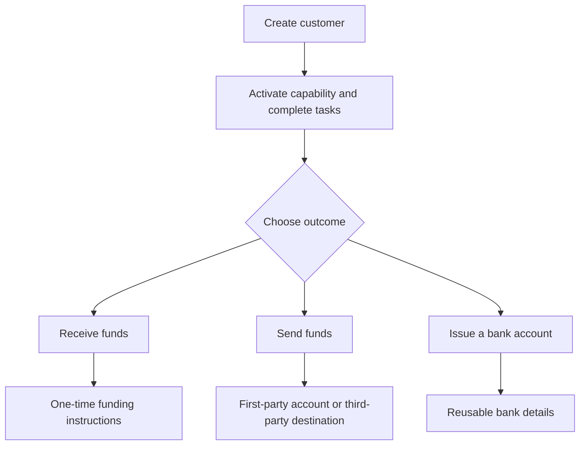

Comienza por el resultado del cliente. Cada flujo utiliza el mismo modelo de onboarding y luego se ramifica en distintas cuentas y movimientos de dinero.

## Compara los flujos

| Resultado | Prepara primero | Qué recibes |
| --- | --- | --- |
| Cobro | Capacidad de cobro lista y cartera de destino emitida | Instrucciones específicas de la transferencia y liquidación en stablecoin |
| Pago | Capacidad de pago lista, cartera emitida financiada y cuenta o destino listo | Una transferencia al endpoint del destinatario seleccionado |
| Cuenta bancaria emitida | Capacidad bancaria lista y cartera de liquidación emitida | Datos bancarios reutilizables tras el aprovisionamiento |

Un cobro cotizado crea instrucciones para una transferencia. Una cuenta bancaria emitida crea datos reutilizables para depósitos posteriores. Un pago parte de fondos ya disponibles en una cartera emitida.

## Elige tu flujo

<CardGroup cols={3}>
  <Card title="Recibir fondos" icon="arrow-down-to-line" href="/es/integration/receive-funds">
    Crea y monitorea un cobro de fiat a stablecoin.
  </Card>
  <Card title="Enviar fondos" icon="arrow-up-from-line" href="/es/integration/send-funds">
    Construye un pago propio o a un tercero.
  </Card>
  <Card title="Emitir una cuenta bancaria" icon="building-columns" href="/es/integration/issue-bank-account">
    Aprovisiona datos bancarios reutilizables vinculados a una cartera.
  </Card>
</CardGroup>
