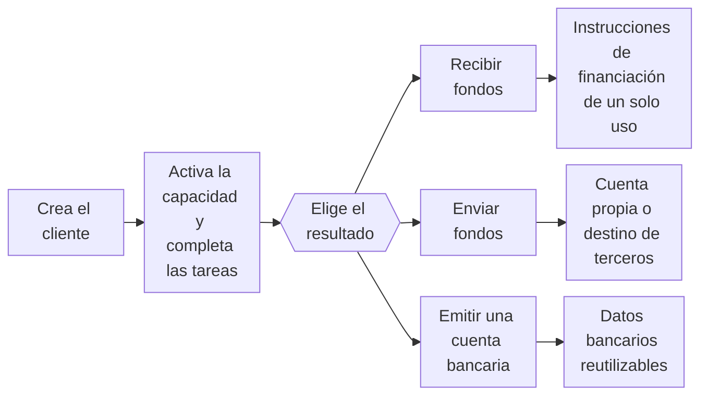

Comienza por el resultado del cliente. Cada flujo utiliza el mismo modelo de onboarding y luego se ramifica en distintas cuentas y movimientos de dinero.

```mermaid
%%{init: {"flowchart": {"rankSpacing": 20, "nodeSpacing": 16, "wrappingWidth": 80, "padding": 8}}}%%
flowchart LR
  A["Crea el cliente"] --> B["Activa la capacidad y completa las tareas"]
  B --> C{{"Elige el resultado"}}
  C --> D["Recibir fondos"]
  C --> E["Enviar fondos"]
  C --> F["Emitir una cuenta bancaria"]
  D --> G["Instrucciones de financiación de un solo uso"]
  E --> H["Cuenta propia o destino de terceros"]
  F --> I["Datos bancarios reutilizables"]
```

## Compara los flujos

| Resultado | Prepara primero | Qué recibes |
| --- | --- | --- |
| Cobro | Capacidad de cobro lista y cartera de destino emitida | Instrucciones específicas de la transferencia y liquidación en stablecoin |
| Pago | Capacidad de pago lista, cartera emitida financiada y cuenta o destino listo | Una transferencia al endpoint del destinatario seleccionado |
| Cuenta bancaria emitida | Capacidad bancaria lista y cartera de liquidación emitida | Datos bancarios reutilizables tras el aprovisionamiento |

Un cobro cotizado crea instrucciones para una transferencia. Una cuenta bancaria emitida crea datos reutilizables para depósitos posteriores. Un pago parte de fondos ya disponibles en una cartera emitida.

## Onramp y offramp

Swipelux utiliza los términos cobro y pago en lugar de onramp y offramp. Un cobro liquida stablecoin en una cartera emitida. Un pago envía fondos desde una cartera emitida.

| Si estás construyendo | Usa | `direction` de la cotización y la transferencia |
| --- | --- | --- |
| Onramp (fiat a stablecoin) | [Recibir fondos](/es/integration/receive-funds) | `fiat_to_stablecoin` |
| Offramp (stablecoin a fiat) | [Enviar fondos](/es/integration/send-funds) a una cuenta bancaria o un destino bancario | `stablecoin_to_fiat` |
| Transferencia de stablecoin de cartera a cartera | [Enviar fondos](/es/integration/send-funds) a una cartera | `stablecoin_move` |

No envías `direction` en la solicitud. Swipelux lo deriva de las divisas `in` y `out` de la cotización. Consulta [Cotizaciones y transferencias](/es/integration/quotes-and-transfers).

## Elige tu flujo

<CardGroup cols={3}>
  <Card title="Recibir fondos" icon="arrow-down-to-line" href="/es/integration/receive-funds">
    Crea y monitorea un cobro de fiat a stablecoin.
  </Card>
  <Card title="Enviar fondos" icon="arrow-up-from-line" href="/es/integration/send-funds">
    Construye un pago propio o a un tercero.
  </Card>
  <Card title="Emitir una cuenta bancaria" icon="building-columns" href="/es/integration/issue-bank-account">
    Aprovisiona datos bancarios reutilizables vinculados a una cartera.
  </Card>
</CardGroup>
