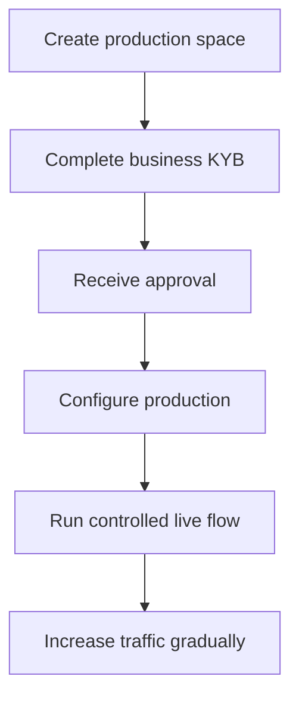

La activación de producción verifica tu empresa integradora. Es independiente de los clientes de la API que creas para tu producto.

## Activa tu espacio de producción

1. Inicia sesión en el Dashboard de Swipelux y selecciona **Create a production space**.
2. Abre la pestaña KYB o ve a [Verificación de empresa](https://www.swipelux.app/kyb).
3. Completa todos los campos solicitados y sube los documentos requeridos.
4. Envía tu empresa integradora para verificación y espera la aprobación.

Solo después de que tu empresa integradora y tu espacio de producción sean aprobados podrás crear clientes de API y transacciones en producción.

## Mantén producción independiente

Crea los recursos de producción de forma explícita. Cambiar una clave de API no migra el estado del sandbox.

- Guarda las credenciales de producción en una entrada de gestor de secretos separada.
- Utiliza configuración de despliegue e IDs de recurso exclusivos de producción.
- Registra un endpoint de webhook y un secreto de firma de producción separados.
- Vuelve a crear en producción los clientes, capacidades, cuentas, destinatarios y destinos necesarios.
- Restringe el acceso de producción a los servicios y operadores que lo necesiten.

Sandbox y producción utilizan `https://platform.swipelux.com`; la clave de la API selecciona el entorno.

## Completa la lista de comprobación de lanzamiento

- [ ] Prueba el camino feliz y las rutas de fallo esperadas en sandbox.
- [ ] Envía una `Idempotency-Key` con cada escritura que la requiera y consérvala para reintentos seguros.
- [ ] Verifica las firmas de los webhooks antes de analizar, persiste los IDs de evento de forma duradera y prueba el replay.
- [ ] Gestiona capacidades no disponibles, tareas abiertas y revisiones de tarea modificadas.
- [ ] Muestra los fallos de transferencia y las instrucciones accionables a tus operadores.
- [ ] Confirma que los logs conservan `X-Request-Id` o `correlationId` sin exponer secretos ni datos financieros sensibles.

## Ejecuta un flujo en vivo controlado

Empieza con un cliente conocido y una transacción de bajo valor. Registra:

| Control | Define antes de la prueba |
| --- | --- |
| Alcance | Cliente, capacidad, cuenta o destino, importe y método. |
| Resultado esperado | Estado de la API, saldo o instrucciones y evento de webhook que esperas observar. |
| Responsable | Persona encargada de vigilar el flujo completo. |
| Condición de parada | Cualquier estado inesperado, webhook ausente, importe incorrecto o tarea sin resolver. |

Verifica tanto el recurso actual de la API como la entrega del webhook autenticado. Si alguno difiere del resultado esperado, detente e investiga antes de enviar más tráfico.

Después de que el flujo completo tenga éxito, aumenta el volumen gradualmente mientras monitoreas los estados de capacidad, cuenta, destino y transferencia.

Vuelve a [Flujos comunes](/es/integration/common-flows) para el recorrido de producto, o utiliza la [Referencia de la API](/es/api-reference/introduction) para los contratos exactos.
