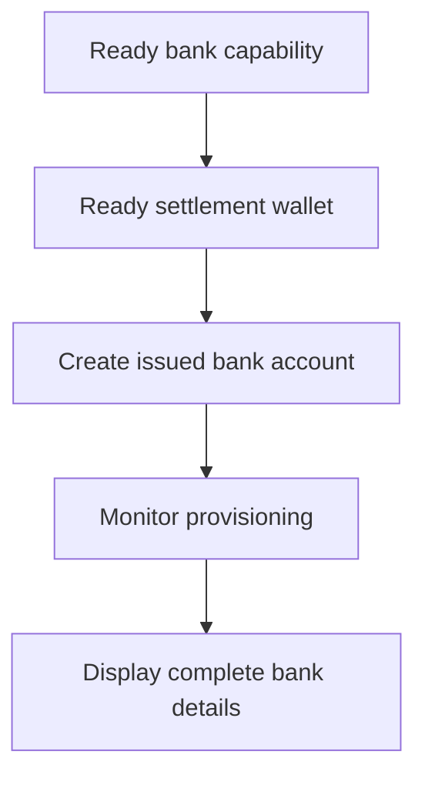

Utiliza una cuenta bancaria emitida cuando el cliente necesite datos bancarios reutilizables. Para instrucciones de financiación de un solo uso vinculadas a un importe específico, utiliza en su lugar [Recibir fondos](/es/integration/receive-funds).



## Antes de empezar

Necesitas un ID de cliente, una capacidad bancaria lista para el método y moneda previstos y una cartera emitida lista propiedad del mismo cliente. Completa el trabajo abierto mediante [Capacidades y tareas](/es/integration/onboarding/capabilities-and-requirements).

## 1. Crea o selecciona la cartera de liquidación

Crea una cartera emitida mediante [Cuentas y carteras](/es/integration/accounts#create-the-account) y vuelve a leerla. Continúa solo cuando su estado actual permita la liquidación.

Guarda el `data.id` derivado de la respuesta como `SETTLEMENT_WALLET_ID`. No utilices una cartera externa para `settlement.accountId`.

## 2. Crea la cuenta bancaria emitida

Utiliza [`POST /v3/customers/{customerId}/accounts`](/api-reference/accounts/post-v3-customers-by-customer-id-accounts) con estas cabeceras:

```http
X-API-Key: ${SWIPELUX_API_KEY}
Idempotency-Key: issued-bank-account-001
Content-Type: application/json
```

Envía este cuerpo de solicitud:

```json
{
  "origin": "issued",
  "type": "bank",
  "method": "ach",
  "country": "US",
  "currency": "USD",
  "settlement": {
    "accountId": "${SETTLEMENT_WALLET_ID}"
  },
  "label": "USD account"
}
```

Guarda el `data.id` devuelto como `BANK_ACCOUNT_ID`. Conserva también `data.status`, `data.openTaskIds`, `data.details` y la relación de liquidación.

El ID de la cuenta bancaria y el ID de la cartera tienen roles distintos. Lee el aprovisionamiento y los datos bancarios mediante el ID de la cuenta bancaria. Utiliza el ID de la cartera de liquidación para identificar dónde se acreditan los depósitos.

## 3. Monitorea el aprovisionamiento

Lee [`GET /v3/customers/{customerId}/accounts/{accountId}`](/api-reference/accounts/get-v3-customers-by-customer-id-accounts-by-account-id) tras la creación y después de cada webhook relevante.

Mantén la interfaz del cliente en pendiente mientras `details` esté ausente. Si `openTaskIds` no está vacío, completa las últimas tareas y vuelve a obtener la cuenta. No infieras la disponibilidad a partir del tiempo transcurrido.

Si el último `statusReason.code` es `awaiting_assignment`, crea el primer cobro para el mismo cliente, capacidad y cartera de liquidación mediante [Recibir fondos](/es/integration/receive-funds) y luego vuelve a leer la cuenta bancaria. Sigue esta ruta solo cuando la cuenta actual lo solicite.

## 4. Presenta los datos bancarios de forma segura

Muestra únicamente los datos completos devueltos por la última lectura de la cuenta. Cuando `details.referenceRequired` sea true, muestra el `details.reference` exacto y hazlo copiable. Cuando sea false, no inventes una referencia.

Estos datos bancarios son reutilizables. No los reemplaces con coordenadas de financiación de un cobro cotizado, que pertenecen únicamente a esa transferencia.

A continuación, añade [Webhooks](/es/integration/webhooks) para que las actualizaciones de aprovisionamiento lleguen a tu aplicación sin mantener al cliente en una pantalla de sondeo.
